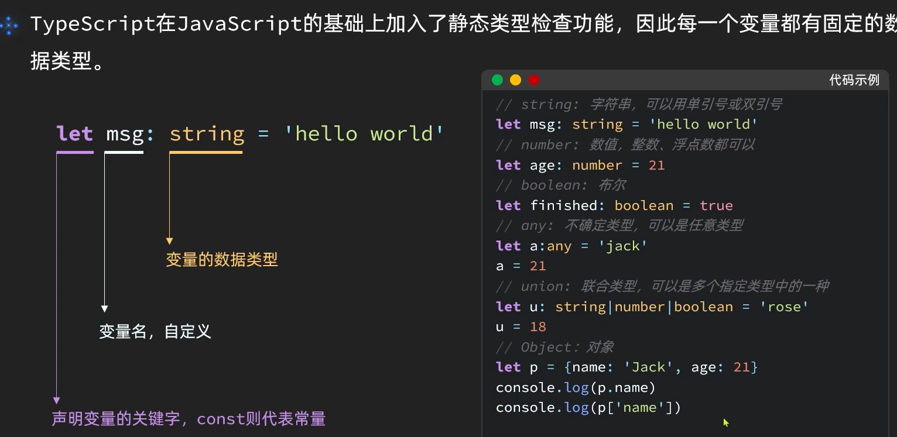
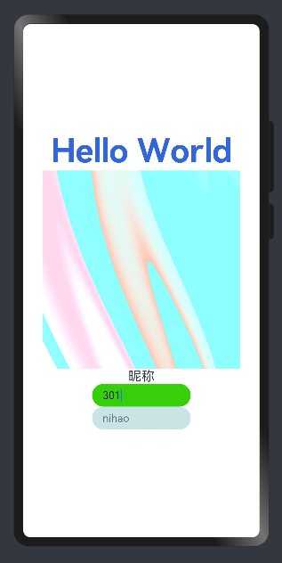
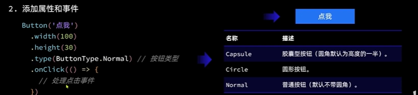

# ArkTS

## 数据类型



[练习网址：](https://www.typescriptlang.org/play)

## 条件语句


拓展：for in与for of的使用

- for in ：遍历得到数组的角标，
- for of ：直接得到元素。


## 函数

使用function关键字声明函数，

```TS
function outname(name:string):void{
    console.log('你好'+name+"!")
}

//第二种写法：
let outname = (name:string)=>{
    console.log('你好'+name+"!")
}

outname('lucy')
```

ts还提供了一种可传参数和不传参数也执行的函数的操作，写法如下：

```TS
let outname = (name:string='张三')=>{
    console.log('你好'+name+"!")
}

outname()
```

## 面向对象

## 模块的导入导出

提高代码的重复使用


## 组件的使用

### image组件

### textinput组件

```ts
TextInput({text:this.imagewidth.toFixed(0)})
          .width(150)
          .backgroundColor('#36D00A')
          .type(InputType.Number)
          .onChange( values =>{
            this.imagewidth = parseInt(values)
          })
        TextInput({placeholder:'nihao'})
          .width(150)
          .backgroundColor('#4399')
```

效果如下图：



文本框内输入的值是什么类型的数据呢？

从上面的代码可知是字符型的，此处我们用`parseInt`将一个变量转换成number类型，又用方法`.toFixed()`将一个number类型的变量转换成字符串型。

### 按键组件



### 滑动条组件（slider）


## 页面布局

### 线性布局


Row布局与Column布局类似，只是主轴方向不同


### 循环控制ForEach

## 使用router进行页面跳转时用replaceUrl与pushUrl的区别

后者会保留前一页信息，就是跳转后会返回上一页面，而后面的不会跳回上一页

11--t

f--!=11,运行时

{}