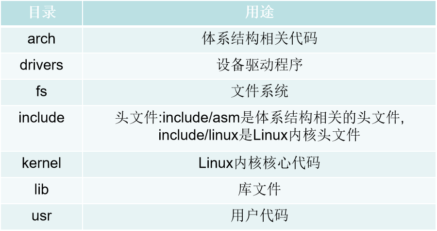
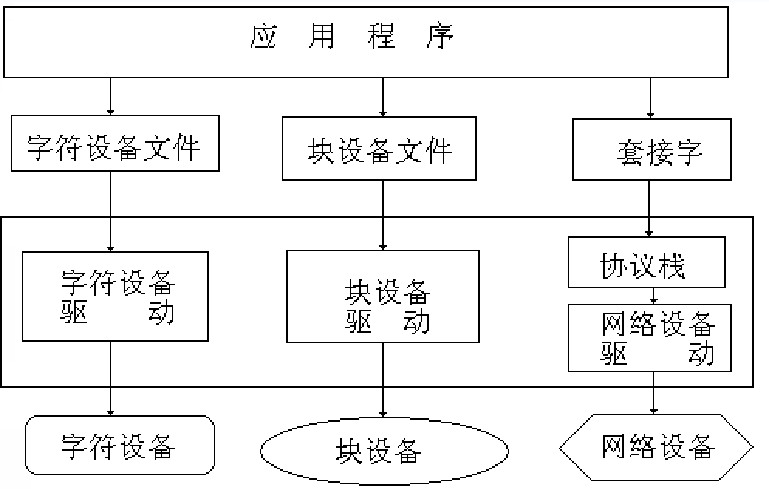

# 嵌入式系统设计知识点

## 基于Cortex-A9微处理器的硬件平台

### RISC和CISC

RISC是精简指令集计算机，CISC是复杂指令集计算机

RISC（精简指令集计算机，Reduced Instruction Set Computer）和CISC（复杂指令集计算机，Complex Instruction Set Computer）是两种不同的计算机架构设计理念，它们在指令集的复杂性、指令执行方式、硬件实现等方面有所区别。以下是RISC和CISC的主要特点及其区别：

- RISC（精简指令集计算机）
  - 指令集简单：RISC架构拥有较少的指令，通常每个指令执行一个简单的操作。
  - 指令执行快速：由于指令简单，大多数RISC指令可以在单个时钟周期内完成。
  - 寄存器丰富：RISC架构通常具有更多的寄存器，以减少对内存的访问次数。
  - 流水线执行：RISC处理器设计易于实现流水线技术，提高指令吞吐率。
  - 编译器优化：RISC架构依赖编译器将复杂操作转换为一系列简单的指令。
- CISC（复杂指令集计算机）
  - 指令集复杂：CISC架构拥有大量的指令，包括一些执行复杂操作的指令。
  - 指令执行较慢：CISC指令可能需要多个时钟周期来完成。
  - 寄存器较少：CISC架构通常具有较少的寄存器，更多依赖内存访问。
  - 微指令执行：CISC处理器可能使用微指令（microcode）来实现复杂指令。
  - 硬件复杂性：CISC处理器的硬件设计相对复杂，以支持广泛的指令集。

区别

- 指令集大小：RISC的指令集较小，CISC的指令集较大。
- 指令复杂性：RISC指令简单，CISC指令复杂。
- 执行速度：RISC指令通常执行更快，CISC指令执行可能较慢。
- 硬件设计：RISC处理器设计相对简单，CISC处理器设计复杂。
- 内存访问：RISC架构倾向于减少内存访问，CISC架构可能更频繁地访问内存。
- 依赖编译器：RISC架构更依赖编译器优化，CISC架构则在硬件层面提供复杂操作。

### ARM处理器支持的基本数据类型

数据类型：字、半字、字节。

说明：

- 一个字节占8位，半个字节占16位，一个字占32位；
- 在存储数据时，字要按照4个字节来存储，所以每一次存时地址都加4，地址末位是00，例如0x13FFFFF8,0x13FFFFFC，
- 在存储数据时，半字要按照2个字节来存，所以每一次存时地址都加2，地址末位是0，例如0x13FFFFF4,0x13FFFFF6，；

### ARM处理器的工作状态

主要有两种状态，主要区别就是执行的指令集位数不同；

- Thumb状态，微处理器执行16位的半字对齐的Thumb指令集，Thumb指令集是从ARM微处理的第四个版本开始增加（v4T）；
- ARM状态，微处理器执行32位的字对齐的ARM指令集。

### ARM存储格式

- 大端格式：高字节存储在低地址，低字节存储在低地址；
- 小端格式:高字节存在高地址，低字节存储在低地址；
说明：

- 对高字节和低字节可以这样理解，假设有一个32位的地址为0x13FFFFF1，它的高字节是31，也可以理解成最高那一位的下标，31这一位存了0，低字节是0存了1。把这个理解带入上面的大端格式，小端格式。

### ARM处理器寄存器

- 共有40个32位的寄存器，其中33个通用寄存器，7个状态寄存器；
- 通用寄存器
  - 未分组寄存器（R0-R7）；
  - 分组寄存器（R8-R14）；
- ARM处理器的程序状态寄存器包括：CPSR（当前程序状态寄存器）和SPSR（程序状态备份寄存器）

### 中断


### ARM工作模式

- 用户模式（usr）:应用程序执行状态。
- 快速中断模式（fiq）：用于高速数据传输或通道处理。
- 外部中断模式（irq）：用于通用的外部中断。
- 特权模式（svc）：操作系统使用的保护模式。
- 数据访问中止模式（abt）：当数据或指令预取终止时进入该模式，可以用于虚拟存储及存储保护。
- 未定义指令中止模式（und）：当未定义的指令执行时进入该模式，可用于支持硬件协处理器的软件仿真。
- 系统模式（sys）：运行具有特权的操作系统任务。
- 监控模式（mon）：可在安全模式与非安全模式之间转换。

- 执行程序什么模式？
- 读指令并执行，读取未定义指令什么模式？
- 遇到特权任务什么模式？
- 遇到中断什么模式?
- 指令执行结束什么模式？

### 3级、5级流水线

- 3级流水线指令可以分解成取指令、编译、执行；
- 5级流水线指令可以分解成取指令、编译、执行、缓冲、写回。

### 程序状态寄存器

- CPSR中的[31:27]为条件标志位，具体含义如下：
  - N：符号标志位。当用两个补码表示的带符号数进行运算时，N=1表示运算的结果为负数；N=0表示运算的结果为正数或零。
  - Z：结果是否为0的标志。Z=1，表示运算结果为0；Z=0，表示运算结果为非0。
  - C：进位或借位标志位。加法运算结果产生了借位时C=1，减法运算产生了借位时C=1，否则为0；包含移位操作的非加/减运算指令，C为移出值的最后一位；其他运算指令，C的值通常不变。
  - V：溢出标志位。对于加减法运算指令，V=1表示符号位溢出，其它指令的影响V位。

- CPSR中的[7:0]为控制位，具体含义如下：
  - I：IRQ中断使能位；
  - F：FIQ中断使能位；
  - T：处理器运行状态控制位；
  - M[4:0]：运行模式位。
- 其它标志位。

### ARM指令集条件域

- EQ：相等，（CPSR）Z=1；
- GT：大于，Z=0&&N=Z;
- TF：小于等于，Z=1||N=Z；

### 寻址指令

### 数据处理指令

- RSB 逆向减法，例如：

```c
  RSB Rd Rn op2 ;op2-Rn赋值给Rd
```

- MUL 32位乘法，

- CMP 比较，例如

```c
  CMP Rn op2 ;Rn-op2
```

- MOV指令:它的传送指令只能是把一个寄存器的值(要能用立即数表示)赋给另一个寄存器，或者将一个常量赋给寄存器，将后边的量赋给前边的量

- ADD指令:ADD指令用于把两个操作数相加，并将结果存放到目的寄存器中。

- SUB指令:SUB指令用于把操作数1减去操作数2，并将结果存放到目的寄存器中

```c
SUB  r0, r1, r2 ; r0 = r1 - r2

SUB  r0, r1, #256                

SUB  r0, r2, r3, LSL#1  ; r0 = r2 - (r3 << 1)
```

- LDR指令:LDR指令用于从存储器中将一个32位的字数据传送到目的寄存器中.

用法1：
LDR r0, =0x20000000
用法2：
LDR r0, =0x30000000 

- STR指令:STR指令用于从源寄存器中将一个32位的字数据传送到存储器中。即：将前边的量赋值给后边的量。

```c
STR r0，[r1]  ; 将r0中的字数据写入以r1为地址的存储器中

STR r0，[r1], ＃8 ; 将r0中的字数据写入以r1为地址的存储器中，并将新地址r1＋8写入r1。

STR r0，[r1, ＃8] ; 将r0中的字数据写入以r1＋8为地址的存储器中。
```

### 跳转指令

### 案例1

```c
     CMP  R0， #0                            
     MOVEQ  R1， #0    
     MOVGT  R1， #1  
解：CMP  R0， #0     ; 将R0的值减去0，并根据结果设置CPSR的标志位                           
        MOVEQ  R1， #0   ; 若R0等于0，Z=1，则将立即数0装入到R1
        MOVGT  R1， #1   ; 若R0大于0，Z=0，N=V，则将立即数1装入到R1
```

程序实现的功能是判断R0的值与0的关系，将结果装入R1，若R0=0则R1=0，若R0>0则R1=1.用C语言描述如下。
         设R0对应变量a，R1对应变量b，
```c
          if(a==0)
                 b=0;
          else  if(a>0)
                 b=1; 
```

### 案例2

对程序各条指令进行注释，最后分析整个程序的功能。

```c
	 AREA	Example1,CODE,READONLY	  ; 声明代码段Example1  
	 ENTRY				     ; 标识程序入口
	 CODE32				  ; 声明32位ARM指令
START 	                   ; 标号/标签
MOV  R0, #0			  ; 设置参数，R0=0
	MOV  R1, #10           ; 设置参数，R1=10
LOOP                       ; 标号/标签
BL  ADD_SUB	         ; 调用子程序ADD_SUB
	B	LOOP			     ; 跳转到LOOP
ADD_SUB	                ; 标号/标签
	ADDS  R0, R0, R1		  ; R0 = R0 + R1，并根据结果设置CPSR的标志位
	MOV	  PC, LR	     	  ; 子程序返回，PC=LR
	END				         ; 声明文件结束
```

**整个程序的功能**：程序实现了一个死循环，每次循环R0都增加10。

## LInux编程基础

### GCC编译的4个过程的主要功能

- 预编译：主要功能是读取源文件，并对头文件预编译语句和一些特殊符号进行分析和处理；
- 编译：主要包括检查代码语法和将预编译后的文件转换成汇编语言；
- 汇编：主要的功能是将汇编语言的代码编程目标文件；（机器代码，0和1）
- 连接：主要功能是连接代码，生成可执行文件。

### 简述Make工具和Makefile的基本结构

Make又叫工程管理工具，即管理较多的工程文件。

主要的功能:

- 通过Makefile文件来描述源程序之间相互依赖的关系，并自动完成维护编译工作；
- 能够根据文件的时间戳发现更新的文件，可以减少编译工作；

基本结构：

```c
target ： dependency
<tab 键> command
```

target:目标；
dependency：依赖关系
command：命令

### Makefile变量

- 用户自定义变量
- 预定义变量
- 自动变量

后两个是系统的变量，是Makefile文件常用的变量，其中有部分变量用户可以修改。

### 预定义变量

需要记住两个比较重要且常用的预定义变量，即

- CC：C编译器名称，默认cc
- CFLAGS：C编译器的选项，无默认值

### 自动变量（又叫系统变量）

- $@ :规则的目标所对应的文件；
- $<：规则中的第一个依赖文件；
- $^:规则中所有依赖的列表，以空格为间隔符。

### 文件操作编程

C语言库中的fopen、fclose、fwrite、fread等函数。

其实是由操作系统的API函数封装而来，如

- fopen内部其实调用的是open函数，
- fwrite内部调用的是write函数。
  
用户也可以直接利用Linux系统的API函数来完成文件操作编程

#### 在Linux操作系统下，用C语言实现文件操作可以采用哪两种方法？

在LInux操作系统中，实现文件操作有两种方法，第一种是调用C语言标准库，第二种是通过Linux系统调用实现。前者独立于操作系统，在任何操作系统下使用C语言标准库函数操作文件，而后者以来于操作系统。

### 时间编程

- time函数

返回1970.1.1 0时到现在所经历的时间，操作失败返回((time_t)-1)

- gmtime函数
将日历转化为格林威治标准时间，结果存在结构体tm中。

在课堂上老师叫我们使用的并非上面这个函数，而是用localtime(const time_t *timep)这个函数,这个函数可以将日历转为本地时间，具体用法请看[综合案例](#综合案例)

- gettimeofday函数

获取从今日凌晨到现在的时差并存储在tv中，tz存放当地时区差；

### 综合案例

（4）编写一个程序，将系统时间以“year-month-day hour:minute:second”格式保存在time.txt文件中。

```c
#include<stdio.h>
#include<string.h>
#include<fcntl.h>
#include<time.h>
#define MAX 40
int main()
{
        int fd,n,ret;
        char writebuf[MAX];
        struct tm *t;
        time_t lt;
        lt=time(NULL);
        t=localtime(&lt);  //将日历时间转化为本地时间
        sprintf(writebuf,"%d-%d-%d %d:%d:%d\n",t->tm_year+1900,t->tm_mon+1,t->tm_mday,t->tm_hour,t->tm_min,t->tm_sec);   //按指定格式保存时间        
/*打开文件，如果文件不存在，则会创建文件*/
        fd = open("time.txt", O_RDWR | O_CREAT);
        /*向文件写入字符串*/ 
        ret = write(fd, writebuf, strlen(writebuf));
        if (ret < 0){
              perror("Write Error!"); return 1;
        }
        else
        {
              printf("write %d characters!\n", ret);
        }
        /*关闭时，会自动保存文件*/
        close(fd);
}
```

### 多线程编程

#### 基本用法

使用到pthread_createh头文件，以及libpthread.so和libpthread.a库文件；

- pthread_create函数：创建线程
- pthread_exit函数：退出线程
- pthread_join函数：阻塞线程

### 互斥锁线程

解决多个线程在一起执行的时候共享数据、资源的问题。在POSIX中有两种线程同步机制，分别为互斥锁和信号量

- pthread_mutex_init:初始化互斥锁
- pthread_mutex_lock：互斥锁上锁
- pthread_mutex_unlock：互斥锁释放

## 嵌入式开发交叉编译与系统移植

### 嵌入式软件调试方法

- 实时在线仿真
- 模拟调试
- 软件调试
- 片上调试

### 引导程序移植

操作系统运行前的一个程序，也就是启动程序。

- BoolLoader工作模式
  - 启动加载模式
  - 下载模式
- BoolLoader启动过程
  - 第一阶段
    - 主要依赖CPU的体系结构硬件初始化的代码，通常使用汇编语言编写。
    - 这个阶段的功能主要有：
      - 基本硬件设备初始化；
      - 为第二阶段准备ARM空间；
      - 复制BootLoader的第二阶段代码到RAM；
      - 设置栈堆；
      - 跳转到第二阶段的入口点；
  - 第二阶段
    - 通常使用C语言完成，以便实现更复杂的功能，使程序具有更好的可读性和可移植性。
    - 这一阶段的主要任务是：
      - 初始化这一阶段要使用的硬件设备;
      - 检测系统内存映射；
      - 将内核文件和根目录系统映像文件从Flash读到RAM；
      - 为内核设置启动参数，
      - 调用内核。

常用的启动文件有很多，这里介绍Uboot。

Uboot是一个开源项目，最早是由德国登克斯（DENX）小组的开发，然后发布在网上，许多对这款软件感兴趣的开发人员共同来维护。

#### BootLoader的核心任务是什么？

启动内核，向内核提供启动参数，完成系统软件的部署功能。

#### 系统加电后执行的第一段代码是什么？

BootLoader(引导程序)是系统上电后运行的第一段代码。

#### U-Boot命令和环境变量

U-Boot通常支持几十个常用命令，通过这些命令，可以对目标机进行调试，也可以引导Linux内核，还可以擦写Flash完成系统部署等功能。

- 常用命令：
print: 通常用于打印信息或变量的值到控制台或终端。

setenv: 设置环境变量。环境变量是在操作系统中存储的配置信息，可以影响程序的行为。

saveenv: 保存环境变量。这个命令通常用于将当前的环境变量设置保存到非易失性存储器，以便在系统重启后保持这些设置。

ping: 网络诊断工具，用于测试主机之间的网络连接是否可达。

tftp: Trivial File Transfer Protocol（简单文件传输协议）的缩写，用于在设备之间传输文件。

boot: 启动系统或加载执行程序。

- 组合命令
  - movi read:用来读取iNand到DDR上  
  - movi write:用来将DDR写到到iNand上

**注释**：

- 非易失性存储器 iNand
- 动态数据随机存取存储器 DDR

### linux内核简介

Linux内核主要功能有：

- 进程管理
- 内存管理
- 文件管理
- 设备管理
- 网络管理

Linux内核源代码非常庞大，它使用目录树结构，内核源码的顶层有许多子目录,分别组织存放各种内核子系统或者文件,如下表：


### Linux内核移植

Linux内核支持多种处理器，如果目标机使用的是ARM处理器核，使用的交叉编译工具链是arm-linux-，内核移植时要指定处理器的类型以及使用的交叉编译工具链，简述具体操作方法。

具体操作如下。
   打开内核顶层目录下的Makefile文件，在文件中找到如下内容。
   ARCH？=$(SUBARCH)
   CROSS_COMPILE?=$(CONFIG_CROSS_COMPILE:“%”=%)
将找到的以上代码修改为如下内容。
   ARCH？=arm
   CROSS_COMPILE?=arm-none-linux-gnueabi-
其中，ARCH是CPU架构变量；CROSS_COMPILE是交叉编译工具链变量。修改完成后，保存文件退出。

## 驱动程序

### 驱动程序的功能

- 对设备初始化和释放
- 数据传输:把数据从内核传送到硬件和从硬件读取数据,读取应用程序传送给设备文件的数据和回送应用程序请求的数据.
- 检测和处理设备出现的错误

#### Open入口点

对象：字符设备文件；
       特点：字符设备文件都需要经过open入口点调用
       open子程序功能：为I/O口作必要的准备工作
       同一时刻只能有一个程序访问此设备（即设备是独占的）,则 open子程序必须设置一些标志以表示设备处于忙碌状态。open子程序的调用格式如下。
int open(char  * filename,int acess)

#### 第一个功能中

打开设备是由调用定义在incliude/linux/fs.h中的file_operations结构体中的 open()函数完成的。open()函数主要完成的主要工作：

1.若是首次打开，先初始化
2.增加设备的使用计数
3.检测设备是否异常，及时发现设备相关错误
4.读取设备次设备号。

### 驱动程序的主要组成部分

- 自动配置和初始化子程序：检测驱动的硬件设备是否正常，能否正常工作
- 服务子程序和中断服务程序:这两者分别是驱动程序的上下两部分。
  - 驱动上部分，即设备服务子程序，它是系统调用的结果，并且伴随着用户态向核心态的演变，在此过程中还可以调用与进程运行环境有关的函数，比如 sleep()函数。
  - 驱动程序的下半部分，即中断服务子程序

### Linux设备分类 （用C表示设备）

- 字符设备
- 块设备
- 网络设备

应用程序操作设备框图


### 简述驱动程序和应用程序的区别

第一，应用程序一般有一个main函数，并从头到尾执行一个任务；驱动程序没有main函数，它在加载时，通过调用module_init宏，完成驱动设备的初始化和注册工作之后便停止工作，并等待被应用程序调用。

第二，应用程序可以和GLIBC库连接，因此可以包含标准的头文件；驱动程序不能使用标准的C库，因此不能调用所有的C库函数，比如输出函数不能使用printf，只能用内核的printk，包含的头文件只能是内核的头文件，比如Linux/module.h。

第三，驱动程序运行在内核空间（又称内核态）比应用程序执行的优先级要高很多。应用程序则运行在最低级别的用户空间（又称用户态），在这一级别禁止对硬件的直接访问和对内存的未授权访问。

应用程序一般有一个main函数,并从头到尾执行一个任务；
应用程序可以和 GLIBC 库连接,因此可以包含标准的头文件；
驱动程序运行在内核空间(又称内核态),比应用程序执行的优先级要高很多。

{}