# 计算机组成原理-复习

## 1 计算机系统概论

### 计算机的分类

计算机总体上分为：电子模拟计算机[^1]和电子数字计算机。二者区别如下表
[^1]:也被称为电脑，或者电子计算机。

|比较内容|电子数字计算机|电子模拟计算机|
|--------|-------------|-------------|
|数据表示方法|0或1|电压|
|计算方式|数字计算|电压组合和测量值|
|控制方式|程序控制|盘上连线|
|精度|高|低|
|数据存储量|大|小|
|逻辑计算能力|强|无|

### 计算机的五代变化

- 第一代1946~1957年， **数据处理** 得到应用；
- 第二代1958~1964年， **工业控制** 开始得到应用；
- 第三代1965~1971年， **小型计算机**开始出现；
- 第四代1972~1990年， **微型计算机** 开始出现；
- 第五代1991年开始， **单片机** 开始出现

### 计算机的性能指标

**处理机字长** 指处理机运算其中一次能工处理的二进制数运算的位数，例如32位，64位。
**存储器带宽** 单位时间内从存储器独处的二进制数信息量，一般用 **字节数/秒**表示。

## 2 运算方法和运算器

**注：**

1. 掌握各进制之间的转换；
2. 掌握小数点之间的二进制与十进制之间的转换；

### 二进制纯小数或纯整数表示方法

- 二进制纯小数： **0.10101** 或 **1.10101**，0或1表示正负号，在正负号后面，在实际中计算机并不存储小数点；
- 二进制纯整数： **10101.**，同样纯整数也用0或1区分正负号。
用Xn-1表示二进制数的个数，Xn表示符号位，如下：
|Xn|Xn-1……X0|
|:--------:|:-------------:|
|符号|量值（尾数）|

纯小数表示范围： **$0<=|x|<=1-2^{-n} $**
纯整数表示范围： **$0<=|x|<=2^{-n} - 1$**

### 浮点数表示方法

电子质量(克)： 9×10^28 = 0.9×10^27
太阳质量(克)： 2×10^33 = 0.2×10^34

任意十进制数 **N** 可以表示为：

```math
$$N=10^E \cdot M$$
```

同样在二进制中也有这样类似的表达：

```math
$$  N=2^e \cdot M$$ 
```

在二进制浮点数表达中：

- 尾数：M，是一个纯小数；
- 比例因子：e，表示指数，常用整数表示，也称为 **阶码** ；
- 基数：式子中的2

二进制浮点数格式：

| $E_s$| $E_m-1…E_1 E_0$| $M_s$| $M_m-1…M_1 M_0$|
|:--------:|:-------------:|:-------------:|:-------------:|
|阶符|阶码|数符|尾数|

**IEEE754标准**格式表示浮点数

**知识储备：** $\frac{1}{2^0}=1$,$\frac{1}{2^1}=0.5$,$\frac{1}{2^2}=0.25$,$\frac{1}{2^3}=0.125$,$\frac{1}{2^4}=0.0625$,$\frac{1}{2^5}=0.03125$

浮点数表示：

```math
$$  N=2^e \cdot M$$ 
```

浮点数所占位数：

|$S$|$E$|$M$
|:--------:|:-------------:|:-------------:|
|$31$|$30 \gets 23$|$22 \gets 0$|

- 基数R=2，基数固定，采用隐含方式来表示它。
- 32位的浮点数：
  - S数的符号位，1位，在最高位，“0”表示正数，“1”表示负
  数。
  - M是尾数， 23位，在低位部分，采用纯小数表示,不对小数点进行存储；
  - E是阶码，8位，也就是说阶码最大不超过255，但阶码采用移码表示$E=2^{7}+e=127+e$，原因是移码比较大小方便。
  - 规格化： 若不对浮点数的表示作出明确规定，同一个浮点数的表示就不是惟一的，所以一般都会规定这个浮点数的位数
    - 尾数域最左位(最高有效位)总是1， 故这一位经常不予存储，而认为隐藏在小数点的左边。
    - 采用这种方式时，将浮点数的指数真值e变成阶码E时，应将指数e加上一个固定的偏移值127(01111111)，即E=e+127。如果是二进制转真值就E=e-127

下面举两个例子进行说明：

**例1：二进制转十进制**若浮点数x的754标准存储格式为(41360000)16，求其浮点数的十进制数值。

解：将16进制数展开后，可得二制数格式为

0 100 00010 011 0110 0000 0000 0000 0000

符号S=0

阶码E=100 00010

尾数M=011 0110 0000 0000 0000 0000

指数e=E-127=10000010-01111111=00000011=$(3)_10$，故有

1.M=1.011 0110 0000 0000 0000 0000=1.011011

于是有

$x=(-1)S \times 1.M \times 2^e=+(1.011011)  \times 2^3=+1011.011=(11.375)_10$

**问：** 0.011怎么转成0.375？

根据上面的知识储备有$ \frac{1}{2^0}\times 0 + \frac{1}{2^1}\times 1 +\frac{1}{2^2}\times 1=0+0.25+0.125=0.375 $

**例2：十进制转二进制**若浮点数为$(28.8125)_10$，求其浮点数的IEEE754标准存储格式的二进制数值。

解：$(28.8125)_10$=$(11100.1101)_2$

格式化表示为：$(11100.1101)_2=1.11001101 \times 2^4$

于是有

e=4

E=e+127=4+127=131=$(1000 0011)_2$

M=1100 1101 0000 0000 0000 000（去掉小数点和小数点前的1，而且有23位，不够补0）

S=0

IEEE754标准的32为存储数据位：0 1000 0011 1100 1101 0000 0000 0000 000

### 数的机器码表示

计算机进行运算时，会把符号位和数字一起编码表示为相应的数，这些数可以用不同的方法表示，例如：原码、补码、移码、反码；

为了区别一般写的数（比如-12，+3等）和机器中的编码（比如 ***0*** 1100,**1** 0011），通常前者称之为 **真值**，后者称为 **机器数** 或 **机器码** 。

$[x]_原$表示机器数，x表示真值。

例如：

$x=+0011$，$[x]{_原}=\textbf{0}0011$

$x=-0011$，$[x]{_原}=\textbf{1}0011$，

原码机器中有“+0”“-0”之分，固有两种形式：例如：$[x]{_原}$与$\textbf{1}0011$表达的意思一样。

数学上把类似于$-3=+9 (mod12)$的式成为 **同余式**。

#### 原码、反码、补码、移码

对原码、反码、补码、移码的简单说明，已知计算机为4位，x=-3.

|例子|表示方法|二进制|说明|
|:--------:|:-------------:|:-------------:|:-------------:|
|-3|原码|$[-3]{_原}$=**0**0011| |
|-3|反码|$[-3]{_反}$=**0**1100|按位取反|
|-3|补码|$[-3]{_补}$=**0**1101|反码最低位加1，注意这个时候符号还是1|
|-3|移码|$[-3]{_移}$=**1**,1101|$[e]{_移}=2^{k}+e=2^4-0011=0,1101$|

对于正数来说，前三个都一样，重点说明移码：

定点整数定义 $[e]{_移}=2^{k}+e,  2^k >e≥-2^k$

上面的表达式中，$[e]{_移}$表示机器码，e为真值，$2^k$表示固定偏移常量。

已知e=+0011,k=4，$[e]{_移}=2^{k}+e=2^{4}+0011=1,0011$

已知e=-0011,k=4，$[e]{_移}=2^{k}+e=2^{4}-0011=0,1101$

移码中的逗号不是小数点，而是表示左边一位是符号位，显然移码中符号位与前三者的表示相反（**详见P21**）。

下面请看例题：

已知计算机是8位的，请分别写出纯整数125，-110，纯小数+0.125，-0.375；二进制数x=11011,y=-01010的原码、反码、补码、移码。（注意格式，要对齐）

|表示方法||表示方法|
|:--------:|:-------------:|:-------------:|
|+125=**0**0101 1111| |-110=**1**0011 1011 |
|$[125]{_原}$=**0**0101 1111| |$[-110]{_原}$=**1**0011 1011 |
|$[125]{_反}$=**0**0101 1111| |$[-110]{_反}$=**1**1100 0100 |
|$[125]{_补}$=**0**0101 1111| |$[-110]{_补}$=**1**1100 0101  |
|$[125]{_移}$=**1**,0101 1111| |$[-110]{_移}$=**0**,1100 0100  |
| | | |
|+0.125=**0**.0010 0000| |-0.357=**1**.0110 0000 |
|$[125]{_原}$=**0**.0010 0000| |$[-110]{_原}$=**1**.0110 0000 |
|$[125]{_反}$=**0**.0010 0000| |$[-110]{_反}$=**1**.1001 1111 |
|$[125]{_补}$=**0**.0010 0000| |$[-110]{_补}$=**1**.1010 0000 |
|$[125]{_移}$=**1**,0010 0000| |$[-110]{_移}$=**0**,1010 0000  |
| | | |
|x=11011| |-110=-01010 |
|$[125]{_原}$=**0**0001 1011| |$[-110]{_原}$=**1**0000 1010 |
|$[125]{_反}$=**0**0001 1011| |$[-110]{_反}$=**1**1111 0101 |
|$[125]{_补}$=**0**0001 1011| |$[-110]{_补}$=**1**1111 0111 |
|$[125]{_移}$=**1**,0001 1011| |$[-110]{_移}$=**0**,1111 0111 |

### 定点加法、减法运算

**公式**
补码加法：任意两数补码之和等于两数之和的补码，$[x]{_补}+[y]{_补}=[x+y]{_补}$

补码减法：$[x-y]{_补}=[x]{_补}-[y]{_补}=[x]{_补}+[-y]{_补}$

从$[y]{_补}$求$[-y]{_补}$的法则是对$[y]{_补}$包括符号位在内求反，最低位加1得到表达式为：

$[-y]{_补}=\rightharpoondown [y]{_补}+2^{-n}$

其中，符号$\rightharpoondown$表示对$[y]{_补}$作求反操作，包括正负号在内，$2^{-n}$表示末位（最低位）加1.

下面举例加以理解运算过程：

（ **详见P29** ）

### 溢出概念与检验方法

在定点整数机器中，运算过程中出现大于字长绝对值的现象称为 **溢出**，溢出分正、负溢出两种，用两位符号位表示， **00**、**11**分别表示整数和负数，**01**表示正溢出，**10** 表示负溢出。

**详细说明原理：** 假设x表示二进制数，用$2^{-n}<x<2^{+n}$表示二进制数的范围，当n=4时，说明二进制最多4为，两个4位二进制运算结果如果为5位则说明溢出，要判断是什么溢出参照上面的方法。

### 定点乘法运算

乘法运算拆分来看主要有算术运算加法，逻辑运算异或，还有移位操作。

四位二进制数x,y，两数进行乘法运算，符号位不参与数值位分开运算，一开始y的最低位与x的每一位进行异或并输出结果，下一次y的次高位与x的每一位进行异或运算，结果输出并左移次高位的位数，假设次高位是2，那么左移两位输出结果。

举个例子，如下：

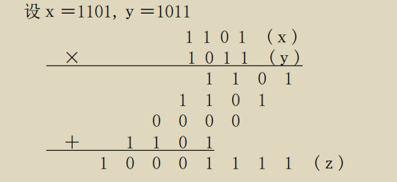

### 定点数除法运算

定点数除法运算这里提供两种方法：

1. 恢复余数法

这种方法是手工计算，而非机器计算，如下图：
定点原码一位除法实现方案（手工）０．１００１０／０．１０１１
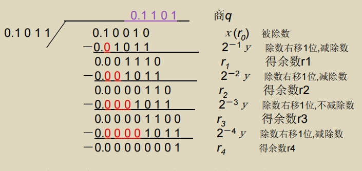
2. 加减交替法（不恢复余数法）

在这之前我们先简单了解并行除法器，如下图：

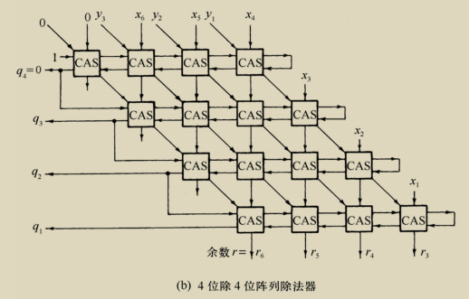

被除数 $0.x{_6}x{_5}x{_4}x{_3}x{_2}x{_1}$

(双倍长)

除数 $0.y{_3}y{_2}y{_1}$

商数 $0.q{_3}q{_2}q{_1}$

余数 $0.r{_6}r{_5}r{_4}r{_3}r{_2}r{_1}$

除数右移

例题：ｘ＝0.101001, ｙ＝0.111, 求${x}\div{y}$

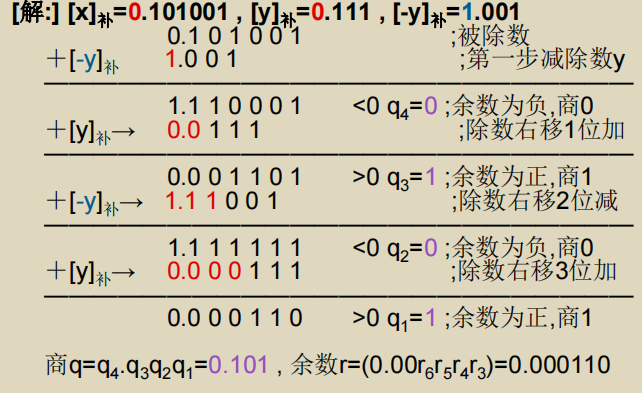

### 浮点运算方法，浮点运算器

再次我们在此复习浮点数的表示方法

```math
$$  N=2^e \cdot M$$ 
```

以及32位IEEE754标准格式
|$S$|$E$|$M$
|:--------:|:-------------:|:-------------:|
|$31$|$30 \gets 23$|$22 \gets 0$|

#### 浮点运算步骤

- 0操作数检查。一般就是检查运算数是否为0，不卸载步骤中
- 比较阶码（E）并完成对阶（小阶向大阶对齐）
- 尾数（M）求和运算
- 结果规格化，把运算结果写成1.M的格式
- 检查上溢出或下溢出（-127<=x<=127,x在这个范围就表示没有溢出,如果溢出需要通过 **变形补码** 来判断是正溢出（01），还是负溢出（10））
- 舍入处理。写出要求需要的有效位，并用十进制检验是否正确
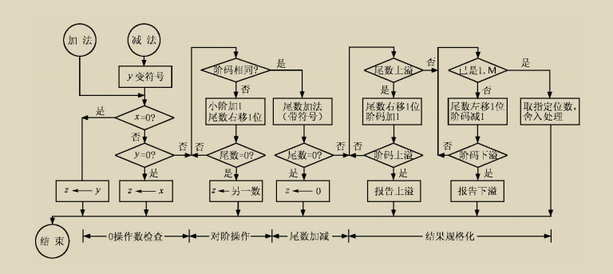

例题：设$x=0.5{_10},y=0.4375{_10}$,假设尾数有效位为4位，用二进制求$(x+y){_浮}$

把x和化为1.M的格式
$x=0.5{_10}=0.1{_2}=0.1{_2}\cdot 2^0=1.000{_2}\cdot 2^{-1}$
$x=-0.4375{_10}=-0.0111{_2}=-0.0111{_2}\cdot 2^0=-1.000{_2}\cdot 2^{-2}$

在这里需要对上面的转换进行说明，说明前我们先看$0.2\cdot10^{0}$,如果现在想写成2，那上面的式子该怎么改呢？

修改如下：
$0.2\cdot10^{0}=2\cdot10^{-1}$

也就是要让式子的左右相等，所以后面10的次方就不一样，理解了上面这个我们再来看$-0.1{_2}\cdot 2^0=-1.000{_2}\cdot 2^{-1}$就会更好理解。

下面是具体的步骤：

1. 对阶，由上可知y的阶小，向x的看齐
    $-1.000{_2}\cdot 2^2=-0.100{_2}\cdot 2^{-1}$
2. 尾数相加，
   $1.000{_2}\cdot 2^{-1}+(-0.100{_2}\cdot 2^{-1})=0.001{_2}\cdot 2^{-1}$
3. 规格化：把结果把x和化为1.M的格式
    $0.001{_2}\cdot 2^{-1}=1.0000{_2}\cdot 2^{-4}$
4. 检验上溢或下溢
   由于指数-4用移码表示，-127<=-4<=127,-4在这个范围即没有溢出
5. 舍入操作
   根据题目要求$(x+y){_浮}=1.0000{_2}\cdot 2^{-4}=0.0625{_10}$
   十进制检验结果x+y=0.5-0.4375=0.0625

### 浮点数乘除法运算

乘除运算分为四步

- 0操作数检查
- 阶码加减操作
- 尾数乘除操作
- 结果规格化和舍入处理

流程与浮点数乘除法类似，但也有不同的地方，下面以乘法运算为例子详细说明具体步骤：

1. 将两数的指数部分相加（前提是你要把两数规格化为1.M的形式）
2. 将被乘数和乘数的尾数相乘
3. 规格化于溢出检测
4. 舍入操作
5. 确定乘积的符号（同号为正，异号为负）

## 存储系统

### 存储系统的层次结构

目前存储器的特点是：

• 速度快的存储器价格贵，容量小；
• 价格低的存储器速度慢，容量大。

- 高速缓冲存储器简称**cache**，它是计算机系统中的一个高速小容量半导体存储器。
- 主存储器简称 **主存**，是计算机系统的主要存储器，用来存放计算机运行期间的 **大量程序** 和 **数据** 。
- 外存储器简称 **外存**，它是大容量辅助存储器。
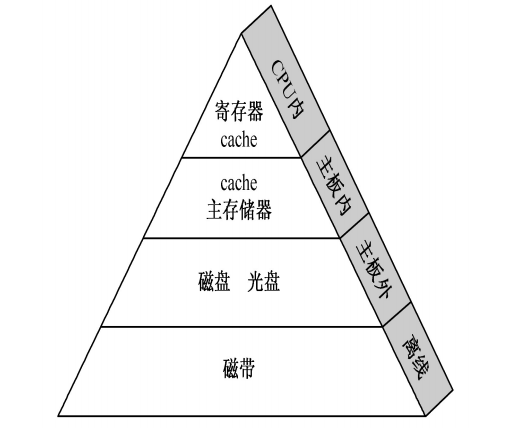

### 存储系统分类

- 按 **存储介质** 分类：磁表面/半导体存储器
- 按 **存取方式** 分类：随机/顺序存取（磁带）
- 按 **读写功能** 分类：ROM，RAM
  - RAM，**随机存取存储器** ：双极型/MOS
  - ROM，**只读存储器** ：MROM/一次可编程只读存储器PROM/可擦除EPROM/电可擦除EEPROM
- 按信息的可保存性分类：永久性和非永久性的
- 按存储器系统中的作用分类：主/辅/缓/控

### 存储器的编制和端模式

- 字存储单元：存放一个机器字的存储单元，相应的单元地址叫字地址。
- 字节存储单元：存放一个字节的单元，相应的地址称为字节地址。
- 端模式：一个存储字内部的多字节排列方式。
  - 大端 big-endian
  - 小端 little-endian

### 存储器技术

- **存储容量：** 指一个存储器中可以容纳的存储单元总数。存储容量越大，能存储的信息就越多。
- **存取时间** 又称存储器访问时间：指一次读操作命令发出到该操作完成，将数据读出到数据总线上所经历的时间。通常取写操作时间等于读操作时间，故称为存储器存取时间。
- **存储周期：** 指连续启动两次读操作所需间隔的最小时间。通常，存储周期略大于存取时间，其时间单位为ns。
- **存储器带宽：** 单位时间里存储器所存取的信息量，通常以位/秒或字节/秒做度量单位。
记住：$1KB=2^{10}B，1MB=2^{20}B，1GB=2^{30}B，1TB=2^{40}B$

### SRAM存储器

- 主存（内部存储器）是半导体存储器。根据信息存储的机理不同可以分为两类：
  - 静态读写存储器(SRAM)：存取速度快
  - 动态读写存储器(DRAM)：存储密度和容量比SRAM大。

三组信号线：
 地址线:n条地址线，确定存储单元（地址）的个数，或说有2^n个存储单元。
 数据线：决定字的长度（位数）。6条地址线，4条数据线，没那么有64*4个存储位元的总数。
    行线
    列线
 控制线：控制读/写，读写不会同时进行
例如一台计算机数据线有4条，那么它就是4位的计算机。
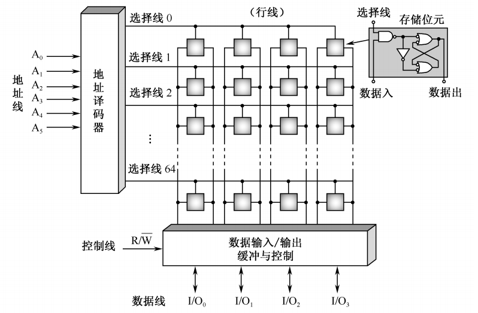

#### 存储容量的扩充

1、字长位数扩展
字节不变，即给的地址线不变，改变数据线让芯片容量符合设计要求。

芯片个数d=设计要求的存储器容量/选择芯片存储器容量

[例2] 利用1M×4位的SRAM芯片，设计一个存储容量
为1M×8位的SRAM存储器。

解：所需芯片数量=(1M×8)/(1M×4)=2片

2、字存储容量扩展

位不变，即数据线不变，通过增加芯片改变地址线使其符合设计要求。

芯片个数d=设计要求的存储器容量/选择芯片存储器容量

[例3]利用1M×8位的DRAM芯片设计2M×8位的DRAM存储
器
解：所需芯片数d=（2M×8）/（1M×8）=2(片)

3、字节扩展

先进行位扩展（数据线bite），字节扩展（字节扩展Byte）

### 动态随机存取存储器

#### 工作原理图

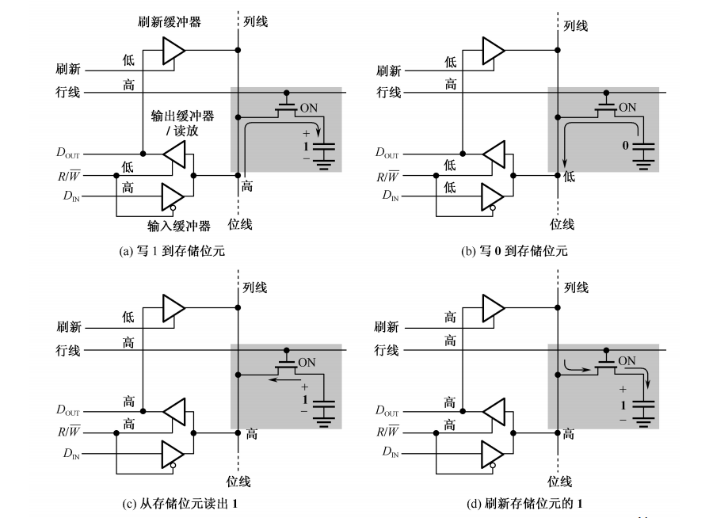
原理图上的刷新本质上是给mos管充电。

#### 动态随机存取存储器的刷新操作

刷新的目的是为了保存存储器的存储信息。
注：读出1才会刷新，读出0不会刷新。
当前主流的DRAM器件的刷新周期间隔时间为64秒

- 集中式刷新。先工作最后在进行充电，假设DRAM有1024行，刷新周期为8ms（这里假设是8ms）
- 分散式刷新。边工作边刷行，假设DRAM有1024行，由8ms（这里假设是8ms）除以1024=7.4us,所以刷新周期为7.4us

### 只读存储器

ROM叫做只读存储器。顾名思义，只读的意思是
在它工作时只能读出，不能写入。然而其中存储的原
始数据，必须在它工作以前写入。只读存储器由于工
作可靠，保密性强，在计算机系统中得到广泛的应用。

主要有两类：

- 掩模ROM：掩模ROM实际上是一个存储内容固定的ROM，由生产厂家提供产品。
- 可编程ROM：用户后写入内容，有些可以多次写入。
  - 一次性编程的PROM
  - 多次编程的EPROM和E2PROM。

#### 掩模ROM

1、掩模ROM的阵列结构和存储元
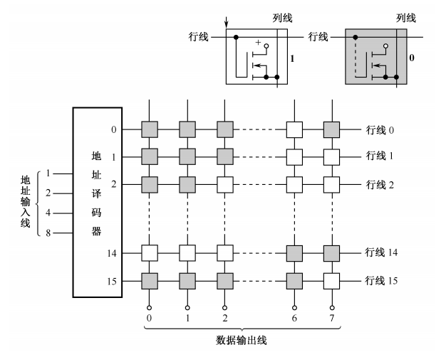

2、可编程ROM

 EPROM叫做 ***光擦除可编程可读存储器***。它的存储内容可以根据需要写入，当需要更新时将原存储内容抹去，再写入新的内容。
 现以浮栅雪崩注入型MOS管为存储元的EPROM为例进行说明，结构如下图所示。

E2PROM存储元

EEPROM，叫做电擦除可编程只读存储器。其存储元是一个具有两个栅极的NMOS管，如图(a)和(b)所示，G1是控制栅，它是一个浮栅，无引出线；G2是抹去栅，它有引出线。在G1栅和漏极D之间有一小面积的氧化层，其厚度极薄，可产生隧道效应。如图(c)所示，当G2栅加20V正脉冲P1时，通过隧道效应，电子由衬底注入到G1浮栅，相当于存储了1”。利用此方法可将存储器抹成全“1”状态。
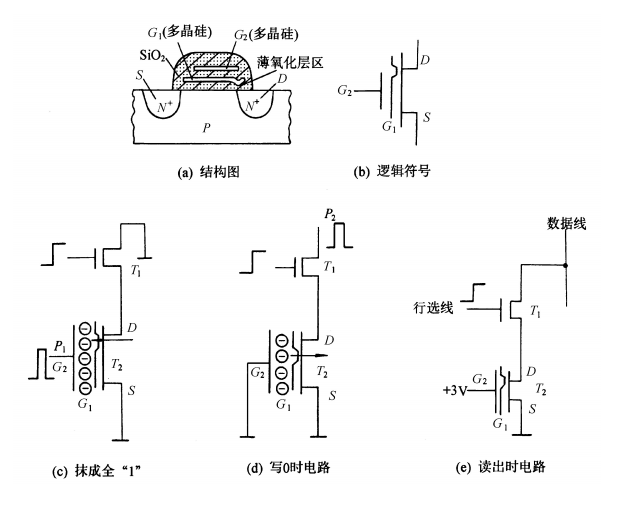

#### FLASH

FLASH存储器也翻译成闪速存储器，它是高密度非失易失性的读/写存储器。高密度意味着它具有巨大比特数目的存储容量。非易失性意味着存放的数据在没有电源的情况下可以长期保存。总之，它既有RAM的优点，又有ROM的优点，称得上是存储技术划时代的进展。

**FLASH存储器的基本操作** 编程操作、读取操作、擦除操作。

### 并行存储器

并行存储器的作用：提高读写效率

#### 双端口与存储器

1、双端口存储器的逻辑结构

双端口存储器由同一个存储器具有两组 **相互独立的读写控制电路** 而得名。由于进行并行的独立操作，因而是一种高速工作的存储器，在科研和工程中非常有用。 举例说明，双端口存储器IDT7133的逻辑框图 。如下图：
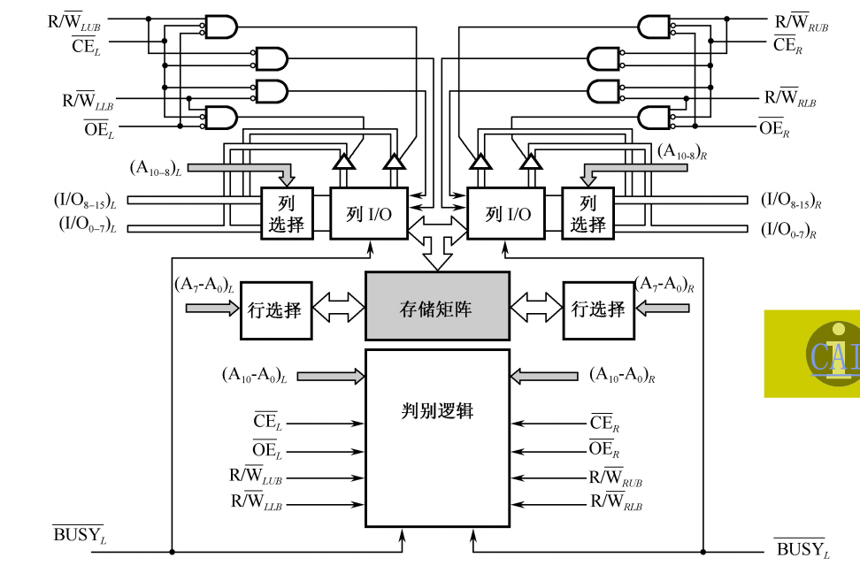

2、无冲突读写控制

当两个端口的地址不相同时，在两个端口上进行读写操作，一定不会发生冲突。当任一端口被选中驱动时，就可对整个存储器进行存取，每一个端口都有自己的片选控制(CE)和输出驱动控制(OE)。读操作时，端口的OE(低电平有效)打开输出驱动器，由存储矩阵读出的数据就出现在I/O线上。

3、有冲突读写控制

当两个端口同时存取存储器同一存储单元时，便发生读写冲突。为解决此问题，特设置了BUSY标志。在这种情况下，片上的判断逻辑可以决定对哪个端口优先进行读写操作，而对另一个被延迟的端口置BUSY标志(BUSY变为低电平)，即暂时关闭此端口。

#### 多模块交叉存储器

1、存储器的模块化组织
一个由若干个模块组成的主存储器是线性编址的。这些地址在各模块中如何安排，有两种方式：

- 一种是 **顺序方式** ，
- 一种是 **交叉方式** 。
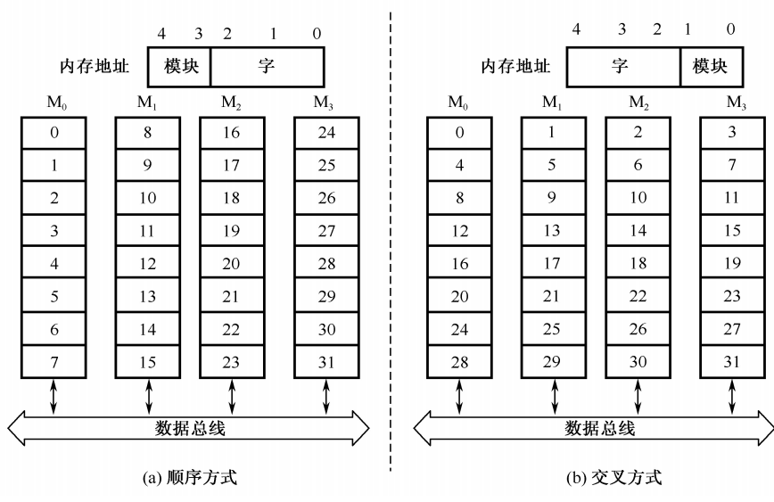

##### 顺序方式

[例]M0－M3共四个模块，则每个模块8个字

顺序方式：

   M0：0—7
   M1：8－15
   M2：16－23
   M3：24－31

- 5位地址组织如下： X X X X X
- 高位选模块，低位选块内地址
- 特点：某个模块进行存取时，其他模块不工作，优点是某一模块出现故障时，其他模块可以照常工作，通过增添模块来扩充存储器容量比较方便。缺点是各模块串行工作，存储器的带宽受到了限制。

##### 交叉方式

- M0：0，4,...除以4余数为0
- M1：1，5,...除以4余数为1
- M2：2，6,...除以4余数为2
- M3：3，7,...除以4余数为3

- 5位地址组织如下： X X X X X
- 高位选块内地址，低位选模块
- 特点：连续地址分布在相邻的不同模块内，同一个模块内的地址都是不连续的。优点是对连续字的成块传送可实现多模块流水式并行存取，大大提高存储器的带宽。使用场合为成批数据读取。

**多模块交叉存储器的基本结构** 下图为四模块交叉存储器结构框图。主存被分成4个相互独立、容量相同的模块M0，M1，M2，M3，每个模块都有自己的读写控制电路、地址寄器和数据寄存器，各自以等同的方式与CPU传送信息。在理想情况下，如果程序段或数据块都是连续地在主存中存取，那么将大大提高主存的访问速度。
!p[tu13](tu13.png)

- 通常在一个存储器周期内，n个存储体必须分时启动，则各个存储体的启动间隔为$t=\frac{T}{n}$（n为交叉存取度）
- 整个存储器的存取速度有望提高n倍
$t{_顺序}=xT$
$t{_交叉}=T\frac{x+n-1}{n}$

### cache 基本原理

为了解决CPU和主存之间速度不匹配而采取的一种重要技术。

- 一般采用高速的SRAM构成。
- CPU和主存之间的速度差别很大采用两级或多级Cache系统
- 早期的一级Cache在CPU内，二级在主板上
- 现在的CPU内带L1 Cache和L2 Cache
- 全由硬件调度，对用户透明
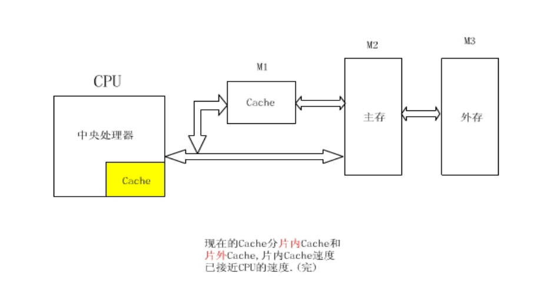
cpu与缓存之间数据交换是以字节为单位，而缓存与主存之间的数据交换以块为单位，一个块有若干组成，是定长的。

从CPU来看，增加一个cache的目的，就是在性能上使主存的平均读出时间尽可能接近cache的读出时间。为了达到这个目的，在所有的存储器访问中由cache满足CPU需要的部分应占很高的比例，即cache的命中率应接近于1。由于程序访问的局部性，实现这个目标是可能的。

命中率：CPU访问cache且需要获取的文件在cache里，即为命中，公示如下：
$h=\frac{N{_c}}{N{_c}+N{_m}}$

$N{_c}$:cache完成存取的总次数（访问cache的总次数）；

$N{_m}$:主存完成存取的总次数。

### 主存与cache的地址映射

无论选择那种映射方式，都要把主存和cache划分为同样大小的“块”。下面介绍三种一映射方式：

1、全相联的映射方式（一对多，一是指缓存，多是指主存里的数据块）

（1）将地址分为两部分（块号和字），在内存块写入Cache时，同时写入块号标记；
（2）CPU给出访问地址后，也将地址分为两部分（块号和字），比较电路块号与Cache 表中的标记进行比较，相同表示命中，访问相应单元；如果没有命中访问内存，CPU 直接访问内存，并将被访问内存的相对应块写入Cache。
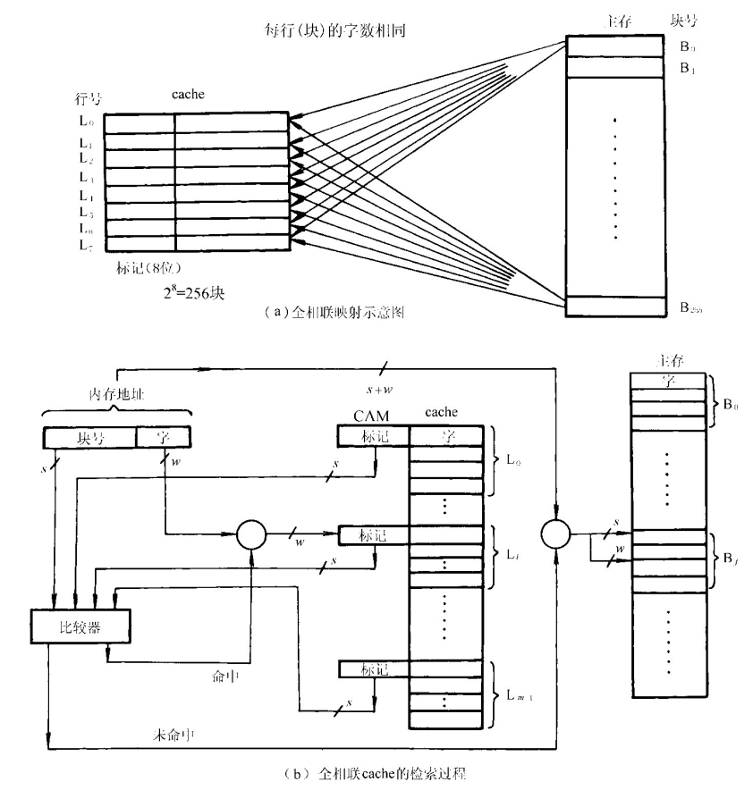

1、全相联映射方式

特点：

- 优点：冲突概率小，Cache的利用高。
- 缺点：比较器电路难实现，适用于小容量的Cache

### 直接映射方式

2、直接映射方式（一对多）：

- i= j mod m
- m为cache中的总行数
- 主存第j块内容拷贝到Cache的i行
- 一般I和m都是2^N级
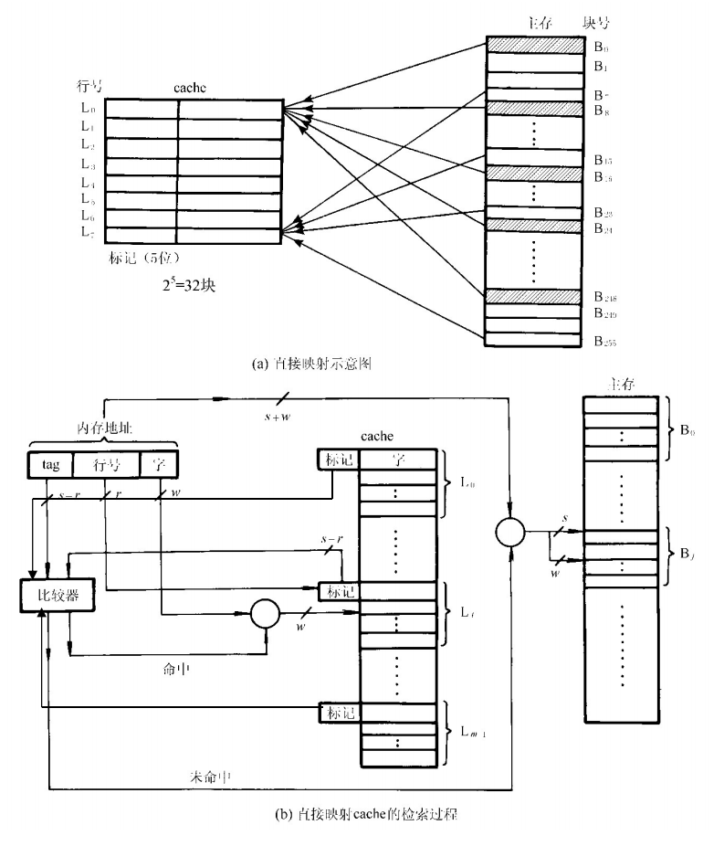

[例]cache容量16字，主存容量256字，则地址2，18，34…..242等都存放在cache的地址2内，如果第一次2在cache中，下次访问34内容，则不管cache其他位置的内容访问情况，都会引起2块内容的替换。

特点

- 优点：比较电路少m倍线路，所以硬件实现简单，Cache地址为主存地址的低几位，不需变换。
- 缺点：冲突概率高（抖动）
- 适合大容量Cache

### 组相联映射方式

前两者的组合

- Cache分组，组间采用直接映射方式，组内采用全相联的映射方式
- Cache分组U，组内容量V
- 映射方法（一对多）
  - q= j mod u
  - 主存第j块内容拷贝到Cache的q组中的某行
- 地址变换
  - 设主存地址x，看是不是在cache中，先y= x mod u，则在y组中一次查找

分析：比全相联容易实现，冲突低

- v=1，则为直接相联映射方式
- u=1，则为全相联映射方式
- v的取值一般比较小， 一般是2的幂，称之为v路组相联cache。
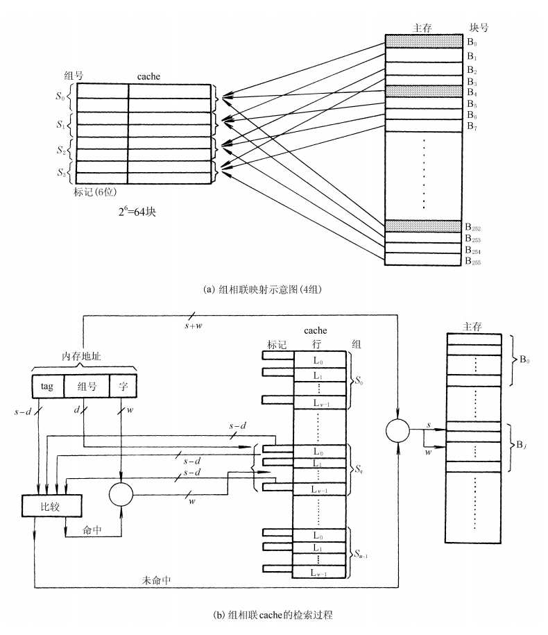

### cache替换策略

- LFU（最不经常使用 ）：每行有一个计数器，被访问的行计数器增加1，哪一行的值小，就换值小的行，不能反映近期cache的访问情况，
- LRU（近期最少使用） ：被访问的行计数器置0，其他的计数器增加1，哪一行的值大，换值大的行，符合cache的工作原理
- 随机替换：随机替换策略实际上是不要什么算法，从特定的行位置中随机地选取一行换出即可。这种策略在硬件上容易实现，且速度也比前两种策略快。
  - 缺点：随意换出的数据很可能马上又要使用，从而降低命中率和cache工作效率。
  - 优点：但这个不足随着cache容量增大而减小。随机替换策略的功效只是稍逊于前两种策略。

由于cache的内容只是主存部分内容的拷贝，它应当 **与主存内容保持一致**。而CPU对cache的写入更改了cache的内容。如何与主存内容保持一致，可选用如下三种写操作策略。

- 写回法：换出时，对行的修改位进行判断，决定是写回还是舍掉。当主存数据传向缓存而缓存满的时候，缓存就要进行替换，只有这个时候才将数据写回主存。
- 全写法：写命中时，Cache与内存一起写，也就是主存和缓存一起更改；
- 写一次法：与写回法一致，第一次Cache命中时采用全写法，也就是这个时候要把数据写回主存，因为第一次命中的时候CPU会在总线上启动一个存储写周期，其他cache即可监听到该消息，选择复制或丢弃该数据，以便委会系统全部cache的一致性。

## 4 指令系统

### 指令系统基本概念

指令：就是要计算机执行某种操作的命令。从计算机组成的层次结构来说，计算机的指令有微指令、机器指令和宏指令之分。

$指令=\begin{cases}微指令\\机器指令\\宏指令\end{cases}$

- **微指令** 是微程序级的命令，它属于硬件；
- **宏指令：** 由若干条机器指令组成的软件指令，它属于软件；
- **机器指令：** 介于微指令与宏指令之间，通常简称为指令，每一条指令可完成一个独立的算术运算或逻辑运算操作。

**本小节介绍的就是机器指令。**

### 指令系统的性能要求

- 完备性
- 规整性
- 有效性
- 兼容性

低级语言与高级语言的关系
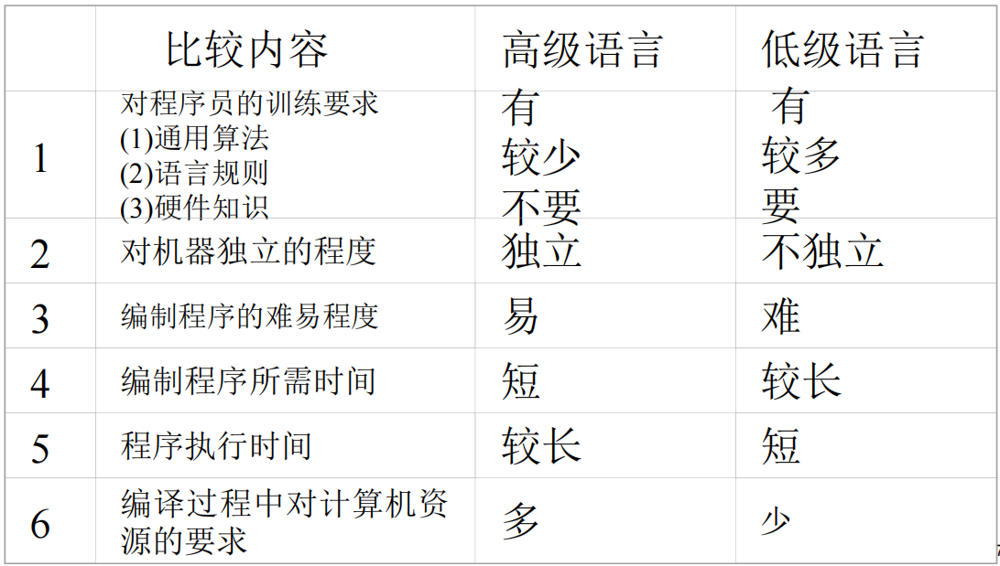

机器程序员看到的计算机属性就是指令系统体系结构，简称 **ISA**。

### 指令格式

|操作字段OP|地址码字段A|
|---------|--------|
|表示进行什么性质的操作，如+、-等|存储操作数的地址|

不同的指令用操作码字段的不同编码来表示，每一种编码代表一种指令。

根据一条指令中有几个操作数地址，可将该指令称为几操作数指令或几地址指令。

- 三地址指令
- 二地址指令
- 单地址指令
- 零地址指令
|地址码名称|操作码|地址块1 |地址块2 |地址块3 |
|---------|--------|--------|--------|--------|
| 三地址指令|OP码|$A_1$|$A_2$|$A_3$|
| 二地址指令|OP码|$A_1$|$A_2$|
| 一地址指令|OP码|$A$|
| 零地址指令|OP码|

#### 三地址指令

| 三地址指令|OP码|$A_1$|$A_2$|$A_3$|
|---------|--------|--------|--------|--------|
|   |操作码|被操作数或源操作数地址|操作数或终点操作数地址|存放结果操作数地址|

- 功能描述：
  - (A1) op(A2)→A3（把A1A2的结果存放到A3中）
  - (PC) +1→PC（PC加1）

这种格式虽然省去了一个地址，但指令长度仍比较长，所以只在字长较长的大、中型机中使用，而小型、微型机中很少使用。

#### 二地址指令（双操作数指令）

| 二地址指令|OP码|$A_1$|$A_2$|
|---------|--------|--------|--------|
|   |操作码| 第一操作数|第二操作数|

- 功能描述：
  - (A1) op(A2)→A1
  - (PC)+1→PC
- 二地址指令在计算机中得到了广泛的应用，但是在使用时有一点必须注意：指令执行之后，A1中原存的内容已经被新的运算结果替换了。

二地址地址根据操作数的物理位置分为：

- SS 存储器-存储器类型
- RS 寄存器-存储器类型
- RR 寄存器-寄存器类型
RR到RS再到SS，指令执行会越来越慢，也就是说指令执行从内存某个单元到内存的另一个单元比较慢。

#### 一地址指令

| 一地址指令|OP码|$A$|
|---------|--------|--------|
|   |操作码| 操作数|

功能描述：

- (AC) op(A1) →A1
- (PC)+1→PC
- 单操作数运算指令，如“+1”、“-1”、“求反”
- 指令中给出一个源操作数的地址

#### 零地址指令

| 零地址指令|OP码|
|---------|--------|
|   |操作码|

功能：“停机”、“空操作”、“清除”等控制类指令。

#### 指令字长度

概念

- 指令字长度（一个指令字包含二进制代码的位数）
- 机器字长：计算机能直接处理的二进制数据的位数。
- 单字长指令
- 半字长指令
- 双字长指令

多字长指令的优缺点

- 优点提供足够的地址位来解决访问内存任何单元的寻址问题 ；
- 缺点必须两次或多次访问内存以取出一整条指令，降低了CPU的运算速度，又占用了更多的存储空间。

- 指令系统中指令采用 **等长指令** 的优点：各种指令字长度是相等的，指令字结构简单，且指令字长度是不变的 ；
- 采用 **非等长指令** 的的优点：各种指令字长度随指令功能而异，结构灵活，能充分利用指令长度，但指令的控制较复杂 。

#### 指令助记符

| 零地址指令|OP码|OP码|
|---------|--------|--------|
|加法|ADD|001|
|减法|SUB|010|
|传送|MOV|011|
|跳转|JMP|100|
|转子|JSR|101|
|存数|STO|110|
|取数|LAD|111|

### 操作数类型

- 地址数据:地址实际上也是一种形式的数据。（ **类似指针** ）
- 数值数据:计算机中普遍使用的三种类型的数值数据。
- 字符数据:文本数据或字符串，目前广泛使用ASCII码。
- 逻辑数据:一个单元中有几位二进制bit项组成，每个bit的值可以是1或0。当数据以这种方式看待时，称为逻辑性数据。（类似布尔型）

### 指令和数据的寻址方式

$指令寻址方式=\begin{cases}顺序寻址\\跳跃寻址\end{cases}$
此处的跳跃寻址包含了选择和循环。

### 操作数基本寻址方式

1、隐含寻址

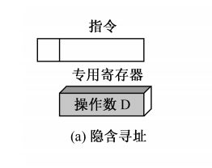

- 指令中隐含着操作数的地址，比如隐藏累加器的地址，当该指令被执行时会执行累加器，但累加器的地址是没有表现在该指令上的。
- 如某些运算，隐含了累加器AC作为源和目的寄存器
- 如8086汇编中的STC指令，设置标志寄存器的C为1

2、立即寻址

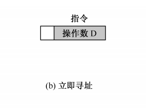

指令的地址指出的不是操作数地址，而是操作数本身。比如

```c
int x=6,y=7;
int z=x+y;
```

在上面这个例子中，执行加法的时候x,y不是6和7的地址，而是6和7本身；

3、直接寻址

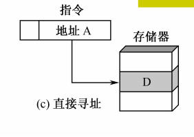

在指令格式中的地址上指出操作数在内存中的地址。其实这很像数组，例如

```c
char x='1';//地址为5673
char cha[]={'x'};//地址为2341
```

我们在使用cha[0]的时候,地址2341指向的就是1的地址5673，一个地址指向另一个地址。

4、间接寻址

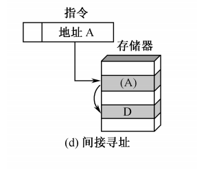

类似二维数组

5、寄存器寻址

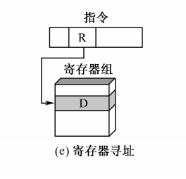

当操作数不在内存而是在CPU的寄存器中时使用这个寻址方式

6、寄存器简介寻址

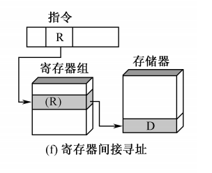

操作数不在寄存器中，而是在寄存器地址所知的位置，比如内存（类似二维数组）

7、偏移寻址

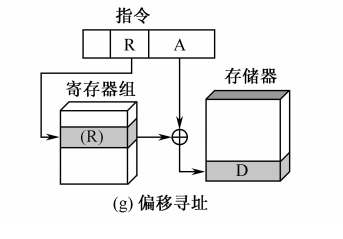

类似于数组中，数组下标的变化会对应不同的地址上的值，下标的变化可以理解为加了某一个偏移量而产生改变。

下面介绍三种不同的偏移寻址，他们的不同我觉得就是使用的寄存器不一样，本质上都是地址加了偏移量后找到第二个地址，再通过第二个地址上的值进行操作。

7.1 相对寻址

使用的是程序计数器（CP），CP作为原始地址，EA=A+（CP）

7.2 基址寻址

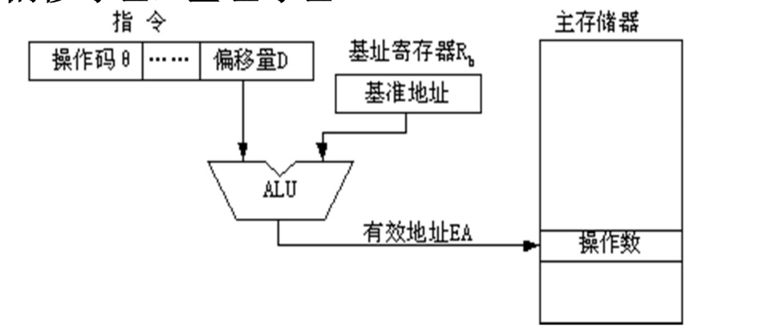

使用存储器地址，作为原始地址，

7.3 变址寻址

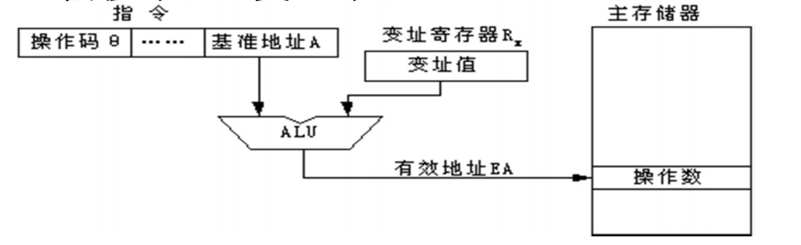

就是将指令的地址码部分给出的基准地址A与CPU内某特定的变址寄存器Rx中的内容相加，以形成操作数的有效地址。

8、分寄存器堆栈、存储器堆栈以先进后出原理存储数据
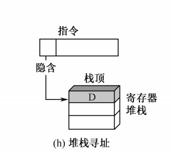

9、段寻址方式

存储空间划分为多段
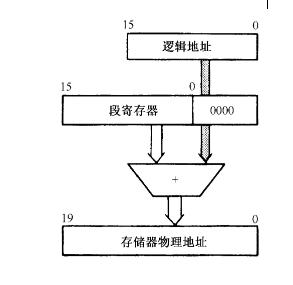

### 典型的指令

- 数据处理
- 数据存储
- 数据传送
- 程序控制

1. 数据传送指令
2. 算术运算指令
3. 逻辑运算指令
4. 程序控制指令
5. 输入输出指令
6. 字符串处理指令
7. 特权指令

## 中央处理器

冯诺一曼机的运算器与控制器是分开的，二现今这两个是设计在同一块芯片上，成为 **CPU** ，而单片机就是 **CPU+存储器**。

### CPU的功能和组成

#### CPU的功能

取指令，执行指令

- 指令控制。程序的**顺序控制** 。
- 操作控制。控制指令的取出与执行。
- 时间控制。对操作实施时间上的定时。
- 数据加工。例如算数运算和逻辑运算

#### CPU的组成

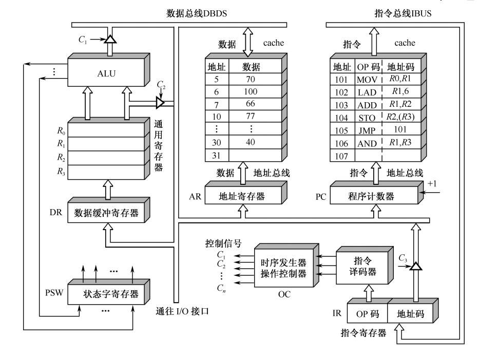
中央处理器CPU = 运算器 + cache + 控制器

##### 运算器

- ALU：算术逻辑运算单元
- 通用寄存器：R0～R3
- 数据缓冲寄存器：DR
- 程序状态字寄存器：PSWR

##### 控制器

程序计数器、指令寄存器、时序发生器、操作控制寄存器；

- 程序计数器PC(Programming Counter)
  - 用来存放正在执行的指令的地址或接着将要执行的下一条指令的地址。
  - **顺序执行** 时，每执行一条指令，PC的值应 **加1**
  - 要改变程序执行顺序的情况时，一般由转移类指令将转移目标地址送往PC ，可实现程序的转移。
- 指令寄存器IR(Instruction Register)
  - 指令寄存器用来存放从存储器中 **取出的待执行的指令**。
  - 在执行该指令的过程中，指令寄存器的内容不允许发生变化，以保证实现指令的全部功能。

### 重要的寄存器

- 数据缓冲寄存器（DP）：暂时存放ALU（算术逻辑运算单元）运算结果，或或有数据寄存器读出的数据字，或外部接口的数据字。
 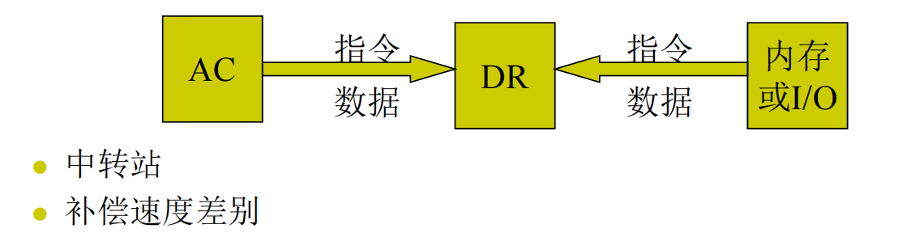
- 指令寄存器(IR)：用来保存当前正在执行的第一条指令
- 程序计数器(PC)：总是保持将要执行的下一条指令，绝大多数是顺序程序，所以修改过程中通常是简单的PC加1.
- 数据地址寄存器(AR)用来保存当前CPU所访问的数据存储单元的地址。
- 通用寄存器(R0～R3)：存常用的指令，
- 状态字寄存器(PSW)：保存有算术运算或逻辑运算或测试结果产生的更重条件代码，简而言之就是存储一些运算的结果，比如进位、溢出、零标志、负标志等

### 指令周期

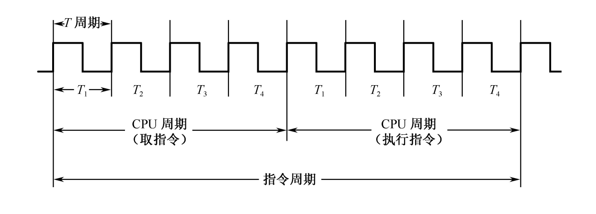
指令周期由若干个CPU周期数表示，CPU周期又称为机器周期，在一些系统中称机器周期为时钟周期。

指令周期又分为取指令周期与执行指令周期


{}
