# 模拟电子技术基础笔记

## 常用半导体器件

### 本征半导体

1. 半导体：介于导体与绝缘体之间的
2. 本征半导体：
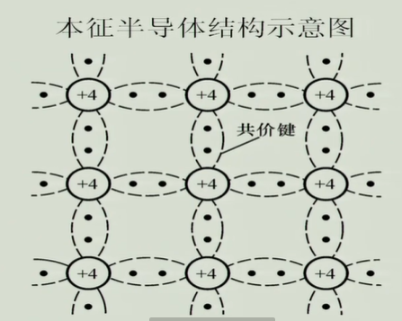
3. 载流子
   3.1 本征激发
   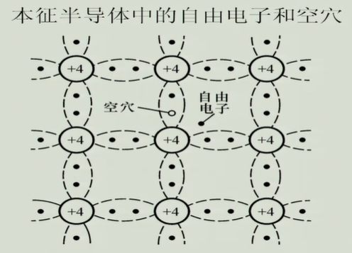
   3.2 自由电子，带负电
   3.3 空穴，带正电
   自由电子和空穴都能到点。
   3.4 复合：与本真激发相反的过程
4. 本征半导体的导电能力与载流子的浓度有关：此时处于动态平衡，本证激发与复合的速度一样。
   
   从工程的角度看，只加热温度让导电能力增加不实际，还好它具有掺杂别的东西让导电能力增加。

### 杂质半导体

#### 概念

掺杂**少量** 的杂志元素。

#### N型半导体

掺杂P元素（5价元素），本征半导体的导电能力增加，自由电子是多子，空穴是少子；

温度对多子影响小，因为多子本身就多，但对少子浓度的影响大，因为少子的量少；

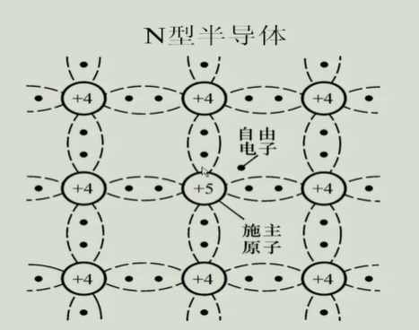

#### P型半导体

掺杂硼元素（3价元素），本征半导体的导电能力增加，自由电子是少子，空穴是多子；

### PN结半导体

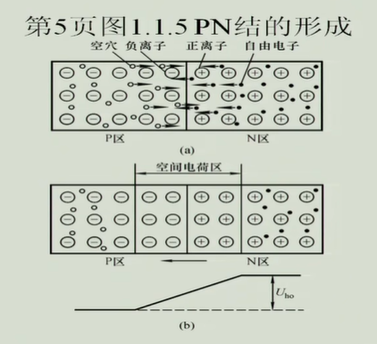

1.扩散运动：在浓度梯度的作用下，浓度高的地方向浓度低的地方扩散；

2.空间电荷区（耗尽层、PN结），这里举个例子，就右边空间电荷区的正电荷而言，从电场线出发，两边平衡我们可以理为正电荷发出的电场阻止了左边的空穴移动，而对于负电荷他也有这样的特性，所以两边达到平衡的状态。

虽然中间有空间电荷区形成势垒（由电压形成）组织了两遍的多子运动，但是这样的势垒能百分之百阻止多子向两边运动吗？

答案是不完全，还是有一小部分的多子冲破避雷向两边运动。下面是一张简单的图。

3.漂移运动：两边少子的运动称之为漂移运动

4.对称结与不对称结：由上面的图可以看出两边宽度一样，原因是掺杂的浓度一样，如果不一样？那么两边就不对称了，这时候称之为不对称结。

#### 加外电压的PN结半导体

加正电压（P流向N，空间电荷区被削弱）
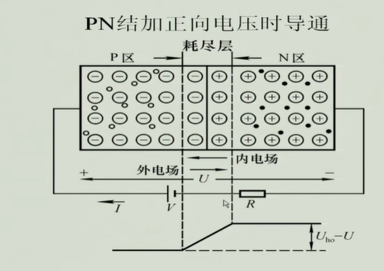

加反向电压（，空间电荷区增加）
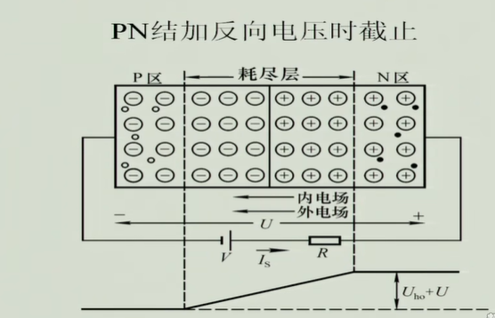

这个时候的漂移运动是增加的，但漂移运动是由少子形成的所以他的影响是很小的，值得注意的是漂移运动对 **温度** 是很敏感的。

### PN结的电流方程

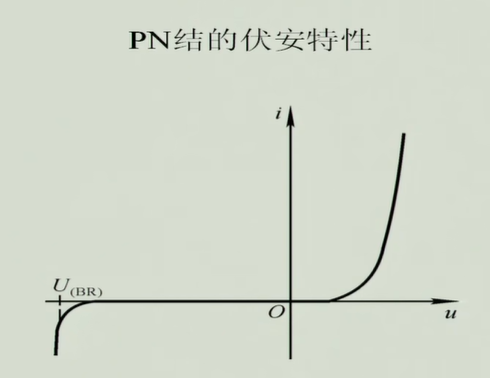

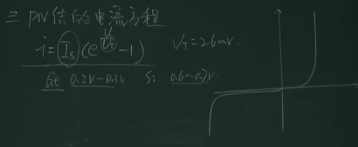
$i=I_s(e^{U/U{_T}}-1),其中V_T=26V$

锗：0.2-0.3V
硅：0.6-0.7V

#### 特性

1. 正向特性
2. 反向特性
   2.1雪崩击穿（掺杂浓度低，温度越高，击穿电压越高，因为粒子需要加速）
   2.2齐纳击穿（掺杂浓度高，温度越高，击穿电压越低，因为）

#### PN结的电容效应

当正负极两边的电压变化时，中间的电量发生改变；

1.势垒电容
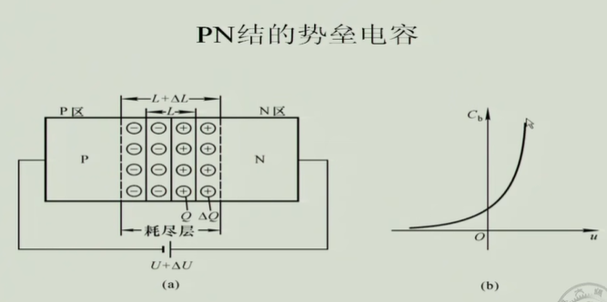

2.扩散电容：非平衡少子形成
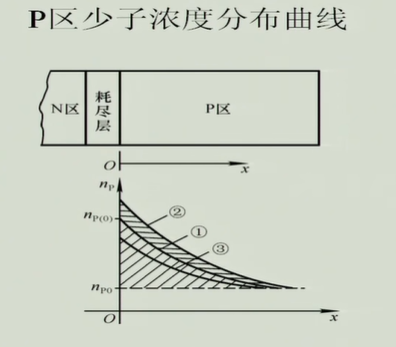

电压增高为2线，浓度增高，电压减小为3，浓度降低；

### 半导体二极管

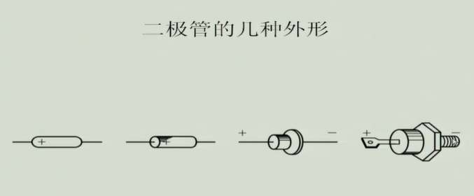

#### 常见结构

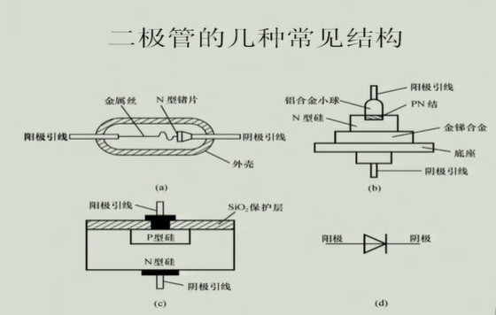

#### 伏安特性

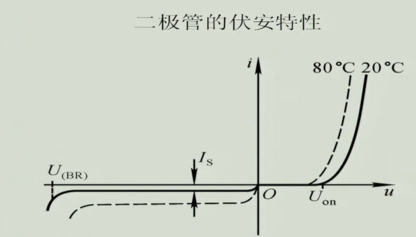

- 体电阻的存在，电流的PN结小；
- 反向电流大一些；

#### 温度的影响

正向电流：温度升高，本证激发，粒子热运动增加，所以电压固定的时候，温度高的电流可定大，所以曲线往上走；

反向电流：温度升高，对少子影响大，饱和电流增加，所以曲线往下走；

### 二极管作用

- 单向导电性，规定电流流向，做整流器件；也可以稳压，但一般用反向的稳压
- 反向的饱和电流，简单的温度传感器；
- 反向截止电流，稳压二极管；

**问：为什么稳压电路不用正向的电压稳压**？

### 二极管的主要参数

- IF：工作的时候电流的最大流过电流，
- UR：最高反向电压，
- IR：反向电流（未击穿时），
- FM：最高频率（选高频电路的时候需要参考），

### 二极管的等效电路

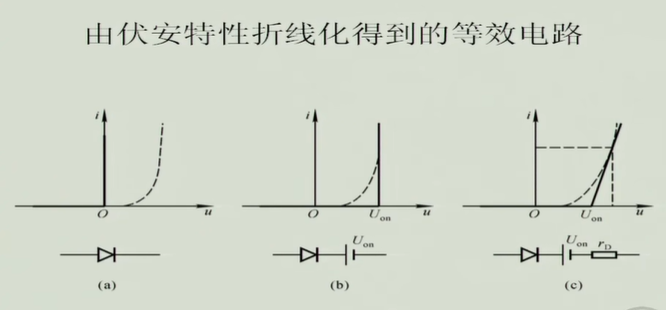
1.上图a为理想的等效电路

2.b图为常用的等效模型

上面三张图的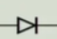中间没有一杠，这是与普通二极管的区别。

下面我们看二级管的几个应用：

1. **整流**电路
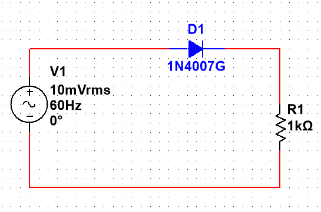

在上面的这个电路中我们假设交流电10mV，要想在$u_R$中测量出变化的电流那么需要加一个直流电压，将交流电抬高，曲线图如下：

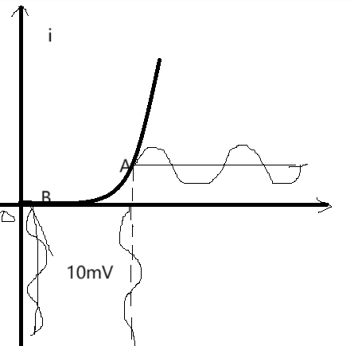

上图B点的电压10mV升到A点，它们的关系是：$U_A=U_B+V$,那么此时就可以测量出$u_R$两端的变化的电流了。具体电路图如下：

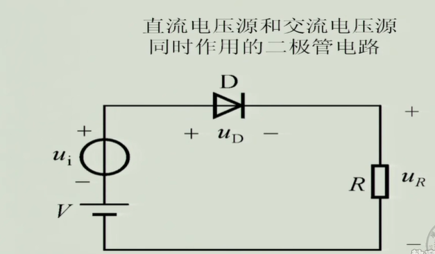

最后得到的波形图是去掉Y轴的负半轴的正弦三角函数图像，也就是整流电路。

2. **限幅**电路

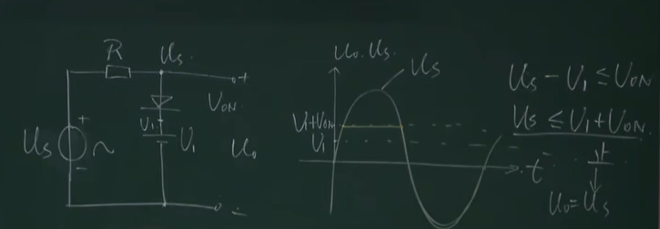

在分析这个电路时，要先判断正向导通和反向截止。

- 当$U_S-U_1<=Uon$的时候截止
- 当$U_S-U_1>=Uon$的时候导通

这时候的三角函数上半边会被割掉如下图：

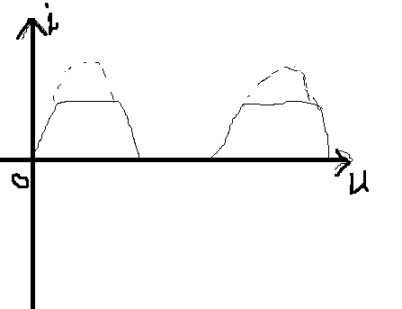

{}