# 1.代码编写规范

## 如何写一个标准的.h文件

以下内容来自[B站](https://www.bilibili.com/video/BV1ELHEewEms/?p=6&spm_id_from=pageDriver&vd_source=5e8e4e9e284af3291f1a3addff3fc2c3)。

接下来将以复数的库文件为例来回答这个问题，下面是一段参考复数库文件代码：

```cpp
class complex
{
private:
    /* data */
    double re,im;
    friend complex& __doapl (complex*,const complex&);
public:
    complex (double r,double i)
    :re(r),im(i)                //这是一个构造函数，这种写法意思是初始化变量
    {};
    complex& operator += (complex operator&);
    double read () const {return re;}  //这里需要加const 意思就是修饰函数的返回值，不允许改变返回值类型
    double imag () const {return im;}
};
```

## 构造函数的特性

这一点需要关注下面的代码：

```cpp
complex (double r,double i)
    :re(r),im(i)                //这是一个构造函数，这种写法意思是初始化变量
    {};
```

## 关于const修饰符

如上面说到的，函数返回最好是加const，这样可以应付下面情况的发生。


{}
```cpp
    double read () const {return re;}  
    double imag () const {return im;}
```

此时做如下两种使用都是正确的

```cpp
    complex com1(1,2);
    cout<<com1.real()<<endl;
```

```cpp
    const complex com1(1,2);
    cout<<com1.real()<<endl;
```
{}

{}
```cpp
    double read ()  {return re;}  
    double imag ()  {return im;}
```

此时做如下两种使用只有第一种可以被执行，第二种会报错。

```cpp
    complex com1(1,2);
    cout<<com1.real()<<endl;
```

```cpp
    const complex com1(1,2);
    cout<<com1.real()<<endl;
```
{}
{}

## 函数传递和返回值的两种方式

pass by values:传值。在传输的事单字节或者字节数较少的情况下使用，比如传一个字符。

pass by reference:传引用。在C++中引用的底层逻辑就是传指针，也就是类似穿了地址，也就是只传输4个字节，
在这种情况下你可以使用const修饰符，迫使函数不能修改值，如果希望函数对值进行处理则可以不加

```cpp
    void re(const classname& cl){};//加了const
    void re(classname cl){};//没有加const
```

对于返回值，我们可以返回值，也可以返回引用，但什么情况下返回的是引用呢？

在设计类中的函数时，可以先考虑返回类型适不适合`引用`,如果返回的是已经存在的地址，那么可以选择返回类型为引用，否则不使用。

```cpp
inline complex&
        __ap(complex * this ,const complex & c){
            this->re += c.re;
            this->im += c.im;

            return *this;
        }
```

向上面的函数就是使用了引用返回。

## 操作符重载-1：成员函数

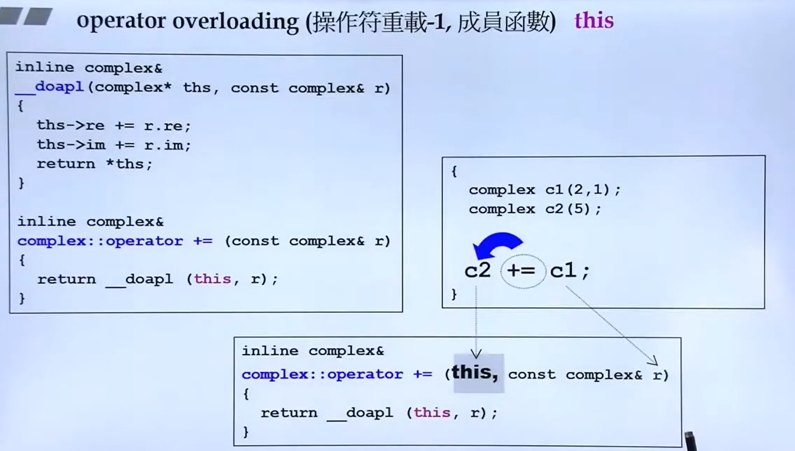

## 操作符重载-2：非成员函数

假设现在要计算复数的加减，如下：

```cpp
    complex com1(1,0);
    complex com2(2,9);
    complex com3;
    
    com3 = com1 + com2;
    com3 = com1 + 2;
    com3 = 0 + com2;

    ……
```

对于这段代码在库文件中，要对加法做非成员函数重载，以应付 不同的情况。

接下来在考虑一个问题，就是如果我们只是做`cout<<com1;`那么对于<<函数返回值可以是void类,但是如果我们做的是`cout<<com1<<com2<<endl;`
这样的操作返回类型为void类型，那么当运行`cout<<com1`后就无法运行`<<com2<<endl`的代码.

很显然要让代码继续运行，我们还需要返回iostream类型，而且使用`return by reference`返回方法，也就是返回引用。如下图：
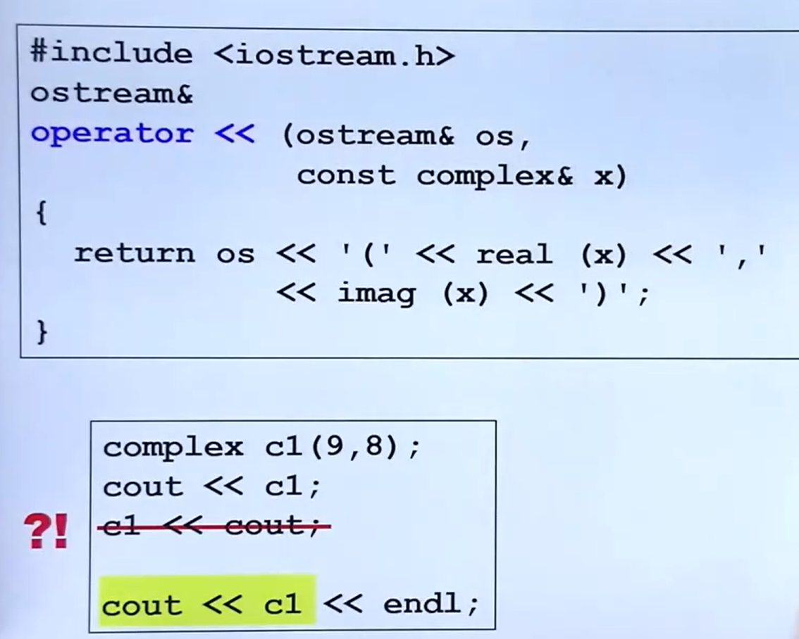

## 小结

通过以上的简单讲解，我们可以总结一下，再写一个类的时候，我们需要注意以下几点：

- 确定类的数据并写在private中;
- 对于构造函数要善于使用初始化数据方法；
- 对于函数要想一想，返回类型是否可以改变，要不要写const；
- 对于函数类型和返回值，要传值还是传引用，要返回值还是返回引用。

是否返回引用最最好的判断标准就是，值在经过函数运算后存储在函数外，或说是一个以存在的存储地址，否则不返回引用

## 接下来通过学习string.h库，进一步了解指针的使用

一般有指针的类需要写三个特殊函数拷贝构造、拷贝析构、拷贝赋值，

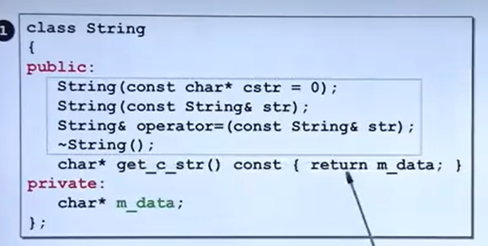
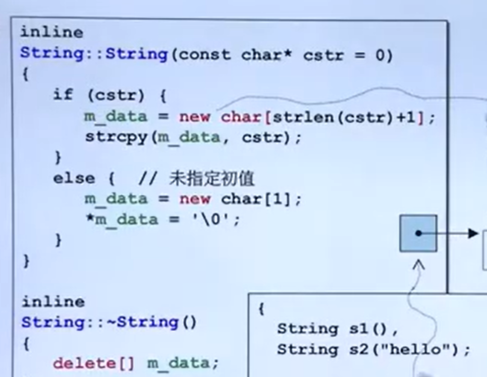
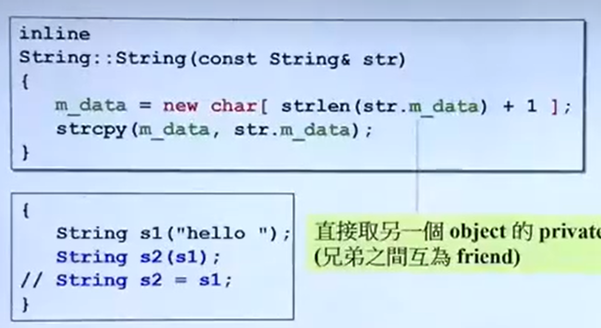
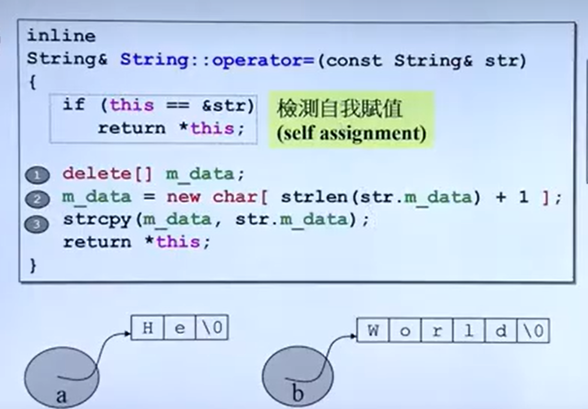

有时候还需要用到new 和 delete。

## stack（栈）和heap（堆）

如下代码：

```cpp
    class String{……};
    ……
    {
        String str("hello");
        String str1 = new String();
        ……
    }
```

上面的{}内的代码就是存储在stack中，而经过new的变量存在heap中；

### stack object 的生命周期

在{}内的代码执行结束后，**自动调用析构函数**将变量清理掉，如下代码，

```cpp
    class String{……};
    ……
    {
        String str("hello");
        ……
    }
```

### static local object 的生命周期

添加关键字static的变量成为静态变量，在作用于如下面代码的{}结束后不会被析构函数清理掉，
变量会存储直到程序结束。

```cpp
    class String{……};
    ……
    {
        static String str("hello");
        ……
    }
```

### global objects 生命周期

全局变量在程序接收后才会被清理掉。

```cpp
    class String{……};

    String str("hello");
    ……
    {
        ……
    }
```

### 调用new和delete的过程

在使用new的地方需要使用delete清理内存，防止内存泄露。

调用new过程：

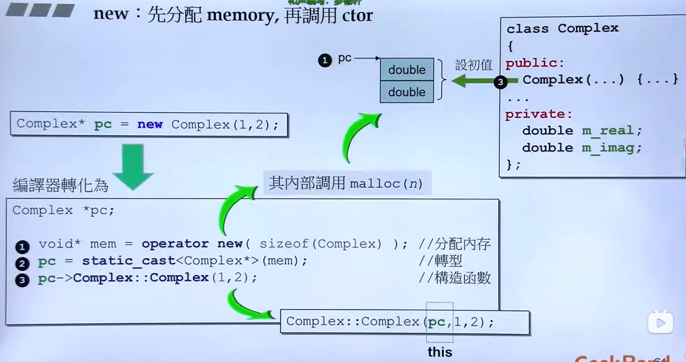

调用delete的过程：

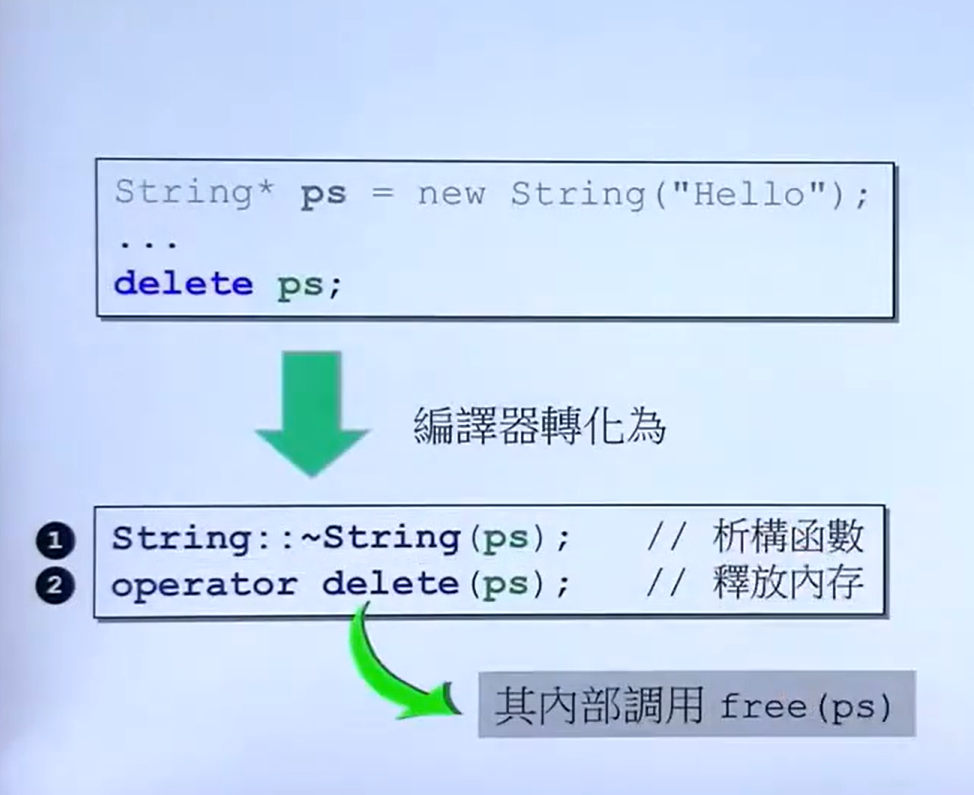
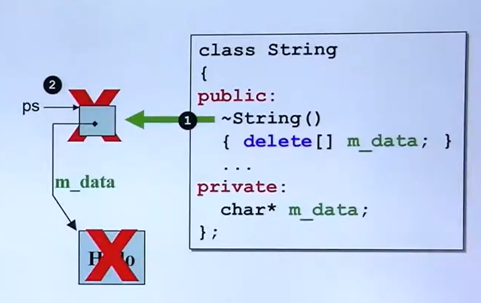

代码 分配内存大小左图是调试模式下的内存分配，右图是非调试模式下分配的内存

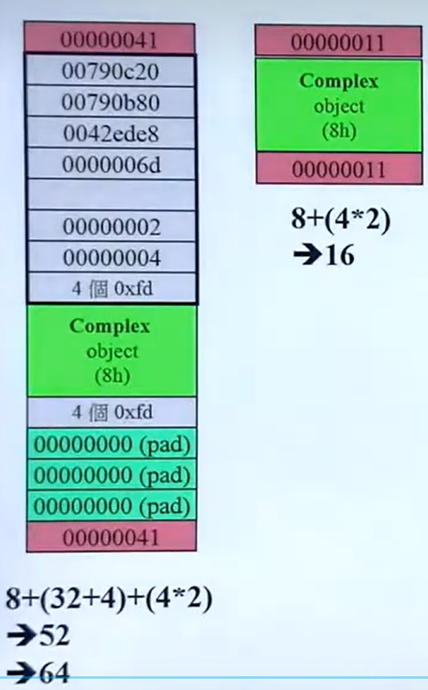

new与delete的搭配，在删除数组时需要加上[]否则编译器不知道你要删的是数组：

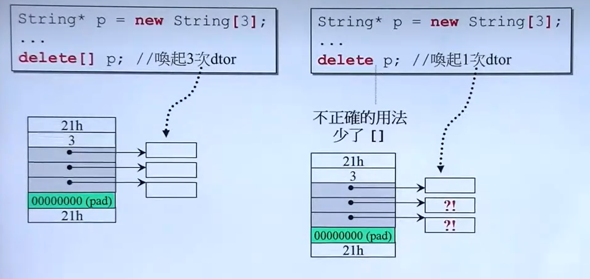

## new和delete的补充

对new和delete的重载，用于设计内存管理，如内存池等操作。

### 重载::new,::delete

重载的函数中，new操作会接收一个大小，该大小由编译器传入，而delete传入的是一个指针，如下图；
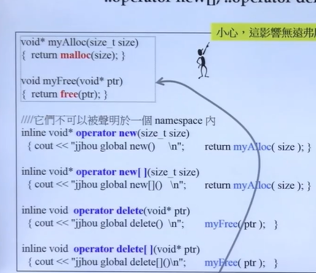

如果不想使用类中的new和delete，可以在二者之前加上:,如::new,::delete，这样在调用函数时就不会调用类设计中的new和delete重载，而是全局的。

### 类中重载的new和delete

```cpp
//类
class F{
    ...
    public:
        void* operate new(size_t);//1
        void operate delete(void*,size_t);//2,size_t可不写
    ...
}
//代码段1的内部操作
try{
    void* mem = operate new(size_t);
    p = static_cast<F*>(mem);//类型转换
    p->F::F();//构造函数
}
//代码段2的内部操作
p->~F();
operate delete(p);

// main函数调用示例
{
    F* p = new F();
    ...
    delete p;
}
```

### 类中重载的new[]和delete[]

代码整体流程与上一个情况类似，区别在于new[]是申请数组内存，在销毁的时候如果不使用delete[]释放内存，delete只会执行一次，导致内存没有完全释放，详细代码如下：

```cpp
//类
class F{
    ...
    public:
        void* operate new(size_t);//1
        void operate delete(void*,size_t);//2,size_t可不写
    ...
}
//代码段1的内部操作
try{
    void* mem = operate new(size_t*N + 4);//指针占4个字节
    p = static_cast<F*>(mem);//类型转换
    p->F::F();//构造函数
}
//代码段2的内部操作
p->~F();//析构函数
operate delete(p);

// main函数调用示例
{
    F* p = new F[N];
    ...
    delete[] p;
}
```

## new,delete使用示例

```cpp
    using namespace std;
class Foo
{
private:
    int _id;//4个字节
    long _data;//4个字节
    string _str;//40个字节
public:
    Foo() :_id(0)       { cout << "default ctor.this = " << this << "id: " << _id << endl; };
    Foo(int i) :_id(i)  { cout << "ctor.this = " << this << "id: " << _id << endl; };
    ~Foo()              { cout << "dtor.this = " << this << "id: " << _id << endl; };
    static void* operator new(size_t size);
    static void operator delete(void* p, size_t size);
    static void* operator new[](size_t size);
    static void operator delete[](void* p, size_t size);
};

void* Foo::operator new(size_t size)
{
    Foo* p = (Foo*)malloc(size);
    cout << "new size = " << size << endl;
    return p;
}

void Foo::operator delete(void* p, size_t size)
{
    cout << "delete size = " << size << endl;
    free(p);
}

void* Foo::operator new[](size_t size)
{
    Foo* p = (Foo*)malloc(size);
    cout << "new[] size = " << size << endl;
    return p;
}

void Foo::operator delete[](void* p, size_t size)
{
    cout << "delete[] size = " << size << endl;
    free(p);
}
```

运行结果如下：

```c
new size = 48
default ctor.this = 00000191EC67A460id: 0
dtor.this = 00000191EC67A460id: 0
delete size = 48
_____________________________________________
new[] size = 104
default ctor.this = 00000191EC673438id: 0
default ctor.this = 00000191EC673468id: 0
dtor.this = 00000191EC673468id: 0
dtor.this = 00000191EC673438id: 0
delete[] size = 104
```

### 为什么new[]操作会多出8个字节呢？

我看课程视频，老师说new[]分配的内存块会在最前面存储计数量，占用4个字节，表示数组大小，但是我在电脑上运行会多出8个字节，查阅资料可能与系统、对齐方式、编译器等有关。

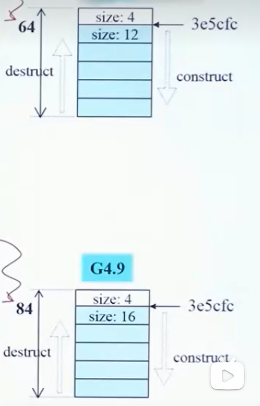

## 对new的分配额外内存

假设分配内存的同时需要额外分配一定的内存，可以参考下面的代码：
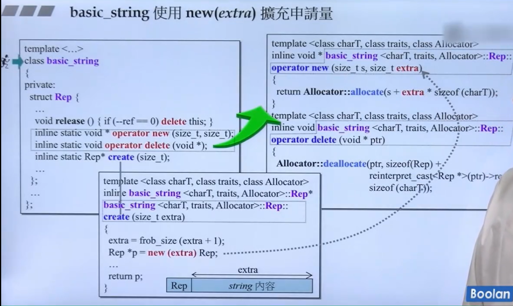

## 小结

对于包含有指针的类，在必要时写上拷贝构造、拷贝赋值、析构函数，如下代码
{}
{}
```cpp
    class String
    {
    private:
        char* m_data;
    public:
        String(const char* cstr = 0);           //构造函数
        String(const String& str);              //拷贝构造函数
        String& operator= (const String& str);  //拷贝赋值函数
        ~String();                              //析构函数
        char* get_c_str() const {return m_data;}
    };
```
{}
{}
```cpp
    String::~String()
    {
        delete[] m_data;
    }
```
{}
{}
```cpp
    inline 
    String::String(const char* cstr = 0)
    {
        if (cstr)
        {
            m_data = new char[strlen(cstr)+1];
            strcpy(m_data, cstr);
        }else{
            m_data = new char[1];
            strcpy(m_data,'\0');
        }
    }
```
{}
{}
```cpp
    inline
    String::String(const String& cstr){
        m_data = new char[strlen(cstr.m_data) + 1];
        strcpy(m_data, cstr);
    }
```
{}
{}
```cpp
    inline 
    String& String::operator=(const String& str)
    {
        if(this == &str)
        return *this;
        delete[] m_data;
        m_data = new char[strlen(str.m_data) + 1];
        strcpy(m_data, str);
        return *this;
    }
```
{}
{}

## 补充内容static

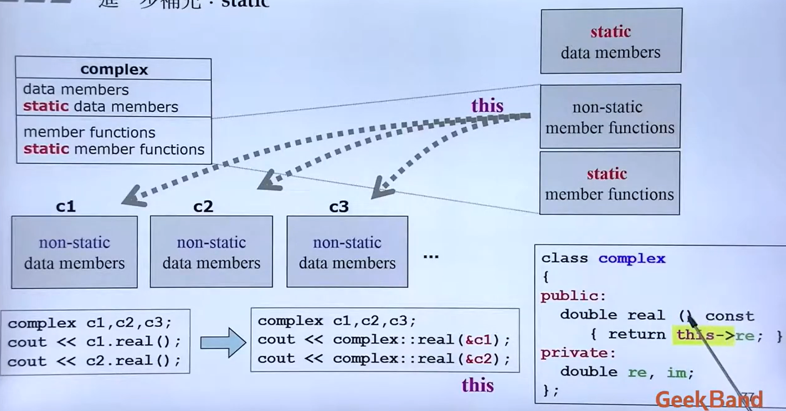

### static在private中的使用例子

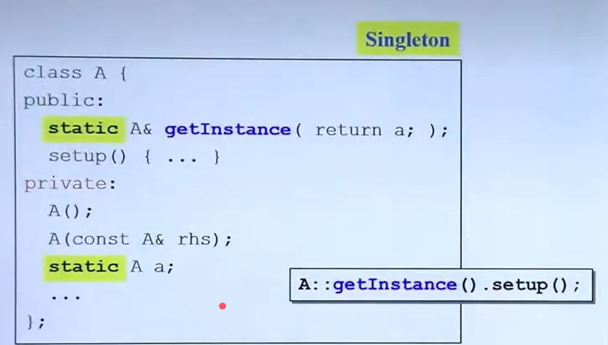
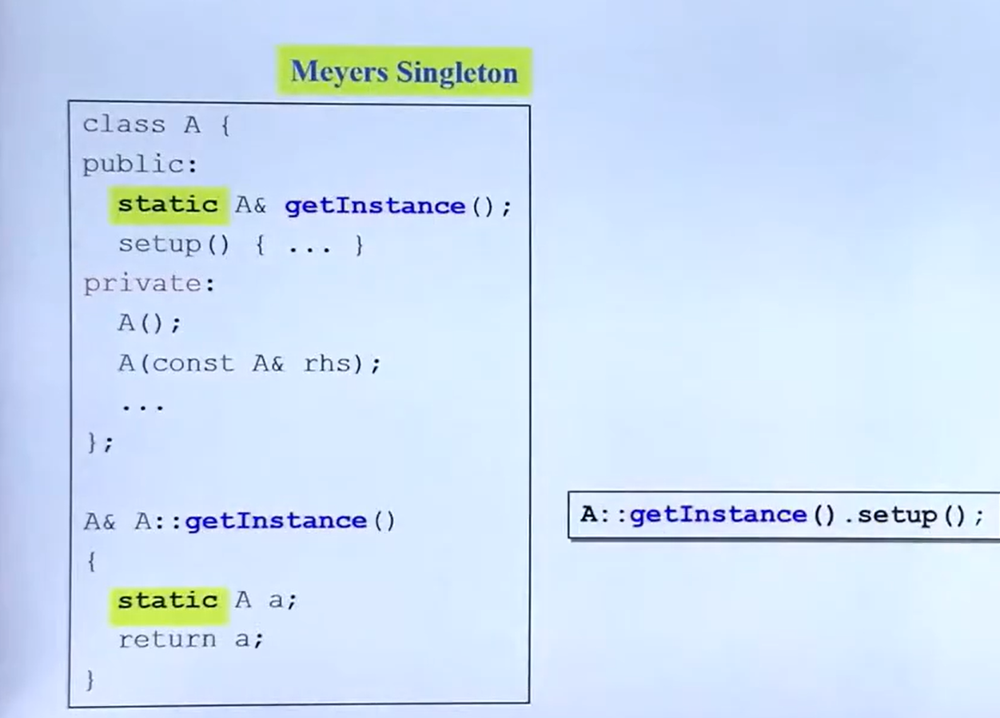

### class template

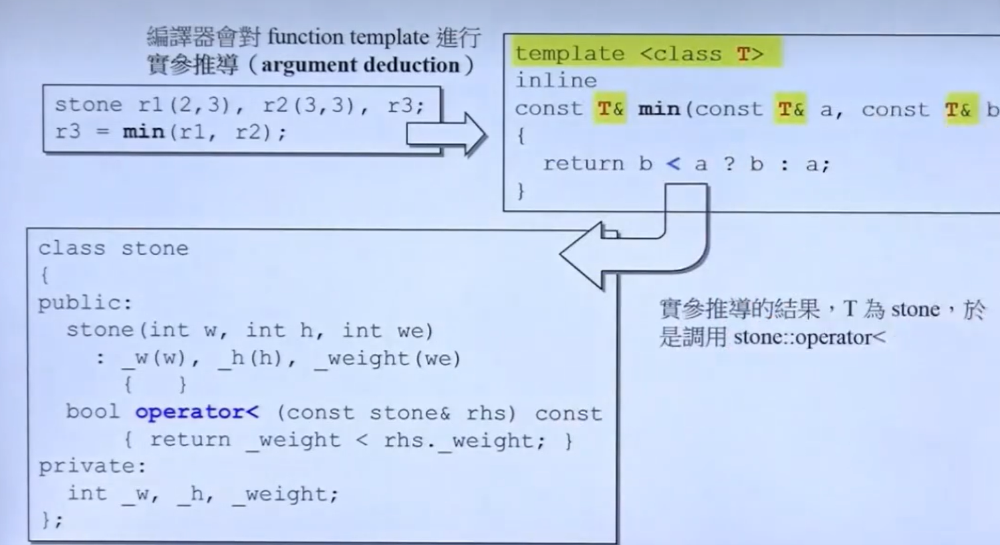

### function template


### member template 成员模板

类模板中，还有类模板，通常是对构造函数的操作，如下图：
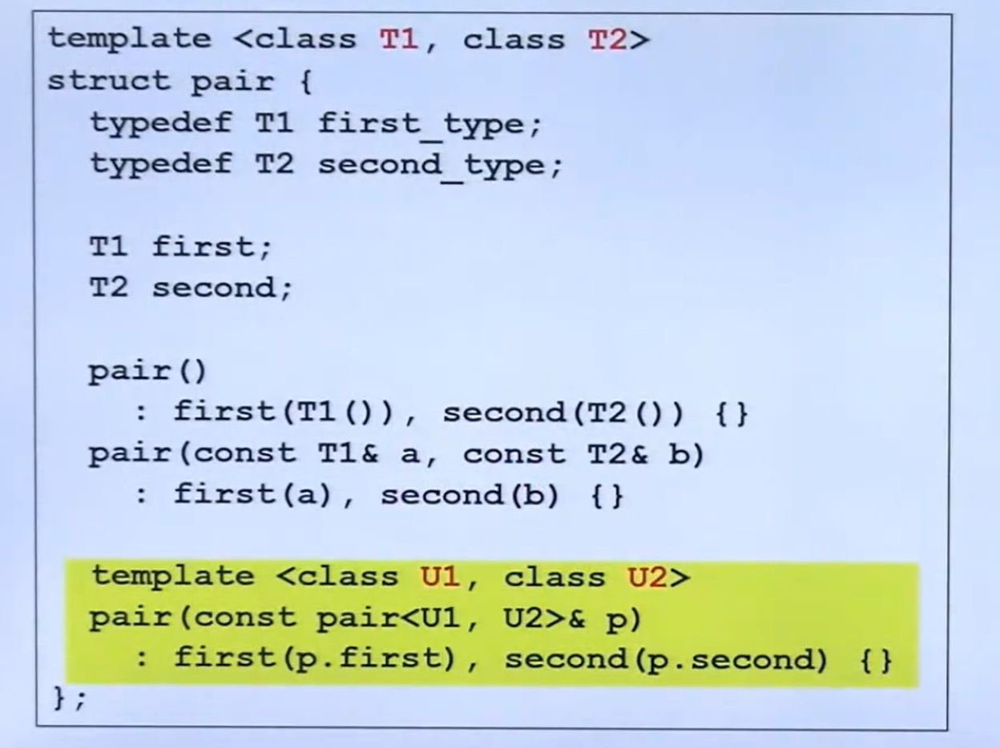

如下图代码
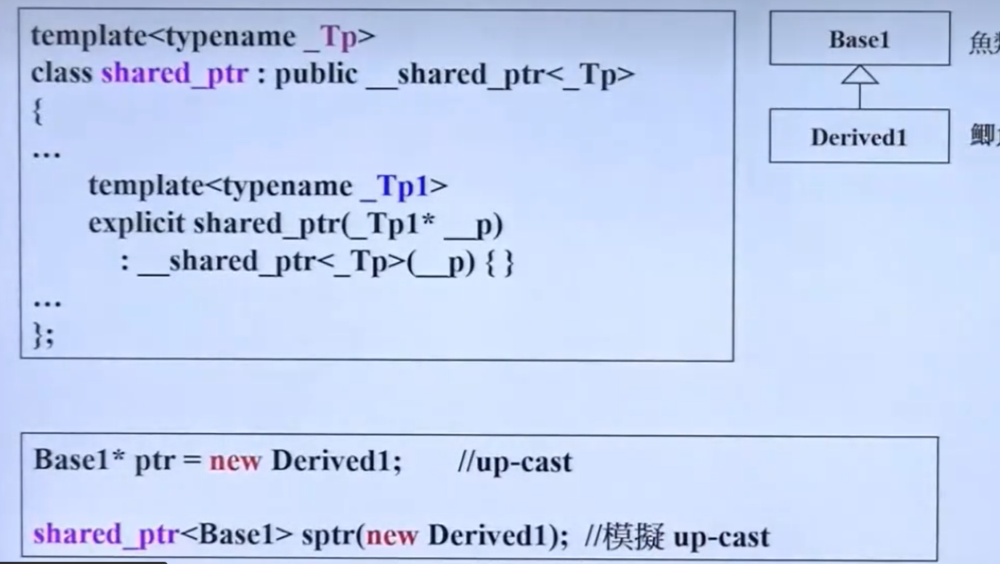

用意就是当一个指针指向父类时，初始化让他指向子类，那么此时需要实现上图类中的代码。

### namespace（命令空间）

使用示例：
```cpp
    using namespace std;
    {
        ……
    }
```

使用方法：

{}
{}
```cpp
    #include <iostream>
    using namespace std;

    int main()
    {
        cout<<……;
        cin<<……;
        return 0;
    }
```
{}
{}
```cpp
    #include <iostream>
    using std::cout;

    int main()
    {
        cout<<……;
        std::cin<<……;
        return 0;
    }
```
或者
```cpp
    #include <iostream>
    int main()
    {
        std::cout<<……;
        std::cin<<……;
        return 0;
    }
```
{}
{}
{}