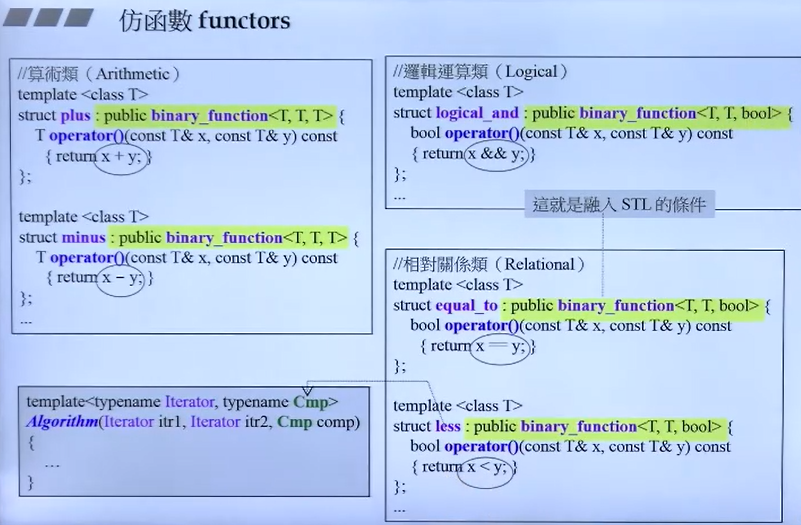
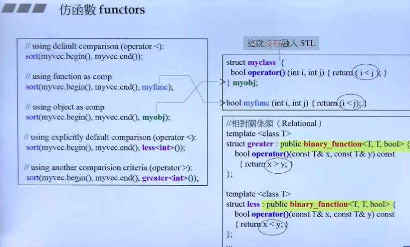
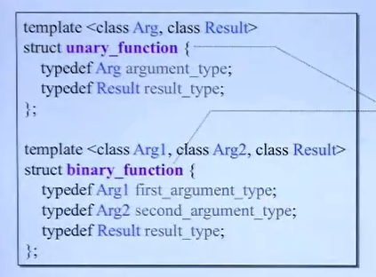

# 10.STL库学习之仿函数

## 仿函数的个人理解

仿函数是行为类似函数的一个类，比较明显的特征是仿函数重载了operate()，比如你写了一个struct，并在里面重载了operate()，当调用这个类的()时就会返回响应的数据。

你的理解是正确的，仿函数（functor）是 C++ 中的一个概念，它指的是那些可以像函数一样被调用的对象。这些对象通常重载了函数调用操作符 `operator()`，使得对象可以被当作函数来使用。以下是对你描述的一些补充说明：

### 仿函数的特点

1. **重载 `operator()`**：仿函数类必须重载函数调用操作符 `operator()`，这样对象就可以被像函数那样调用。

2. **可以携带状态**：与普通函数不同，仿函数可以拥有成员变量，这意味着它们可以携带状态。这些状态可以是私有的，也可以是公开的，取决于仿函数的设计。

3. **可以进行重载**：仿函数可以重载 `operator()`，以接受不同数量和类型的参数。

4. **可以定义在类中**：仿函数可以是类的成员函数，也可以是独立的类。

5. **可以有返回值**：当仿函数被调用时，可以返回一个值，就像普通函数那样。

6. **可以作为参数传递**：由于仿函数可以像函数一样被调用，它们可以作为参数传递给接受函数作为参数的函数。

### 仿函数的应用

1. **算法的参数**：仿函数经常用作 STL 算法的参数，例如 `std::sort` 和 `std::find_if`，因为这些算法需要一个可以被调用的实体来比较元素或测试条件。

2. **回调函数**：在事件驱动的编程中，仿函数可以作为回调函数，响应特定的事件。

3. **策略模式**：在设计模式中，仿函数可以用于实现策略模式，允许算法的行为在运行时动态改变。

4. **简化代码**：通过使用仿函数，可以减少函数指针和全局函数的使用，使得代码更加简洁和易于管理。

### 示例代码

```cpp
struct Max {
    // 重载()操作符，使其可以被调用
    int operator()(int a, int b) const {
        return (a > b) ? a : b;
    }
};

int main() {
    Max max_functor;
    int result = max_functor(10, 20); // 使用仿函数对象调用
    std::cout << "Max value: " << result << std::endl;
    return 0;
}
```

在这个例子中，`Max` 是一个仿函数，它重载了 `operator()` 来比较两个整数并返回最大值。然后，我们可以像调用函数一样调用 `max_functor` 对象。

## 仿函数内部一般设计什么？

仿函数一般重载operate()后，会在内部设计运算操作，如算数、逻辑、相对关系等运算。如下图所示。

从上面一张图也可以发现，plus,minus,logical_and,equal_to,less类都集成了binary_function，该类的作用是什么呢？

`std::binary_function` 的主要作用是：

1. **泛型框架**：提供一个泛型框架，允许函数对象接受任意类型的参数。
2. **类型转换**：允许参数类型和返回类型的转换，使得函数对象可以用于不同的数据类型。
3. **模板编程**：支持模板编程，使得可以创建通用的算法和函数。

- **原型**

`std::binary_function` 的原型如下：

```cpp
template <class Arg1Type, class Arg2Type, class ResultType>
struct binary_function {
    typedef Arg1Type first_argument_type;
    typedef Arg2Type second_argument_type;
    typedef ResultType result_type;
};
```

- `Arg1Type`：第一个参数的类型。
- `Arg2Type`：第二个参数的类型。
- `ResultType`：函数返回值的类型。

- **继承和使用**

函数对象如 `std::plus`, `std::minus`, `std::logical_and`, `std::equal_to`, `std::less` 等都继承自 `std::binary_function`。这意味着这些函数对象都定义了 `first_argument_type`, `second_argument_type`, 和 `result_type` 这三个类型别名，它们分别表示函数对象接受的第一个参数类型、第二个参数类型和返回值类型。

关于 `std::binary_function`的具体细节在适配器一节会重点讲到。

下图是是否继承binary_function的一些示例，如果不继承会怎么样呢？以我个人的理解，继承会让仿函数的扩展性更高，它将来可以扩展出更好的功能。如下图所示。


除了上面讲到的binary_function还有unary_function，该类是针对单个变量的操作，比如取反，加加。如下图：


关于binary_function的细节此处先不介绍，下一节将着重说明。

对于仿函数，鲜明的特点就是对operate()做了重载，这样的类创建出来的对象叫仿函数对象，具有函数的行为。如果要对重载做更多操作需要结合一些仿函数适配器，比如相面讲到的binary_function和unary_funtion。

{}
