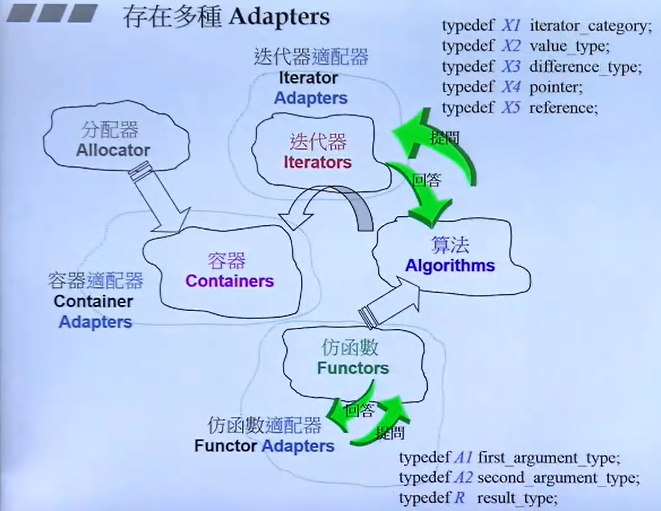
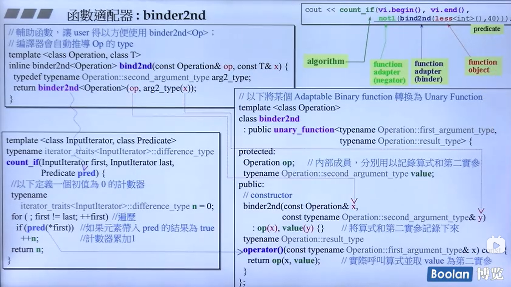
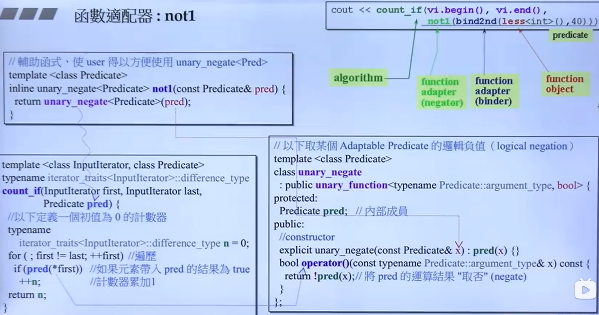
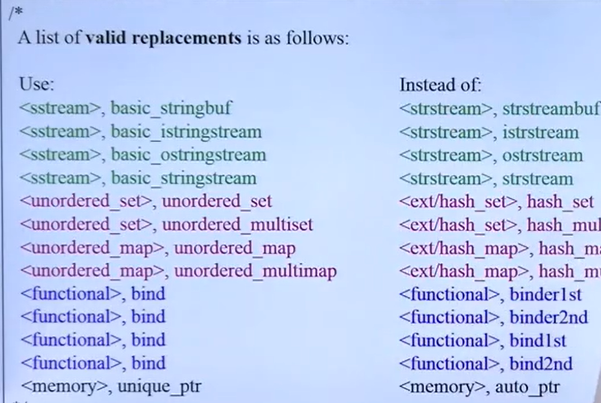
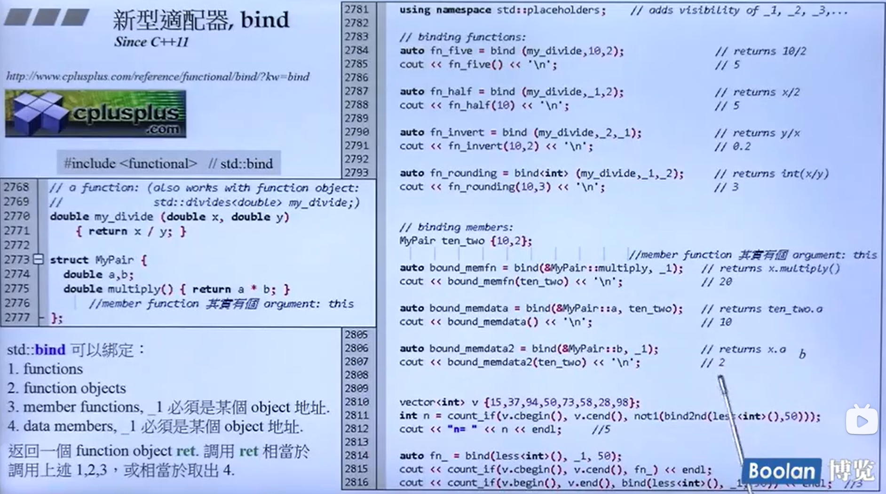
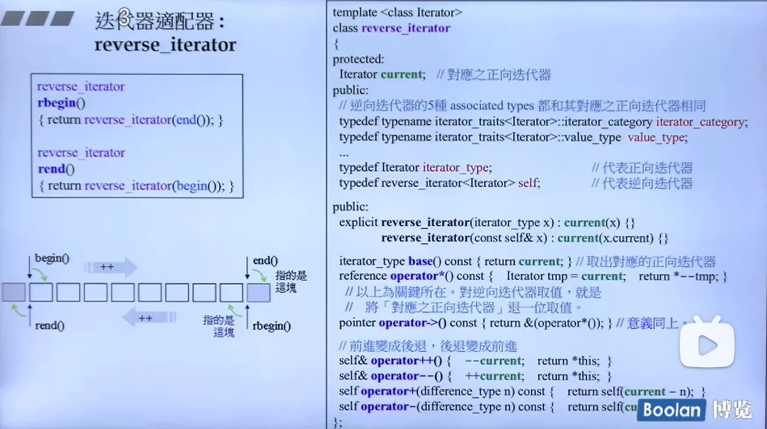
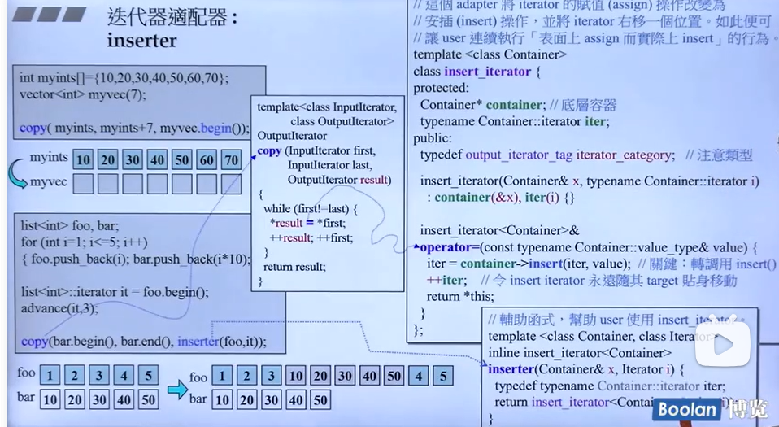
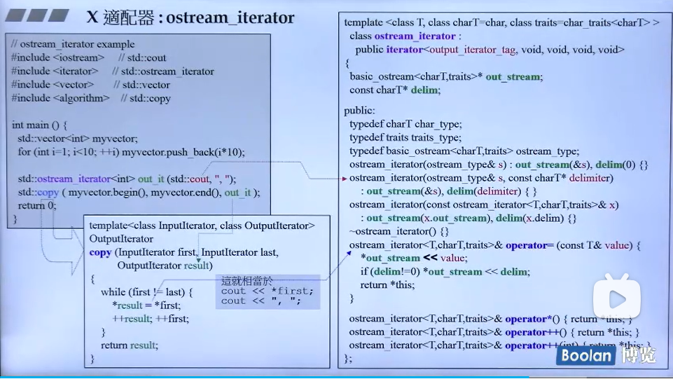
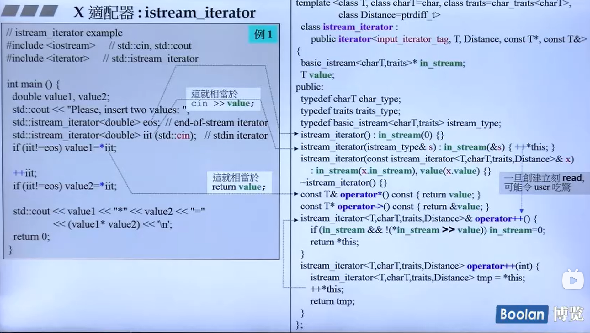
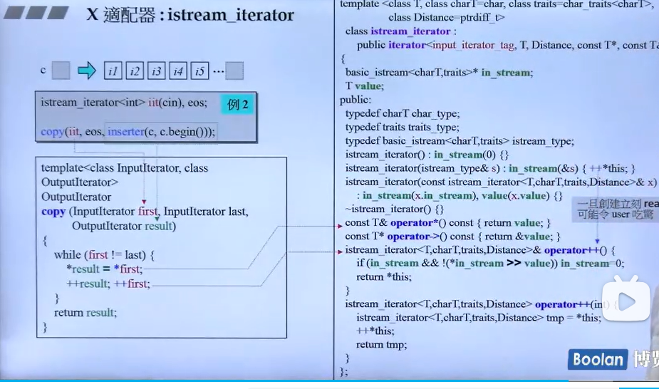

# 11.STL库学习之适配器

## 整体框架的回顾

## 存在多种适配器-adapters

一个人理解，要将适配器理解透彻，我们需要先从别的组件入手，这里以vector容器为例，我们都知道该容器需要迭代器，也就是一些智能指针来确定容器的头尾，以及内容位置，目的是方便后续的算法的怎删改查等操作，假设算法现在要做拿到位置8的数据，那么vector的指针要怎么移动呢？已知指针移动上，vector是随机访问指针，也就是前后都可以跑，而这个操作实际上是迭代器的其中一个内容，而这一内容就需要一个适配器去做适配。

下面做一个模拟问答，来加以了解：

---c
    模拟问答
    算法：你好，vector的迭代器，我需要知道你的迭代器类别，这样我才能正确地进行操作。

    vector的迭代器：好的，我先问一下我的适配器。

    vector的迭代器：适配器，算法想知道 iterator_traits<InputIterator>::iterator_category 是什么类型的迭代器？

    vector_iterator的适配器：你好，我们这里是随机访问迭代器（Random Access Iterator）。

    算法：太好了，随机访问迭代器可以让我进行更高效的操作。那么，如果我想访问第8个元素，我该怎么做？

    vector_iterator的适配器：很简单，你可以直接通过加上偏移量来访问第8个元素。比如，如果你有一个指向第一个元素的迭代器 first，那么 first + 7（因为迭代器是从0开始计数的）就会给你第8个元素的迭代器。

    算法：明白了，那我可以直接使用 *(first + 7) 来获取第8个元素的值了。

    vector_iterator的适配器：是的，完全正确。

    算法：如果我需要反向迭代器，或者插入迭代器，你们能提供吗？

    vector_iterator的适配器：当然可以。我们 vector 提供了多种迭代器适配器，包括反向迭代器（reverse_iterator）、插入迭代器（insert_iterator）等，以满足不同的需求。

    算法：那太好了，这样我可以更灵活地处理 vector 中的数据了。谢谢你的帮助！
---

## STL中适配器的重要特性

对于容器、迭代器和仿函数它们第二次迭代器都有一个重要的特性，就是适配器会包含（也有继承）对应的类，比如stack包含了deque，然后使用了deque的某些功能，屏蔽了deque的某些某能，实现了先进后出的功能。

## 仿函数适配器

### binder2nd适配器

该适配器是用于绑定的，比如对于一个容器，需要操作比88小于数，这使用可以用binder2nd，第一个参数可以传入比较大小的less仿函数，第二个传入比较的数值x，本质上在binder2nd中，less的第二个参数传入就是x,这样就达到比较的目的了。

小结：把A类和数值a传入另一个类B中，在B中再操作A和a.这样就实现了绑定。

### not1

对结果取反

### 一些新的适配器

### bind

## 迭代器适配器

### reverse——iterator

三个细节：

- 1.begin=rend,end=rbigin
- 2.取值是取后一个，所以内部实现的*是做--操作；
- 3.operate ++()操作重载后内部实现为--，operate --()重载后内部实现++操作。

具体图下图所示

### insert_iterator

在下面的案例中`copy(bar.begin(),bar.end(),inserter(foo,it));`欲将list的bar数据从it指向的位置
开始插入，但是foo的空间不够，为什么还能成功？

设计的小技巧，当传入copy中时，因为inserter对operate =()做了重载，重载中调用了insert()该函数能决绝以上问题，
因此不会因为foo的内存不足导致插入失败。

### ostream_iterator

下面通过一个案例说明该迭代器的一些特性和使用方法：

1.当执行初始化操作std::ostream_iterator<int> out_it(std::cout,",")时调用构造函数，并初始化。
2.执行copy操作时，因为ostream_iterator对operate =()重载，所以会将值value传给*out_stream，通过这个方法把数据打印在屏幕上。

### istream_iterator

下面也是两个例子说明istream_iterator的特性：

1.`std::istream_iterator<double> iit(std::cin);`时同样会调用对应的构造函数，并且此处会调用`operate ++()`重载，在该重载中，`*in_stream`接收按键输入的一个值，也就是说才定义时，就已经在准备接收一个值，如果此时在该语句下写一段打印操作没见无法看到输出！

2.下面是`copy`操作，对于这个操作，我们可以观察是否有对`*`和`=`的操作符进行重载，对于`=`的重载上述已经介绍， `*`的重载是将value返回，也就是 `*first`的操作取得的是容器中的值。

{}