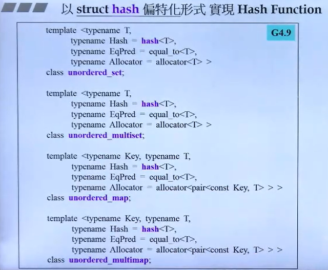
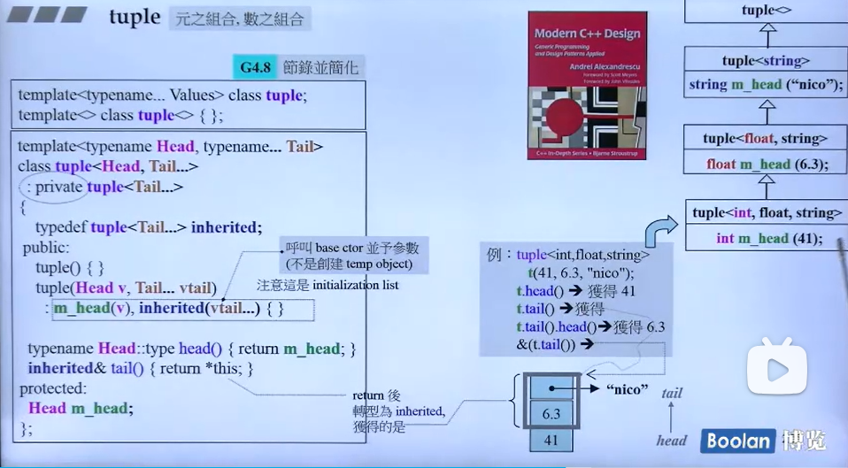

# 12.其他库的介绍

### 为什么需要哈希函数？

哈希函数在计算机科学中扮演着重要的角色，其主要作用包括：

1. **数据检索**：哈希函数可以将键（key）映射到哈希表中的一个位置，从而快速检索数据。这是哈希表（如 C++ 中的 `std::unordered_map` 和 `std::unordered_set`）的基础。

2. **快速比较**：在数据库和各种数据结构中，哈希函数可以快速比较字符串或对象，常用于检查两个字符串是否相等。

3. **数据分布**：在分布式系统中，哈希函数可以将数据均匀地分布到多个节点上，以实现负载均衡。

4. **密码学应用**：在密码学中，哈希函数用于生成数据的摘要，用于数据完整性验证和数字签名。

5. **缓存实现**：哈希函数可以用于实现缓存机制，通过快速定位缓存中的数据。

6. **负载均衡**：在网络流量管理中，哈希函数可以用于将请求分配到不同的服务器上。

### C++ 库中哈希函数的实现和底层逻辑

在 C++11 及以后的版本中，标准库提供了一个专门的哈希函数库 `<functional>`，其中包含了 `std::hash` 模板类。`std::hash` 为基本数据类型（如 `int`、`double`、`std::string` 等）提供了特化版本。

#### 实现底层逻辑：

1. **整数类型**：对于整数类型，`std::hash` 直接返回数值本身或其变体。例如，对于 `int` 类型，`std::hash<int>()(10)` 可能直接返回 10 或者 10 的一个简单变换。

2. **浮点类型**：对于浮点类型，`std::hash` 通常会将浮点数的位表示转换为整数，然后应用整数的哈希函数。

3. **字符串类型**：对于字符串，`std::hash` 通常会遍历字符串中的每个字符，将每个字符的哈希值组合起来，生成最终的哈希值。这可以通过位操作和数学函数（如乘法、加法、异或等）来实现。

4. **自定义类型**：对于自定义类型，如果需要使用 `std::hash`，则需要为该类型提供自定义的哈希函数。

5. **组合哈希**：对于复合类型（如结构体或类），哈希函数需要将各个成员的哈希值组合起来。这通常通过将成员的哈希值进行某种形式的数学运算（如加权求和、异或等）来实现。

6. **均匀分布**：一个好的哈希函数应该能够产生均匀分布的哈希值，以减少哈希冲突。

7. **确定性**：哈希函数应该是确定性的，即对于同一个输入总是产生相同的哈希值。

8. **快速计算**：哈希函数的计算应该尽可能快，以减少对性能的影响。

在 C++ 中，`std::hash` 的实现可能因编译器和平台而异，但基本原理是相似的。正确实现哈希函数对于哈希表的性能至关重要，因为它直接影响到哈希表的冲突率和检索效率。

## hash function-哈希函数

如果要自己给自己的数据写一个哈希函数，那又该怎么写呢？能否基于这些数据计算出hash code的呢？

### 编写模版规范

{}
{}
```cpp
    #include <functional>
    namespace test_hash_function
    {
        class Customer {
            private:
            string fname;
            string lname;
            int on;

            public:
                Customer( string fn,  string ln, int id) : fname(fn), lname(ln), on(id) {}
                bool operator==(const Customer& other) const {//需要重载==
                    return fname == other.fname && lname == other.lname && on == other.on;
                }
                friend class CustomerHash;
        };
        class CustomerHash {
        public:
            std::size_t operator()(const Customer& c) const {
                return ...;
            }
        };
        unordered_set<Customer, CustromerHash> custsct;
    }
```
{}
{}
```cpp
   #include <functional>
    namespace test_hash_function
    {
        template <typename T>
        inline void hash_combine(size_t& seed, const T& val) {
            seed ^= hash<T>()(val) +
                0x9e3779b9 +
                (seed << 6) +
                (seed >> 2);
        }
        template <typename T>
        inline void hash_val(size_t& seed, const T& val) {
            hash_combine(seed, val);
        }
        template <typename T, typename... Types>
        inline void hash_val(	size_t& seed,
                                    const T& val,
                                    const Types&... args) 
        {
            hash_combine(seed, val);
            hash_val(seed, args...);
        }
        template <typename... Types>
        inline size_t hash_val(const Types&... args) {
            size_t seed = 0;
            hash_val(seed, args...);
            return seed;
        }
        class Customer {
        private:
            string fname;
            string lname;
            int on;

        public:
            Customer( string fn,  string ln, int id) : fname(fn), lname(ln), on(id) {}
            bool operator==(const Customer& other) const {
                return fname == other.fname && lname == other.lname && on == other.on;
            }
            friend class CustomerHash;
        };

        class CustomerHash {
        public:
            size_t operator()(const Customer& c) const {
                return hash_val(c.fname, c.lname, c.on);
            }
        };

        void test() {
            unordered_set<Customer, CustomerHash> s;
            s.insert(Customer("Asd", "dfw", 1L));
            s.insert(Customer("Dfg", "kjt", 2L));
            s.insert(Customer("VVB", "ert", 3L));
            s.insert(Customer("TgR", "uik", 4L));
            s.insert(Customer("Gdf", "pii", 5L));
            s.insert(Customer("Gdf", "pii", 6L));
            s.insert(Customer("Gdf", "pii", 7L));//8
            cout << s.bucket_count() << endl;

            CustomerHash hh;
            cout << hh(Customer("Asd", "dfw", 1L)) % 8 << endl;//4
            cout << hh(Customer("Dfg", "kjt", 2L)) % 8 << endl;//0
            cout << hh(Customer("VVB", "ert", 3L)) % 8 << endl;//3
            cout << hh(Customer("TgR", "uik", 4L)) % 8 << endl;//7
            cout << hh(Customer("Gdf", "pii", 5L)) % 8 << endl;//2
            cout << hh(Customer("Gdf", "pii", 6L)) % 8 << endl;//7
            cout << hh(Customer("Gdf", "pii", 7L)) % 8 << endl;//4

            for (unsigned i = 0; i < s.bucket_count(); i++) {
                cout << "bucked #" << i << "has" << s.bucket_size(i) << "element\n";
            }
        }
    }
    // bucked #0has1element
    // bucked #1has0element
    // bucked #2has1element
    // bucked #3has1element
    // bucked #4has2element
    // bucked #5has0element
    // bucked #6has0element
    // bucked #7has2element
```
{}
{}
```cpp
    #include <functional>
    namespace test_hash_function
    {
        class Customer {
            private:
            string fname;
            string lname;
            int on;

            public:
                Customer( string fn,  string ln, int id) : fname(fn), lname(ln), on(id) {}
                bool operator==(const Customer& other) const {//需要重载==
                    return fname == other.fname && lname == other.lname && on == other.on;
                }
                friend class CustomerHash;
        };
        class CustomerHash {
        public:
            size_t customer_hash_func(const Customer& c) const {
                return ...;
            }
        };
        unordered_set<Customer, size_t(*)(const Custromer&)> custsct(20,customer_hash_func);//注意与类型1的不同写法
    }
```
{}
{}
第三种方式是对类里面的hash进行偏特化，比如你使用了unordered_set那么对于它的Hash，可以单独进行偏特化。

{}
{}

## tuple

在C++中，tuple 是一个标准库模板类，它提供了一种方式来存储不同类型数据的集合。tuple 类似于一个固定大小的数组，但是数组中的每个元素可以是不同的类型。这个特性使得 tuple 非常灵活，可以用于多种场景。


{}