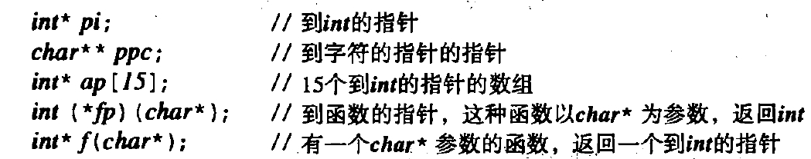
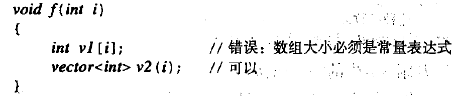
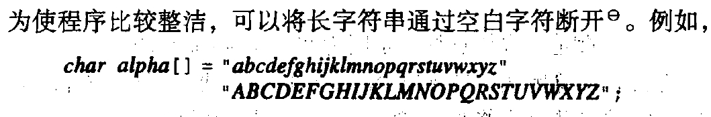
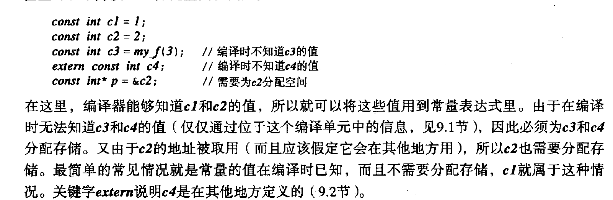
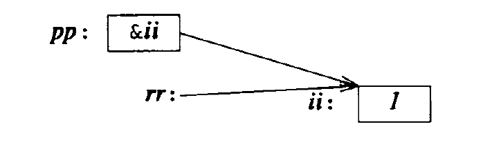

# 13.从C到C&#43;&#43;

## 指针

指针的声明：


## 数组

数组的范围必须是常量表达式，同时如果需要变化的范围可以做如下定义：


2.字符串文字量

指的是用 ""括起来的字符串。

- 长字符串编写：

- 带有L的字符是宽字符，如L"sddsf"，类型是const wchar_t.

3.指向数组的指针

4.常量


5.指针和常量

使用一个指针时涉及到两个对象:该指针本身和被它所指的对象。将一个指针的声明用cons“预先固定”将使那个对象而不是使这个指针成为常量。要将指针本身而不是被指对象声明为常量，我们必须使用声明运算符*const，而不能只用简单的const。

定义常量指针的声明运算符是*const。并没有cons** 声明符，所以出现在*之前的conr是作为基础类型的一部分。例如

```cpp
// 到char的hconst指针
char *const cp;
char const* pc;
// 到const char的指针
const char* pc2;
//到const char的指针
```

有人发现从右向左读这种定义很有帮助。例如，"cp是一个conse指针到char"，以及“pe2是一个指针措到const chor"

## 引用

```cpp
void f(){
    int ii=1;
    int &rr = ii;
    rr++;//实际上是ii++,rr不能像指针一样操作。
    int *pp = &ii;
}
```


{}