# 14.新标准C加加程序设计

## 内存分区模型

内存代码区的意义：程序代码放在不同的区域，有程序自动管理的代码，也有程序员管理的代码，灵活管理；

一、程序执行前

1.代码区
存放二进制指令，就是代码，特点：
- 共享：多个进程的代码区是共享的，因为代码是相同的，所以只需要加载一份到内存中即可，节省内存空间。
- 只读：代码是只读的，防止程序意外地修改了代码。

2.全局区
全局变量和静态变量存储在全局区，还包括常量区、字符串常量和其他常量（如：const）,特点：
- 全局区是程序结束后由系统释放。
- 全局变量和静态变量在程序结束后系统会自动释放，而局部变量在函数结束后由系统自动释放。

例子：
```cpp
#include <iostream>
using namespace std;

//全局变量 
int g_a = 10;
int g_b;

//const 修饰的全局变量
const int c_g_a = 10;

int main(int argc,char *argv[]){
    //局部变量
    int a = 10;
    int b = 20;

    //静态变量
    static int s_a = 10;
    static int s_b;

    //字符串常量
    char *P = "hello world";

    //const修饰的局部变量
    const int c_l_a = 10;

    cout<<"局部变量a的地址："<<&a<<endl;
    cout<<"局部变量b的地址："<<&b<<endl;
    cout<<"全局变量a的地址："<<&g_a<<endl;
    cout<<"全局变量b的地址："<<&g_b<<endl;
    cout<<"静态变量a的地址："<<&s_a<<endl;
    cout<<"静态变量b的地址："<<&s_b<<endl;

    cout<<"字符串常量P的地址："<<P<<endl;
    cout<<"const修饰的局部变量c_l_a的地址："<<&c_l_a<<endl;
    cout<<"const修饰的全局变量c_g_a的地址："<<&c_g_a<<endl;

    return 0;
}
```

3.总结
- 代码区：存放二进制指令，共享，只读。
- 全局区：存放全局变量和静态变量，程序结束后由系统释放。

二、程序运行后

1.栈区

由编译器自动分配释放，存放函数的参数值，局部变量等。

**注意：** 不要返回局部变量的地址，因为局部变量在函数结束后会被系统释放，再次访问会导致程序崩溃。

例子：
```cpp
#include <iostream>
using namespace std;

int *GetAddr(int b){//形参数据也放在栈区
    b = 10;
    int a = 10;
    return &a;//返回局部变量的地址
}

int main(){
    int *p = GetAddr();
    cout<<*p<<endl;//第一次可以打印正确的数据，是因为编译器做了保留，
    cout<<*p<<endl;// 但是第二次访问将不再保留
    return 0;
}
```

2.堆区

由程序员分配释放，如果程序员不释放，程序结束时由系统回收。

在C++中主要利用new和delete操作符进行动态内存管理。

例子1-在堆上开辟空间：
```cpp
#include <iostream>
using namespace std;
int* getAddr(){

    //在堆上开辟空间，并初始化为10
    int *p = new int(10);//new出来的数据返回的是一个指针
    //使用存在栈区的局部指针指向堆区的数据，栈区的内容会被程序自动释放，但是指向堆区的数据不会被释放
    return p;
}
int main(){

    int *p = getAddr();

    cout<<*p<<endl;//输出10
    delete p;//释放空间
    return 0;
}
```

图解：
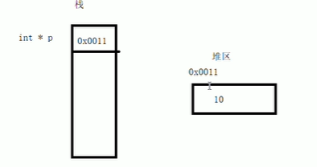

例子2-堆区上的数据开辟与释放
```cpp
#include <iostream>
using namespace std;
void test(){
    int *P = new int(10);
    cout<<*P<<endl;
    
    delete P;
}
void test2(){
    int *arr = new int[10];
    for(int i = 0;i<10;i++){
        arr[i] = i+10;
    }
    for(int i = 0;i<10;i++){
        cout<<arr[i]<<" ";
    }
    delete[] arr;
}
int main(){
    test();
}

```

## 引用

给变量取别名。

一、变量引用

引用注意事项：

- 引用必须初始化，int &b;//这样是不正确的
- 引用初始化后不能改变
- 通过引用参数产生的效果与指针地址传递效果一样，引用语法更清楚；

测试代码：
```cpp
//值传递
void test1(int a,int b) {

}
//地址传递
void test2(int *a,int *b) {
	int temp = *a;
	*a = *b;
	*b = temp;
}
//引用传递
void test3(int &a,int &b) {
	int temp = a;
	a = b;
	b = temp;
}
```

二、应用做函数的返回值

- 不要返回局部变量的引用
- 函数返回值是引用，那么这个函数调用可以作为左值

测试代码：
```cpp
// 二、引用做函数返回值
	//1.不能返回应用返回值
int& test04()//以引用的方式返回b,相当于给这个b起了一个别名
{
	int b = 10;//局部变量存放在栈区，函数结束后会被释放
	return b;
}
	//2. 函数的调用可以作为左值
int& test05()
{
	static int b = 10;//静态变量存放在全局区，程序结束后由系统自动释放
	return b;
}

int main() 
{
	int& ret04 = test04();
	int& ret05 = test05();
	std::cout << "ret04= "<<ret04 << std::endl;
	std::cout << "ret04= " << ret04 << std::endl;//第二次访问返回的是乱码
	std::cout << "ret05= " << ret05 << std::endl;
	test05() = 130;//函数的返回是引用，函数的调用可以作为左值
	std::cout << "ret05= " << ret05 << std::endl;

	system("pause");
	return 0;
}
```

测试代码结果
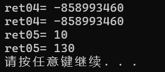

三、引用的本质

引用的本质在C++内部实现是一个指针常量，引用类型必须和引用实体是同类型。

四、常量引用

作用：用来修饰形参，防止误操作。

代码说明：
```cpp
//四、常量引用
	//int &ref = 10; 这样的操作是不被允许的，因为赋值给引用的是一个字面量,引用需要一个合法的空间，
	// 程序运行时没有专门为其分配可修改的内存空间
	// 但是如果在前面在上const，这条代码就通过
	// const int &ref = 10;
	//用来修饰形参，防止误操作
void test06(const int &val)
{
	//val = 100;不被允许修改
	std::cout << "val = " << val << std::endl;
}
```

## 函数进阶

一、函数默认参数

返回值 函数名(参数 = 默认值){}

注意事项：

1.如果某个位置已经有了默认参数，那么该位置往后都必须有默认参数
```cpp
//函数默认参数
void test(int a ,int b = 20,int c = 30)
{
	std::cout << "a = " << a << std::endl;
	std::cout << "b = " << b << std::endl;
	std::cout << "c = " << c << std::endl;
}
```
2.函数的声明有默认参数，函数实现不能有默认参数,声明和实现只能有一个有默认值
```cpp
#include <iostream>
//函数声明
void test(int a=10,int b = 20);//
//函数实现
void test(int a ,int b)
{
	std::cout << "a = " << a << std::endl;
	std::cout << "b = " << b << std::endl;
}
```

二、函数占位参数

作用：为了函数声明和定义的统一
语法：返回类型 函数名(数据类型){}

```cpp
//函数占位参数
void test(int a,int)//第二个参数为占位参数
{
    std::cout << "a = " << a << std::endl;
}

int main() {
    test(10,10);//占位参数必须填补,否则无法运行
}
```

注意：占位参数可以有默认参数，此时调用时就不用在传值
```cpp
//函数占位参数
void test(int a,int = 10)//第二个参数为占位参数，含默认值
{
    std::cout << "a = " << a << std::endl;
}

int main() {
    test(10);//不需要传站位参数
}
```

三、函数重载

满足条件：
- 在同一个作用域下。
- 函数名相同，
- 参数类型不同，
- 参数个数不同，
- 参数顺序不同。

作用： 提高复用性

注意：

1.返回值不能作为重载的条件

2.引用作为重载的条件

加const和不加是可以重载的
```cpp
void fun(int &a){
    std::cout<<"fun(int &a)"<<std::endl;
}
void fun(const int &a){
    std::cout<<"fun(const int &a)"<<std::endl;
}
int main(){
    int a = 10;
    const int &b = 20;
    fun(a);//调用fun(int &a)
    fun(b);//调用fun(const int &a)
    fun(10);//调用fun(const int &a)
    return 0;
}
```

3.函数重载遇到默认参数
```cpp
void fun2(int a,int b = 10){
    std::cout<<"fun(int &a)"<<std::endl;
}
void fun2(int a){
    std::cout<<"fun(const int &a)"<<std::endl;
}
int main(){

    fun2(10);//此时程序出现二义性，无法确定调用哪个函数
    return 0;
}
```

## 类和对象的基本概念

C++的特性：封装、多态、继承

一、基本概念

- 抽象：将事物所能进行的的行为归纳出来，形成函数，这些函数可以操作事物归纳后的数据结构。
- 类： 、

### 封装

将事物归纳的数据结构和操作该数据结构的算法呈现显而易见的紧密关系，叫封装。

一、 封装的意义

1.将属性和行为作为一个整体，表现生活中的事物。
```cpp
namespace test_class
{
	//设计一个圆的类
#define PI 3.14
	class Circle
	{
		//访问权限
	public:
		//属性
		int m_r;
		//行为
		double calculateZC()
		{
			return 2 * PI * m_r;
		}
	};
	void test() {
		Circle c1;
		c1.m_r = 10;
		cout << "圆的周长 = " << c1.calculateZC() << endl;
	}
}
```
2.访问权限
- public 公共权限
- protected 保护权限
- private 私有权限

二、访问权限说明

- public修饰的成员，可以在类内或者类外直接访问
- protected修饰的成员，只能在类内和子类中访问
- private修饰的成员，只能在类内访问

### 继承

### 多态

### 类

将数据结构和操作该数据结构的函数捆绑在一起形成一个类。

### 在类中使用缺省函数

需要注意避免二义性：
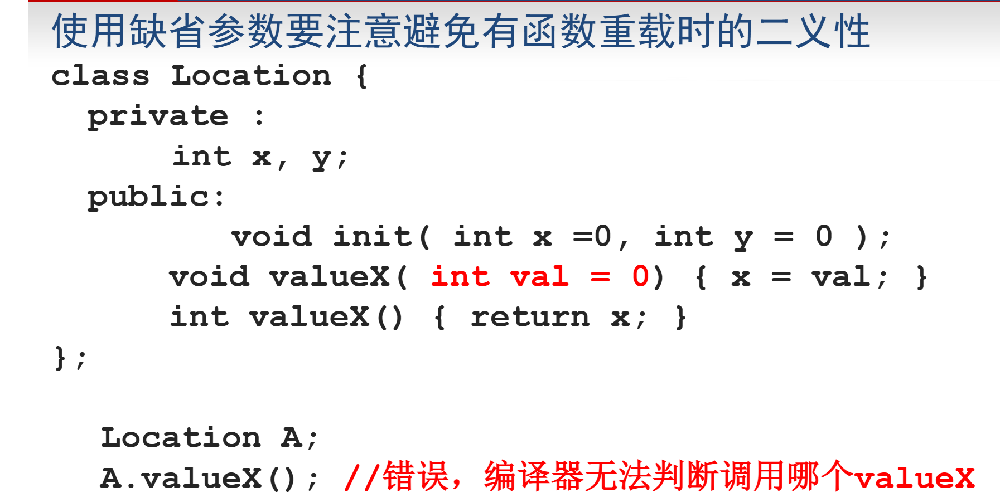

## 构造函数

### 类中为什么需要构造函数

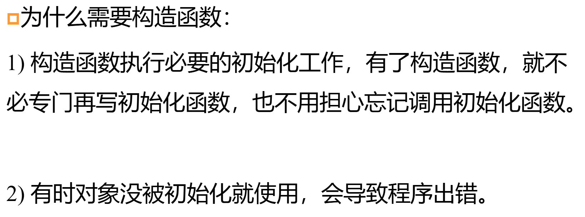

### 构造函数在数组中的使用

```cpp
class A{
    int a;
    public:
        A(){std::cout<<"hello\n";}//1
        A(int b){std::cout<<"value: "<<b<<std::endl;}//2
}
int main(){
    A arr[2] = {1};
}
```
上面的语句就调用了第1，2个构造函数，首先数据里的1会调用2，而数组的第二个是空值那么就会调用第1个。

## 复制构造函数-copy constructor

函数名与类名相同，参数为A(A& a)或A(const A& a)（二选一）。

三种情况下复制构造函数起作用

- 同类对象a,b，将a的值初始化b；
  - A a; A b(a);
- 将类当作参数传入函数；
- 将类作为返回值；

注意：对象之间的复制是不会导致复制构造函数的

## 转换构造函数

什么是转换构造函数
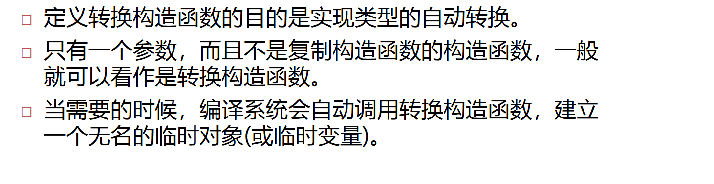

示例代码：
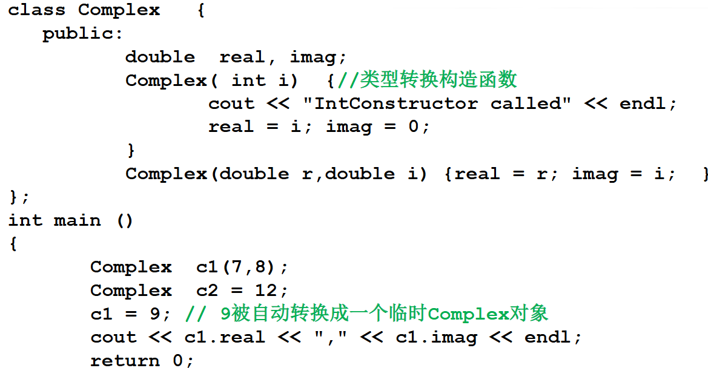
在上面的例子当中，`c1 = 9;`会被自动转换为调用转换构造函数，如果不想让这样的事情发生，可以在转换构造函数前面加上修饰字段 `explicit`，这样再次使用`c1 = 9;`时程序会报错。

## 析构函数-destructors

这里补充几点，一个类只能有一个析构函数；

**析构函数与数组：**

数组成员的每一次结束时都会调用析构函数，假设类A数组array[2]，则生命周期结束时会调用两次析构函数。

**析构函数什么时候被调用呢？**

```cpp
    class CMyclass {
    public:
    ~CMyclass() { cout << "destructor" << endl; }
    };
    CMyclass obj;
    CMyclass fun(CMyclass sobj ) { //参数对象消亡也会导致析
    //构函数被调用
    return sobj; //函数调用返回时生成临时对象返回
    }
    int main(){
    obj = fun(obj); //函数调用的返回值（临时对象）被
    return 0; //用过后，该临时对象析构函数被调用
    }
```

上面结果输出三个destructor，在`fun(CMyclass sobj)`参数对象消亡调用析构函数（具体可以联想复制构造函数），会调用一次析构函数；当函数返回赋值给obj后，再次调用析构函数；整个程序结束再次调用析构函数。
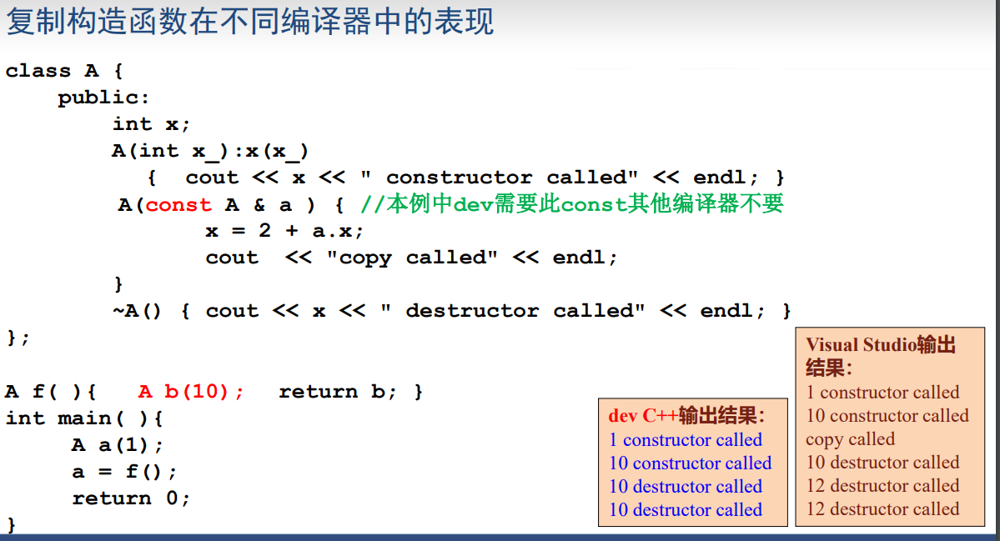

## this指针

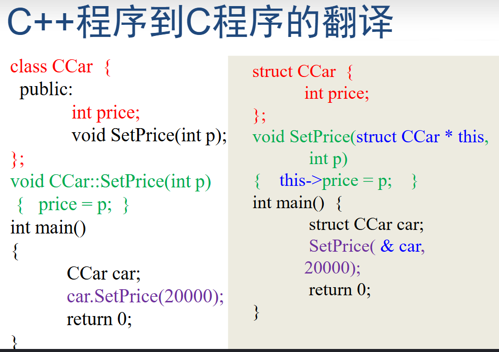

静态成员函数中可以直接使用this指针来代表指向该函数作用的对象的指针

示例1：
```cpp
class Complex {
public:
double real, imag;
void Print() { cout << real << "," << imag ; }
Complex(double r,double i):real(r),imag(i)
{ }
Complex AddOne() {
this->real ++; //等价于 real ++;
this->Print(); //等价于 Print
return * this;
}
}; 

int main() {
Complex c1(1,1),c2(0,0);
c2 = c1.AddOne();//调用AddOne函数后内部this指针变为c1，所以是c1中的read++
return 0;
} //输出 2,1

```

示例2：
```cpp
    class A
{
int i;
public:
void Hello() { cout << i << "hello" << endl; }
}; // 翻译为void Hello(A * this ) { cout << this->i << "hello"<< endl; }
int main()
{
A * p = NULL;
p->Hello(); //翻译为Hello(p);
} //编译报错
```
报错的原因是p指针式一个空指针，它并不指向任何A的对象，所以编译到 `this->i` 会报错。

## 静态成员变量和函数

 **基本特点：**

- 普通成员变量每个对象有各自的一份，而静态成员变量一共就一份，为所有对象共享。
- 普通成员函数必须具体作用于某个对象，而静态成员函数并不具体作用于某个对象。因此静态成员不需要通过对象就能访问。

对第二句话的理解，如下代码示例：

```cpp
class Dog {
public:
    // 普通成员函数
    void bark() {
        std::cout << "Woof!" << std::endl;
    }

    // 静态成员函数
    static std::string getSpecies() {
        return "Canine";
    }
};
```

要调用bark我们需要先创建一个Dog的类对象，然后通过 `.` 调用，也就是非静态成员作用于对象的意思，但是对于 `getSpecies` 就不需要，可以直接 `Dog::getSpecies`调用。

**如何访问静态成员？**

1) 类名::成员名
CRectangle::PrintTotal();

2) 对象名.成员名
CRectangle r; r.PrintTotal();

3) 指针->成员名
CRectangle * p = &r; p->PrintTotal();

4) 引用.成员名
CRectangle & ref = r; int n = ref.nTotalNumber;

**设置静态成员变量的目的是什么？**

设置静态成员这种机制的目的是将和某些类紧密相关的全局变量和函数写到类里面，看上去像一个整体，易于维护和理解。比如，考虑一个需要随时知道矩形总数和总面积的图形处理程序，可以用全局变量来记录总数和总面积，用静态成员将这两个变量封装进类中，就更容易理解和维护。

注意事项：

- 必须在定义类的文件中对静态成员变量进行一次说明或初始化。否则编译能通过，链接不能通过。
- 在静态成员函数中，不能访问非静态成员变量，也不能调用非静态成员函数。

## 成员对象和封闭类

- 有成员对象的类叫 封闭(enclosing)类。
- 任何生成封闭类对象的语句，都要让编译器明白，对象中的成员对象，是如何初始化的。具体的做法就是：通过封闭类的构造函数的初始化列表。

**封闭类的复制构造函数:**

```cpp
    class A
    {
    public:
    A() { cout << "default" << endl; }
    A(A & a) { cout << "copy" << endl;}
    };

    class B { A a; };

    int main()
    {
    B b1,b2(b1);//b2调用自生默认复制构造函数，而内部的A a也会调用默认的复制构造函数
    return 0;
    }
```

## 友元

1) 友元函数: 一个类的友元函数可以访问该类的私有成员。
2) 可以将一个类的成员函数(包括构造、析构函数)说明为另一个类的友元。
3) 友元类: 如果A是B的友元类，那么A的成员函数可以访问B的私有成员。
4) 友元类之间的关系不能传递，不能继承。

## 常量成员

常量成员函数：内部不能改变属性的值，也不能调用非常量成员函数。

**注意：**如果一个成员函数中没有调用非常量成员函数，也没有修改成员变量的值，那么，最好将其写成常量成员函数。
mutable成员变量
可以在const成员函数中修改的成员变量
```cpp
    class CTest
    {
    public:
    bool GetData() const
    {
    m_n1++;//这个值更可以更改
    return m_b2;
    }
    private:
    mutable int m_n1;
    bool m_b2;
    };
```

## 运算符重载函数

**浅拷贝与深拷贝：**
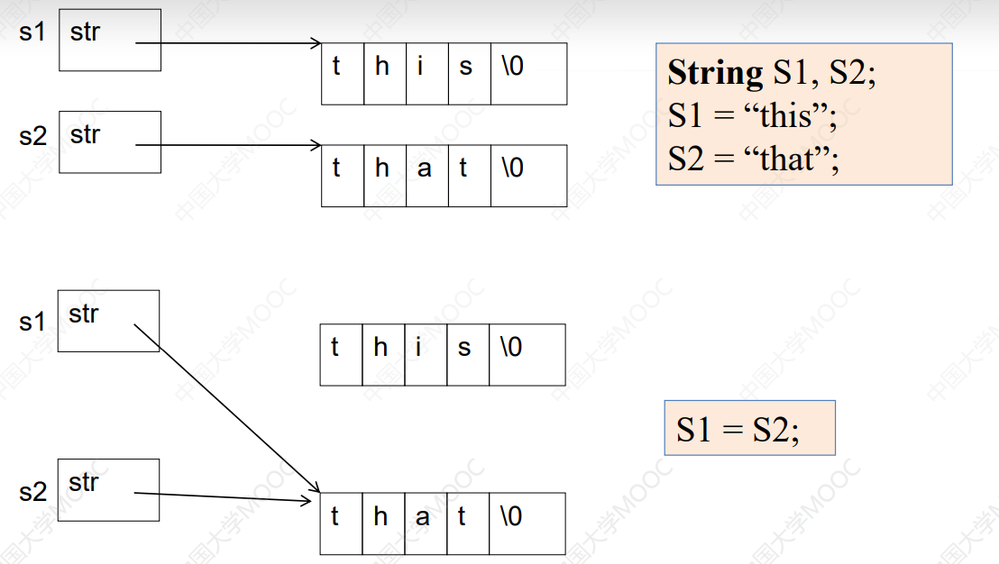

为解决这个问题，我们需要修改赋值运算符重载：
```cpp
    String & operator = (const String & s){
        if( this == & s)
            return * this;
        delete [] str;
        str = new char[strlen(s.str)+1];
        strcpy( str,s.str);
        return * this;
    }
```

### 自增自减运算法重载

```cpp
class CDemo {
private :
int n;
public:
CDemo(int i=0):n(i) { }
CDemo & operator++(); //用于前置形式
CDemo operator++( int ); //用于后置形式
operator int ( ) { return n; }
friend CDemo & operator--(CDemo & );
friend CDemo operator--(CDemo & ,int);
}
```

`operator int ( ) {return n;}`

这里，int 作为一个类型强制转换运算符被重载, 此后

```cpp
Demo s;
(int) s ; //等效于 s.int();
```

类型强制转换运算符被重载时不能写返回值类型，实际上其返回值类型就是该类型强制转换运算符代表的类型。

## 继承和派生

**注意：**在派生类的各个成员函数中，不能访问基类中的private成员。

### 派生类的内存空间

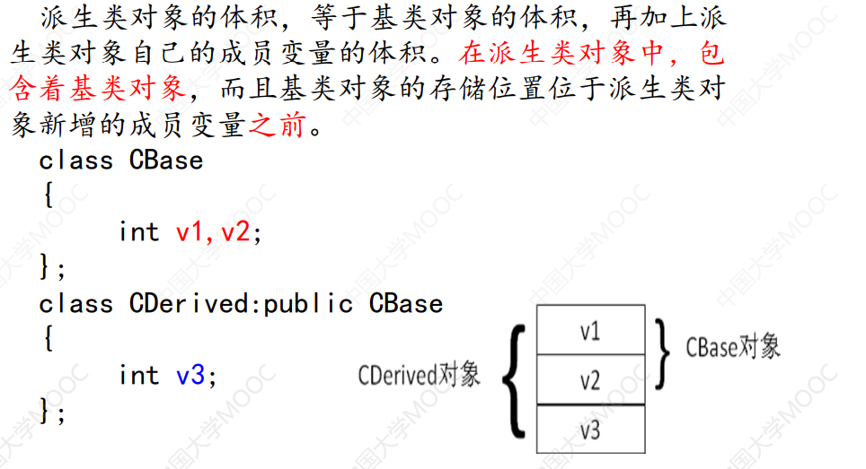

### 类之间的关系

**继承：“是”关系。**

- 基类 A，B是基类A的派生类。
- 逻辑上要求：“一个B对象也是一个A对象”。

**复合：“有”关系。**

- 类C中“有”成员变量k，k是类D的对象，则C和D是复合
关系
- 一般逻辑上要求：“D对象是C对象的固有属性或组成部
分”

复合关系的示例：
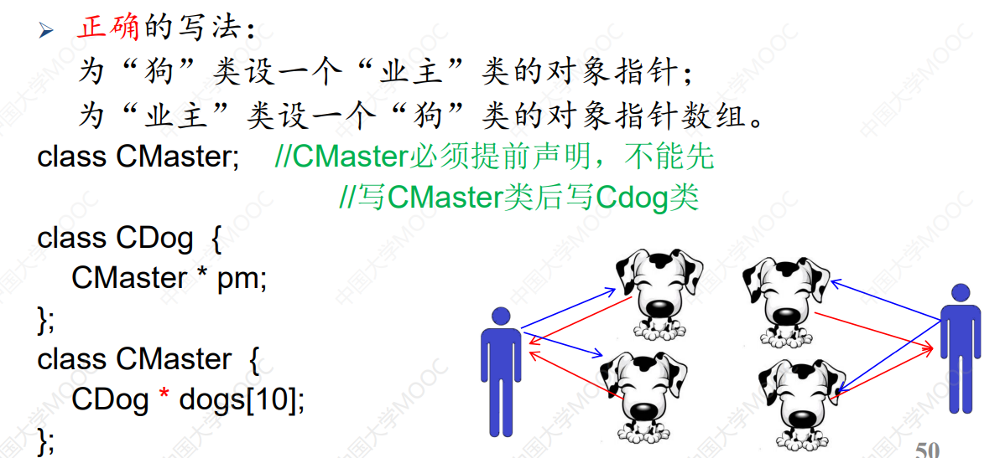

### 基类与派生类名字重名的情况

一般来说，基类和派生类不定义同名成员变量。但如果要方位可以使用`基类::基类成员`来访问。

### 访问权限

**• 基类的private成员：可以被下列函数访问**

- 基类的成员函数
- 基类的友元函数

**• 基类的public成员：可以被下列函数访问**

- 基类的成员函数
- 基类的友元函数
- 派生类的成员函数
- 派生类的友元函数
- 其他的函数

**• 基类的protected成员：可以被下列函数访问**

- 基类的成员函数
- 基类的友元函数
- 派生类的成员函数可以访问当前对象和其它对象的基类的保护成

举一个例子：

```cpp
class Father {
private: int nPrivate; //私有成员
public: int nPublic; //公有成员
protected: int nProtected; // 保护成员
};
class Son :public Father{
void AccessFather () {
nPublic = 1; // ok;
nPrivate = 1; // wrong
nProtected = 1; // OK，访问从基类继承的protected成员
Son f;
f.nProtected = 1; //ok，派生类的成员函数可以访问当前对象和其它对象的基类的保护成
}
};

int main(){
    Father f;
    Son s;
    f.nPublic = 1; // Ok
    s.nPublic = 1; // Ok
    f.nProtected = 1; // error，因为只能在派生类（或友元类）中访问
    f.nPrivate = 1; // error
    s.nProtected = 1; //error
    s.nPrivate = 1; // error
    return 0;
}
```

### 派生类构造函数中包含成员变量时该如何写？

```cpp
    class Bug {
    private :
    int nLegs; int nColor;
    public:
    int nType;
    Bug ( int legs, int color);
    void PrintBug (){ };
    };

    class Skill {
    public:
    Skill(int n) { }
    };

    class FlyBug: public Bug {
    int nWings;
    Skill sk1, sk2;
    public:
    FlyBug( int legs, int color, int wings);
    };

    FlyBug::FlyBug( int legs, int color, int wings):
    Bug(legs,color),sk1(5),sk2(color) ,nWings(wings) { }//注意这种写法。
```

### private 和 protected的继承

• protected继承时，基类的public成员和protected成员成为派生类的protected成员。
• private继承时，基类的public成员成为派生类的private成员，基类的protected成员成
为派生类的不可访问成员。
• protected和private继承不是“是”的关系。

**问题：**

即便基类指针指向的是一个派生类的对象，也不能通过基类指针访问基类没有，而派生类中有的成员。

**解决办法：**

通过强制指针类型转换，可以把ptrBase转换成Derived类的指针
```cpp
    Base * ptrBase = &objDerived;
    Derived *ptrDerived = (Derived * ) ptrBase;
```
程序员要保证ptrBase指向的是一个Derived类的对象，否则很容易会出错。

## 虚函数和多态

### 多态的表现形式

- 派生类的指针（或引用）可以给基类赋值。
- 当指针指向基类时调用，基类的函数，当指针指向派生类时，调用调用派生类的函数，这叫做多态。
- 另外，在非虚函数和非构造、析构函数中调用虚函数，也叫做多态。
例子：
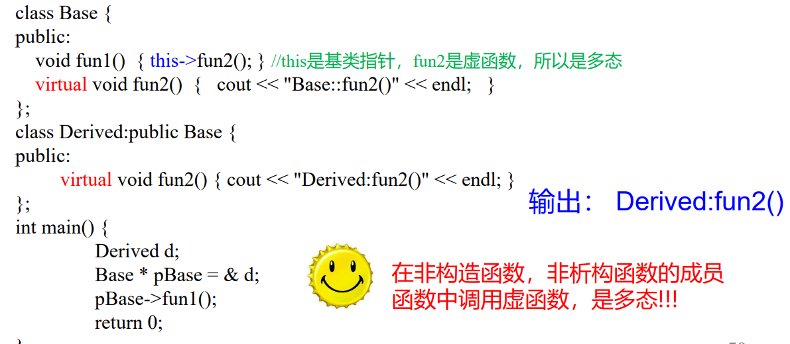

如果在构造、析构函数中调用虚函数，那么会怎么样呢？

如果这么做，那么编译器只会调用当前的虚函数，如果当前没有重写虚函数，则会从基类中找进行调用，为什么要这么做呢？其实这是为了防止未初始化就调用派生类的虚函数的情况。

你想想啊，一类的初始化先从基类的构造函数开始，如果这个时候构造函数具有多态性，那么此时将调用派生类的对应虚函数，但是派生类这个时候都还没有初始化。

例子：
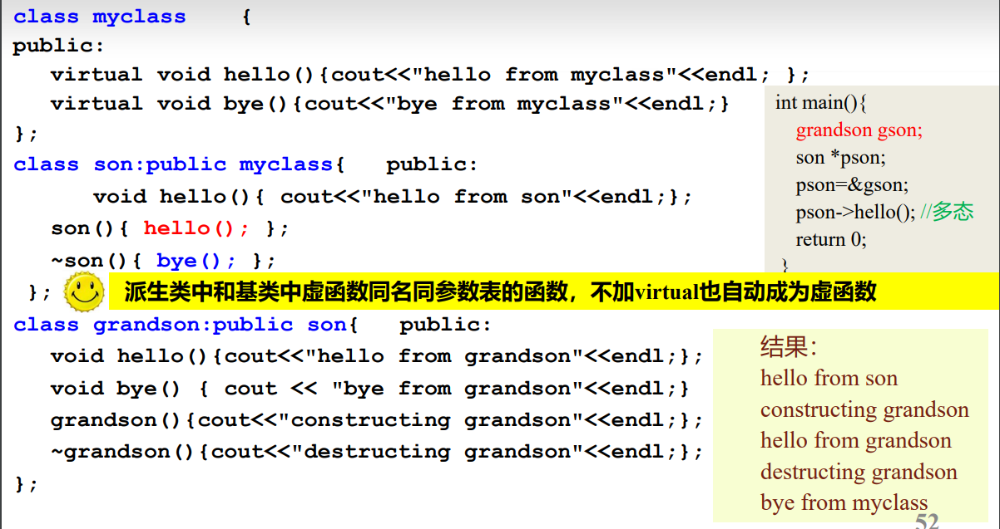`

- 补充：在上面的图例子中，派生类写了与基类虚函数相同的名字，但是没有在前面加修饰符virtual，这种情况编译器认为是虚函数。

### 多态的作用

在面向对象的程序设计中使用多态，能够增强程序的可扩充性，即程序需要修改或增加功能的时候，需要改动和增加的代码较少。

### 虚函数的访问权限

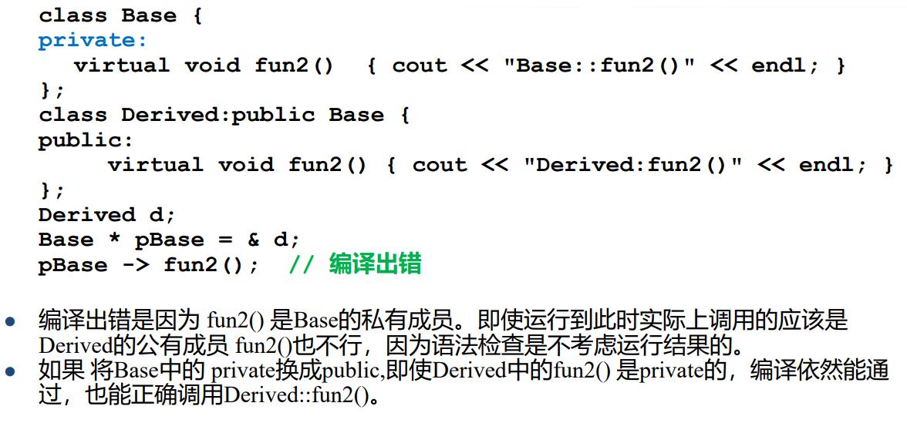

### 动态联编的实现机制

“多态”的关键在于通过基类指针或引用调用一个虚函数时，编译时不确定到底调用的是基类还是派生类的函数，运行时才确定 ---- 这叫“动态联编”。

每一个有虚函数的类（或有虚函数的类的派生类）都有一个虚函数表，该类的任何对象中都放着虚函数表的指针。虚函数表中列出了该类的虚函数地址。多出来的4个字节就是用来放虚函数表的地址的。
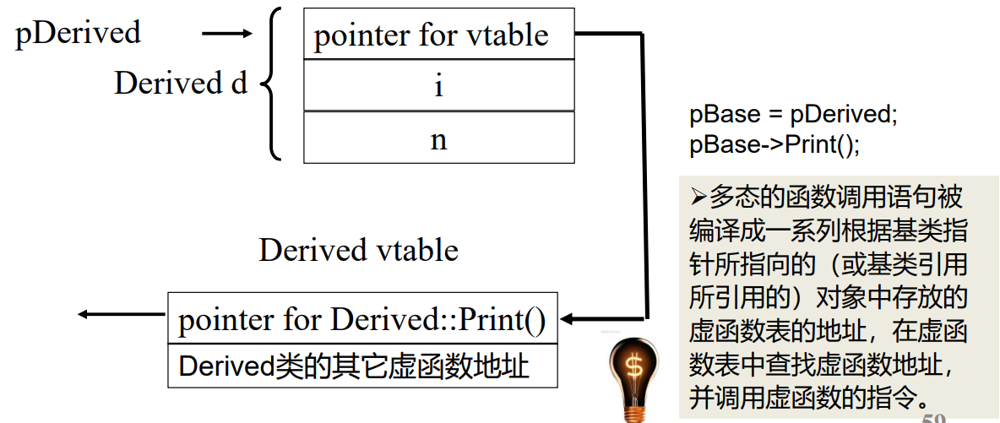

下面一段代码将验证，对象的首地址是存了虚函数表的地址的：

```cpp
    #include <iostream>
    using namespace std;
    class A {
    public: virtual void Func() { cout << "A::Func" << endl; }
    };
    class B:public A {
    public: virtual void Func() { cout << "B::Func" << endl; }
    };
    int main() {
    A a;
    A * pa = new B();
    pa->Func();
    //64位程序指针为8字节
    long long * p1 = (long long * ) & a;
    long long * p2 = (long long * ) pa;
    * p2 = * p1;
    pa->Func();
    return 0;
    }
```

### 纯虚函数和抽象类

- 纯虚函数：没有函数体的虚函数
- 抽象类：有纯虚函数的类

注意：

- 包含纯虚函数的类叫抽象类
  - 抽象类只能作为基类来派生新类使用，不能创建独立的抽象类的对象
  - 抽象类的指针和引用可以指向由抽象类派生出来的类的对象

```cpp
    A a ; // 错，A 是抽象类，不能创建对象
    A * pa ; // ok,可以定义抽象类的指针和引用
    pa = new A ; //错误, A 是抽象类，不能创建对象
```

- **在抽象类的成员函数内可以调用纯虚函数，但是在构造函数或析构函数内部不能调用纯虚函数。**
- 如果一个类从抽象类派生而来，那么当且仅当它实现了基类中的所有纯虚函数，它才能成为非抽象类。

{}