# 14.新标准C加加程序设计

## 内存分区模型

内存代码区的意义：程序代码放在不同的区域，有程序自动管理的代码，也有程序员管理的代码，灵活管理；

一、程序执行前

1.代码区
存放二进制指令，就是代码，特点：
- 共享：多个进程的代码区是共享的，因为代码是相同的，所以只需要加载一份到内存中即可，节省内存空间。
- 只读：代码是只读的，防止程序意外地修改了代码。

2.全局区
全局变量和静态变量存储在全局区，还包括常量区、字符串常量和其他常量（如：const）,特点：
- 全局区是程序结束后由系统释放。
- 全局变量和静态变量在程序结束后系统会自动释放，而局部变量在函数结束后由系统自动释放。

例子：
```cpp
#include <iostream>
using namespace std;

//全局变量 
int g_a = 10;
int g_b;

//const 修饰的全局变量
const int c_g_a = 10;

int main(int argc,char *argv[]){
    //局部变量
    int a = 10;
    int b = 20;

    //静态变量
    static int s_a = 10;
    static int s_b;

    //字符串常量
    char *P = "hello world";

    //const修饰的局部变量
    const int c_l_a = 10;

    cout<<"局部变量a的地址："<<&a<<endl;
    cout<<"局部变量b的地址："<<&b<<endl;
    cout<<"全局变量a的地址："<<&g_a<<endl;
    cout<<"全局变量b的地址："<<&g_b<<endl;
    cout<<"静态变量a的地址："<<&s_a<<endl;
    cout<<"静态变量b的地址："<<&s_b<<endl;

    cout<<"字符串常量P的地址："<<P<<endl;
    cout<<"const修饰的局部变量c_l_a的地址："<<&c_l_a<<endl;
    cout<<"const修饰的全局变量c_g_a的地址："<<&c_g_a<<endl;

    return 0;
}
```

3.总结
- 代码区：存放二进制指令，共享，只读。
- 全局区：存放全局变量和静态变量，程序结束后由系统释放。

二、程序运行后

1.栈区

由编译器自动分配释放，存放函数的参数值，局部变量等。

**注意：** 不要返回局部变量的地址，因为局部变量在函数结束后会被系统释放，再次访问会导致程序崩溃。

例子：
```cpp
#include <iostream>
using namespace std;

int *GetAddr(int b){//形参数据也放在栈区
    b = 10;
    int a = 10;
    return &a;//返回局部变量的地址
}

int main(){
    int *p = GetAddr();
    cout<<*p<<endl;//第一次可以打印正确的数据，是因为编译器做了保留，
    cout<<*p<<endl;// 但是第二次访问将不再保留
    return 0;
}
```

2.堆区

由程序员分配释放，如果程序员不释放，程序结束时由系统回收。

在C++中主要利用new和delete操作符进行动态内存管理。

例子1-在堆上开辟空间：
```cpp
#include <iostream>
using namespace std;
int* getAddr(){

    //在堆上开辟空间，并初始化为10
    int *p = new int(10);//new出来的数据返回的是一个指针
    //使用存在栈区的局部指针指向堆区的数据，栈区的内容会被程序自动释放，但是指向堆区的数据不会被释放
    return p;
}
int main(){

    int *p = getAddr();

    cout<<*p<<endl;//输出10
    delete p;//释放空间
    return 0;
}
```

图解：
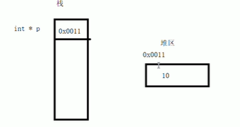

例子2-堆区上的数据开辟与释放
```cpp
#include <iostream>
using namespace std;
void test(){
    int *P = new int(10);
    cout<<*P<<endl;
    
    delete P;
}
void test2(){
    int *arr = new int[10];
    for(int i = 0;i<10;i++){
        arr[i] = i+10;
    }
    for(int i = 0;i<10;i++){
        cout<<arr[i]<<" ";
    }
    delete[] arr;
}
int main(){
    test();
}

```

## 引用

给变量取别名。

一、变量引用

引用注意事项：

- 引用必须初始化，int &b;//这样是不正确的
- 引用初始化后不能改变
- 通过引用参数产生的效果与指针地址传递效果一样，引用语法更清楚；

测试代码：
```cpp
//值传递
void test1(int a,int b) {

}
//地址传递
void test2(int *a,int *b) {
	int temp = *a;
	*a = *b;
	*b = temp;
}
//引用传递
void test3(int &a,int &b) {
	int temp = a;
	a = b;
	b = temp;
}
```

二、应用做函数的返回值

- 不要返回局部变量的引用
- 函数返回值是引用，那么这个函数调用可以作为左值

测试代码：
```cpp
// 二、引用做函数返回值
	//1.不能返回应用返回值
int& test04()//以引用的方式返回b,相当于给这个b起了一个别名
{
	int b = 10;//局部变量存放在栈区，函数结束后会被释放
	return b;
}
	//2. 函数的调用可以作为左值
int& test05()
{
	static int b = 10;//静态变量存放在全局区，程序结束后由系统自动释放
	return b;
}

int main() 
{
	int& ret04 = test04();
	int& ret05 = test05();
	std::cout << "ret04= "<<ret04 << std::endl;
	std::cout << "ret04= " << ret04 << std::endl;//第二次访问返回的是乱码
	std::cout << "ret05= " << ret05 << std::endl;
	test05() = 130;//函数的返回是引用，函数的调用可以作为左值
	std::cout << "ret05= " << ret05 << std::endl;

	system("pause");
	return 0;
}
```

测试代码结果
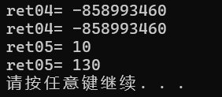

三、引用的本质

引用的本质在C++内部实现是一个指针常量，引用类型必须和引用实体是同类型。

四、常量引用

作用：用来修饰形参，防止误操作。

代码说明：
```cpp
//四、常量引用
	//int &ref = 10; 这样的操作是不被允许的，因为赋值给引用的是一个字面量,引用需要一个合法的空间，
	// 程序运行时没有专门为其分配可修改的内存空间
	// 但是如果在前面在上const，这条代码就通过
	// const int &ref = 10;
	//用来修饰形参，防止误操作
void test06(const int &val)
{
	//val = 100;不被允许修改
	std::cout << "val = " << val << std::endl;
}
```

## 函数进阶

一、函数默认参数

返回值 函数名(参数 = 默认值){}

注意事项：

1.如果某个位置已经有了默认参数，那么该位置往后都必须有默认参数
```cpp
//函数默认参数
void test(int a ,int b = 20,int c = 30)
{
	std::cout << "a = " << a << std::endl;
	std::cout << "b = " << b << std::endl;
	std::cout << "c = " << c << std::endl;
}
```
2.函数的声明有默认参数，函数实现不能有默认参数,声明和实现只能有一个有默认值
```cpp
#include <iostream>
//函数声明
void test(int a=10,int b = 20);//
//函数实现
void test(int a ,int b)
{
	std::cout << "a = " << a << std::endl;
	std::cout << "b = " << b << std::endl;
}
```

二、函数占位参数

作用：为了函数声明和定义的统一
语法：返回类型 函数名(数据类型){}

```cpp
//函数占位参数
void test(int a,int)//第二个参数为占位参数
{
    std::cout << "a = " << a << std::endl;
}

int main() {
    test(10,10);//占位参数必须填补,否则无法运行
}
```

注意：占位参数可以有默认参数，此时调用时就不用在传值
```cpp
//函数占位参数
void test(int a,int = 10)//第二个参数为占位参数，含默认值
{
    std::cout << "a = " << a << std::endl;
}

int main() {
    test(10);//不需要传站位参数
}
```

三、函数重载

满足条件：
- 在同一个作用域下。
- 函数名相同，
- 参数类型不同，
- 参数个数不同，
- 参数顺序不同。

作用： 提高复用性

注意：

1.返回值不能作为重载的条件

2.引用作为重载的条件

加const和不加是可以重载的
```cpp
void fun(int &a){
    std::cout<<"fun(int &a)"<<std::endl;
}
void fun(const int &a){
    std::cout<<"fun(const int &a)"<<std::endl;
}
int main(){
    int a = 10;
    const int &b = 20;
    fun(a);//调用fun(int &a)
    fun(b);//调用fun(const int &a)
    fun(10);//调用fun(const int &a)
    return 0;
}
```

3.函数重载遇到默认参数
```cpp
void fun2(int a,int b = 10){
    std::cout<<"fun(int &a)"<<std::endl;
}
void fun2(int a){
    std::cout<<"fun(const int &a)"<<std::endl;
}
int main(){

    fun2(10);//此时程序出现二义性，无法确定调用哪个函数
    return 0;
}
```

## 类和对象的基本概念

C++的特性：封装、多态、继承

一、基本概念

- 抽象：将事物所能进行的的行为归纳出来，形成函数，这些函数可以操作事物归纳后的数据结构。
- 类： 、

### 封装

将事物归纳的数据结构和操作该数据结构的算法呈现显而易见的紧密关系，叫封装。

一、 封装的意义

1.将属性和行为作为一个整体，表现生活中的事物。
```cpp
namespace test_class
{
	//设计一个圆的类
#define PI 3.14
	class Circle
	{
		//访问权限
	public:
		//属性
		int m_r;
		//行为
		double calculateZC()
		{
			return 2 * PI * m_r;
		}
	};
	void test() {
		Circle c1;
		c1.m_r = 10;
		cout << "圆的周长 = " << c1.calculateZC() << endl;
	}
}
```
2.访问权限
- public 公共权限
- protected 保护权限
- private 私有权限

二、访问权限说明

- public修饰的成员，可以在类内或者类外直接访问
- protected修饰的成员，只能在类内和子类中访问
- private修饰的成员，只能在类内访问

三、struct 与 Class 的区别

- 默认访问权限不同
- struct 默认权限为 public
- class 默认权限为 private

四、设置访问权限

一般对于变量设置为private，当要访问private的变量时，通过public的函数来访问。

```cpp
namespace test_class
{
	class Person
	{
	private:
		//姓名
		string m_Name;
		//年龄
		int m_Age;
    public:
		void setAge(int age)
		{
			m_Age = age;
        }
    };
    int main(){
        Person p;
        p.setAge(18);
        return 0;
    }
}
```

### 对象特性

一、初始化和清零
如果我们不提供构造函数，编译器会自动提供默认构造函数，但两个函数是空实现。

1.作用

- 构造函数：主要作用在于粗昂见对象那个时为对象成员属性赋值，
- 析构函数：主要作用在于对象销毁前系统自动调用析构函数，执行一些清理工作。

2.语法
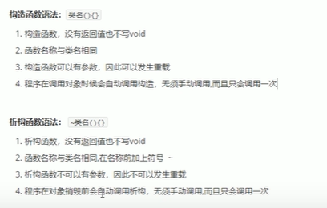

二、构造函数的分类及调用

1. 按参数分类：有参构造和无参构造(默认构造函数)
2. 按类型分类：普通构造和拷贝构造

3.调用规则

- 如果定义了有参构造，最好显示定义无参构造
- 如果定义了拷贝构造，最好显示定义赋值构造

```cpp
namespace test
{
	//构造函数的分类及调用

	//分类 按照参数分：有参构造函数和无参构造函数（默认构造函数）
	//		按照类型分：普通构造和拷贝构造
	class Person
	{
		public:
			Person() {
				cout << "调用无参构造函数" << endl;
			}
			Person(int Age)
			{
				age = Age;
				cout << "调用有参构造函数" << endl;
			}
			Person(const Person &p)
			{
				age = p.age;
				cout << "调用拷贝构造函数" << endl;
			}
			~Person() {
				cout << "调用析构函数" << endl;
			}

		private:
			int age;
	};
	//调用
	void test() {
		//1.括号法
		Person p1;
		Person p2(18);
		Person p3(p2);
		//注意事项
		// 如果写的是 Person p1();那么编译器会认为是函数声明，而不会调用默认构造函数

		//2.显示法
		Person p1;
		Person p2 = Person(10);
		Person p3 = Person(p2);

		//匿名对象：只写Person (10)的形式，特点是当前行执行结束后，系统会立即回收
		// 注意2：
		// 不要使用拷贝构造函数初始化匿名对象、编译器会认为Person (p3) === Person p3;即对象声明
		//3.隐式调用
		Person p4 = 10;//隐式转换为Person p4 = Person(10);
	}
}
```
三、拷贝构造函数调用时机

1.使用一个已经创建完毕的对象来初始化一个新对象
2.值传递的方式给函数参数传值
3.值方式返回局部对象
```cpp
namespace test_copy
{
	//拷贝构造函数调用时机
	class Person
	{
	public:
		Person() {
			cout << "调用无参构造函数" << endl;
		}
		Person(int Age)
		{
			age = Age;
			cout << "调用有参构造函数" << endl;
		}
		Person(const Person& p)
		{
			age = p.age;
			cout << "调用拷贝构造函数" << endl;
		}
		int getAge() {
			return age;
		}
		~Person() {
			cout << "调用析构函数" << endl;
		}

	private:
		int age;
	};
	//1.使用一个创建好的对象初始化一个新的对象
	void test01() {
		Person p(19);
		Person p2(p);
	}
	//2.值传递方式传给函数参数传值
	void doWork01(Person p){
		cout << "值传递方式调用拷贝构造函数" << endl;
	}
	//3.以返回值的方式返回
	Person doWork02() {
		Person p1;
		cout << (int*)&p1 << endl;
		return p1;//返回时不直接返回p而是通过拷贝构造函数，拷贝一份返回给外面。当然，也有存在被编译器优化的情况
					//这个时候就不会调用拷贝构造函数
	}
	void test02() {
		Person p = doWork02();
		cout << (int*)&p << endl;
		//cout << p.getAge() << endl;
	}
}
```

四、构造函数调用规则

1.默认情况下，c++编译器至少给一个类添加3个函数
- 默认构造函数(无参，函数体为空)
- 默认析构函数(无参，函数体为空)
- 默认拷贝构造函数，对属性值进行拷贝

2.如果我们提供了有参构造函数，编译器就不会提供默认构造函数，但会提供默认拷贝构造函数

3.如果我们提供了拷贝构造函数，编译器就不会提供其他构造函数

五、深拷贝与浅拷贝

1.浅拷贝：简单的赋值拷贝操作
2.深拷贝：在堆区重新申请空间，进行拷贝操作

```cpp
namespace test_deepcopy
{
	class Person
	{
	public:
		Person(int age,int height);
		Person(const Person& p);
		~Person();

		int m_Age;
		int* m_Height;
	};

	Person::Person(int age,int height)
	{
		m_Age = age;
		m_Height = new int(height);//在堆区申请一块内存空间用于存储身高
		cout << "调用构有参造函数" << endl;
	}
	Person::Person(const Person& p)
	{
		m_Age = p.m_Age;
		//m_Height = p.m_Height;//这段代码就是浅拷贝操作
		m_Height = new int(*p.m_Height);//这段代码就是在堆区另申请内存空间，存储赋值过来的身高值
	}
	Person::~Person()
	{
		if (m_Height != NULL)
		{
			delete m_Height;
			m_Height = NULL;//避免野指针出现置空
		}
		cout << "调用析构函数" << endl;
	}
	void test()
	{
		Person p(18, 180);
		cout << "person年龄：" << p.m_Age << "身高：" << *p.m_Height << endl;

		// 为测试浅拷贝与深拷贝写如下代码
		Person p1(p);//在没有写拷贝构造函数中的申请内存空间情况下，程序会报错，原因是程序是浅拷贝，导致第二次调用析构函数的时候报错
		cout << "person年龄：" << p1.m_Age << "身高：" << *p1.m_Height << endl;
	}
}
```

结果如下：

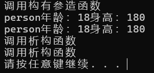

六、初始化列表

1.作用

用于初始化属性

2.语法


```cpp
namespace test_init
{
	class Person
	{
	public:
		//初始化列表
		//Person() :m_A(10), m_B(20), m_C(30) { }
		Person(int a,int b,int c) :m_A(a), m_B(b), m_C(c) { }

		~Person() {}

		int m_A;
		int m_B;
		int m_C;
		
	};
	void test() {
		Person p(10, 20, 30);
		cout << "m_A:" << p.m_A << endl;
		cout << "m_B:" << p.m_B << endl;
		cout << "m_C:" << p.m_C << endl;
	}
}
```

七、类对象作为类成员

1.类中的成员可以是另一个类的对象，我们称该成员为对象成员

2.类对象作为类成员时，其构造顺序和声明顺序一致，析构顺序和构造相反

八、静态成员

1.静态成员变量

- 所有对象共享同一份数据
- 在编译阶段分配内存（代码运行前分配内存，在全局区）
- 类内声明，类外初始化

2.静态成员函数

- 所有对象共享同一个函数
- 静态成员函数只能访问静态成员变量

3.访问静态成员变量
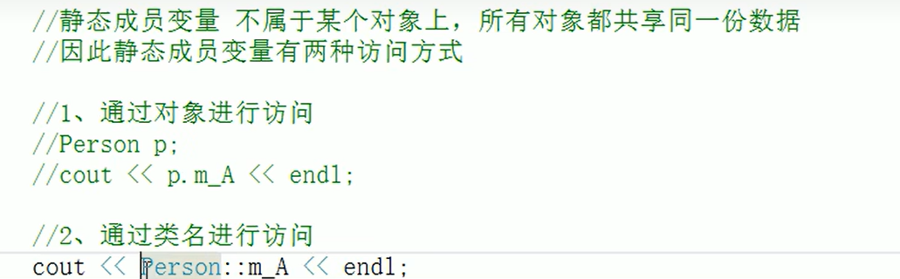

4.静态成员变量也有访问权限

- 公有静态成员变量类外可以访问
- 私有静态成员变量类外不可以访问

```cpp
namespace test_static
{
	class Person
	{
	public:
		static int m_A;
		int m_B;
	private:
		static int m_C;
	};
	int Person::m_A = 10;
	void test01() {
		//1.通过对象访问
		Person p;
		p.m_A = 100;
		cout << "p.m_A = " << p.m_A << endl;
		cout << "p.m_B = " << p.m_B << endl;
		//2.通过类名访问
		cout << "Person::m_A = " << Person::m_A << endl;
		//cout << "Person::m_B = " << Person::m_B << endl;//报错，私有成员变量类外不可以访问
	}
}
```

5.静态成员函数

- 所有对象共享一个函数
- 静态成员函数只能访问静态成员变量

```cpp
namespace test_static_func
{
	class Person
	{
	public:
		static void func() {
			m_A = 100;//静态成员函数可以访问静态成员变量
			//m_B = 100;//静态成员函数不可以访问非静态成员变量
			cout << "static_func调用" << endl;
		
		_}
		static int m_A;
		int m_B;
	}
	int Person::m_A = 10;
	void test01() {
		//1.通过对象访问
		Person p;
		p.func();
		//2.通过类名访问
		Person::func();
	}
}
```

注意：静态成员函数也有访问权限

九、C++对象模型和this指针

1.成员变量和成员函数分开存储

在C++中，类内的成员变量和成员函数分开存储，只有非静态成员变量才属于类的对象上，静态成员函数不属于类的对象上。

```cpp
namespace test_this{
	class Person
	{
	};
	class Person2
	{
		int m_A;
		static m_B;//静态成员，不在类对象上
		void func(){}//非静态成员函数，不在类对象上【原因需要看下一节】
		static void func2(){}//静态成员函数，不在类对象上
	};
	int Person::m_B = 10;
	void test01() {
		Person p;
		//空对象占用内存为1
		//原因：C++编译器给每个空对象也分配一个字节空间，是为了区分空对象占用的内存区域，否则，空对象和字符数组无法区分
		cout << sizeof(p) << endl;//1
	}
	void test02() {
	    Preson2 p2;
		cout <<sizeof(p2)<<endl;
		//空对象占用内存为4
		//原因：此时不是5而是4，当不是空的时候，为int类型，占用4个字节
		//同时也验证了静态成员变量不属于类的对象上。
	}
}
```

2.this指针

this是指针，谁调用，this指针就指向谁，

用途：

- 通过this指针访问类的成员
- this指针的本质是指针常量，即指针的值不能修改
- 在类的非静态成员函数中，this指针默认作为隐含参数存在，不需要定义

（1）名称冲突：
```cpp
namespace test_this{
	class Person
	{
	public:
		Person(int age) {
			age = age;
		}
		int age;
	}
	void test01() {
		Person p(19);
	     cout<<"age:"<<p.age<<endl;
	}
}
```
此时，得到的数据不是18,原因在于“age = age;”与"int age;"名字相同但不是同一个东西，解决的办法有而，第一种是如之前一样定义一个"int m_Age;"，然后在代码中使用"m_Age = age;"。

第二种就是使用this指针，代码如下：
```cpp
namespace test_this{
	class Person
	{
	public:
		Person(int age) {
			this->age = age;
		}
		int age;
	}
	void test01() {
		Person p(19);
	     cout<<"age:"<<p.age<<endl;
	}
}
```
这种办法也可以实现正常输出，这里就解释了this指针的用途。对象p调用Person(int age)函数，此时this指针指向p，this指针指向p，this->age就相当于p.age。

(2)以返回值方式返回对象本身

```cpp
namespace test_this {
    class Person {
    public:
        // 修改1：添加类定义结尾的分号
        void addAge(int age) {
            this->m_Age += age;
        }
        int m_Age = 10;
    };  // 修正：补充分号

    void test01() {
        Person p;
        p.addAge(10);
        // 修改2：void 返回值无法输出，需直接访问成员变量
        cout << "age:" << p.m_Age << endl;  // 输出 20
    }
}
```

此时得到的结果是20，如果想实现p.addAge(10).addAge(10).addAge(10)这样的操作，那么需要修改为如下代码：

```cpp
namespace test_this {
    class Person {
    public:
        // 返回引用以实现链式调用
        Person& addAge(int age) {
            this->m_Age += age;
            return *this; // 返回对象本身的引用
        }
        int m_Age = 10;
    };

    // 修改3：重载 operator<< 以支持输出 Person 对象
    ostream& operator<<(ostream& os, const Person& p) {
        os << p.m_Age;
        return os;
    }

    void test01() {
        Person p;
        // 链式调用操作的是同一个对象（p）
        p.addAge(10).addAge(10).addAge(10);
        cout << "p.m_Age: " << p.m_Age << endl; // 输出 40
    }
}
```

这时候输出的结果就是40,实现了**链式调用**,类似与`cout<<a<<b<<c<<endl;`这样的操作。

当返回类型是 Person（而非引用）时，p.addAge(10) 会返回一个​​临时副本​​，后续的 .addAge(10) 操作修改的是临时副本的 m_Age，而非原始对象 p。

```cpp
Person addAge(int age) { /* ... */ } // 返回副本

Person p;
p.addAge(10).addAge(10);  // 第二个 addAge 操作的是临时副本
cout << p.m_Age;          // 输出 20（仅第一次修改生效）
```

十、空指针的访问函数

C++中空指针也是可以调用成员函数的，但是也要注意有没有访问成员变量。

```cpp
namespace test_nullptr {
    class Person {
    public:
        void showClassName() {
            cout << "this is Person class" << endl;
        }
        void showPersonAge() {
			//报错的原因是因为传入的指针是空指针，空指针访问成员变量会报错，解决办法如下:
			// if(this == NULL){
			// 	return;
			// }
            cout << "age = " << m_Age << endl;//这条代码的本质：cout << "age = " << this->m_Age << endl;
        }
		int m_Age;
	};
	void test01() {
	    Person *P = NULL;
		p->showClassName();//不报错
		p->showPersonAge();//报错，空指针访问成员变量
	}
}
```

十一、const修饰成员函数

1.常函数

- 成员函数后加const，称为常函数
- 常函数内不可以修改成员变量，除了 mutable修饰的成员变量

2.常对象

- 声明对象前加const，称为常对象
- 常对象只能调用常函数

```cpp
namespace test_const{
//常函数
class Person{
	public:
	//this指针的本质是指针常量，指针指向的内容不可以修改
	//Person * const this
	//如果在成员函数后写了const，那么上面的语句就变成：
	//const Person * const this
	//在成员函数的后面加const，本质上是修饰了this指针，让this指针指向的值不可修改
		void showPerson() const
		{
			//this->m_A = 100;//常函数不可以修改成员变量
			m_B = 100;//在变量前加mutable，让这个变量永远可变
		}
		void func(){
			cout<<"func调用"<<endl;
		}
		int m_A;
		mutable int m_B;//在变量前加mutable，让这个变量永远可变
}
void test01() {
    Person p;
	p.showPerson();
}
//常对象
void test02() {
    const Person p;
	//p.m_A = 100;//常对象不可以修改成员变量
	p.m_B = 100;//可以调用
	p.showPerson();//可以调用
	p.func();//可以调用
}
}
```

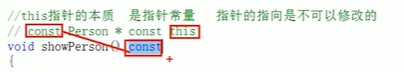

### 友元

友元关键字：friend

一、全局函数做友元

作用：全局函数做友元，全局函数就可以访问类中的私有内容

```cpp
namespace test_friend{
	class Building{
		//告诉编译器GoodGay全局函数是Building类的好朋友，可以访问类中的私有内容
		friend void GoodGay(Building &building);
		public:
			Building(){
				this->m_SittingRoom = "客厅";
				this->m_BedRoom = "卧室";
			}
		public:
			string m_SittingRoom;
		private:
			string m_BedRoom;
	};
	void GoodGay(Building &buiding){
		cout<<"好基友正在访问"<<buiding.m_SittingRoom<<endl;
		cout<<"好基友正在访问"<<buiding.m_BedRoom<<endl;
	}
	void test01(){
	    Building buiding;
		GoodGay(buiding);
	}
}
```

二、友元类

目的：让一个类可以访问另一个类的私有成员

友元类的所有成员函数都可以访问对方类的私有保护成员。

```cpp
namespace test_friend{
	class Building;//先写出来防止报错
	class GoodGay{
		public:
			GoodGay();
			void visit();//参观函数访问Building中的成员
			Building *m_Building;//让该类有访问Building的权限
	};
	class Building{
		friend class GoodGay;//告诉编译器GoodGay类是Building的好朋友，可以访问Building的私有内容
		public:
			Building();//构造函数
		public:
			string m_SittingRoom;
		private:
		    string m_BedRoom;
	};
	GoodGay::GoodGay(){
		this->m_Building = new Building();//在对象被初始化时，就创建一个Building对象，方便后续访问Building中的成员
	}
	Building::Building(){//当building对象被创建的时候，给变量初始化
		this->m_SittingRoom = "客厅";
		this->m_BedRoom = "卧室";
	}
	void GoodGay::visit(){
		cout<<"好基友正在访问："<<this->m_Building.m_SittingRoom<<endl;
		cout<<"好基友正在访问："<<this->m_Building.m_BedRoom<<endl;//在没有声明GoodGay为Building的友元类时，这句代码不通过。
	}
	void test01(){
		GoodGay gg;
		gg.visit(); 
	}
}

三、成员函数做友元

作用：

```cpp
namespace test_friend{
	class Building;
	class GoodGay{
		public:
			GoodGay();
			void visit();//参观函数访问Building中的成员
			void visit2();//让参观函数不可以访问访问Building中的成员
			Building *building;//让该类有访问Building的权限
	};
	class Building{
		//告诉编译器GoodGay类中的visit成员函数是Building好朋友，可以访问Building的私有内容
		friend void GoodGay::visit();
		public:
			Building();//构造函数
		public:
			string m_SittingRoom;
		private:
		    string m_BedRoom;
	};
	Building::Building(){
		m_SittingRoom = "客厅";
		m_BedRoom ="卧室";

	}
	GoodGay::GoodGay(){
		building = new Building();//在对象被初始化时，就创建一个Building对象
	}
	void GoodGay::visit(){
		cout<<"好基友正在访问："<<building->m_SittingRoom<<endl;
		cout<<"好基友正在访问："<<building->m_BedRoom<<endl;
	}
	void GoodGay::visit2(){
		cout<<"好基友正在访问："<<building->m_SittingRoom<<endl;
	}
	void test01(){
		GoodGay gg;
		gg.visit();
		gg.visit2();
	}
}
```
未加入关键字friend时：
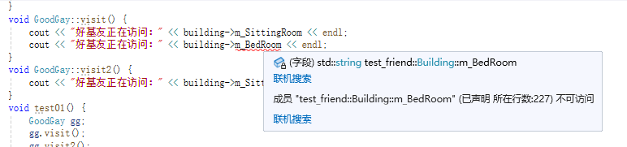

加入后：
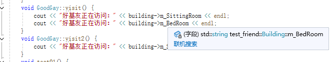

结果：
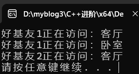

### 运算符重载

作用：让自定义的类，对象，也能够进行加减乘除等操作。

#### 加号运算符重载

实现两个自定义数据结构的相加

需求：
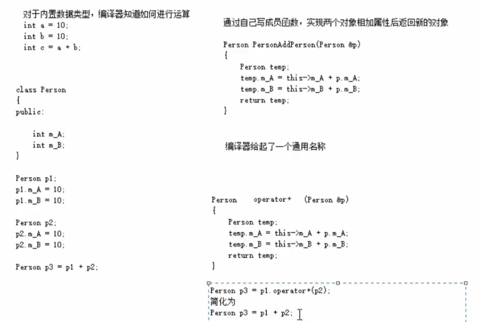
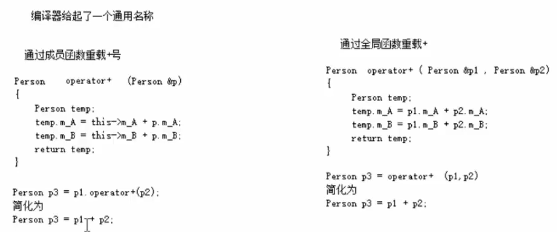
```cpp
namespace test_add
{
	class Person
	{
	public:
		//1、成员函数重载
		/*Person operator+ (Person &p)
		{
			Person temp;
			temp.m_A = this->m_A + p.m_A;
			temp.m_B = this->m_B + p.m_B;
			return temp;
		}*/
		int m_A;
		int m_B;

	};
	Person operator+(Person& p1, Person& p2)
	{
		Person temp;
		temp.m_A = p1.m_A + p2.m_A;
		temp.m_B = p1.m_B + p2.m_B;
		return temp;
	}
	void test() {
		Person p1;
		p1.m_A = 20;
		p1.m_B = 10;
		Person p2;
		p2.m_A = 20;
		p2.m_B = 10;
		//本质:Person ret = p2.operator+(p1)或者Person ret = operator+(p2,p1);简化为如下写法：
		Person p3 = p1 + p2;

		cout << "结果：" << p3.m_A << endl;
		cout << "结果：" << p3.m_B << endl;
	}
}
```

除了以上的写法我们还可以使用函数重载的知识，将operator+重载实现Person p4 = p1+10;

#### 左移运算符重载

作用：可以输出自定义数据类型

通过上面的学习我们可以使用两种办法实现输出自定义数据类型，但是此处如果使用成员函数重载，那么会出现对象在左侧，而cout在右侧的情况，详细如下图解释：
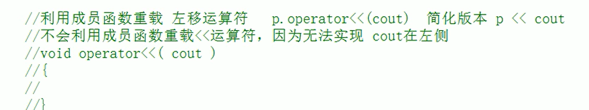

所以一般的作揖运算符重载使用全局函数重载，代码如下：

```cpp
namespace test_LeftMove
{
	class Person
	{
		//使用友元思想实现类外函数访问类内私有成员
		friend ostream& operator<<(ostream& cout, Person& p);
	public:
		Person(int a,int b):m_A(a),m_B(b){}
		private://数据一般为私有
			int m_A;
			int m_B;
	};
	//此处传入的值与返回的值都是用引用，对于ostream& cout是唯一的，
	// 所以使用引用，ostream&作为返回值类型是为了实现链式输出
	//即：cout << p << endl;
	ostream& operator<<(ostream& cout, Person &p)
	{
		cout << "m_A = " << p.m_A << "  m_B = " << p.m_B;
		return cout;
	}
	void test() {
		Person p(10,20);
		cout << p << endl;
	}
}
```

#### 递增运算符重载

作用：实现对自定义数据类型的递增

```cpp
namespace test_MyInteger {
	class MyInteger
	{
		friend ostream& operator<<(ostream& cout, const MyInteger& myint);
	public:
		MyInteger(){
			Integer = 0;
		}
		//前置运算符
		MyInteger& operator++() {
			Integer++;
			return *this;
		}
		//后置运算符
		MyInteger operator++(int)//int是占位符，用于区分是前置还是后置运算符
		{
			MyInteger myint = *this;//记录当前值
			Integer++;//对象属性自增
			return myint;//返回记录值而不是自增后的值
		}
	private:
		int Integer;
	};
	ostream& operator<<(ostream& cout, const MyInteger& myint)
	{
		cout << myint.Integer;
		return cout;
	}
	
	void test1() {
		MyInteger myint;
		cout << ++(++myint) << endl;//如果返回的不是引用，那么这里的++(++myint)也能通过，但是并不是在原来的对象上进行操作，而是一个新的对象上操作。
		cout << myint << endl;
	}
	void test2() {
		MyInteger myint;
		cout << (myint++)++ << endl;//这样的操作精良避免发生，这不符合C++语法，因为第二次自增是在临时对象上自增而不是原始对象。
		cout << myint << endl;
	}

}
```

**关键点总结**

- ​​右值与左值引用​​：非 const 左值引用 (MyInteger&) 无法绑定到右值（如 myint++ 返回的临时对象）。
- ​const 引用的灵活性​​：const 左值引用 (const MyInteger&) 可以绑定到右值和左值，解决了参数匹配问题。

所以上面的代码中，<<的重载第二个参数是const的引用类型，如果是非const的引用类型，那么在`test2()`函数中，`cout << myint++<<endl;`就会报错，因为 myint++的返回值是右值引用。

#### 赋值运算符重载

**C++编译器至少给一个类添加4个函数**

- 默认构造函数(无参，函数体为空)
- 默认析构函数(无参，函数体为空)
- 默认拷贝构造函数，对属性值进行拷贝
- 赋值运算符重载函数operator=(对属性值进行拷贝)


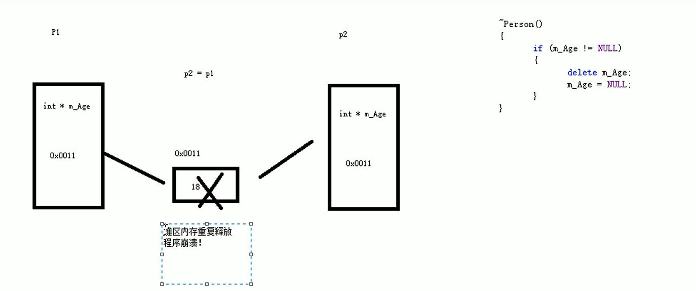

解决办法：
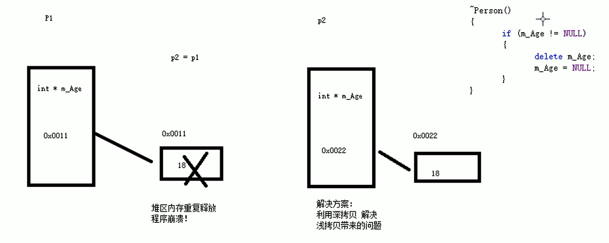

```cpp
namespace test_assig
{
	class Person
	{
	public:
		Person(int age) {
			m_Age = new int(age);
		}

		~Person() {
			if (m_Age != NULL)
			{
				delete m_Age;
				m_Age = NULL;
			}
		}
		Person& operator=(Person &p) {
			//默认赋值语句
			//m_Age= p.age;

			//先判断是否有属性在堆区，如果有先删除干净，再深拷贝
			if (m_Age != NULL)
			{
				delete m_Age;
				m_Age = NULL;
			}
			//深拷贝
			m_Age = new int(*p.m_Age);

			return *this;
		}
		int* m_Age;

	};
	void test() {
		Person p1(18);
		Person p2(20);
		Person p3(90);

		p3=p1 = p2;

		cout << *p1.m_Age << endl;
		cout << *p2.m_Age << endl;
		cout << *p3.m_Age << endl;

	}
}
```

#### 关系运算符重载

作用：重载关系运算符。可以让两个自定义类型对象进行对比操作。

```cpp
namespace test_relation
{
	class Person
	{
	public:
		Person(string name, int age)
		{
			m_Name = name;
			m_Age = age;
		}
		bool operator==(Person& p)
		{
			if (m_Age == p.m_Age && m_Name == p.m_Name)
			{
				return true;
			}
			else {
				return false;
			}
		}
		int m_Age;
		string m_Name;

	};
	void test()
	{
		Person p1("JUN", 18);
		Person p2("JUN", 18);

		if (p1 == p2)
		{
			cout << "p1与p2相等" << endl;
		}
		else
		{
			cout << "p1与p2不相等" << endl;
		}
	}
}
```

#### 函数调用运算符重载

- 函数调用运算符()也可以重载
- 由于重载后使用的方式非常像函数的调用，因此称之为**仿函数**
- 仿函数没有固定写法，非常灵活

```cpp
namespace test_call
{
	class MyPrint
	{
	public:
		void operator()(string text)
		{
			cout << text << endl;
		}
		void operator()(int a, int b)
		{
			cout << a + b << endl;
		}
	};
	void test()
	{
		MyPrint myprint;
		myprint("hello world");
		myprint(1, 2);
		cout<<MyPritn()("hello world")<<endl;//MyPritn()是匿名对象，作用域在当前行，所以输出后立即销毁
	}
}
```

### 继承

#### 继承的基本语法

```cpp
class 子类 : 继承方式 父类
{
	//类体
};
```

继承方式一共有三种：public、protected、private

继承后的访问权限：

- 父类的私有成员，哪种方式继承都无法访问；
- public继承,原来是什么还是什么：public-->public，protected-->protected；
- protected继承，都变保护：public-->protected，protected-->protected；
- private继承，都变私有：public-->private，protected-->private；

protected与public的区别：

-

#### 继承中的对象模型

```cpp
namespace test_model
{
	class Base {
	public:
		int m_A;
	protected:
		int m_B;
	private:
		int m_C;
	};
	class Son :public Base {
	public:
		int m_D;
	};
	void test(){
		cout<<"sizeof(Base) = "<<sizeof(Base)<<endl;
	}
}

```

结果为16，因此可知父类中的所有非静态成员属性都被子类继承了，并且子类对象中包含了父类对象，父类对象在子类对象中是隐藏的。

另一种方式查看类的大小：
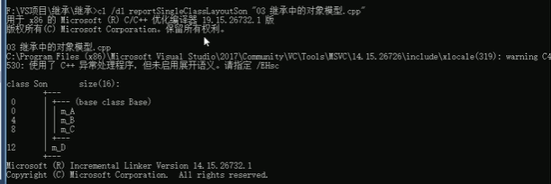

#### 继承构造和析构函数

问题：父类和子类的构造和析构函数的调用顺序是什么？

```cpp
namespace test_construct_destruct{
	class Base{
		public:
			Base(){
				cout<<"Base构造函数"<<endl;
			}
			~Base(){
				cout<<"Base析构函数"<<endl;
			}
	};
	class Son:public Base{
		public:
			Son(){
				cout<<"Son构造函数"<<endl;
			}
			~Son(){
				cout<<"Son析构函数"<<endl;
			}
	}
}
```

结果为：

```
Base构造函数
Son构造函数
Son析构函数
Base析构函数
```

#### 继承同名成员处理方式

问题：当子类和父类出现同名的成员，如何通过子类对象，访问到父类和子类的同名成员？

- 访问子类同名成员直接访问即可；
- 访问父类同名成员需要加作用域；

```cpp
namespace test_same_name{
	class Base{
		public:
			Base()
			{
				m_A = 100;
			}
			void func(){
				cout<<"Base func()"<<endl;
			}
			void func(int a){
				cout<<"Base func(int a)"<<endl;
			}
			int m_A;
	};
	class Son:public Base{
		public:
			Son()
			{
				m_A = 200;
			}
			void func(){
				cout<<"Son func()"<<endl;
			}
			int m_A;
	};
	//同名的成员属性
	void test01(){
		Son s;
		cout<<s.m_A<<endl;
		cout<<s.Base::m_A<<endl;
	}
	//同名的函数
	void test02(){
		Son s;
		s.func():
		s.Base::func();//通过作用域解决

		//下面的代码不通过，因为当子类和父类存在相同函数名时，子类的同名函数会屏蔽父类的同名函数，要想访问父类的同名函数，需要加作用域
		//s.func(10);
	}
}
```

#### 继承同名静态成员处理方式

问题：继承中同名的静态成员在子类对象上如何进行访问？

- 访问子类同名静态成员，直接通过子类对象访问即可；
- 访问父类同名静态成员，需要加作用域；

```cpp
namespace test_same_static{
	class Base{
		public:
			static int m_A;
			static void func(){
				cout<<"Base func()"<<endl;
			}
	};
	class Son:public Base{
		public:
			static int m_A;
			static void func(){
				cout<<"Son func()"<<endl;
			}
	};


	int Base::m_A = 100;
	int Son::m_A = 200;
	//同名的静态成员属性
	void test01(){
		Son s;

		//通过对象访问
		cout<<s.m_A<<endl;
		cout<<s.Base::m_A<<endl;

		//通过类名访问
		cout<<Son::m_A<<endl;
		cout<<Son::Base::m_A<<endl;
	}
	//同名的静态成员函数
	void test02(){
		Son s;
		s.func();
		s.Base::func();

		//通过对象访问
		Son::func();
		Son::Base::func();
	}
}
```

#### 多继承

C++允许一个类继承多个类：

语法：`class 子类:继承方式 父类1, 继承方式 父类2...`

多继承可能会引发父类中有同名成员出现的情况，需要加作用域区分。

C++实际开发中不建议使用多继承，因为会引发很多二义性问题。

```cpp
namespace test_multi_inherit{
	class Base1{
		public:
			Base1(){
				m_A = 100;
				cout<<"Base1构造函数"<<endl;
			}
			int m_A;
	}；
	class Base2{
		public:
			Base2(){
				m_A = 200;
				cout<<"Base2构造函数"<<endl;
			}
			int m_A;
	};
	class Son:public Base1,public Base2{
		public:
			Son(){
				m_A = 300;
				m_B = 400;
				cout<<"Son构造函数"<<endl;
			}
			int m_A;
			int m_B;
	};
	void test(){
		Son s;//调用Base1构造函数，再调用Base2构造函数，最后调用Son构造函数
	}
}
```

#### 菱形继承

菱形继承的概念：

- 两个派生类继承同一个基类；
- 又有一个类同时继承这两个派生类；
- 这个类就叫做菱形继承；
- 菱形继承会导致**二义性问题**；

经典菱形继承案例：

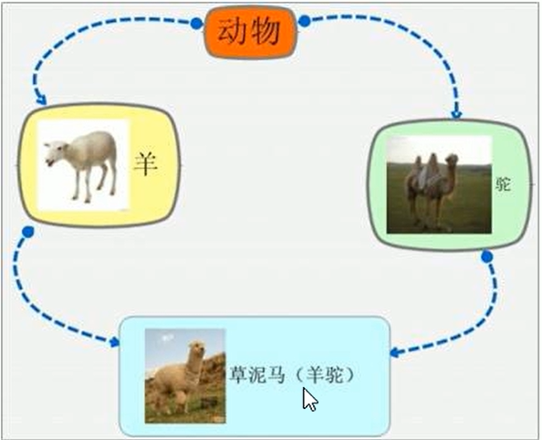

出现的问题：
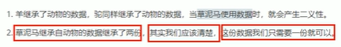

如何解决：
```cpp
namespace test_diamond_inherit {
	//动物类
	class Animal {
	public:
		int m_Age;
	};
	//利用虚继承可以解决菱形继承的问题
	//在继承之前加virtual
	//羊类
	class Sheep :virtual public Animal {
	};
	//驼类
	class Tuo :virtual public Animal {
	};
	//羊驼类
	class SheepTuo :public Sheep, public Tuo {
	};
	void test() {
		SheepTuo st;
		//当菱形继承，连个父类拥有相同的数据时，需要加作用域加以区分
		st.Sheep::m_Age = 10;
		st.Tuo::m_Age = 20;

		
		cout << "st.Sheep::m_Age = " << st.Sheep::m_Age << endl;
		cout << "st.Tuo::m_Age = " << st.Tuo::m_Age << endl;
		//当添加virtual关键字后，就可以使用下面的语句，而且不会出现二义性
		cout << "st.m_Age = " << st.m_Age << endl;
	}
}
```

在没有使用virtual前，输入`cl /d1 repoterSingleClassLayoutSheepTuo 类与对象.cpp`后的结果如下图
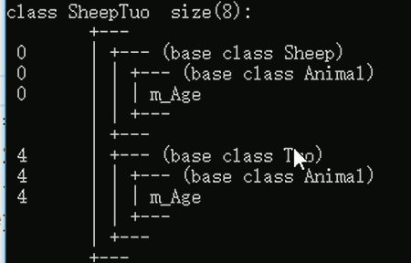

加入virtual后，输入`cl /d1 repoterSingleClassLayoutSheepTuo 类与对象.cpp`后的结果如下图，下图就解释了为什么使用virtual能解决菱形继承问题。
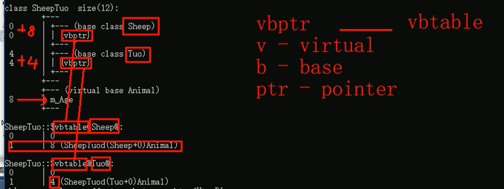

## 多态

### 多态的基本概念

多态分为两类：
	class Donkey:public Sheep,public Horse{
	};
	void test(){
		Donkey d;

### 多态

——————————————————————————————————————————————————————————————————————————————————————————————-

### 类

将数据结构和操作该数据结构的函数捆绑在一起形成一个类。

### 在类中使用缺省函数

需要注意避免二义性：
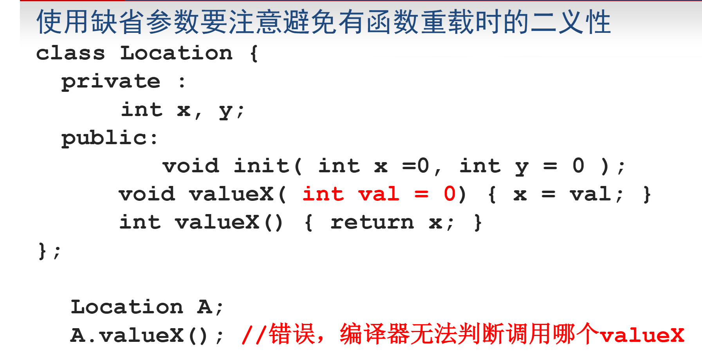

## 构造函数

### 类中为什么需要构造函数

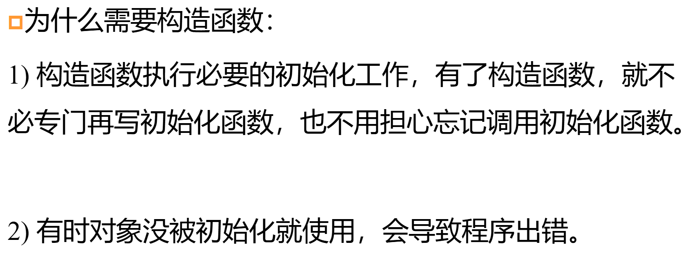

### 构造函数在数组中的使用

```cpp
class A{
    int a;
    public:
        A(){std::cout<<"hello\n";}//1
        A(int b){std::cout<<"value: "<<b<<std::endl;}//2
}
int main(){
    A arr[2] = {1};
}
```
上面的语句就调用了第1，2个构造函数，首先数据里的1会调用2，而数组的第二个是空值那么就会调用第1个。

## 复制构造函数-copy constructor

函数名与类名相同，参数为A(A& a)或A(const A& a)（二选一）。

三种情况下复制构造函数起作用

- 同类对象a,b，将a的值初始化b；
  - A a; A b(a);
- 将类当作参数传入函数；
- 将类作为返回值；

注意：对象之间的复制是不会导致复制构造函数的

## 转换构造函数

什么是转换构造函数
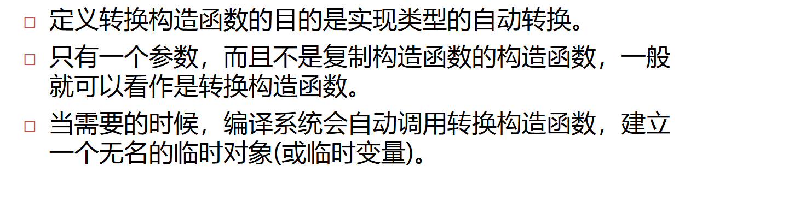

示例代码：
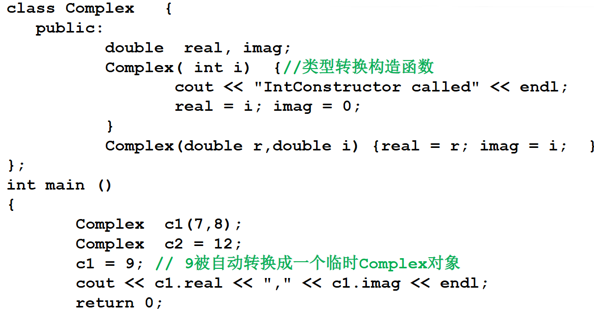
在上面的例子当中，`c1 = 9;`会被自动转换为调用转换构造函数，如果不想让这样的事情发生，可以在转换构造函数前面加上修饰字段 `explicit`，这样再次使用`c1 = 9;`时程序会报错。

## 析构函数-destructors

这里补充几点，一个类只能有一个析构函数；

**析构函数与数组：**

数组成员的每一次结束时都会调用析构函数，假设类A数组array[2]，则生命周期结束时会调用两次析构函数。

**析构函数什么时候被调用呢？**

```cpp
    class CMyclass {
    public:
    ~CMyclass() { cout << "destructor" << endl; }
    };
    CMyclass obj;
    CMyclass fun(CMyclass sobj ) { //参数对象消亡也会导致析
    //构函数被调用
    return sobj; //函数调用返回时生成临时对象返回
    }
    int main(){
    obj = fun(obj); //函数调用的返回值（临时对象）被
    return 0; //用过后，该临时对象析构函数被调用
    }
```

上面结果输出三个destructor，在`fun(CMyclass sobj)`参数对象消亡调用析构函数（具体可以联想复制构造函数），会调用一次析构函数；当函数返回赋值给obj后，再次调用析构函数；整个程序结束再次调用析构函数。
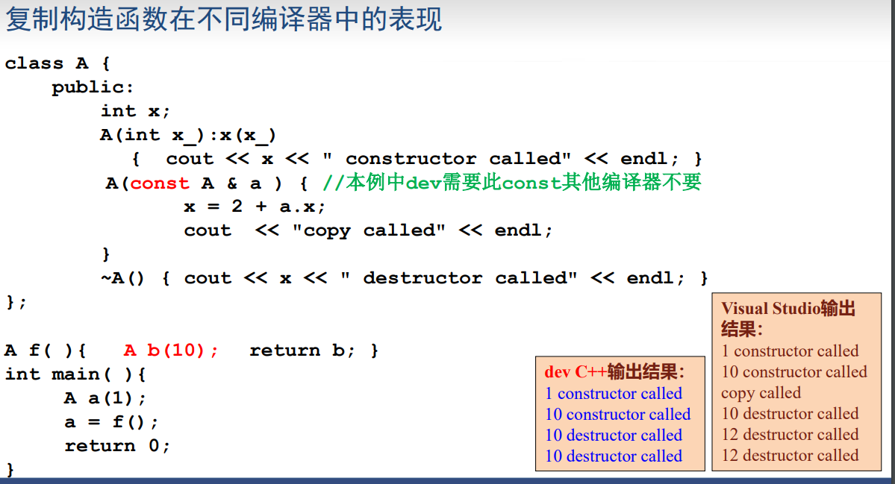

## this指针

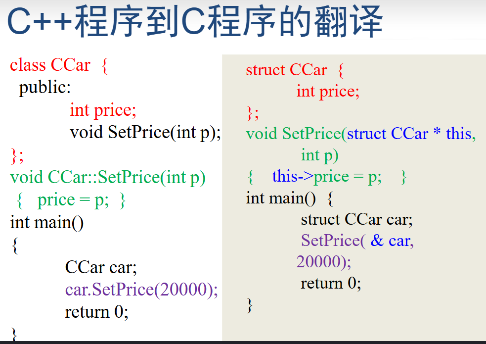

静态成员函数中可以直接使用this指针来代表指向该函数作用的对象的指针

示例1：
```cpp
class Complex {
public:
double real, imag;
void Print() { cout << real << "," << imag ; }
Complex(double r,double i):real(r),imag(i)
{ }
Complex AddOne() {
this->real ++; //等价于 real ++;
this->Print(); //等价于 Print
return * this;
}
}; 

int main() {
Complex c1(1,1),c2(0,0);
c2 = c1.AddOne();//调用AddOne函数后内部this指针变为c1，所以是c1中的read++
return 0;
} //输出 2,1

```

示例2：
```cpp
    class A
{
int i;
public:
void Hello() { cout << i << "hello" << endl; }
}; // 翻译为void Hello(A * this ) { cout << this->i << "hello"<< endl; }
int main()
{
A * p = NULL;
p->Hello(); //翻译为Hello(p);
} //编译报错
```
报错的原因是p指针式一个空指针，它并不指向任何A的对象，所以编译到 `this->i` 会报错。

## 静态成员变量和函数

 **基本特点：**

- 普通成员变量每个对象有各自的一份，而静态成员变量一共就一份，为所有对象共享。
- 普通成员函数必须具体作用于某个对象，而静态成员函数并不具体作用于某个对象。因此静态成员不需要通过对象就能访问。

对第二句话的理解，如下代码示例：

```cpp
class Dog {
public:
    // 普通成员函数
    void bark() {
        std::cout << "Woof!" << std::endl;
    }

    // 静态成员函数
    static std::string getSpecies() {
        return "Canine";
    }
};
```

要调用bark我们需要先创建一个Dog的类对象，然后通过 `.` 调用，也就是非静态成员作用于对象的意思，但是对于 `getSpecies` 就不需要，可以直接 `Dog::getSpecies`调用。

**如何访问静态成员？**

1) 类名::成员名
CRectangle::PrintTotal();

2) 对象名.成员名
CRectangle r; r.PrintTotal();

3) 指针->成员名
CRectangle * p = &r; p->PrintTotal();

4) 引用.成员名
CRectangle & ref = r; int n = ref.nTotalNumber;

**设置静态成员变量的目的是什么？**

设置静态成员这种机制的目的是将和某些类紧密相关的全局变量和函数写到类里面，看上去像一个整体，易于维护和理解。比如，考虑一个需要随时知道矩形总数和总面积的图形处理程序，可以用全局变量来记录总数和总面积，用静态成员将这两个变量封装进类中，就更容易理解和维护。

注意事项：

- 必须在定义类的文件中对静态成员变量进行一次说明或初始化。否则编译能通过，链接不能通过。
- 在静态成员函数中，不能访问非静态成员变量，也不能调用非静态成员函数。

## 成员对象和封闭类

- 有成员对象的类叫 封闭(enclosing)类。
- 任何生成封闭类对象的语句，都要让编译器明白，对象中的成员对象，是如何初始化的。具体的做法就是：通过封闭类的构造函数的初始化列表。

**封闭类的复制构造函数:**

```cpp
    class A
    {
    public:
    A() { cout << "default" << endl; }
    A(A & a) { cout << "copy" << endl;}
    };

    class B { A a; };

    int main()
    {
    B b1,b2(b1);//b2调用自生默认复制构造函数，而内部的A a也会调用默认的复制构造函数
    return 0;
    }
```

## 友元

1) 友元函数: 一个类的友元函数可以访问该类的私有成员。
2) 可以将一个类的成员函数(包括构造、析构函数)说明为另一个类的友元。
3) 友元类: 如果A是B的友元类，那么A的成员函数可以访问B的私有成员。
4) 友元类之间的关系不能传递，不能继承。

## 常量成员

常量成员函数：内部不能改变属性的值，也不能调用非常量成员函数。

**注意：**如果一个成员函数中没有调用非常量成员函数，也没有修改成员变量的值，那么，最好将其写成常量成员函数。
mutable成员变量
可以在const成员函数中修改的成员变量
```cpp
    class CTest
    {
    public:
    bool GetData() const
    {
    m_n1++;//这个值更可以更改
    return m_b2;
    }
    private:
    mutable int m_n1;
    bool m_b2;
    };
```

## 运算符重载函数

**浅拷贝与深拷贝：**
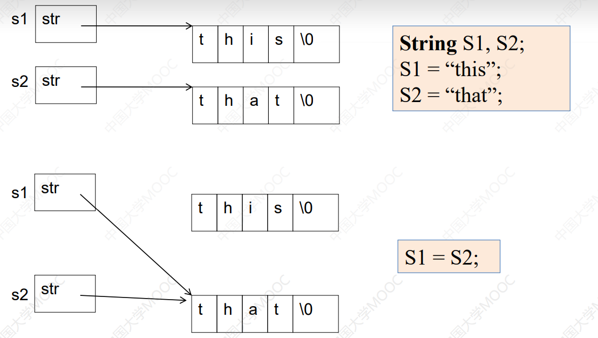

为解决这个问题，我们需要修改赋值运算符重载：
```cpp
    String & operator = (const String & s){
        if( this == & s)
            return * this;
        delete [] str;
        str = new char[strlen(s.str)+1];
        strcpy( str,s.str);
        return * this;
    }
```

### 自增自减运算法重载

```cpp
class CDemo {
private :
int n;
public:
CDemo(int i=0):n(i) { }
CDemo & operator++(); //用于前置形式
CDemo operator++( int ); //用于后置形式
operator int ( ) { return n; }
friend CDemo & operator--(CDemo & );
friend CDemo operator--(CDemo & ,int);
}
```

`operator int ( ) {return n;}`

这里，int 作为一个类型强制转换运算符被重载, 此后

```cpp
Demo s;
(int) s ; //等效于 s.int();
```

类型强制转换运算符被重载时不能写返回值类型，实际上其返回值类型就是该类型强制转换运算符代表的类型。

## 继承和派生

**注意：**在派生类的各个成员函数中，不能访问基类中的private成员。

### 派生类的内存空间

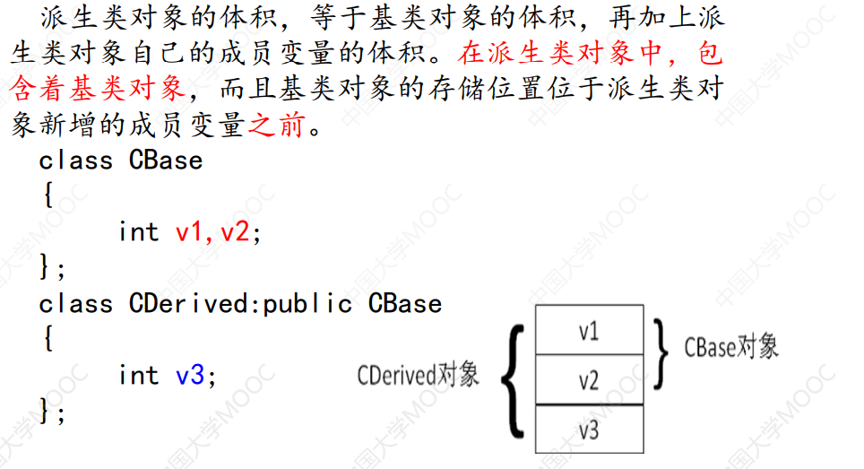

### 类之间的关系

**继承：“是”关系。**

- 基类 A，B是基类A的派生类。
- 逻辑上要求：“一个B对象也是一个A对象”。

**复合：“有”关系。**

- 类C中“有”成员变量k，k是类D的对象，则C和D是复合
关系
- 一般逻辑上要求：“D对象是C对象的固有属性或组成部
分”

复合关系的示例：
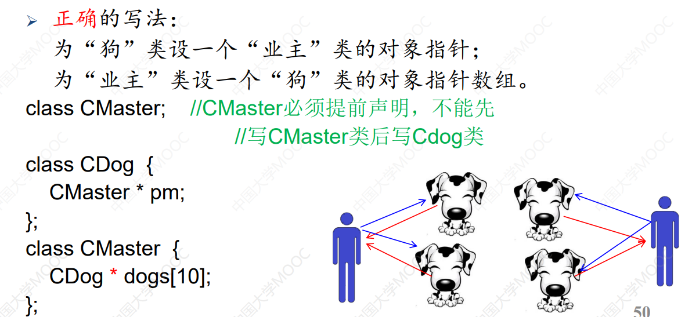

### 基类与派生类名字重名的情况

一般来说，基类和派生类不定义同名成员变量。但如果要方位可以使用`基类::基类成员`来访问。

### 访问权限

**• 基类的private成员：可以被下列函数访问**

- 基类的成员函数
- 基类的友元函数

**• 基类的public成员：可以被下列函数访问**

- 基类的成员函数
- 基类的友元函数
- 派生类的成员函数
- 派生类的友元函数
- 其他的函数

**• 基类的protected成员：可以被下列函数访问**

- 基类的成员函数
- 基类的友元函数
- 派生类的成员函数可以访问当前对象和其它对象的基类的保护成

举一个例子：

```cpp
class Father {
private: int nPrivate; //私有成员
public: int nPublic; //公有成员
protected: int nProtected; // 保护成员
};
class Son :public Father{
void AccessFather () {
nPublic = 1; // ok;
nPrivate = 1; // wrong
nProtected = 1; // OK，访问从基类继承的protected成员
Son f;
f.nProtected = 1; //ok，派生类的成员函数可以访问当前对象和其它对象的基类的保护成
}
};

int main(){
    Father f;
    Son s;
    f.nPublic = 1; // Ok
    s.nPublic = 1; // Ok
    f.nProtected = 1; // error，因为只能在派生类（或友元类）中访问
    f.nPrivate = 1; // error
    s.nProtected = 1; //error
    s.nPrivate = 1; // error
    return 0;
}
```

### 派生类构造函数中包含成员变量时该如何写？

```cpp
    class Bug {
    private :
    int nLegs; int nColor;
    public:
    int nType;
    Bug ( int legs, int color);
    void PrintBug (){ };
    };

    class Skill {
    public:
    Skill(int n) { }
    };

    class FlyBug: public Bug {
    int nWings;
    Skill sk1, sk2;
    public:
    FlyBug( int legs, int color, int wings);
    };

    FlyBug::FlyBug( int legs, int color, int wings):
    Bug(legs,color),sk1(5),sk2(color) ,nWings(wings) { }//注意这种写法。
```

### private 和 protected的继承

• protected继承时，基类的public成员和protected成员成为派生类的protected成员。
• private继承时，基类的public成员成为派生类的private成员，基类的protected成员成
为派生类的不可访问成员。
• protected和private继承不是“是”的关系。

**问题：**

即便基类指针指向的是一个派生类的对象，也不能通过基类指针访问基类没有，而派生类中有的成员。

**解决办法：**

通过强制指针类型转换，可以把ptrBase转换成Derived类的指针
```cpp
    Base * ptrBase = &objDerived;
    Derived *ptrDerived = (Derived * ) ptrBase;
```
程序员要保证ptrBase指向的是一个Derived类的对象，否则很容易会出错。

## 虚函数和多态

### 多态的表现形式

- 派生类的指针（或引用）可以给基类赋值。
- 当指针指向基类时调用，基类的函数，当指针指向派生类时，调用调用派生类的函数，这叫做多态。
- 另外，在非虚函数和非构造、析构函数中调用虚函数，也叫做多态。
例子：
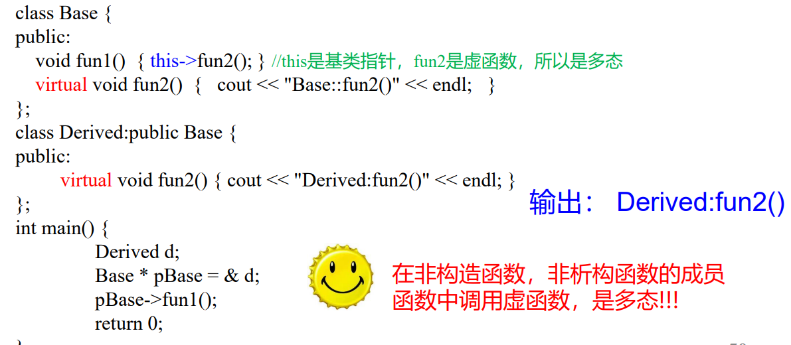

如果在构造、析构函数中调用虚函数，那么会怎么样呢？

如果这么做，那么编译器只会调用当前的虚函数，如果当前没有重写虚函数，则会从基类中找进行调用，为什么要这么做呢？其实这是为了防止未初始化就调用派生类的虚函数的情况。

你想想啊，一类的初始化先从基类的构造函数开始，如果这个时候构造函数具有多态性，那么此时将调用派生类的对应虚函数，但是派生类这个时候都还没有初始化。

例子：
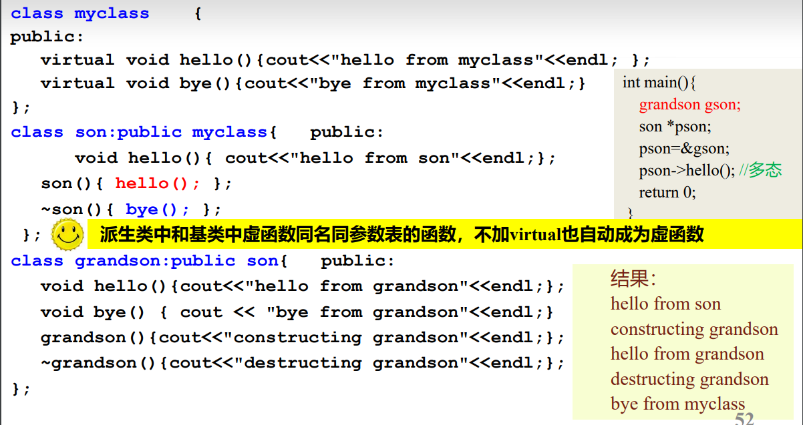`

- 补充：在上面的图例子中，派生类写了与基类虚函数相同的名字，但是没有在前面加修饰符virtual，这种情况编译器认为是虚函数。

### 多态的作用

在面向对象的程序设计中使用多态，能够增强程序的可扩充性，即程序需要修改或增加功能的时候，需要改动和增加的代码较少。

### 虚函数的访问权限

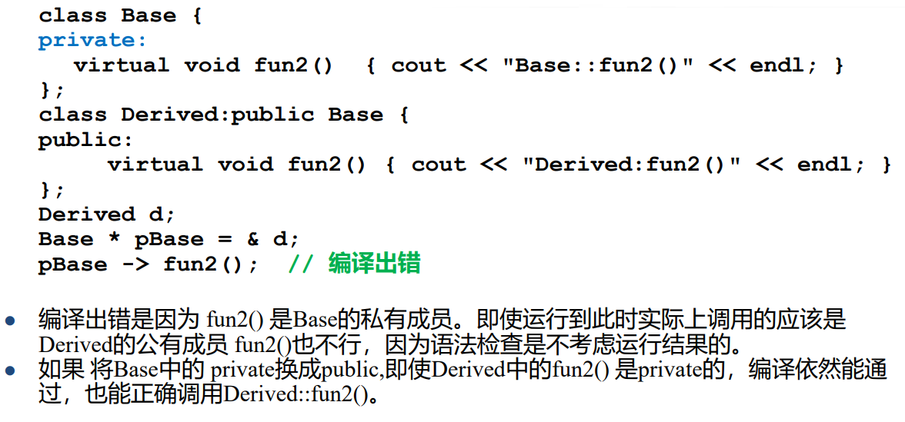

### 动态联编的实现机制

“多态”的关键在于通过基类指针或引用调用一个虚函数时，编译时不确定到底调用的是基类还是派生类的函数，运行时才确定 ---- 这叫“动态联编”。

每一个有虚函数的类（或有虚函数的类的派生类）都有一个虚函数表，该类的任何对象中都放着虚函数表的指针。虚函数表中列出了该类的虚函数地址。多出来的4个字节就是用来放虚函数表的地址的。
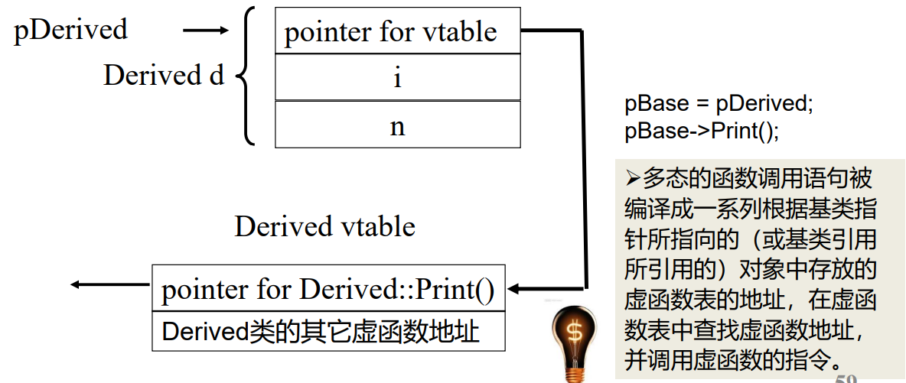

下面一段代码将验证，对象的首地址是存了虚函数表的地址的：

```cpp
    #include <iostream>
    using namespace std;
    class A {
    public: virtual void Func() { cout << "A::Func" << endl; }
    };
    class B:public A {
    public: virtual void Func() { cout << "B::Func" << endl; }
    };
    int main() {
    A a;
    A * pa = new B();
    pa->Func();
    //64位程序指针为8字节
    long long * p1 = (long long * ) & a;
    long long * p2 = (long long * ) pa;
    * p2 = * p1;
    pa->Func();
    return 0;
    }
```

### 纯虚函数和抽象类

- 纯虚函数：没有函数体的虚函数
- 抽象类：有纯虚函数的类

注意：

- 包含纯虚函数的类叫抽象类
  - 抽象类只能作为基类来派生新类使用，不能创建独立的抽象类的对象
  - 抽象类的指针和引用可以指向由抽象类派生出来的类的对象

```cpp
    A a ; // 错，A 是抽象类，不能创建对象
    A * pa ; // ok,可以定义抽象类的指针和引用
    pa = new A ; //错误, A 是抽象类，不能创建对象
```

- **在抽象类的成员函数内可以调用纯虚函数，但是在构造函数或析构函数内部不能调用纯虚函数。**
- 如果一个类从抽象类派生而来，那么当且仅当它实现了基类中的所有纯虚函数，它才能成为非抽象类。

{}