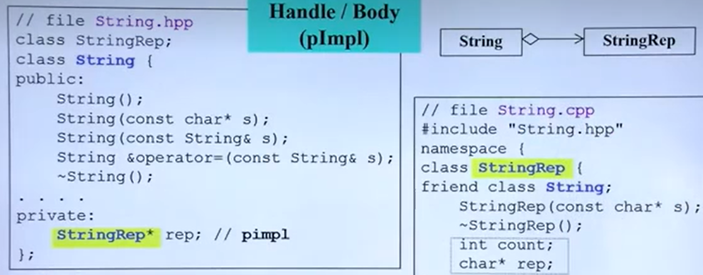
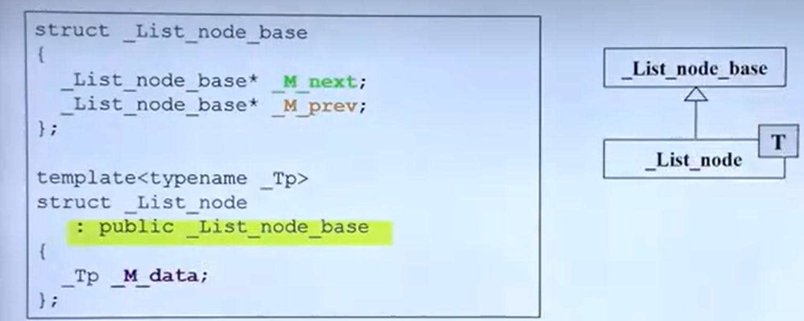
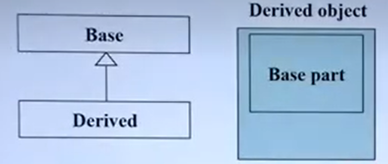

# 2.组合与继承

## 类与类的三种关系

### Composition-复合

以我个人的理解，复合就是一个类中包含有另外一个类，使用到另一个类的内容。复合的类他们的构造和析构函数运行次序是，构造函数有内到外依次运行，析构函数则相反。可以使用下图表示这种关系

### delegation-委托

当一个类欲用一个指针指向另一个类，以达到想使用时就指向这个类的这种关系就叫delegation，假设我要实现一个计算，此时指针指向这个函数，让函数去做这个计算。这有些类似于复合，但是这里重点在于指针的使用。在写一些功能的时候也建议使用这种关系的特性，因为这样就将两者隔开，起到一定的保护作用。参考下图：

### Inheritance-继承

在C++有三种继承方式，其中public是常用的一种，继承表示从一个类中集成某些属性成为 **另外一种** 类。

Inheritance关系的两个类它们的构造函数与析构函数执行次序与之前描述复合时一样。如下图是这种关系的表示方法：

- 构造函数（constructor）：由内到外，代码表示为`SunFunction::SunFunction(…):base(){…};`
- 析构函数（destructor）：由外到内，代码表示为`SunFunction::SunFunction(…){……~base();};`

值得注意的是，如果一个类将来可能是父类，那么需要在析构函数前加**virtual**关键字，否则会报错`undefine behavior`。

## 设计模式

**参考书籍：***Design PatternsExplained Simply*

{}