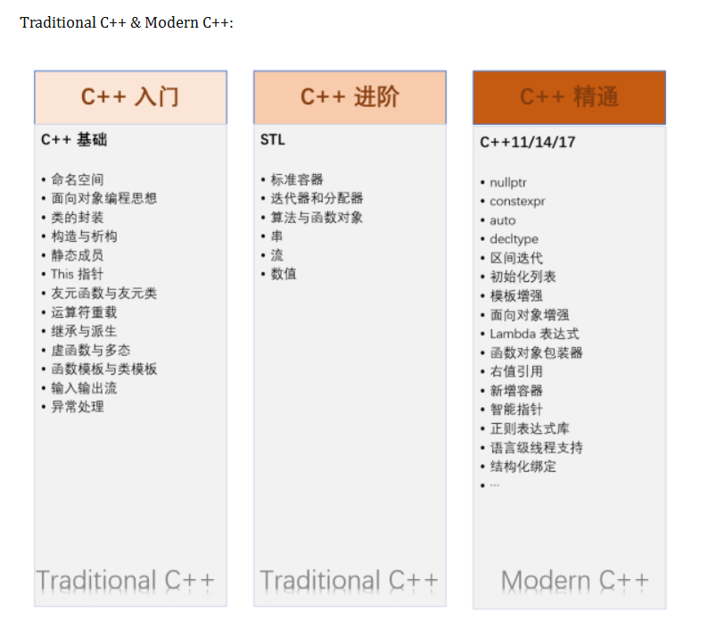
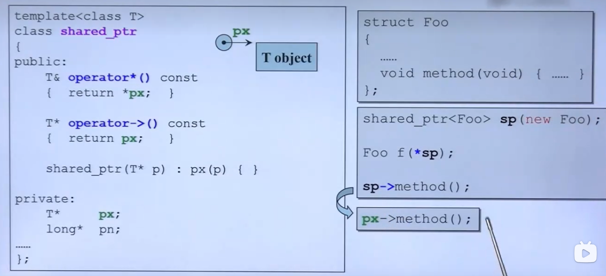
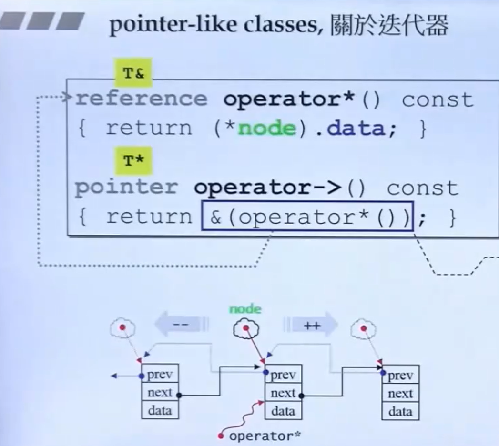
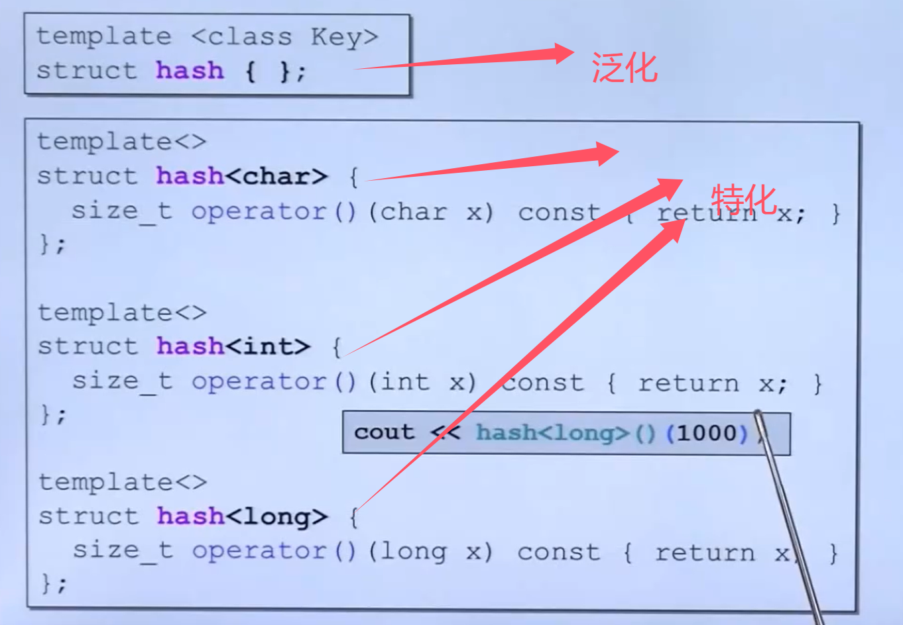
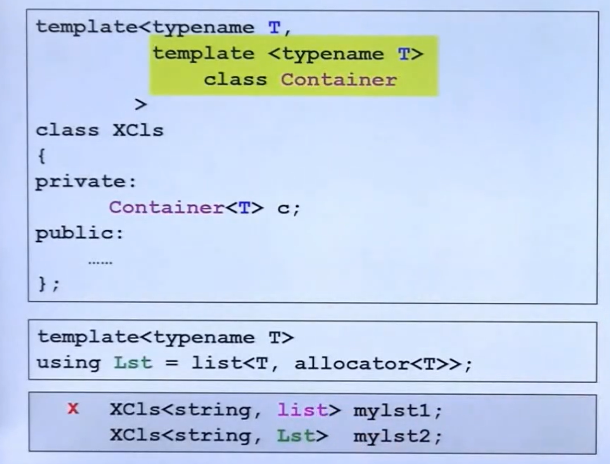

# 3.导读

## 书籍推荐

- 《C++ Premier》
- 《C++ Programming Language》
- 《Effective Modern C++》
- 《Efficient C++》
- 《The C++ standard library》
- 《STL C++》
- 《STL源码剖析》
- 《算法+数据结构=程序》
- ["网站CPLusPlus"](CPLusPlus.com)
- ["网站CppReference"](CppReference.com)
- ["网站gcc.gnu"](gcc.gnu.org)

## 学习路线



- [慕课C++学习](https://www.icourse163.org/learn/PKU-1002029030?tid=1473325453#/learn/content)
- [练习网站](cxsjsxmooc.openjudge.cn)

## conversion function-转换函数

接下来以一个分数的代码例子说明转换函数。

情况1：让值转为其他类型

```cpp
    class Fraction
    {
    private:
        int m_num, m_den;
    public:
        Fraction(int num, int den = 1)
        : m_num(num),m_den(den){}
        opertaor double() const {
            return (double)(m_num/m_den);
        }
    };

    //使用示例：
    Fraction f(2,5);
    double d = 4+f;
```
在上述的示例中，`d = 4+f;`程序会先判断有没有写`opertaor +`，如果没有会试着将f通过`opertaor double()`转为double类型。

情况2：**non-explicit-one-argument-ctor**，不带explicit的一个参数的构造函数，将其他类型转为预所写类的类型

```cpp
    class Fraction
    {
    private:
        int m_num, m_den;
    public:
        Fraction(int num, int den = 1)
        : m_num(num),m_den(den){}
        opertaor double() const {
            return (double)(m_num/m_den);
        }
    };

    //使用示例：
    Fraction f1(2,5);
    Fraction f2 = 4+f1;
```
同样在这个地方会先将4转为Fraction，然后在进行相加，转换函数使用的是构造函数，构造函数默认第二个参数是1，也就一个参数时也可用，但这个意思并不是说f1(2)你不写第二个参数。

虽然向上面的情况可行，但是当你把两个情况结合在一起时，就会报错，例如你如下写：

```cpp
    class Fraction
    {
    private:
    int m_num, m_den;
    public:
        Fraction(int num, int den = 1)
        : m_num(num),m_den(den){}
        opertaor double() const {
            return (double)(m_num/m_den);
        }
        Fraction operator + (const Fraction& f){
            return Fraction(……);
        }
    };
```

情况3：**explicit-one-argument-ctor**，带explicit的一个参数的构造函数
这个时候再使用刚才的例子，程序就会报错，因为此时是两种情况的结合，意味着两种情况都可以实现，编译器此时就不知道该使用哪个方法，为了解决这个问题，你可以使用关键字explicit来约束构造函数，让其他类型如法转为所写类，这个时候编译器会报错说无法将double类型转为Fraction。如下：
```cpp
    class Fraction
    {
    private:
        int m_num, m_den;
    public:
        explicit Fraction(int num, int den = 1)
        : m_num(num),m_den(den){}
        opertaor double() const {
            return (double)(m_num/m_den);
        }
        Fraction operator + (const Fraction& f){
            return Fraction(……);
        }
    };
    //示例
    Fraction f1(2,5);
    Fraction f2 = 4+f1;
```

## 编写的类大两个大方向

### 智能指针




### 伪函数

这样的类会像函数一样接收参数，返回某一类型的值通常会看到类中重载`operate() (……){……}`函数。

## 特化



## 偏特化--对应泛化

- 个数上的偏

以我的理解就是假设原先设计的模版为

```cpp
    template <typename a, typename b……>
    class A
    {……}
```
现在我使用偏特化，写为

```cpp
    template <typename b>
    class A<bool, typename b……>
    {……}
```

也就是第一个参数已经确定是bool类型了。（大概先这么理解吧:smile: :smile: :smile:）

- 范围上的偏特化

一般我们的类模版你可以任意指定类型，但是现在我想写一个用指针指向的类模板，那么他就被限制在一定的范围内了

```cpp
    template <typename a>
    class A
    {……}
    //范围偏特化
    template <typename a>
    class A<typename* a>
    {……}
```

## 模板模板类

假设我要创建一个容器，并指定这个容器内容的类型，这个时候可以使用模版模版类，详细看下图：


{}