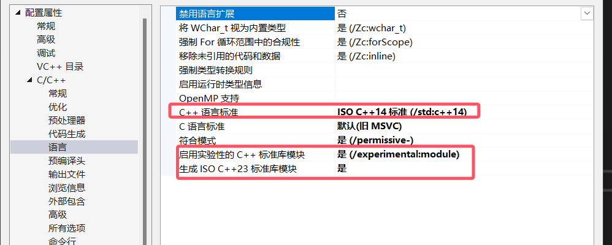
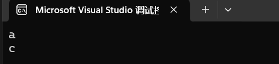

# 4.C&#43;&#43;2.0特性的使用

## VS 2022的设置

首先你可以先用下面的代码测试使用可以执行：

```cpp
    #include <iostream>
    void printTypes() {
    }
    template <typename T, typename... U>
    void printTypes(const T& t, const U&... u) {
        std::cout << t << std::endl;
        printTypes(u...);
    }

    int main() {
        printTypes('a', 1.5, 'b');
    }
```

如果报错了，如typename...未定义，那么请你按照如下步骤操作，


- C++语言标准选择`预览 - 最新 C++ 工作草案中的功能 (/std:c++latest)`
- 启用实验性C++标准库模块--`是`
- 生成ISO C++23标准库模块 -- `是`

## const补充

| |const 参数|non-const 参数|
|--|--|--|
|const 函数|可执行|可执行|
|non-const 函数|报错|可执行|

使用const需要注意两个问题，参数是否需要修改，参数进入函数内后数据是都会修改。解决这两个问题，在需要的地方加上const

还有一种情况，

```cpp
    template<typename T>
    class foo {
    public:
        T fooTo(T str) const { return str; };
        T fooTo(T str)  {return str;};
    };

    int main() {
        foo < char > f;
        const char x = 'a';
        char y = 'c';
        std::cout <<  f.fooTo(x) << std::endl;
        std::cout <<  f.fooTo(y) << std::endl;
    }
```

运行结果如下:

在这个例子中，带const的参数只会执行带const的函数，而不带const的参数会只会执行不带const的函数，这就是带const和不带const函数出现时的情况。
但是这个结果我并不是很满意，应为我试着在不带const函数内部修改传入的参数，代码执行时将不会以我上面说的结论出现。或许还需要在研究研究……


{}