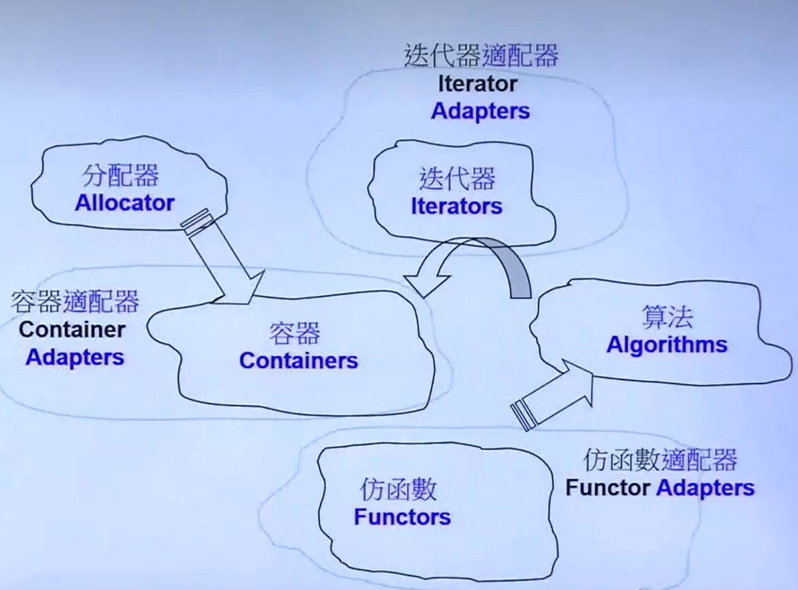
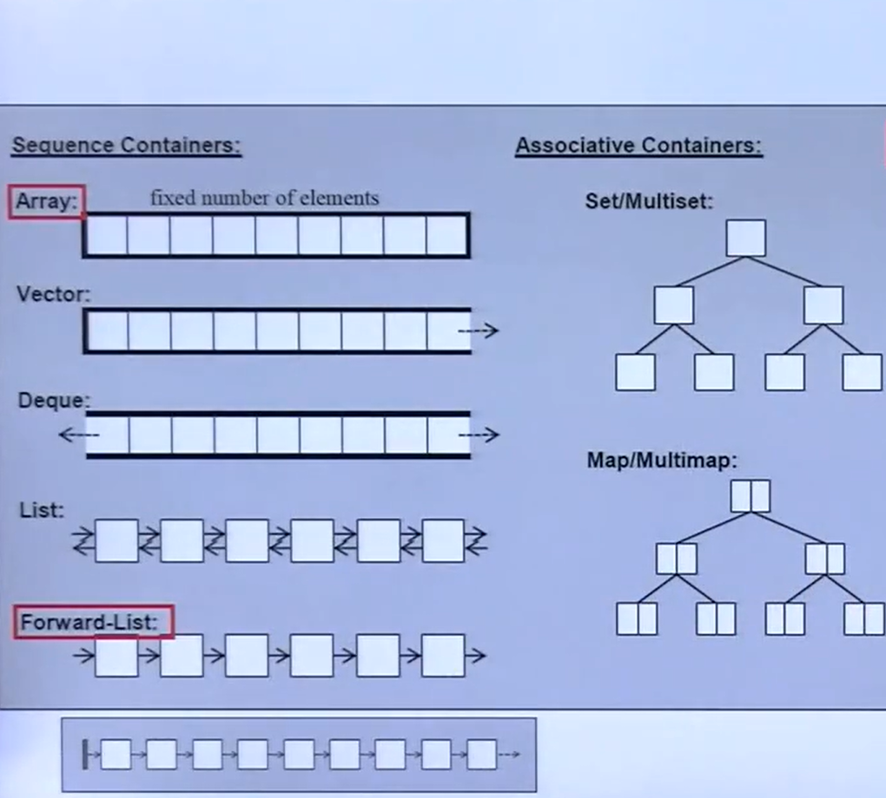
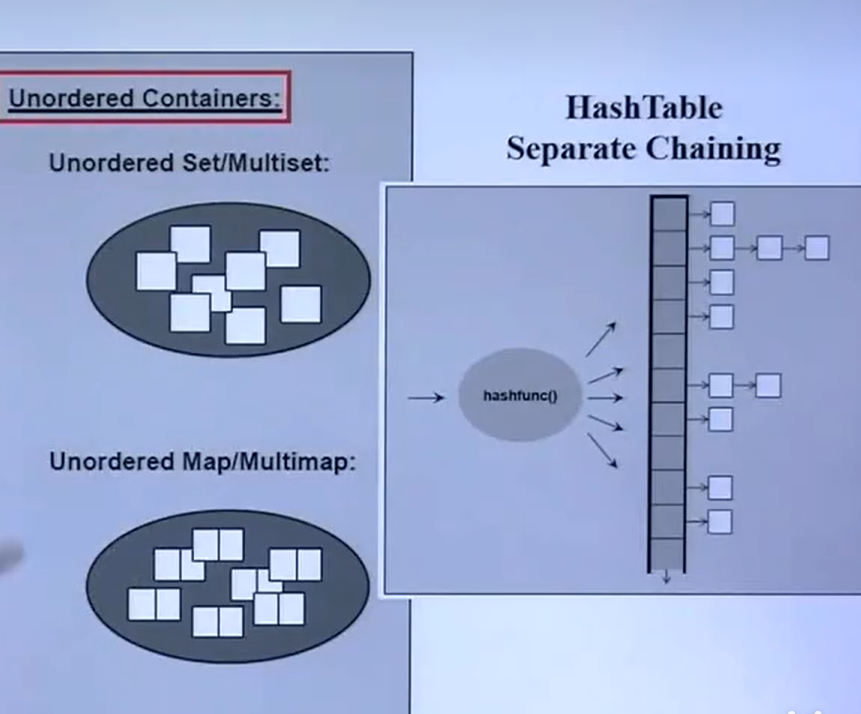
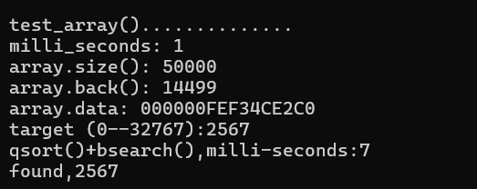
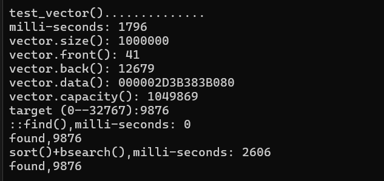
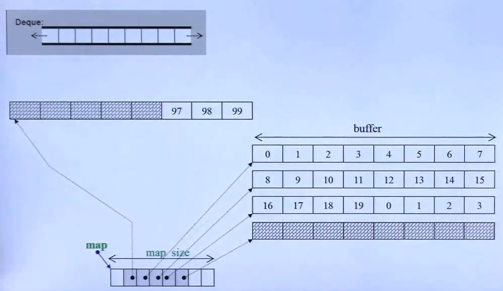
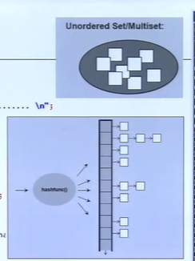

# 5.STL库之观其大略

## 一下主要讲STL组件的测试用例，特别是容器的测试

## 学习资料

- CPLusPlus.com
- CppReference.com
- gcc.gnu.org
- 《STL源码剖析》

## STL六大组件

- 容器-Containers，申请内存用于存储数据
- 分配器-Allocators，配合容器分配内存
- 算法- Algorithms，处理某一数据的最优办法
- 迭代器-  Iterators，指针的泛型，本质与指针类似
- 适配器- Adapters，
- 仿函数-Functors，类似函数。

六者的关系



## begin()和end()

以迭代器为例，begin()指向迭代器的首地址，而end()指向迭代器尾地址的下一位，可以用前闭后开区间来表示，即**[ )**

## 容器的分类




## 数组容器的使用

### array 的使用

{}
{}

```cpp
        #ifndef __AUXFUN__
        #define __AUXFUN__
        #include <iostream>
        #include <string>
        #define RAMD_MAX 32767
        using namespace std;
        long get_a_target_long()
        {
            long target = 0;
            cout << "target (0--" << RAMD_MAX << "):";
            cin >> target;
            return target;
        }

        //将数值转为string，这样可以测试类似object的情况
        string get_a_target_string()
        {
            long target = 0;
            char buf[10];

            cout << "target (0--" << RAMD_MAX << "):";
            cin >> target;
            snprintf(buf, 10, "%d", target);

            return string(buf);
        }
        int compareLongs(const void* a, const void* b)
        {
            return (*(long*)a - *(long*)b);
            /*
            1.类型转换：因为参数是const void* 类型，你需要将它们转换为具体的数据类型指针（在这个例子中是long* ），以便可以解引用并获取它们的值。

            2.解引用：在转换之后，通过在类型转换的结果前使用* 操作符来获取指针指向的实际值。

            3.强制转换的结果：* (long*)a实际上是一个long值，它是通过解引用转换后的指针得到的。*/
        }
        int compareString(const void* a, const void* b)
        {
            if (*(long*)a > *(long*)b)
                return 1;
            else if (*(long*)a < *(long*)b)
                return -1;
            else
                return 0;
        }
        #endif // !__ENTRY__
```
{}
{}
```cpp
    #include "TestHeardFiles/AuxFun.h"
    #include <ctime>
    #include <cstdlib>//qsort()、 bsearch()、 NULL
    #include <array>

    const size_t ASIZE = 50000;

    namespace t01
    {
        void test_array()
        {
            cout << "\ntest_array().............. \n";
            array<long, ASIZE> c;//使用数组容器

            clock_t timeStart = clock();
            for (long i = 0; i < ASIZE; ++i)
            {
                c[i] = rand();//可以产生随机数的函数
            }
            cout << "milli_seconds: " << (clock() - timeStart) << endl;
            cout << "array.size(): " << c.size() << endl;//返回数组大小
            cout << "array.back(): " << c.back() << endl;//返回数组最后一个数
            cout << "array.data: " << c.data() << endl;//返回第一个数的地址

            long target = get_a_target_long();
            timeStart = clock();//clock()返回毫秒数
            qsort(c.data(), ASIZE, sizeof(long), compareLongs);//数组排序
            long* pItem = (long*)bsearch(&target, (c.data()), ASIZE, sizeof(long), compareLongs);//数组查找
            cout << "qsort()+bsearch(),milli-seconds:" << clock() - timeStart << endl;
            if (pItem != NULL)
            {
                cout << "found," << *pItem << endl;
            }
            else
                cout << "Not found!" << endl;
        }
    }
    int main() {
        t01::test_array();
    }
```
{}

{}

{}
{}

### vector 的使用

vector是一种向后自动以2次方增加的内存的容器，一般使用push_back向后添加数据；

vector也有一定的缺点，假设我只需要5个内存空间，但是vector分配的是8个，剩下的3个后面如果不使用就会浪费。

{}
{}
```cpp
    #include <vector>
    #include <stdexcept> //obort()
    #include <cstdio>	//snprintf()
    #include <algorithm>//sort()
    namespace t02
    {
        void test_vector(long& value) {
            cout << "\ntest_vector()..............\n";
            vector<string> c;
            char buf[10];
            clock_t timeStart = clock();
            for (long i = 0; i < value; ++i)
            {
                try
                {
                    snprintf(buf, 10, "%d", rand());
                    c.push_back(string(buf));//将随机数转为string类型，并使用push_back()将数据存入容器尾部，这是vector的特性
                    //同时值得注意，当空间不足时，内存会自动增加，怎么加方式是2的平方
                }
                catch (exception& p)
                {
                    cout << "i=" << i << " " << p.what() << endl;
                    abort();//发生异常使用该函数退出程序
                }
            }
            cout << "milli-seconds: " << (clock() - timeStart) << endl;
            cout << "vector.size(): " << c.size() << endl;
            cout << "vector.front(): " << c.front() << endl;
            cout << "vector.back(): " << c.back() << endl;
            cout << "vector.data(): " << c.data() << endl;
            cout << "vector.capacity(): " << c.capacity() << endl;//返回的是向量当前分配的存储空间可以容纳的元素个数
            string target = get_a_target_string();//获取输入的数字，并转为string类型返回
            //使用算法find查找
            {
                timeStart = clock();
                auto pItem = ::find(c.begin(), c.end(), target);//返回类型是：使用全局::find()寻找目标，这是循环寻找
                cout << "::find(),milli-seconds: " << (clock() - timeStart) << endl;

                //判断有没有找到
                if (pItem != c.end()) {
                    cout << "found," << *pItem << endl;
                }
                else
                {
                    cout << "Not fount!" << endl;
                }
            }
            //进行排序后使用bsearch查找。
            {
                timeStart = clock();
                sort(c.begin(), c.end());//该算法将任何类型进行排序，需要提供相应的比较函数
                string* pItem = (string*)bsearch(&target, (c.data()), c.size(), sizeof(string), compareString);
                cout << "sort()+bsearch(),milli-seconds: " << (clock() - timeStart) << endl;
                if (pItem != NULL) {
                    cout << "found," << *pItem << endl;
                }
                else
                {
                    cout << "Not fount!" << endl;
                }
            }
        }
    }
```
{}
{}

{}
{}

从上面的结果来看，排序后使用二分查找反而比循环查找慢，原因在于排序话费了很多时间，因为string类型是一个object，其本身大小比较大，所以面对一个object进行查找时不建议使用排序后二分查找。

在实际应用中，选择排序加二分查找还是直接线性查找，需要根据具体情况来决定：

- 如果容器已经排序，或者数据量不大，直接使用二分查找可能更简单、更快。
- 如果容器未排序，且数据量很大，那么可能需要考虑是否值得为了一次查找而进行排序，或者是否可以通过其他方式（如使用更高效的数据结构，如哈希表）来提高查找效率。
- 如果查找操作非常频繁，而插入和删除操作不频繁，那么维护一个已排序的容器可能是合理的，这样每次查找都可以利用二分查找的效率。

总之，选择哪种方法取决于具体的应用场景和性能要求。在某些情况下，可能需要通过实验或性能分析来确定最佳的策略。

### 链表容器-list

std::list 是 C++ 标准库中的一个容器，它提供了双向链表的实现。

**std::list 容器的特点：**

- 双向链表结构：std::list 由一系列节点组成，每个节点包含一个元素和两个指针，分别指向前一个节点和后一个节点。
- 动态内存分配：std::list 中的每个节点都是独立分配内存的。这意味着当你添加或删除元素时，std::list 会为新元素分配内存，或释放不再使用的元素所占用的内存。
- 内存空间利用：由于 std::list 的元素是单独分配的，因此不存在像 std::vector 那样的连续内存块，也就不会有额外的内存浪费。每个元素恰好占用它所需的空间，加上一些指针存储开销。

**查询操作效率：**

- 查询效率较低：与 std::vector 或 std::array 这样的随机访问容器相比，std::list 的查询操作通常较慢。这是因为 std::list 没有提供快速的随机访问能力。
- 顺序访问：在 std::list 中，要访问一个特定位置的元素，你需要从头开始遍历，直到到达那个位置。这意味着访问时间与列表的大小成正比，最坏情况下的时间复杂度为 O(n)。
- 没有跳跃访问：与数组或 std::vector 不同，std::list 没有提供直接跳到任意位置的能力。在数组中，你可以通过简单的指针算术来访问任意位置的元素，而在 std::list 中，你必须遍历链表。

**测试代码：**
{}
{}
```cpp
    #include <list>
    namespace t03
    {
        void test_list(long& value)
        {
            cout << "\ntest_list()..............\n";
            list<string> c;
            char buf[10];
            clock_t timeStart = clock();
            for (long i = 0; i < value; ++i)
            {
                try
                {
                    snprintf(buf, 10, "%d", rand());
                    c.push_back(string(buf));//将随机数转为string类型，并使用push_back()将数据存入容器尾部，这是vector的特性
                    //同时值得注意，当空间不足时，内存会自动增加，怎么加方式是2的平方
                }
                catch (exception& p)
                {
                    cout << "i=" << i << " " << p.what() << endl;
                    abort();//发生异常使用该函数退出程序
                }
            }
            cout << "milli-seconds: " << (clock() - timeStart) << endl;
            cout << "list.size(): " << c.size() << endl;
            cout << "list.max_size(): " << c.max_size() << endl;
            cout << "list.front(): " << c.front() << endl;
            cout << "list.back(): " << c.back() << endl;

            string target = get_a_target_string();//获取输入的数字，并转为string类型返回
            //使用算法find查找
            {
                timeStart = clock();
                auto pItem = ::find(c.begin(), c.end(), target);//返回类型是：使用全局::find()寻找目标，这是循环寻找
                cout << "::find(),milli-seconds: " << (clock() - timeStart) << endl;

                //判断有没有找到
                if (pItem != c.end()) {
                    cout << "found," << *pItem << endl;
                }
                else
                {
                    cout << "Not fount!" << endl;
                }
            }
            //测试排序花费的时间
            {
                timeStart = clock();
                c.sort();//使用list自带的排序函数，当然也可以用全局的sort，一般如果容器自带，则选择自带的。
                cout << "list.sort(),milli-seconds: " << (clock() - timeStart) << endl;
            }
        }
    }
```
{}
{}
```C
    How much memory space you need: 1000000

    test_list()..............
    milli-seconds: 1073
    list.size(): 1000000
    list.max_size(): 329406144173384850
    list.front(): 41
    list.back(): 12679
    target (0--32767):12345
    ::find(),milli-seconds: 4
    found,12345
    list.sort(),milli-seconds: 1611
```
{}
{}

**总结：**
std::list 的优点在于它的灵活性和高效的插入/删除操作，这些操作可以在 O(1) 时间内完成，因为它们只需要修改几个指针。然而，这种灵活性的代价是牺牲了快速随机访问的能力。因此，如果你的应用场景中需要频繁地在序列中间插入或删除元素，而不太关心随机访问性能，std::list 是一个很好的选择。反之，如果随机访问是一个关键操作，那么可能需要考虑使用其他类型的容器。

### 链表容器-forward_list

std::forward_list 是 C++ 标准库中的一个容器，它提供了单向链表的实现。

**std::forward_list 容器的特点：**

- 单向链表结构：std::forward_list 由一系列节点组成，每个节点包含一个元素和一个指向下一个节点的指针。
- 内存分配：与 std::list 类似，std::forward_list 的元素也是动态分配内存的。但是，由于它是单向链表，所以只能从链表的前端（头部）开始进行内存分配。
- 操作限制：由于 std::forward_list 的单向特性，它只提供了 push_front() 和 pop_front() 操作来在链表的前端添加或删除元素。不支持快速的随机访问，也不支持在链表的中间或末尾进行插入和删除操作。

**内存使用效率：**

- 无尾插法：std::forward_list 没有 push_back() 方法，只能使用 push_front() 在链表的头部插入元素。这意味着，如果你需要在链表的末尾添加元素，你将不得不遍历整个链表以到达末尾，这在大型数据集中可能效率较低。
- 节省空间：与 std::list 相比，std::forward_list 每个节点只需要存储一个指向下一个节点的指针，因此它的内存开销比 std::list 小。

**适用场景：**

- 空间敏感的应用：如果你的应用对内存使用非常敏感，且需要从链表的前端进行频繁的插入和删除操作，std::forward_list 是一个不错的选择。
- 单向遍历：如果你的应用只需要从链表的前端开始遍历元素，那么 std::forward_list 可以提供良好的性能。

**测试代码**

{}
{}
```cpp
    #include <forward_list>
    namespace t04
    {
        void test_forward_list(long& value)
        {
            cout << "\nforward_list()..............\n";
            forward_list<string> c;
            char buf[10];
            clock_t timeStart = clock();
            for (long i = 0; i < value; ++i)
            {
                try
                {
                    snprintf(buf, 10, "%d", rand());
                    c.push_front(string(buf));//将随机数转为string类型，并使用push_frond()将数据存入容器头部，forward_list没有push_back()
                }
                catch (exception& p)
                {
                    cout << "i=" << i << " " << p.what() << endl;
                    abort();//发生异常使用该函数退出程序
                }
            }
            cout << "milli-seconds: " << (clock() - timeStart) << endl;
            cout << "forward_list.max_size(): " << c.max_size() << endl;
            cout << "forward_list.front(): " << c.front() << endl;
            //cout << "forward_list.back(): " << c.back() << endl;	没有该函数
            //cout << "forward_list.size(): " << c.size() << endl;	没有该函数

            string target = get_a_target_string();//获取输入的数字，并转为string类型返回
            //使用算法find查找
            {
                timeStart = clock();
                auto pItem = ::find(c.begin(), c.end(), target);//返回类型是：使用全局::find()寻找目标，这是循环寻找
                cout << "::find(),milli-seconds: " << (clock() - timeStart) << endl;

                //判断有没有找到
                if (pItem != c.end()) {
                    cout << "found," << *pItem << endl;
                }
                else
                {
                    cout << "Not fount!" << endl;
                }
            }
            //测试排序花费的时间
            {
                timeStart = clock();
                c.sort();//使用forward_list自带的排序函数，当然也可以用全局的sort，一般如果容器自带，则选择自带的。
                cout << "forward_list.sort(),milli-seconds: " << (clock() - timeStart) << endl;
            }
        }
    }
```
{}
{}
```c
    How much memory space you need: 1000000

    forward_list()..............
    milli-seconds: 965
    forward_list.max_size(): 384307168202282325
    forward_list.front(): 12679
    target (0--32767):12345
    ::find(),milli-seconds: 3
    found,12345
    forward_list.sort(),milli-seconds: 1595
```
{}
{}

值得注意的是：
std::forward_list 专为高效的前端插入和删除操作设计，std::forward_list 没有 push_back() 是因为它是单向链表，
只能高效地从前面操作。它没有 size() 函数，因为计算链表长度需要遍历整个链表，这与它优化前端操作的设计目标不符。

**总结：**

std::forward_list 是一个轻量级的容器，它在内存使用上比 std::list 更为高效，但在功能上也更为有限。它适合于那些只需要单向遍历和操作的场景。由于其单向链表的特性，std::forward_list 在进行元素插入和删除时，只能从链表的前端进行，这限制了它的使用场景。在选择 std::forward_list 时，需要根据应用的具体需求来权衡其优势和局限性。

### 链表容器-slist

slist容器与forward_list容器一样，只是slis容器存在于ext\slist头文件中。

**测试代码：**

{}
{}
```cpp
    #include <forward_list>
    namespace t04
    {
        void test_forward_list(long& value)
        {
            cout << "\nforward_list()..............\n";
            forward_list<string> c;
            char buf[10];
            clock_t timeStart = clock();
            for (long i = 0; i < value; ++i)
            {
                try
                {
                    snprintf(buf, 10, "%d", rand());
                    c.push_front(string(buf));//将随机数转为string类型，并使用push_frond()将数据存入容器头部，forward_list没有push_back()
                }
                catch (exception& p)
                {
                    cout << "i=" << i << " " << p.what() << endl;
                    abort();//发生异常使用该函数退出程序
                }
            }
            cout << "milli-seconds: " << (clock() - timeStart) << endl;
            cout << "forward_list.max_size(): " << c.max_size() << endl;
            cout << "forward_list.front(): " << c.front() << endl;
            //cout << "forward_list.back(): " << c.back() << endl;	没有该函数
            //cout << "forward_list.size(): " << c.size() << endl;	没有该函数

            string target = get_a_target_string();//获取输入的数字，并转为string类型返回
            //使用算法find查找
            {
                timeStart = clock();
                auto pItem = ::find(c.begin(), c.end(), target);//返回类型是：使用全局::find()寻找目标，这是循环寻找
                cout << "::find(),milli-seconds: " << (clock() - timeStart) << endl;

                //判断有没有找到
                if (pItem != c.end()) {
                    cout << "found," << *pItem << endl;
                }
                else
                {
                    cout << "Not fount!" << endl;
                }
            }
            //测试排序花费的时间
            {
                timeStart = clock();
                c.sort();//使用forward_list自带的排序函数，当然也可以用全局的sort，一般如果容器自带，则选择自带的。
                cout << "forward_list.sort(),milli-seconds: " << (clock() - timeStart) << endl;
            }
        }
    }
```
{}
{}
```c
    How much memory space you need: 1000000

    forward_list()..............
    milli-seconds: 965
    forward_list.max_size(): 384307168202282325
    forward_list.front(): 12679
    target (0--32767):12345
    ::find(),milli-seconds: 3
    found,12345
    forward_list.sort(),milli-seconds: 1595
```
{}
{}

## 双向容器-deque



std::deque（双端队列）是一种容器，它允许在序列的前端和后端快速插入和删除元素。尽管从概念图上看，
std::deque 似乎是一个连续的存储空间，但实际上它并不是连续的。std::deque 的实现通常是由一个或多个固定大小的连续内存块
（通常称为“节点”或“块”）组成的，这些块通过指针连接在一起。

以下是对您提供内容的整理：

- 存储机制：std::deque 由多个指针组成，每个指针指向一个具有一定容量的连续内存块。这些内存块被组织在一起，形成一个能够从两端快速增长的容器。
- 内存管理：当 std::deque 中的一个内存块满了，需要更多的空间时，它会“自动跳转”到下一个空闲的内存块的开始位置。如果所有现有的内存块都已满，std::deque 会分配一个新的内存块，并更新指针以指向这个新的块。
- 内存效率：使用固定容量的内存块可以减少内存浪费。例如，如果每个内存块的大小为8个元素，那么即使只存储一个元素，也只会浪费7个元素的空间（因为第一个块始终被使用）。这与 std::vector 相比，后者可能会因为频繁的内存重新分配而导致更多的内存浪费。
- 动态增长：当 std::deque 需要更多内存时，它会动态地增加新的内存块。这种设计使得 std::deque 能够在不牺牲太多内存的情况下，提供快速的插入和删除操作。
- 连续性：尽管 std::deque 在内部不是完全连续的，但它提供了随机访问的能力，这意味着你可以像访问 std::vector 或数组一样，通过索引来访问 std::deque 中的任何元素。

总的来说，std::deque 是一个灵活且高效的容器，适用于需要在序列的两端进行频繁插入和删除操作的场景。它的设计既考虑了性能，
也考虑了内存使用效率。

**测试代码：**

{}
{}
```cpp
    #include <deque>
    namespace t05
    {
        void test_deque(long& value)
        {
            cout << "\ntest_deque()..............\n";
            deque<string> c;
            char buf[10];
            clock_t timeStart = clock();
            for (long i = 0; i < value; ++i)
            {
                try
                {
                    snprintf(buf, 10, "%d", rand());
                    c.push_back(string(buf));//将随机数转为string类型，并使用push_back()将数据存入容器尾部
                }
                catch (exception& p)
                {
                    cout << "i=" << i << " " << p.what() << endl;
                    abort();//发生异常使用该函数退出程序
                }
            }
            cout << "milli-seconds: " << (clock() - timeStart) << endl;
            cout << "deque.max_size(): " << c.max_size() << endl;
            cout << "deque.front(): " << c.front() << endl;
            cout << "deque.back(): " << c.back() << endl;
            cout << "deque.size(): " << c.size() << endl;

            string target = get_a_target_string();//获取输入的数字，并转为string类型返回
            //使用算法find查找
            {
                timeStart = clock();
                auto pItem = ::find(c.begin(), c.end(), target);//返回类型是：使用全局::find()寻找目标，这是循环寻找
                cout << "::find(),milli-seconds: " << (clock() - timeStart) << endl;

                //判断有没有找到
                if (pItem != c.end()) {
                    cout << "found," << *pItem << endl;
                }
                else
                {
                    cout << "Not fount!" << endl;
                }
            }
            //测试排序花费的时间
            {
                timeStart = clock();
                sort(c.begin(), c.end());//使用全局的sort,deque没有自己的sort。
                cout << "deque.sort(),milli-seconds: " << (clock() - timeStart) << endl;
            }
        }
    }
```
{}
{}
```c
    How much memory space you need: 1000000

    test_deque()..............
    milli-seconds: 1055
    deque.max_size(): 461168601842738790
    deque.front(): 41
    deque.back(): 12679
    deque.size(): 1000000
    target (0--32767):12345
    ::find(),milli-seconds: 4
    found,12345
    deque.sort(),milli-seconds: 3838
```
{}
{}

## 特殊容器-stack和queue

### std::stack（栈）

**定义：**

std::stack 是一个遵循后进先出（LIFO，Last In First Out）原则的容器适配器。它只能在序列的一端（栈顶）进行添加（push）和移除（pop）操作。

**主要操作：**

- push()：在栈顶添加一个元素。
- pop()：移除栈顶元素。
- top()：返回栈顶元素的引用，不移除它。

**特点：**

- 只能单端操作，即只能在栈顶进行操作。
- 没有提供直接的迭代器支持，但提供了 top() 方法来访问栈顶元素。

### std::queue（队列）

**定义：**

std::queue 是一个遵循先进先出（FIFO，First In First Out）原则的容器适配器。它只能在序列的一端（队尾）进行添加（push）操作，在另一端（队首）进行移除（pop）操作。

**主要操作：**

- push()：在队尾添加一个元素。
- pop()：移除队首元素。
- front()：返回队首元素的引用，不移除它。
- back()：返回队尾元素的引用，不移除它。

**特点：**

- 双端操作，即在队首进行移除操作，在队尾进行添加操作。
- 提供了迭代器支持，允许遍历队列中的所有元素。

**与 std::deque 的不同.**

- 操作限制：std::stack 和 std::queue 限制了操作的位置，而 std::deque 允许在两端自由操作。
- 迭代器支持：std::stack 不支持迭代器，std::queue 支持迭代器但只能访问队列中的元素，而 std::deque 提供了随机访问迭代器，可以高效地访问序列中的任何位置。
- 使用场景：如果你需要一个简单的后进先出或先进先出的数据结构，std::stack 或 std::queue 可能更适合。如果你需要一个能够在两端快速操作且支持随机访问的容器，std::deque 是更好的选择。

**测试代码：**

{}
{}
```cpp
    #include <stack>
    namespace t06
    {
        void test_stack(long& value)
        {
            cout << "\ntest_stack()..............\n";
            stack <string> c;//stack又叫栈，特点是先进后出
            char buf[10];
            clock_t timeStart = clock();
            for (long i = 0; i < value; ++i)
            {
                try
                {
                    snprintf(buf, 10, "%d", rand());
                    c.push(string(buf));//将随机数转为string类型，并使用push()将数据压入容器
                }
                catch (exception& p)
                {
                    cout << "i=" << i << " " << p.what() << endl;
                    abort();//发生异常使用该函数退出程序
                }
            }
            cout << "milli-seconds: " << (clock() - timeStart) << endl;
            cout << "stack.size(): " << c.size() << endl;
            cout << "stack.top(): " << c.top() << endl;
            c.pop();
            cout << "stack.size(): " << c.size() << endl;
            cout << "stack.top(): " << c.top() << endl;

            //与前面的容器不同，stack不可以进行查找操作
        }
    }
```
{}
{}
```cpp
    #include <queue>
    namespace t07
    {
        void test_queue(long& value)
        {
            cout << "\ntest_queue()..............\n";
            queue <string> c;//queue又叫队列，特点是先进先出
            char buf[10];
            clock_t timeStart = clock();
            for (long i = 0; i < value; ++i)
            {
                try
                {
                    snprintf(buf, 10, "%d", rand());
                    c.push(string(buf));//将随机数转为string类型，并使用push()将数据压入容器
                }
                catch (exception& p)
                {
                    cout << "i=" << i << " " << p.what() << endl;
                    abort();//发生异常使用该函数退出程序
                }
            }
            cout << "milli-seconds: " << (clock() - timeStart) << endl;
            cout << "queue.size(): " << c.size() << endl;
            cout << "queue.front(): " << c.front() << endl;
            cout << "queue.back(): " << c.back() << endl;
            c.pop();
            cout << "queue.size(): " << c.size() << endl;
            cout << "queue.front(): " << c.front() << endl;
            cout << "queue.back(): " << c.back() << endl;

            //与前面的容器不同，queue也不提供查找操作
        }
    }
```
{}
{}
```c
    How much memory space you need: 1000000

    test_stack()..............
    milli-seconds: 1050
    stack.size(): 1000000
    stack.top(): 12679
    stack.size(): 999999
    stack.top(): 17172

    test_queue()..............
    milli-seconds: 1027
    queue.size(): 1000000
    queue.front(): 21384
    queue.back(): 1461
    queue.size(): 999999
    queue.front(): 10793
    queue.back(): 1461
```
{}
{}

## 红黑树-multiset容器

multiset容器结构类似二叉树，准确说是红黑树，这种结构的的查找会快很多，但是插入则会耗费一定时间，这些时间都花费在了排序上。

**测试代码：**

{}
{}
```cpp
    #include <set>
    namespace t08
    {
        void test_multiset(long& value)
        {
            cout << "\ntest_multiset()..............\n";
            multiset <string> c;//multiset结构式红黑树
            char buf[10];
            clock_t timeStart = clock();
            for (long i = 0; i < value; ++i)
            {
                try
                {
                    snprintf(buf, 10, "%d", rand());
                    c.insert(string(buf));//将随机数转为string类型，并使用insert()将数据存入容器
                }
                catch (exception& p)
                {
                    cout << "i=" << i << " " << p.what() << endl;
                    abort();//发生异常使用该函数退出程序
                }
            }
            cout << "milli-seconds: " << (clock() - timeStart) << endl;
            cout << "multiset.size(): " << c.size() << endl;
            cout << "multiset.max_size(): " << c.max_size() << endl;
            
            string target = get_a_target_string();
            {
                timeStart = clock();
                auto pItem = ::find(c.begin(), c.end(), target);//使用全局::fingd()查找
                cout << "::find(),milli-seconds: " << (clock() - timeStart) << endl;
                if (pItem != c.end()) {
                    cout << "found, " << *pItem << endl;
                }
                else
                {
                    cout << "not found!" << endl;
                }
            }
            {
                timeStart = clock();
                auto pItem = c.find(target);//使用multiset自身的fingd()查找
                cout << "c.find(),milli-seconds: " << (clock() - timeStart) << endl;
                if (pItem != c.end()) {
                    cout << "found, " << *pItem << endl;
                }
                else
                {
                    cout << "not found!" << endl;
                }
            }
        }
    }
```
{}
{}
```cpp
    #include <map>
    namespace t09
    {
        void test_multimap(long& value)
        {
            cout << "\ntest_multimap()..............\n";
            multimap <long,string> c;
            char buf[10];
            clock_t timeStart = clock();
            for (long i = 0; i < value; ++i)
            {
                try
                {
                    snprintf(buf, 10, "%d", rand());
                    c.insert(pair<long,string>(i,buf));//此处使用了pair设置键值对
                    //值得注意，multimap不可以用[]做insert，这一点可以结合map容器理解,
                    //另外key是不会重复的，因为接收的是0-1000000，而值可能会重复，因为值是通过随机数函数rand()产生，范围为0-32767
                }
                catch (exception& p)
                {
                    cout << "i=" << i << " " << p.what() << endl;
                    abort();//发生异常使用该函数退出程序
                }
            }
            cout << "milli-seconds: " << (clock() - timeStart) << endl;
            cout << "multimap.size(): " << c.size() << endl;
            cout << "multimap.max_size(): " << c.max_size() << endl;

            long target = get_a_target_long();
                timeStart = clock();
                auto pItem = c.find(target);
                cout << "c.find(),milli-seconds: " << (clock() - timeStart) << endl;
                if (pItem != c.end()) {
                    cout << "found, (" << (*pItem).first <<", " <<pItem->second<<")" << endl;
                }
                else
                {
                    cout << "not found!" << endl;
                }
            
        }
    }
```
{}
{}
```c
    How much memory space you need: 1000000

    test_multiset()..............
    milli-seconds: 3235
    multiset.size(): 1000000
    multiset.max_size(): 256204778801521550
    target (0--32767):23456
    ::find(),milli-seconds: 59
    found, 23456
    c.find(),milli-seconds: 0
    found, 23456

    test_multimap()..............
    milli-seconds: 1843
    multimap.size(): 1000000
    multimap.max_size(): 230584300921369395
    target (0--32767):23456
    c.find(),milli-seconds: 1
    found, (23456, 31622)
```
{}
{}

从测试结果看，因为不会抛弃重复的值，multiset的元素个数与大小相等，且存值会话费很多时间。
相比之下multimap存值时间会话费少一些。

## unordered_multiset和unordered_multimap

std::unordered_map 和 std::unordered_set 是 C++ 标准库中的两种容器，它们基于哈希表实现。这两种容器提供平均时间复杂度为 O(1) 的快速访问，插入和删除操作。下面简单解释它们的概念图，包括桶和负载因子的说明。

**概念图简述：**

**桶（Buckets）：**

在 std::unordered_map 和 std::unordered_set 中，哈希表被分为多个“桶”。
每个桶存储指向一个链表的指针（在 std::unordered_map 的情况下）或直接存储元素（在 std::unordered_set 的情况下）。
当元素被插入时，它们的哈希值决定了它们将被存储在哪个桶中。

**链表（Chaining）：**

如果多个元素具有相同的哈希值（哈希冲突），它们将被存储在同一个桶中，并通过链表连接起来。
在 std::unordered_map 中，每个桶可能包含一个链表，链表中的每个节点存储一个键值对。
在 std::unordered_set 中，每个桶可能包含一个链表，链表中的每个节点存储一个元素。

**负载因子（Load Factor）：**

负载因子是哈希表中已存储元素数量与桶数量的比率。
负载因子影响哈希表的性能。较高的负载因子可能导致更多的哈希冲突，从而增加链表的长度，降低性能。
当负载因子超过一个预设的最大值时，哈希表可能会进行重新哈希（rehashing），即增加桶的数量并重新分配所有元素到新的桶中。

**概念图说明：**



- 桶：哈希表被分为多个桶，每个桶可以存储一个链表的头部指针。
- 指针：在 std::unordered_map 中，每个指针指向一个链表节点，该节点包含一个键值对。在 std::unordered_set 中，每个指针直接指向存储的元素。
- 元素：链表中的元素，可能是键值对或单个值。

**负载因子说明：**

重新哈希（Rehashing）：当负载因子超过 max_load_factor() 时，哈希表会进行重新哈希，增加桶的数量，并将所有元素重新分配到新的桶中。
动态调整：这种动态调整机制使得 std::unordered_map 和 std::unordered_set 能够根据元素数量的变化自动调整大小，以保持操作的性能。
通过这种结构，std::unordered_map 和 std::unordered_set 能够在大多数情况下提供快速的访问和修改操作，但需要注意，极端情况下（如所有元素哈希到同一个桶中）性能可能会退化到 O(n)。

**测试代码：**

{}
{}
```cpp
    #include <unordered_set>
    namespace t10
    {
        void test_unordered_multiset(long& value)
        {
            cout << "\ntest_unordered_multiset()..............\n";
            unordered_multiset <string> c;
            char buf[10];
            clock_t timeStart = clock();
            for (long i = 0; i < value; ++i)
            {
                try
                {
                    snprintf(buf, 10, "%d", rand());
                    c.insert(string(buf));//将随机数转为string类型，并使用insert()将数据存入容器
                }
                catch (exception& p)
                {
                    cout << "i=" << i << " " << p.what() << endl;
                    abort();//发生异常使用该函数退出程序
                }
            }
            cout << "milli-seconds: " << (clock() - timeStart) << endl;
            cout << "unordered_multiset.max_size(): " << c.max_size() << endl;// 打印 unordered_multiset 能存储的最大元素数量
            cout << "unordered_multiset.bucket_count(): " << c.bucket_count() << endl;// 打印 unordered_multiset 中桶的数量，即存储指向一定长度链表的指针的个数
            cout << "unordered_multiset.max_load_factor(): " << c.max_load_factor() << endl;// 打印 unordered_multiset 可以使用的最大负载因子，它影响桶中链表的最大长度
            cout << "unordered_multiset.max_bucket_count(): " << c.max_bucket_count() << endl;// 打印 unordered_multiset 可以使用的最大桶的数量，这个值通常由桶的增长策略和哈希表的容量决定
            for (unsigned i = 0; i < 20; i++) {
                cout << "bucket # " << i << " has " << c.bucket_size(i) << " element.\n";
            }
            string target = get_a_target_string();
            {
                timeStart = clock();
                auto pItem = ::find(c.begin(), c.end(), target);//使用全局::fingd()查找
                cout << "::find(),milli-seconds: " << (clock() - timeStart) << endl;
                if (pItem != c.end()) {
                    cout << "found, " << *pItem << endl;
                }
                else
                {
                    cout << "not found!" << endl;
                }
            }
            {
                timeStart = clock();
                auto pItem = c.find(target);//使用multiset自身的fingd()查找
                cout << "c.find(),milli-seconds: " << (clock() - timeStart) << endl;
                if (pItem != c.end()) {
                    cout << "found, " << *pItem << endl;
                }
                else
                {
                    cout << "not found!" << endl;
                }
            }
        }
    }
```
{}
{}
```c
    How much memory space you need: 1000000

    test_unordered_multiset()..............
    milli-seconds: 1867
    unordered_multiset.max_size(): 329406144173384850
    unordered_multiset.bucket_count(): 1048576
    unordered_multiset.max_load_factor(): 1
    unordered_multiset.max_bucket_count(): 1152921504606846975
    bucket # 0 has 0 element.
    bucket # 1 has 0 element.
    bucket # 2 has 0 element.
    bucket # 3 has 0 element.
    bucket # 4 has 0 element.
    bucket # 5 has 0 element.
    bucket # 6 has 0 element.
    bucket # 7 has 0 element.
    bucket # 8 has 0 element.
    bucket # 9 has 0 element.
    bucket # 10 has 0 element.
    bucket # 11 has 0 element.
    bucket # 12 has 0 element.
    bucket # 13 has 0 element.
    bucket # 14 has 0 element.
    bucket # 15 has 0 element.
    bucket # 16 has 0 element.
    bucket # 17 has 0 element.
    bucket # 18 has 0 element.
    bucket # 19 has 0 element.
    target (0--32767):12345
    ::find(),milli-seconds: 108
    found, 12345
    c.find(),milli-seconds: 0
    found, 12345
```
{}
{}
```cpp
    #include <unordered_map>
    namespace t11
    {
        void test_unordered_multimap(long& value)
        {
            cout << "\ntest_unordered_multimap()..............\n";
            multimap <long, string> c;
            char buf[10];
            clock_t timeStart = clock();
            for (long i = 0; i < value; ++i)
            {
                try
                {
                    snprintf(buf, 10, "%d", rand());
                    c.insert(pair<long, string>(i, buf));
                }
                catch (exception& p)
                {
                    cout << "i=" << i << " " << p.what() << endl;
                    abort();//发生异常使用该函数退出程序
                }
            }
            cout << "milli-seconds: " << (clock() - timeStart) << endl;
            cout << "unordered_multimap.size(): " << c.size() << endl;
            cout << "unordered_multimap.max_size(): " << c.max_size() << endl;

            long target = get_a_target_long();
            timeStart = clock();
            auto pItem = c.find(target);
            cout << "c.find(),milli-seconds: " << (clock() - timeStart) << endl;
            if (pItem != c.end()) {
                cout << "found, (" << (*pItem).first << ", " << pItem->second << ")" << endl;
            }
            else
            {
                cout << "not found!" << endl;
            }

        }
    }
```
{}
{}
```c
    How much memory space you need: 1000000

    test_unordered_multimap()..............
    milli-seconds: 1942
    unordered_multimap.size(): 1000000
    unordered_multimap.max_size(): 230584300921369395
    target (0--32767):12345
    c.find(),milli-seconds: 0
    found, (12345, 5839)
```
{}
{}

## set和map容器

测试代码：
{}
{}
```cpp
    namespace t12
    {
        void test_set(long& value){
            cout << "\ntest-set()............................\n" << endl;
            set<string> c;
            char buf[10];
            clock_t timeStart = clock();
            
                for (long i = 0; i < value; ++i) {
                    try
                    {
                        snprintf(buf, 10, "%d", rand());
                        c.insert(string(buf));
                    }
                    catch (exception& p)
                    {
                        cout << "i = " << i << p.what() << endl;
                        abort();
                    } 
                }
                cout << "milli-seconds: " << (clock() - timeStart) << endl;
                cout << "set.max_size() " << c.max_size() << endl;
                cout << "set.size() " << c.size() << endl;
                string target = get_a_target_string();
                {
                    timeStart = clock();
                    auto pItem = ::find(c.begin(), c.end(), target);
                    cout << "::find(), milli-seconds: " << (clock() - timeStart) << endl;
                    if (pItem != c.end()) {
                        cout << "found, " << *pItem << endl;
                    }
                    else
                        cout << "not fount!" << endl;
                }
                {
                    timeStart = clock();
                    auto pItem = c.find(target);
                    cout << "find(), milli-seconds: " << (clock() - timeStart) << endl;
                    if (pItem != c.end()) {
                        cout << "found, " << *pItem << endl;
                    }
                    else
                        cout << "not fount!" << endl;
                }
            
        }
    }
```
{}
{}
```cpp
   namespace t13
    {
        void test_map(long& value) {
            cout << "\ntest_map()............................\n" << endl;
            map<long,string> c;
            char buf[10];
            clock_t timeStart = clock();

            for (long i = 0; i < value; ++i) {
                try
                {
                    snprintf(buf, 10, "%d", rand());
                    c[i] = string(buf);//注意这种使用方式
                }
                catch (exception& p)
                {
                    cout << "i = " << i << p.what() << endl;
                    abort();
                }
            }
            cout << "milli-seconds: " << (clock() - timeStart) << endl;
            cout << "map.max_size() " << c.max_size() << endl;
            cout << "map.size() " << c.size() << endl;
            long target = get_a_target_long();
            {
                timeStart = clock();
                auto pItem = c.find(target);
                cout << "::find(), milli-seconds: " << (clock() - timeStart) << endl;
                if (pItem != c.end()) {
                    cout << "found value, " << pItem->second << endl;
                }
                else
                    cout << "not fount value!" << endl;
            }
        }
    }
```
{}
{}
```c
    How much memory space you need: 1000000

    test-set()............................

    milli-seconds: 2133
    set.max_size() 256204778801521550
    set.size() 32768
    target (0--32767):12345
    ::find(), milli-seconds: 1
    found, 12345
    find(), milli-seconds: 0
    found, 12345

    test_map()............................

    milli-seconds: 1937
    map.max_size() 230584300921369395
    map.size() 1000000
    target (0--32767):12345
    ::find(), milli-seconds: 0
    found value, 5839
```
{}
{}

## 分配器测试程序


{}