# 9.STL库学习之迭代器与算法

## 标准库常用算法

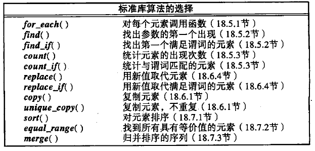

## 迭代器

### 迭代器-的分类

```cpp
struct input_iterator_tag {}；
struct output_iterator_tag {};
struct forward_iterator_tag:public input_iterator_tag{};
struct bidirectional_iterator_tag:public forward_iterator_tag{};
struct random_access_tag:public bidirectional_iterator_tag {};
```

以上5中迭代器的继承关系，如下图所示。
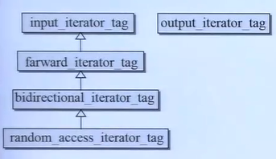

1.Input Iterator（输入迭代器）：
输入迭代器是最基本的迭代器类型，支持单向遍历，只能向前移动。

用法示例：
```cpp
     std::vector<int> vec = {1, 2, 3, 4, 5};
     std::input_iterator<int> it = vec.begin();
     while (it != vec.end()) {
         std::cout << *it << " ";
         ++it;
     }
```

2.Forward Iterator（前向迭代器）：
前向迭代器支持双向遍历，可以向前和向后移动。

用法示例：
```cpp
     std::list<int> lst = {1, 2, 3, 4, 5};
     std::forward_iterator<int> it = lst.begin();
     while (it != lst.end()) {
         std::cout << *it << " ";
         ++it;
     }
```

3.Output Iterator（输出迭代器）：
输出迭代器允许对容器中的元素进行写操作，但不支持读操作。

用法示例：
```cpp
     std::vector<int> vec;
     std::back_insert_iterator<std::vector<int>> it(vec);
     *it = 1; // 写操作
     ++it;
     *it = 2; // 写操作
```

4.Bidirectional Iterator（双向迭代器）：
双向迭代器支持双向遍历，可以向前和向后移动。

用法示例：
```cpp
     std::list<int> lst = {1, 2, 3, 4, 5};
     std::bidirectional_iterator<int> it = lst.end();
     while (it != lst.begin()) {
         --it;
         std::cout << *it << " ";
     }
```

5.Random Access Iterator（随机访问迭代器）：
随机访问迭代器支持任意位置的快速访问，类似于指针操作。

用法示例：
```cpp
     std::vector<int> vec = {1, 2, 3, 4, 5};
     std::random_access_iterator<int> it = vec.begin();
     it += 2; // 随机访问
     std::cout << *it << " ";
```

## 各种容器的迭代器类型

测试代码：

```cpp
    #include <iterator> 
    namespace test_iterator_category
    {
        template <typename T>
        void display_category(T itr) {
            typename iterator_traits<T>::iterator_category cagy; // 使用 std::iterator_traits 获取迭代器类别
            // 这里不需要递归调用 display_iterator 函数
            cout << typeid(cagy).name() << endl;
        }

        void test() {
            cout << "\ntest_iterator_category....................\n";
            display_category(array<int, 10>::iterator());
            display_category(vector<int>::iterator());
            display_category(list<int>::iterator());
            display_category(forward_list<int>::iterator());
            display_category(deque<int>::iterator());

            display_category(set<int>::iterator());
            display_category(map<int, int>::iterator());
            display_category(multiset<int>::iterator());
            display_category(multiset<int, int>::iterator());

            display_category(istream_iterator<int>());
            display_category(ostream_iterator<int>(cout,""));
        }
    }
```

此处可以参考一下`display_category(array<int, 10>::iterator());`中传递`array<int, 10>::iterator()`的方法。

测试结果：

```cpp
test_iterator_category....................
struct std::random_access_iterator_tag
struct std::random_access_iterator_tag
struct std::bidirectional_iterator_tag
struct std::forward_iterator_tag
struct std::random_access_iterator_tag
struct std::bidirectional_iterator_tag
struct std::bidirectional_iterator_tag
struct std::bidirectional_iterator_tag
struct std::bidirectional_iterator_tag
struct std::input_iterator_tag
struct std::output_iterator_tag
```

## 迭代器对算法的影响

### 例子1-distance

迭代器如何计算容器元素之间的距离呢？当调用迭代器时，迭代器是如何操作以协助算法完成后续的增删改查的？

在计算距离方面，我们可以看到调用接口需要传入容器的头，以及容器尾部，接着使用：

```cpp
    ...
    typedef typename iterator_traits<InputIterator>::itrerator_category category;
    return __distance(first,last, category);
```

`typedef typename iterator_traits<InputIterator>::itrerator_category category;`这一句会判断迭代器的类型，进而执行加操作或一步一步加操作。详细如下图所示。
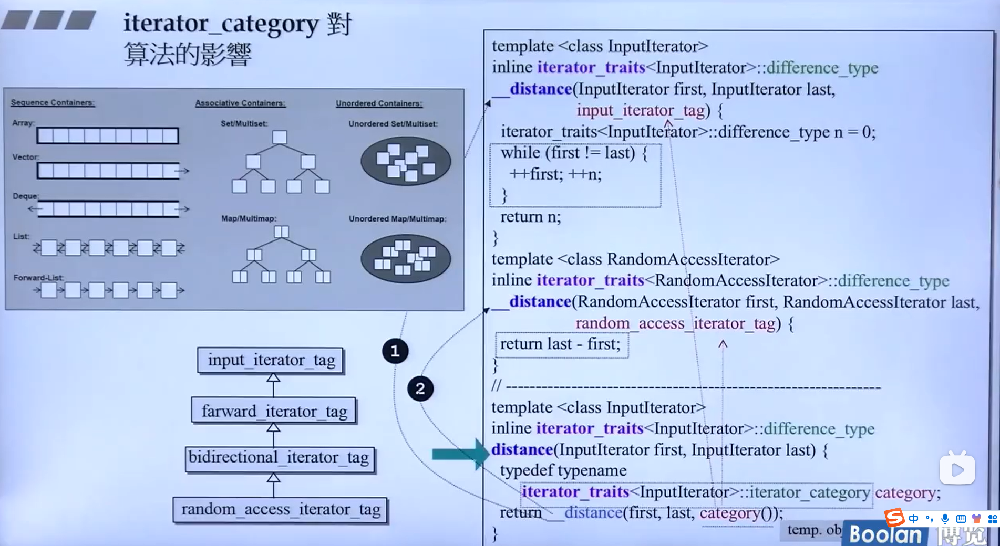

### 例子2-copy

copy的动作也不仅仅是对迭代器类型的判断，还做了许多特化、偏特化。如下图所示。
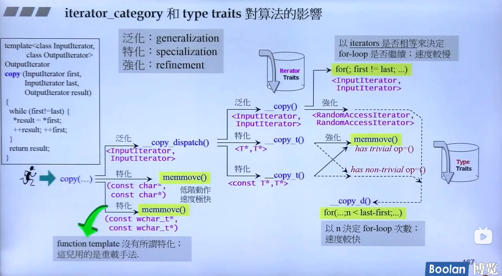

### 例子3-destroy

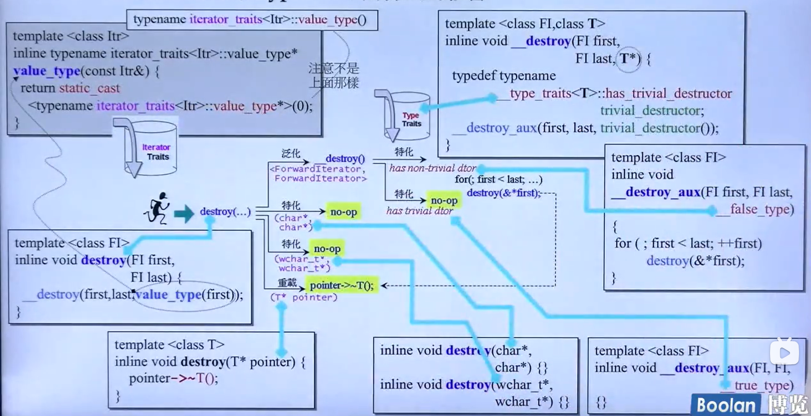

### 例子4-__unique_copy

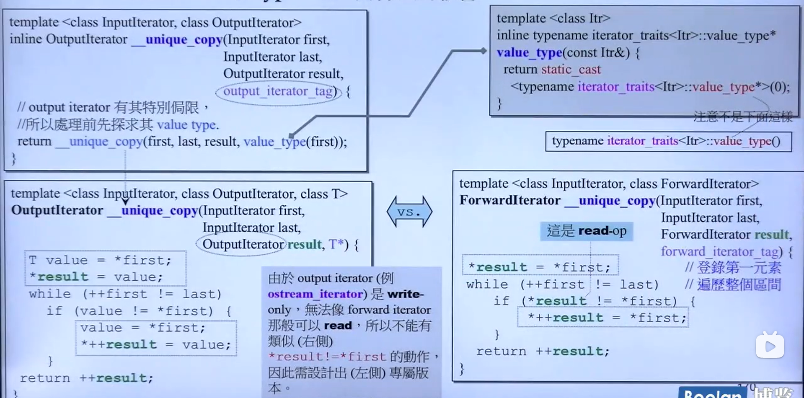

## 对传入的迭代器类型的暗示

在调用一些需要传入迭代器的函数时，从函数的形参名可以判断传入的迭代器类型，如InputIterator，由于forward_iterator_tag、bidirection_iterator_tag、random_asccess_iterator_tag与input_iterator的继承关系可知，前三者都可以传入，以此类推如果形参是forward_iterator_tag那么除了其本身，bidirection_iterator_tag、random_asccess_iterator_tag也可传入。

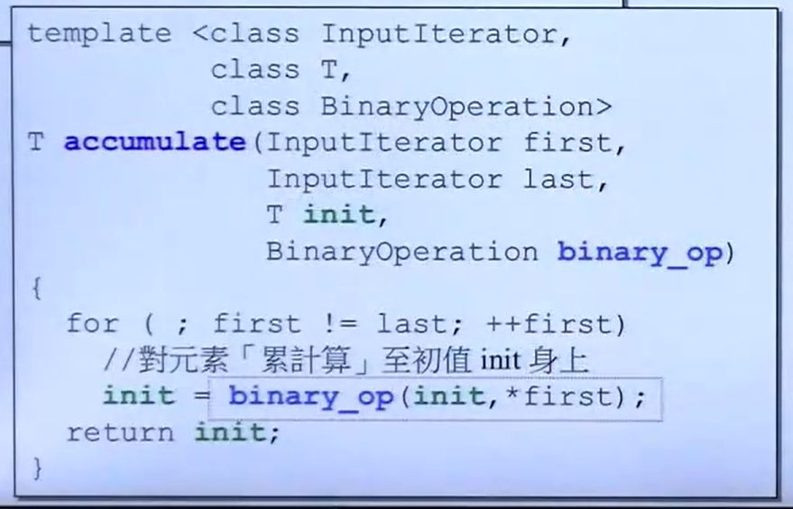

## 算法源码剖析

### accumulate-累计

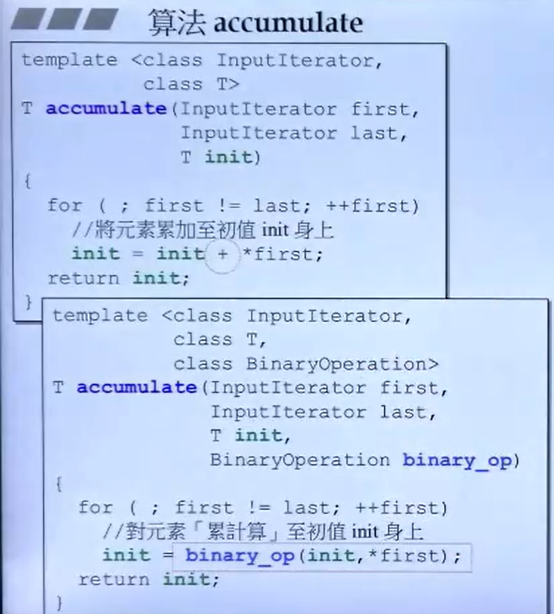

测试用例：

```cpp
    #include <functional>//std::minus
    #include <numeric>//std::accumulate
    namespace test_accumulate
    {
        int myfcn(int x, int y) { return x + 2 * y; }
        struct myclass {
            int operator()(int x, int y) { return x + 3 * y; }
        } myobj;
    }
    void test(){
        int init = 10;
        int nums[] = {10,10,10};
        cout << accumulate(nums, nums + 3, init)<<endl;//40
        cout << accumulate(nums, nums + 3, init, test_accumulate::myfcn)<<endl;//70
        cout << accumulate(nums, nums + 3, init, test_accumulate::myobj) << endl;//100
    }
```

### for_each

拿到每一个元素时都对该元素执行某一操作。
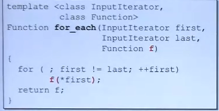

测试用例：

```cpp
    namespace test_for_each
    {
        void myfcn(int i) { cout<<i<<"-"; }
        struct myclass {
            void operator()(int i) { cout << "[" << i<<"] "; }
        } myobj;
        void test() {
            vector<int> c;
            c.push_back(10);
            c.push_back(20);
            c.push_back(30);
            for_each(c.begin(), c.end(), test_for_each::myfcn);//10-20-30-
            cout << "\n";
            for_each(c.begin(), c.end(), test_for_each::myobj);//[10] [20] [30]
        }
    }
```

### replace,replace_if,rreplace_copy

replace用于将新值替换为旧值，例如将数组中所有的8替换为9.详细源码如下图所示。
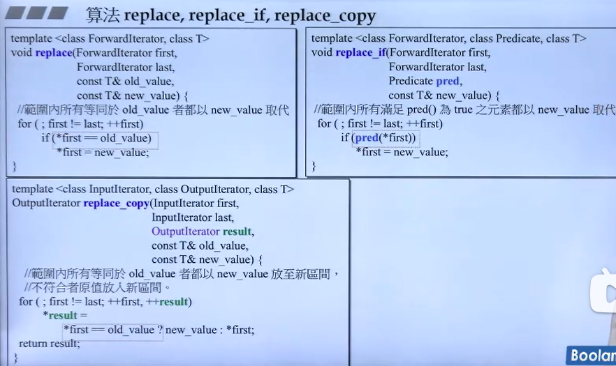

`replace`、`replace_if` 和 `replace_copy` 是 C++ 标准库中的算法，它们用于在容器或数组中替换元素。这些函数属于 `<algorithm>` 头文件。下面是每个函数的详细介绍和作用：

### 1. `replace`

`replace` 函数用于将容器中所有满足特定条件的元素替换为另一个值。这个函数直接在原容器上操作，不创建新的容器。

**函数原型**:
```cpp
void replace(ForwardIterator first, ForwardIterator last, const T& old_value, const T& new_value);
```
- `first`, `last`：定义了要替换元素的范围。
- `old_value`：要被替换的值。
- `new_value`：替换后的值。

**示例**:
```cpp
vector<int> v = {1, 2, 3, 4, 3, 2};
replace(v.begin(), v.end(), 2, 5);
// v 变为 {1, 5, 3, 4, 3, 5}
```

### 2. `replace_if`

`replace_if` 函数用于将容器中满足特定条件的元素替换为另一个值。与 `replace` 不同，`replace_if` 需要一个谓词（条件函数），只有满足这个条件的元素才会被替换。这个函数也直接在原容器上操作。

**函数原型**:
```cpp
void replace_if(ForwardIterator first, ForwardIterator last, Predicate pred, const T& new_value);
```
- `first`, `last`：定义了要替换元素的范围。
- `pred`：一个谓词函数，返回 `true` 表示替换，`false` 表示不替换。
- `new_value`：替换后的值。

**示例**:
```cpp
vector<int> v = {1, 2, 3, 4, 3, 2};
replace_if(v.begin(), v.end(), [](int i) { return i == 2; }, 5);
// v 变为 {1, 5, 3, 4, 3, 5}
```

### 3. `replace_copy`

`replace_copy` 函数用于将容器中所有满足特定条件的元素复制到另一个容器中，并替换为另一个值。这个函数不会改变原容器，而是创建一个新的容器，其中包含替换后的元素。

**函数原型**:
```cpp
template <class InputIterator, class OutputIterator>
OutputIterator replace_copy(InputIterator first, InputIterator last, OutputIterator result, const T& old_value, const T& new_value);
```
- `first`, `last`：定义了要替换元素的范围。
- `result`：指向目标容器的迭代器，用于存储替换后的元素。
- `old_value`：要被替换的值。
- `new_value`：替换后的值。

**示例**:
```cpp
vector<int> v = {1, 2, 3, 4, 3, 2};
vector<int> v2(v.size());
replace_copy(v.begin(), v.end(), v2.begin(), 2, 5);
// v 保持不变，v2 变为 {1, 5, 3, 4, 3, 5}
```

### count，count_if

源代码如下：
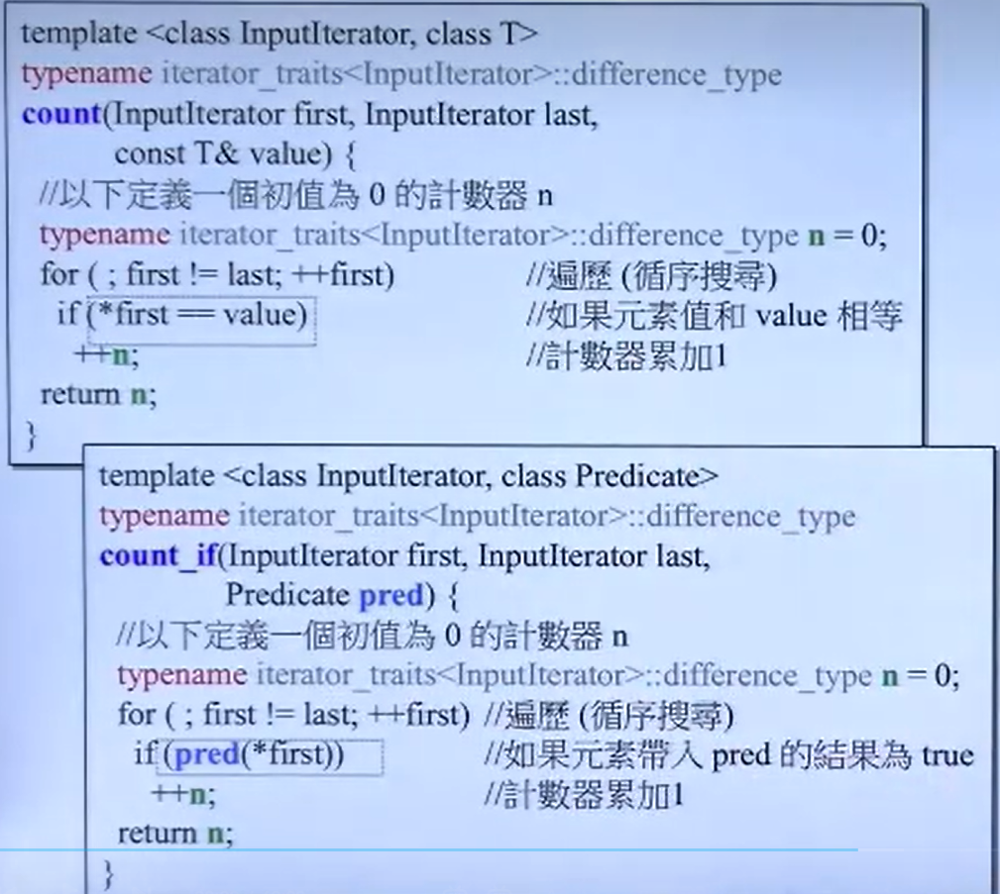

小结：
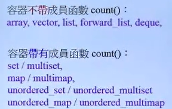

### find，find_if

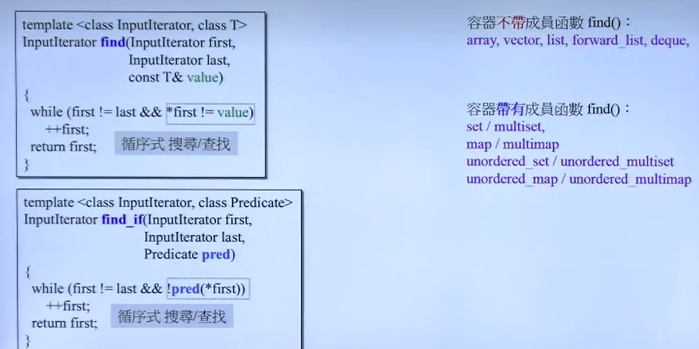

### sort

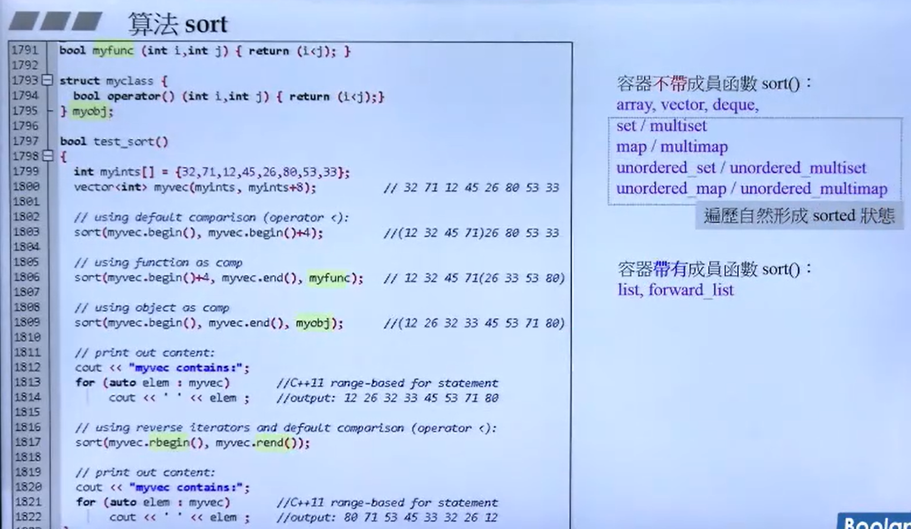

### binary_search

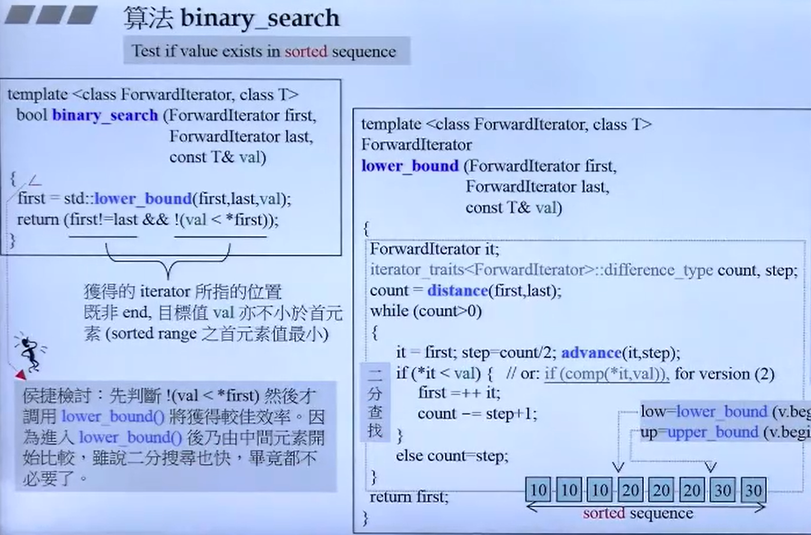

**算法原理：**

二分查找的基本思想是将一个有序序列分为两半，通过比较中间元素和目标值来缩小搜索范围。如果中间元素正好是目标值，则查找成功；如果目标值小于中间元素，则在序列的左半部分继续查找；如果目标值大于中间元素，则在右半部分继续查找。这个过程不断重复，直到找到目标值或搜索范围为空。

**函数原型：**

`binary_search` 的函数原型如下：
```cpp
template <class ForwardIterator, class T>
bool binary_search(ForwardIterator first,
                   ForwardIterator last,
                   const T& value);
```
- `first`, `last`：定义了要搜索的范围，`first` 是序列的开始迭代器，`last` 是序列的结束迭代器（指向序列末尾的下一个位置）。
- `value`：要查找的值。

**返回值：**

- 如果在序列中找到 `value`，则返回 `true`。
- 如果没有找到，则返回 `false`。

**示例代码：**

```cpp
#include <algorithm>
#include <vector>
#include <iostream>

int main() {
    std::vector<int> data = {1, 2, 3, 4, 5, 6, 7, 8, 9};
    int target = 5;

    bool found = std::binary_search(data.begin(), data.end(), target);

    if (found) {
        std::cout << "Element found in the array." << std::endl;
    } else {
        std::cout << "Element not found in the array." << std::endl;
    }

    return 0;
}
```

**注意事项：**

1. **有序序列**：`binary_search` 要求序列必须是有序的，否则查找结果将不可预测。
2. **效率**：二分查找的时间复杂度为 O(log n)，其中 n 是序列中的元素数量。这使得它比线性查找（O(n)）更高效，尤其是在大数据集上。
3. **稳定性**：如果存在多个相同的目标值，`binary_search` 将返回第一个匹配的位置。如果需要找到所有匹配项，可能需要使用其他方法。

{}