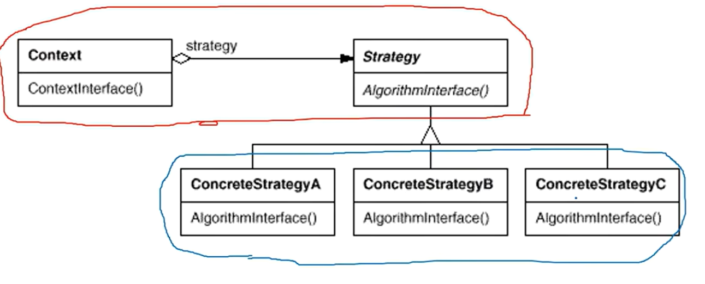

# 19.设计模式（C&#43;&#43;）

## 组件协作

### 模板方法-template method

在C语言代码编写中主函数调用常调用库函数，进行功能实现。那么现在面向对象编程中，可以选择在库中调用未来写在主函数中的函数，这个设计方式就叫template method（个人的理解，不是定义）。举个例子，假设有一个lib.h的库，里面写了画圆的步骤，主体框架已经在rung()中写好，但是还有一个函数没用写，该函数是用来指定圆的半径等参数的，这个函数用virtual修饰，在未来主函数中可以继承该类并重写这个函数，最后在调用lib.h库里的run()即可。

在这里画圆的框架以及步骤已经规定好，也就是稳定的，而圆的半径是变化，使用以上方法就把稳定与变化分开，这也是设计模式的核心要点之一。例子粗糙但已经能说明该设计模式了

前一过程称为早绑定，后一过程称为晚绑定。

### 策略方法-strategy

如下图是该方法的结构图。

该方法是为了应对未来的需求，这在业务就很常见，在未来会增加业务的功能，主要体现在代码**运行时**，假设现在有三种算分分别对应三种不同的情况，在运算时需要对不同的算法做不同的处理，以往我们会使用if-else或Switch-case，但是当情况不是三种或未来增加时，后者的代码会变得冗长，也不好维护，现在我们可以把三种情况对应的算法继承一个基类中的virtual修饰的方法，并重写这个方法。在运行处通过上下文调用对应的算法。

{}
