# 1.在线题库练习

## 网站

- ["语言网【基础】"](https://www.dotcpp.com/oj/ybt-cpp/?page=1)
- ["大学慕课对应习题【算法基础】"](http://cxsjsxmooc.openjudge.cn/2023t1spring/)
- ["牛客竞赛【中等】"](https://ac.nowcoder.com/acm/skill/detail/noip-tg/1582)
- ["LeetCode【较难】"](https://leetcode.cn/studyplan/top-100-liked/)

## 课程学习

- ["书籍"](https://sse.hit.edu.cn/book/)
- ["大学慕课"](https://www.icourse163.org/learn/PKU-1001553023?tid=1473340448#/learn/announce)
Github项目
- ["C/C++面试总结项目"](https://github.com/huihut/interview?tab=readme-ov-file#cc-development-direction)
- ["书籍：Github项目"](https://github.com/ZhongYi-LinuxDriverDev/CS-EmbeddedLinux-Book?tab=readme-ov-file#c)
- ["C/C++面试总结"](https://github.com/CyC2018/CS-Notes/blob/master/notes/%E5%89%91%E6%8C%87%20Offer%20%E9%A2%98%E8%A7%A3%20-%20%E7%9B%AE%E5%BD%95.md)
- ["系统设计"](https://github.com/donnemartin/system-design-primer/blob/master/README-zh-Hans.md)

## 题目笔记

1.`cahr *s = "AAAA"`指针接受一个字符串（右值），当想通过s[0] = 'B'修改时是无法修改成功的，因为"AAAA"只能读，不能写。
2.一般函数内如果返回char s[] = {"abcd"};那么一般会报错，因为这是一个局部变量，但s[]修改为*s就不会有问题。因为 *s指向的地址是固定的。
3.在自动类型转换中：
```cpp
    unsiged int a = 9;
    int b = 1;
    printf("%d", b+a);
```
此处会触发隐式转换——int类型转为uniged int 类型。

4.大端模式和小端模式的作用是什么，为什么会出现这两种模式？

作用：
**大端模式：**在这种模式下，数据的高字节（最重要的字节）保存在内存的低地址处，而数据的低字节（最不重要的字节）保存在内存的高地址处。这种方式类似于人类读写数值的习惯，即从高位到低位
。
**小端模式：**在这种模式下，数据的低字节保存在内存的低地址处，而数据的高字节保存在内存的高地址处。这种方式在进行数据类型转换时不需要调整字节内容，直接截取低字节即可

测试代码：
```cpp
    #include <stdio.h>
    
    int main(){
        int i;
        union test{
            unsigned int n;
            char arr[4];
        };
        union test num;
        num.n = 0x12345678;//注意:12所在位置是高位 
        for(i = 0; i<4; i++){
            printf("&arr[%d]  = %p, arr[%d] = %#x\n",i,&num.arr[i],i,num.arr[i]);
        }
        return 0;
    } 
    /*
    代码解释：
            代码中，%x表示输出16进制，x前加 # 标志表示，如果使用 %ox（八进制），
            则输出的数前面会加上前缀 0；如果使用 %#x 或 %#X（十六进制），
            则输出的数前面会加上前缀 0x 或 0X。这样做可以明确地表示数值的进制，
            便于阅读和理解。 
    结果：
        &arr[0]  = 000000000062FE10, arr[0] = 0x78
        &arr[1]  = 000000000062FE11, arr[1] = 0x56
        &arr[2]  = 000000000062FE12, arr[2] = 0x34
        &arr[3]  = 000000000062FE13, arr[3] = 0x12 
    结论：
        高位存储在高地址，所以是小端模式。 
    */ 
```

5.printf的返回值类型是变量的字符个数。
6.#和##运算符的使用

```cpp
    #include <stdio.h>
    #define T(x) printf(""#x" square is the ",(x)*(x))
    #define TEST(n) X##n

    int main(void){
        T(4);
        int TEST(0) = 10;
        int TEST(1) = 20;
        printf("%d",X1);
    }
```

结果：

```cpp
    4 square is the 16
    X1 = 10
```
7.结构体中存储字符串时我们可以使用字符指针或者字符数组，但是一般推荐字符数组。选择字符数组还是字符指针取决于具体的应用场景和需求。如果字符串长度固定或较短，且对性能和内存连续性有要求，字符数组可能是更好的选择。如果需要灵活处理不同长度的字符串，或者字符串长度可能非常大，使用字符指针可能更合适，但需要更加小心地管理内存。

8.strlen()和strcpy()

`strlen()` 和 `strcpy()` 是 C 语言标准库中的两个常用函数，它们用于处理字符串。下面分别解释它们的用途和使用时需要注意的事项。

### strlen() 函数

**用途**：
`strlen()` 函数用于计算一个以空字符（`'\0'`）结尾的字符串的长度。它返回字符串的长度，不包括最后的空字符。

**函数原型**：
```c
size_t strlen(const char *str);
```

**使用注意事项**：

1. **参数必须是以空字符结尾的字符串**：如果传入的参数不是以空字符结尾的字符串，`strlen()` 会一直读取内存直到遇到空字符，这可能导致程序读取到未分配的内存区域，造成越界错误。
2. **返回值类型**：`strlen()` 返回的是 `size_t` 类型，它是一个无符号整数类型，用于表示大小或长度。在比较时，需要注意不要与有符号整数类型进行比较，以避免潜在的负值问题。
3. **效率问题**：`strlen()` 需要遍历整个字符串直到找到空字符，因此对于非常长的字符串，可能会有一定的性能开销。

### strcpy() 函数

**用途**：
`strcpy()` 函数用于将源字符串（包括空字符）复制到目标字符串中。它会覆盖目标字符串原有的内容。

**函数原型**：
```c
char *strcpy(char *dest, const char *src);
```

**使用注意事项**：

1. **目标字符串必须足够大**：在使用 `strcpy()` 之前，必须确保目标字符串 `dest` 有足够的空间来存储源字符串 `src` 的内容，包括最后的空字符。否则，可能会导致缓冲区溢出，这是常见的安全漏洞。
2. **不检查目标字符串大小**：`strcpy()` 不会自动检查目标字符串的大小，如果目标字符串空间不足，会发生溢出。
3. **不进行类型检查**：`strcpy()` 不会对传入的参数类型进行检查，因此传入的参数必须是字符数组或字符指针。
4. **返回值**：`strcpy()` 返回目标字符串的指针，通常用于链式操作，但需要注意不要因此覆盖了重要的指针值。
5. **安全性问题**：由于上述原因，`strcpy()` 在很多情况下被认为是不安全的。在实际编程中，推荐使用 `strncpy()` 或其他更安全的字符串复制函数，这些函数允许指定最大复制的字符数，从而避免溢出。

9.修改字节对齐方式 ：`#pragma pack(n) //n表示字节对起数，如2，4，8，`

10.不同位数电脑的字节对齐方式

解释代码含义：
```cpp
#define offsetof(TYPE, MEMBER) ((size_t ) &((TYPE *)0)->MEMBER)
```
- `(TYPE *)0`:将0强制转换为TYPE类型指针，p = (TYPE *)0;
- `((TYPE *)0)-> MEMNER`:通过指针访问MEMBER成员，
- `&((TYPE *)0)-> MEMNER`：取得成员地址
- `((size_t ) &((TYPE *)0)->MEMBER)`：将成员地址转为size_t类型
总结：该宏定义的作用是求出MEMBER成员变量在TYPE中的偏移量。

示例：

```cpp
    //#pragma pack(4) 
    #include <stdio.h>
    #define offsetof(TYPE, MEMBER) ((size_t ) &((TYPE *)0)->MEMBER)
    typedef struct s
    {
        /* data */
        union {
            int a;//4字节
            char str[10];//10字节
        };
        struct s* next;
    }S;

    int main(){
        printf("%ld",offsetof(S, next));
        return 0;    
    }
```

结果为16，因为电脑是64位的，所以以8字节对齐，联合体字节大小以最大的成员变量为准，故联合体的字节大小是10个字节

12.返回二进制数中1的个数（经典题目）
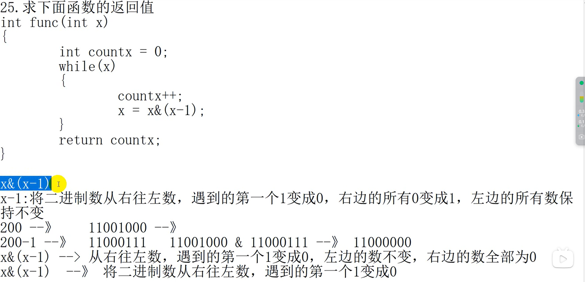

13.求2的n次方
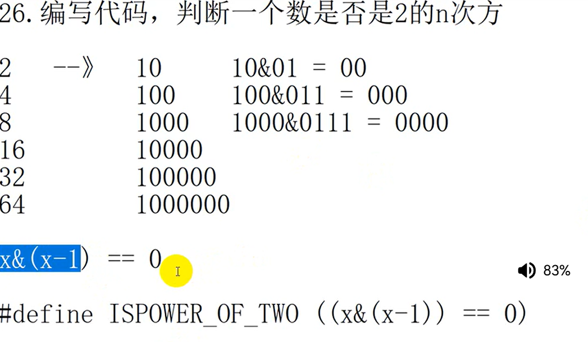

14.操作符[]的重载，代码实现读和写。
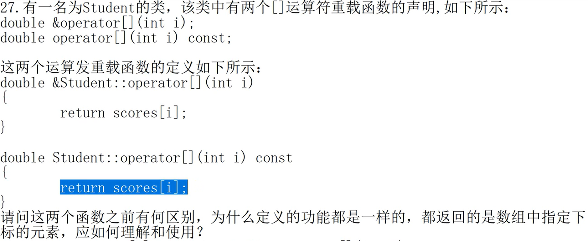

15.与操作与位操作
```cpp
    #include <stdio.h>
    int main(){
        int a = 0;
        a |= (1<<3);//将a的第3位设置为1
        printf("%d\n",a);
        a &= ~(1<<3);//将a的第3位设置为0
        printf("%d\n",a);
        return 0;
    }
```
知识点：

- 只要出现置1：或操作
- 只要出现置0：与操作
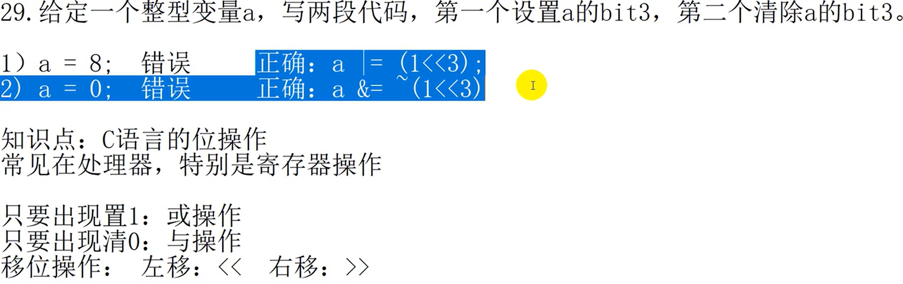

16.sizeof的使用
```c
#include <stdio.h>
int main(){
    int a = 10;
    printf("%d\n",a);
    printf("%d\n",sizeof(a++));
    printf("%d\n",a);
    return 0;
}
```
结果为：10,4,10,为什么最后不是11呢？
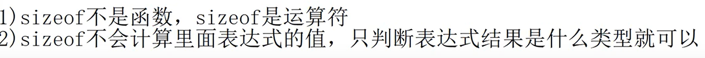

17.指向地址的指针加一个整数
```c
#include <stdio.h>
int main(){
    unsigned char *p1 = (unsigned char *)0x08000010;//指向地址的指针
    unsigned long *p2 = (unsigned long *)0x08000010;//指向地址的指针
    printf("%#x\n",p1+5);
    printf("%#x\n",p2+5);
    return 0;
}
```
结果是0x08000015和0x08000024，

- 对于前一个答案我们很清楚，因为一个unsigned char占一个字符，加5则是加5个字符；
- 后一个答案则是加5个long，一个long占4个字符，所以加5个long就是加20个字符，那么应该是0x08000030才对，为什么是0x08000024呢？因为使用的是16进制计算，20的十六进制就是14，所以是0x08000024。

18.volatile关键字
```cpp
    #include <stdio.h>
    int squere(volatile int *pt){
        //正确写法如下：
        //int a = *pt;
        //return a*a;
        return (*pt)*(*pt);//这样写可能会出错，因为编译器可能会优化代码，认为*pt的值没有改变，所以直接返回上一次的值
    }
    int main(){
        int a = 10;
        printf("%d\n",squere(&a));
        return 0;
    }
```
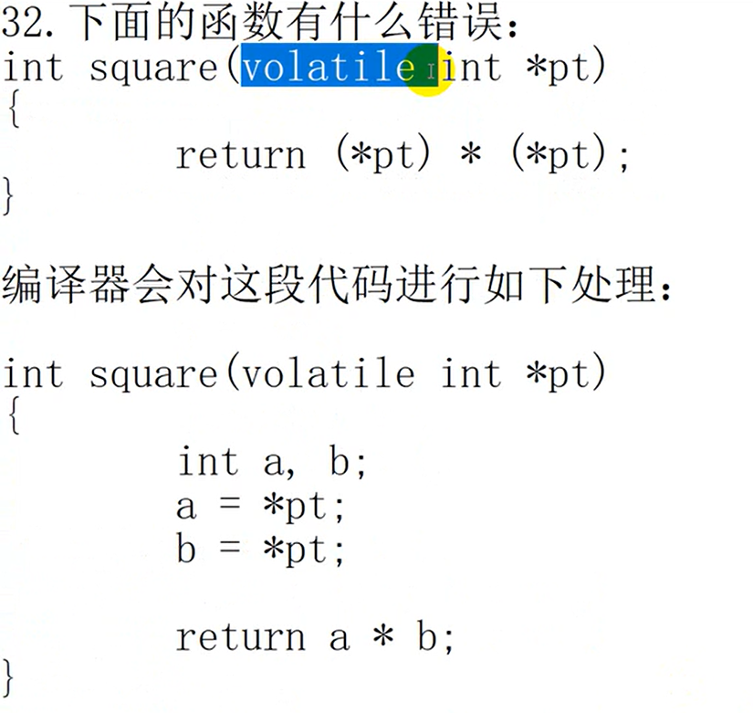

19.假设有两个变量a,b，不借助第三个变量交换两个变量的值。
```c
#include <stdio.h>
int main(){
    a=2;b=3;
    a=a^b;//0010^0011=0001
    b=a^b;//0001^0011=0010
    a=a^b;//0001^0010=0011
    printf("%d,%d\n",a,b);
    return 0;
}
```
还可以使用减法的思想：
```c
#include <stdio.h>
int main(){
    a=2;b=3;
    a=a+b;//a=5
    b=a-b;//b=2
    a=a-b;//a=3
    printf("%d,%d\n",a,b);
    return 0;
}
```
20.左移右移运算符和条件运算符的优先级
```c
#include <iostream>
using namespace std;
int main(){
    int a = 99;
    int b = 100;
    cout<<(a>b)?a:b;
    return 0;
}
```
结果输出为0，因为条件运算符的优先级低于左移运算符，所以先执行了左移运算符，结果为0。

21.交换地址的高位和地位
```c
#include <stdio.h>
void convert(unsigned int *);
int main(){
    unsigned int a;
    printf("请输入一个整数：");
    scanf("%x",&a);
    convert(&a);
    printf("转换后的整数为：%x\n",a);
    return 0;
}
void convert(unsigned int *a){
    unsigned int temp;
    temp = *a & 0x0f;
    *a &= 0xf0;
    *a = (*a >> 4) | (temp << 4);
}
结果：
```c
    请输入一个整数：0x3A
    转换后的整数为：0xa3
```

22.一级指针和二级指针
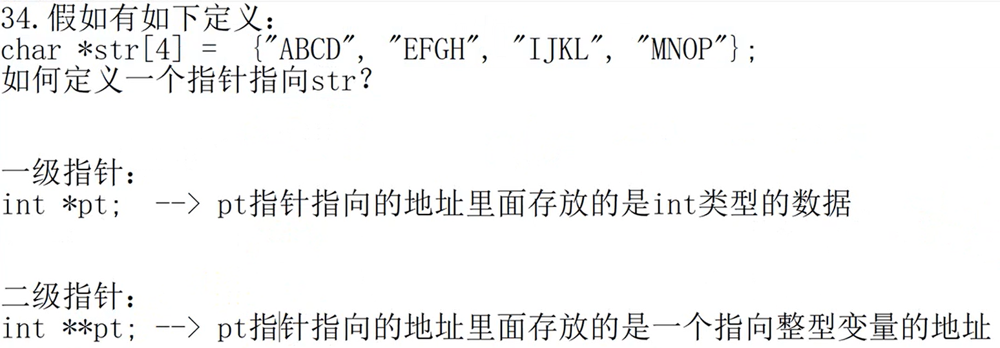

23.如果从数组x复制50个字节到数组y,最简单的方法是什么？

```c
#include <stdio.h>
int main(){
    char x[50] = "hello world";
    char y[50];
    memcpy(y,x,50);
    printf("%s\n",y);
    return 0;
}
```

memcpy 是一个用于在内存中复制数据的函数，定义在 C 标准库中的 <string.h> 头文件中。它的原型如下：

```c
void *memcpy(void *dest, const void *src, size_t n);
```

参数说明

- dest：指向目标内存位置的指针，即数据将被复制到的位置。
- src：指向源内存位置的指针，即数据将从哪里复制。
- n：**要复制的字节数。**

返回值

返回指向目标内存位置的指针 dest。

用途

memcpy 函数主要用于在内存中复制数据块，常用于以下场景：

- 字符串复制：复制字符串内容。
- 结构体复制：复制结构体数据。
- 数组复制：复制数组元素。

使用注意事项

- 目标内存必须足够大：确保目标内存区域足够大，能够容纳从源内存复制过来的数据，否则会导致缓冲区溢出。
- 源和目标内存不能重叠：如果源和目标内存区域有重叠，memcpy 的行为是未定义的。如果需要处理重叠的情况，可以使用 memmove 函数。
- 类型安全：memcpy 是一个低级别的内存操作函数，不进行类型检查，因此在使用时需要确保数据类型的一致性。
- 性能考虑：memcpy 通常比手动循环复制更高效，因为它利用了底层硬件的优化。

24.将字符数字转为整形数字

思路：使用指针取出字符串中的每个字符，然后减去字符'0'的ASCII码值，即可得到对应的整形数字。
编写一个函数来实现这个操作，函数原型如下：
```c
int ascii_to_integer(const char *str);
```
其中，str 是一个指向字符数字字符串的指针，函数返回对应的整形数字。

```c
#include <stdio.h>
int ascii_to_integer(const char *str){
    int digit = 0;
    while(*str >= '0' && *str <= '9'){
        digit = digit * 10 + (*str - '0');
        str++;
    }
    if(*str != '\0')
        return 0;
    return digit;
}
int main(int argc, char *argv[]){
    // int digit = ascii_to_integer(argv[1]);//在Linux中可以尝试这样写
    char str[100];
    printf("请输入一串数字字符：");
    scanf("%s",str);
    printf("The digit is: %d\n", ascii_to_integer(str));
    return 0;
}
```

24.百钱买百鸡问题

解题思路如下图：
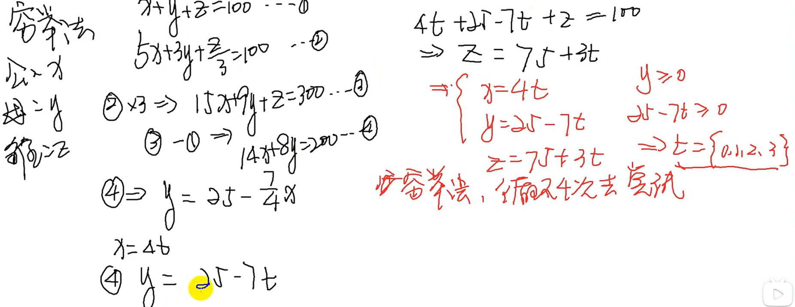

```C
#include <stdio.h>
int main(){
    int x, y, z;
    int t;
    for(t = 0;t<=4;t++){
        x = 4 * t;
        y = 25 - 7 * t;
        z = 75 + 3 * t;
        printf("cock:%d,hen:%d,chicken:%d-----sum:%d\n",x,y,z,x+y+z);
    }
    return 0;
}
结果：
cock:0,hen:25,chicken:75-----sum:100
cock:4,hen:18,chicken:78-----sum:100
cock:8,hen:11,chicken:81-----sum:100
cock:12,hen:4,chicken:84-----sum:100
```

25.*和++运算符优先级
二者的运算优先级是一样的。
```C
#include <stdio.h>
int main(){
    int arr[10] = {1,2,3,4,5,6,7,8,9};
    int *p = arr;
    for (int i = 0; i < 3; i++){
        printf("%d",*p++);
    }
    p = arr;
    printf("\n-------------------------------------------\n");
    for (int i = 0; i < 3; i++){
        printf("%d",*++p);
    }
    p = arr;
    printf("\n-------------------------------------------\n");
    for (int i = 0; i < 3; i++){
        printf("%d",++(*p));
    }
    return 0;
}
```

26.函数指针类型
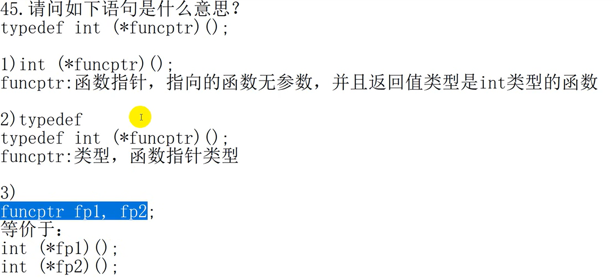

27.编写函数实现整数四舍五入
思路：对于正数我们可以加0.5，然后取整；
对于负数则减去0.5，然后取整。
```c
#include <stdio.h>
int round(int num){
    if(num >= 0){
        return num + 0.5;
    }else{
        return num - 0.5;
    }
}
int main(){
    int num = 3.6;
    printf("round(%d) = %d\n",num,round(num));
    return 0;
}
```

28.下图代码运行结果
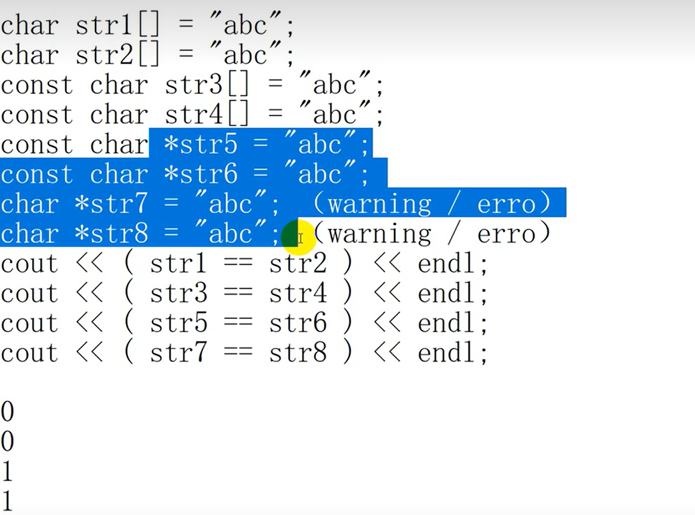

29.函数指针数组
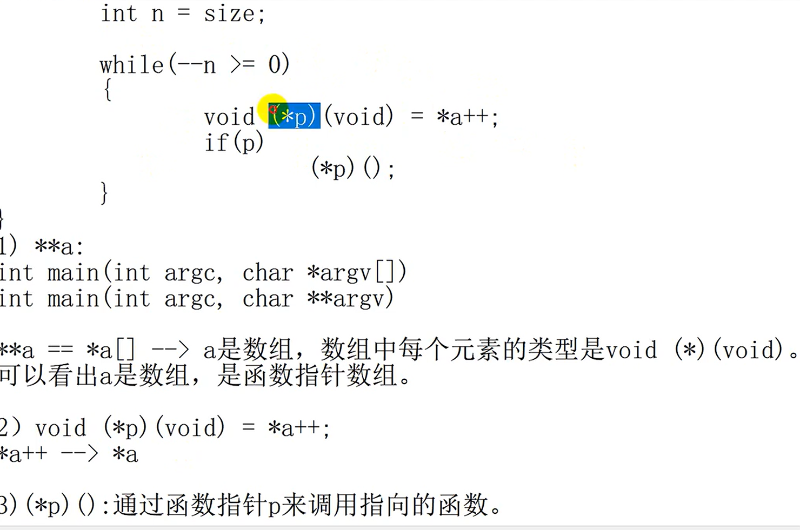

{}