# FreeRTOS

## 裸机与RTOS

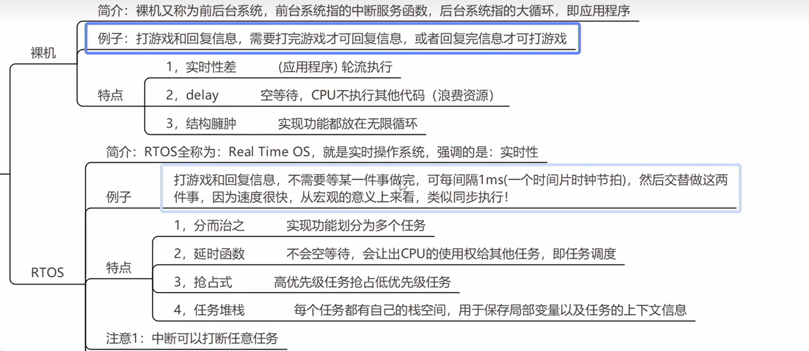

## freeRTOS基础知识

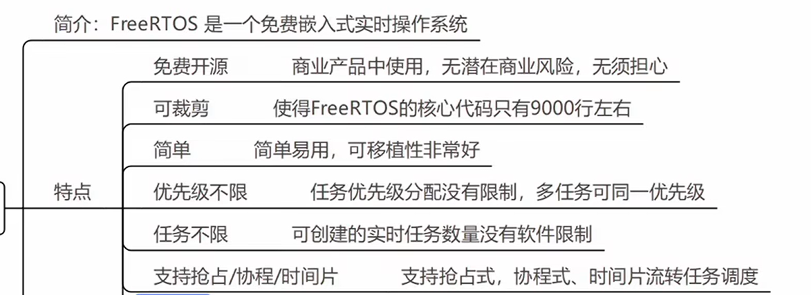

### 调度算法

#### 1、抢占式

特点：

- 高优先级任务先执行
- 高优先级任务不停止，低优先级任务无法执行
- 被抢占任务会进入就绪状态

#### 2、时间片

说明：同等优先级任务享有相同CPU时间，在freeRTOS中一个时间片就等于一个systick时间。

特点：

- 同等优先级轮流执行；
- 一个时间片大小却决于滴答定时器中断周期；
- 没有用完时间片的任务不会再使用（如任务1只执行了25%，这时会切换任务，不会接着执行）；下次分配时还是分配一个时间片大小

### 任务状态

- 运行态：正在执行的任务，同一时间只有一个任务在执行
- 就绪态：任务已经就绪，准备执行
- 阻塞态：任务因延时或等待外部事件发生而处于的状态
- 挂起态：任务不运行也不就绪（可以理解为暂停）

关系图：
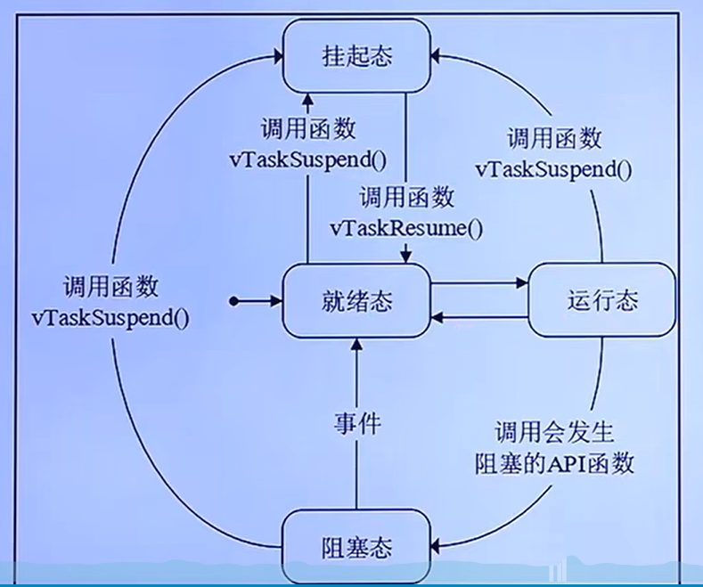

### 任务状态列表

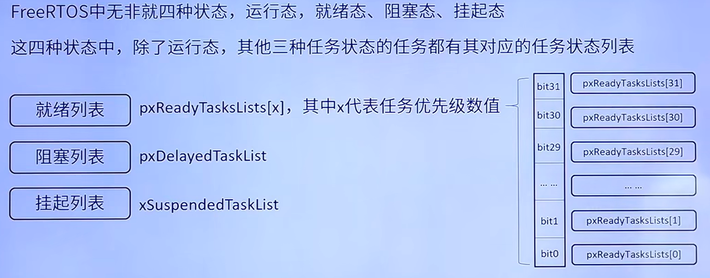

列表结构为链表结构，通过标志位置1标记有任务，标志为0标识没有任务。

**调度器总是在就绪列表中，查找就最高优先级的任务来执行**

## 源文件说明

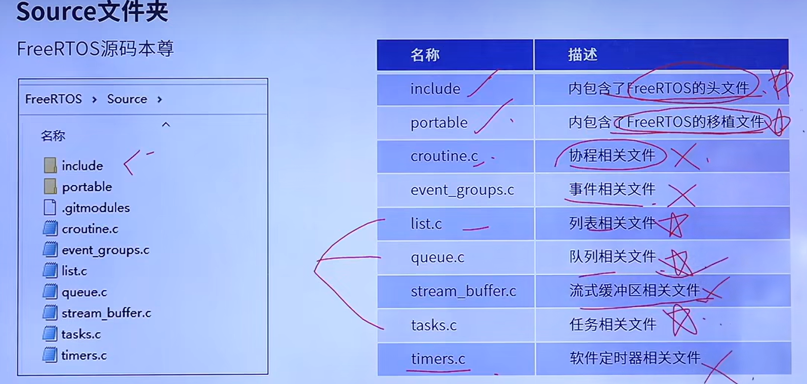
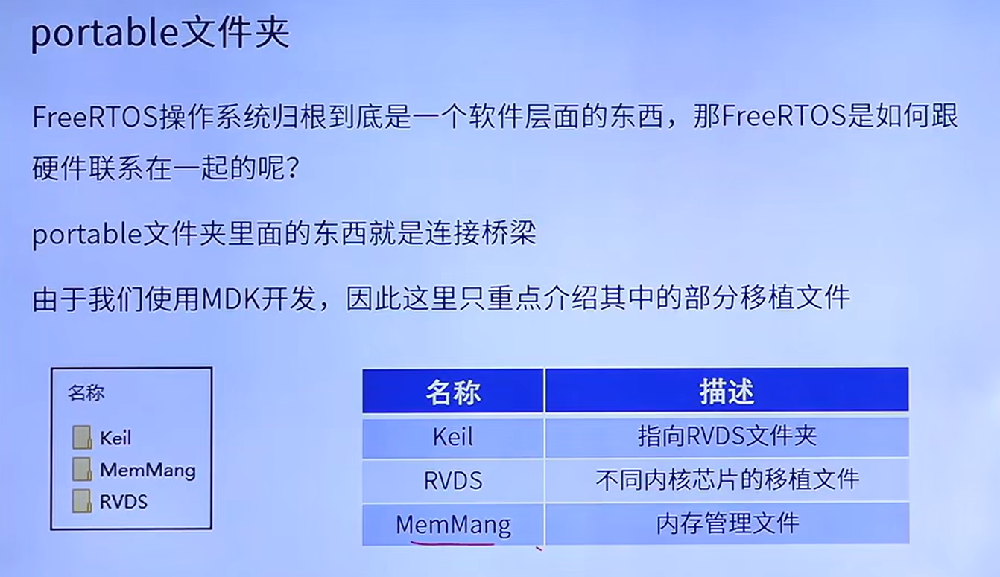

## FreeRTOS移植

### 源码获取

- 官方网站：[freeRTOS.org](https://www.freertos.org/)
- 工程文件：[FreeRTOS](https://github.com/freertos/freertos)
- 核心源码：[FreeRTOS-Kernel](https://github.com/FreeRTOS/FreeRTOS-Kernel)

将源码文件复制到工程文件的FreeRTOS/FreeRTOS/Source/目录下。删除源码文件中部分文件最终如下：
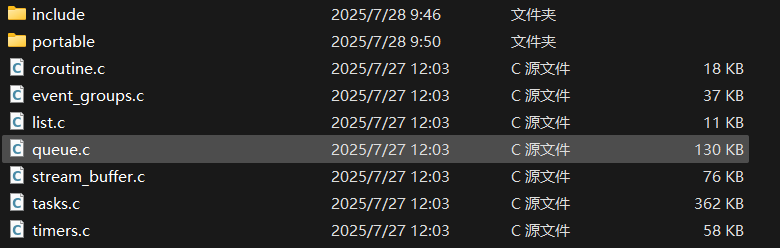

### 开始移植

1.准备一个适合STM32的工程，以stm32g474RE芯片为例；

2.在项目文件中创建`FreeRTOS/`文件夹，并将FreeRTOS源码拷贝到目录下。

3.打开Kiel5，创建文件夹`Middlewares/FreeRTOS_CORE`、`Middlewares/FreeRTOS_PORT`，添加如下图文件到`Middlewares/FreeRTOS_CORE`下，
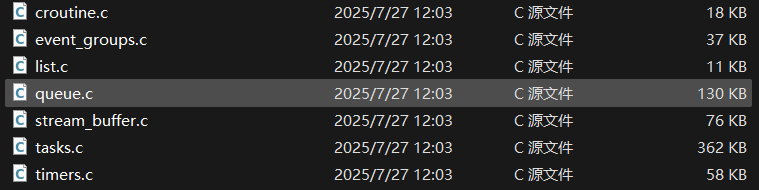
添加如下路径的`heap.c、port4.c`文件到`Middlewares/FreeRTOS_PORT`下：
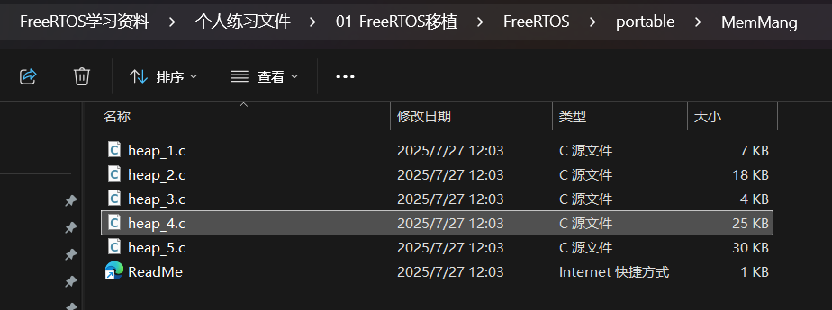
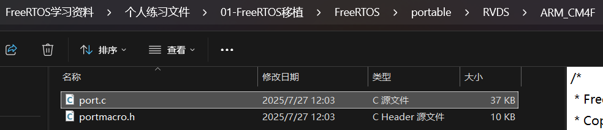

4.在kiel5中的C/C++添加头文件。头文件路径分别为如下图的include、以及port路径，需要注意的时对于不同的芯片第二张图显示的路径有所不同。

5.以上最终结果
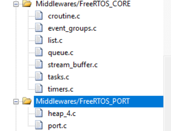
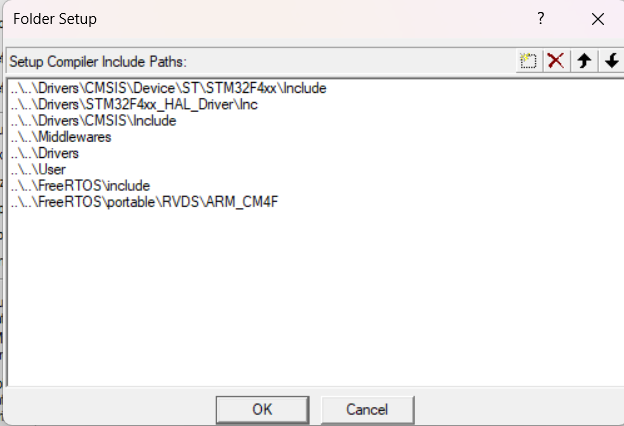

6.复制现有的`FreeRTOSConfig.h`文件到包含main.c文件的路径下。

## 创建与删除的原理

{}