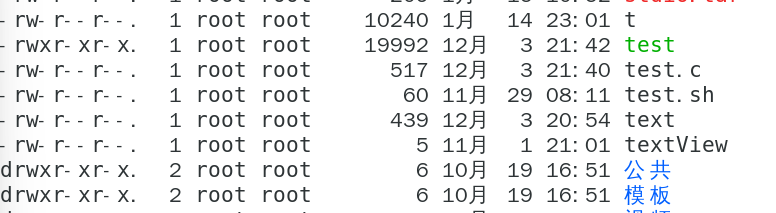
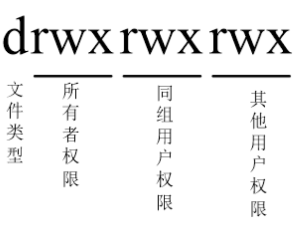
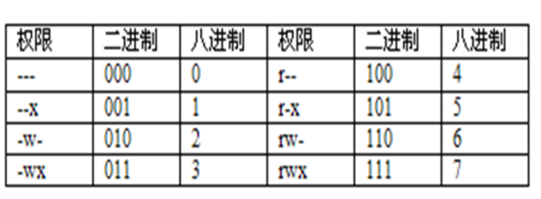
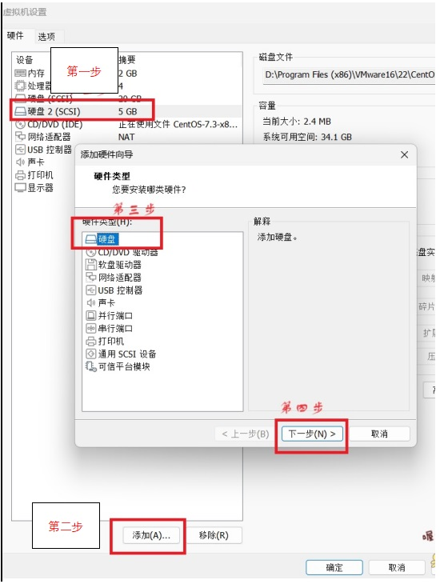
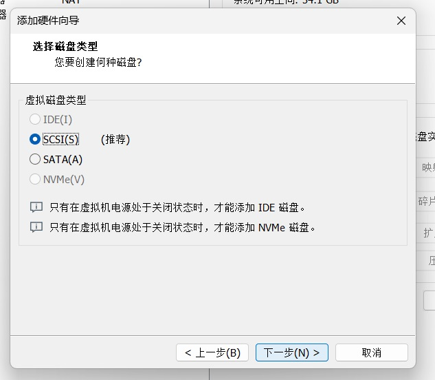
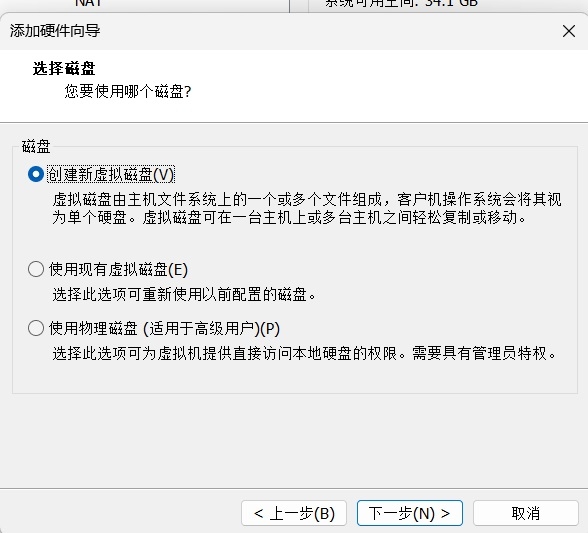
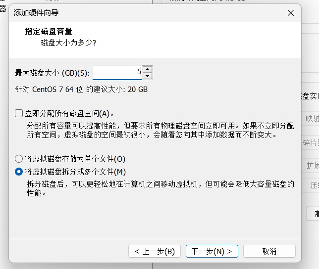
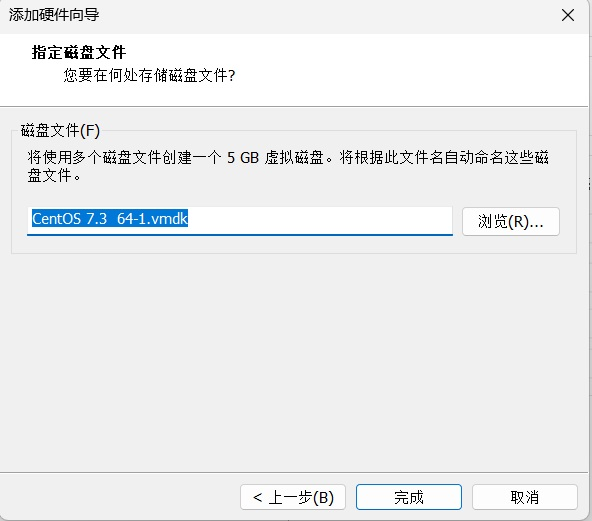

# Linux期末复习

## 认识Linux

### 安装Linux

### 图形界面与命令行

## 文件管理与常用命令

### 文件/目录的打包和压缩

#### gzip压缩文件和gunzip、zcat压缩文件命令

一般压缩解压文件：
{}

````linux
 gzip [文件名]
 gunzip [解压文件名]
````

{}
例子：

````linux
    [root@localhost stdio]# ls
    1.c  2.c  3.c  hello.txt
    [root@localhost stdio]# gzip hello.txt
    [root@localhost stdio]# ls
    1.c  2.c  3.c  hello.txt.gz
    [root@localhost stdio]# gunzip hello.txt.gz 
    [root@localhost stdio]# ls
    1.c  2.c  3.c  hello.txt
    [root@localhost stdio]# 
````

如果不想删除源文件要怎么做呢？使用如下命令：
{}

````linux
 gzip -c [文件名] > [压缩文件名.gz]
 zcat [解压文件名.gz] >[压缩文件名.gz]
````

{}
例子：

````linux
    [root@localhost stdio]# ls
    1.c  2.c  3.c  hello.txt
    [root@localhost stdio]# gzip -c hello.txt >hello.txt.gz
    [root@localhost stdio]# ls
    1.c  2.c  3.c  hello.txt  hello.txt.gz
    [root@localhost stdio]# zcat  hello.txt.gz >he.txt
    [root@localhost stdio]# ls
    1.c  2.c  3.c  hello.txt  hello.txt.gz  he.txt
[root@localhost stdio]# 
````

在上面的命令中，**zcat [解压文件名.gz] >[压缩文件名.gz]** 与 **gunzip -c [解压文件名.gz] >[压缩文件名.gz]** 作用一样，另外，zcat [文件名]会将文件压缩信息输出在窗口上，即输出在 **std**。

#### bzip2压缩文件和bunzip2压缩文件命令

一般压缩解压文件：
{}

````linux
    bzip2 [文件名]
    bunzip2 [解压文件名]
    //压缩解压后不会删除原文件
    bzip2 -k [文件名]
    bunzip2 -k [解压文件名]
````

{}

例子：

```linux
[root@localhost stdio]# ls
1.c  2.c  3.c  hello.txt
[root@localhost stdio]# bzip2 hello.txt 
[root@localhost stdio]# ls
1.c  2.c  3.c  hello.txt.bz2
[root@localhost stdio]# bunzip2 hello.txt.bz2 
[root@localhost stdio]# ls
1.c  2.c  3.c  hello.txt

[root@localhost stdio]# bzip2 -k  hello.txt 
[root@localhost stdio]# ls
1.c  2.c  3.c  hello.txt  hello.txt.bz2
[root@localhost stdio]# rm hello.txt
rm：是否删除普通文件 "hello.txt"？y
[root@localhost stdio]# ls
1.c  2.c  3.c  hello.txt.bz2
[root@localhost stdio]# bunzip2 -k hello.txt.bz2
[root@localhost stdio]# ls
1.c  2.c  3.c  hello.txt  hello.txt.bz2
[root@localhost stdio]# 
```

#### tar归档文件命令

{}

在Linux系统中，tar 是一个非常重要的归档工具，用于将一组文件和目录打包到一个单一的.tar文件中。它创建的这种归档文件并不进行压缩，仅仅是将多个文件集合在一起，并保持原始文件的权限、所有权和其他元数据信息。

````linux
    tar -cvf [文件名]
    tar -xvf [解压文件名]
````

然而，为了减少存储空间占用以及在网络上传输时加快速度，通常会结合使用 tar 和压缩工具（如gzip或bzip2）对归档文件进行压缩。这里 -z 或 -j 参数的作用就是启用压缩功能

````linux
    tar -czvf [文件名]
    tar -xzvf [解压文件名]

    tar -cjvf [文件名]
    tar -xjvf [解压文件名]
````

如果要选择性的归档或压缩、解压某个文件或目录，那么需要加 **w**，如下：

```l
    tar -cwzvf [文件名]
    tar -xwzvf [解压文件名]

    tar -cwjvf [文件名]
    tar -xwjvf [解压文件名]
```

{}

在命令中;

- c（create）：表示创建新备份
- z（gzip或gunzip）:表示使用gzip指令处理文件
- v（verbose）：显示指令执行过程
- f（file）:指定备份文件
- w(interactive):对每一步都进行确认
- j:表示使用bzip2、bunzip2指令进行压缩解压

如果加选项 **-C** （directory），则说明转到指定的目录，命令如下：

```linux
    [root@localhost ~]# tar -cjvf stdio.tar stdio/
    stdio/
    stdio/1.c
    [root@localhost ~]# tar -xjvf stdio.tar -C  st/
    stdio/
    stdio/1.c
    [root@localhost ~]# cd st/
    [root@localhost st]# ls
    stdio
    [root@localhost st]# ls stdio/
    1.c
    [root@localhost st]# 

```

## 用户与用户组管理

### 用户与组文件

#### 用户文件-passwd

存放用户登录用户信息的文件位置：/etc/passwd
文件中域的的格式：

---
username:passwd:uid:gid:userinfo:home:shell:

---

例子：

---
[root@localhost st]# tail -1 /etc/passwd
daliu:x:1008:1006::/home/daliu:/bin/bash

---

**/etc/passwdw** 文件中域的含义

|域|含义|
|:---:|:---:|
|username|用户名|
|password|登录密码（一般显示的是密码转换后的乱码）|
|uid|用户ID（0-99一般为系统保留）|
|gid|用户组ID|
|userinfo|用户信息|
|home|分配该用户的主目录（但位置是人为决定的，自己可以修改）|
|shell|登录后启动的shell|

一般root用户的UID为0，UID一般是唯一的为的是区分不同的用户，但UID为0的除外，UID为0则说明为超级用户；

创建用户时，系统会分配一个主目录给用户一般在 **home** 目录下，例如用户user主目录为 **/home/user**。

#### 用户文件-shadow

Linux系统中的`/etc/shadow`文件是存放用户密码信息的重要安全文件，也称为“影子口令文件”。它的主要作用是存储用户的加密密码以及与密码相关的属性，以增强系统的安全性。

在早期的Unix/Linux系统中，密码是以明文或简单加密的形式存储在`/etc/passwd`文件中。为了提高系统的安全性，从1970年代末期开始引入了影子口令的概念，将密码字段从`/etc/passwd`移出，并存放在只有超级用户（root）可以读取的`/etc/shadow`文件中，而原来的 **/etc/passwd** 中的密码字段显示 **x** ,这就是上面的例子中显示x的原因。

通过这种方式，即使攻击者获取了`/etc/shadow`文件，由于密码已经被高度加密，直接破解难度大大增加，从而有效提高了系统的密码安全级别。同时，通过对密码策略的设定，还可以实现对用户密码复杂度和有效期的管理。

|域|含义|
|:---:|:---:|
|username| |
|password| |
|min| |
|max| |
|warm| |
|inactive| |
|expire| |
|flag| |

下面就举个例子：

---
[root@localhost st]# tail -1 /etc/passwd
daliu:x:1008:1006::/home/daliu:/bin/bash

[root@localhost st]# tail -1 /etc/shadow
daliu:$6$f703Izgm$gIA74I6Vyqdjstz3BazhvEUVWfSyelNuv7UKTUtB3cScauSctebqrBIr/KShHnBcWWQideao3aucMrXsO.I6Z/:19694:0:99999:7:::

---

#### 用户组文件-group

用户组一方面是为了查找用户时更方便，比如查找user用户，你不需要去passwd文件一行一行的查找，你只需要去group文件找到对应的用户组即可。

同样的，用户组也有类似passwd、shadow之和这样的文件，分别为group、gshadow.

**/etc/group** 文件中域的含义如下：

|域|含义|
|:---:|:---:|
|group_name|组用户名|
|group_password|加密后的用户组口令|
|group_id|用户组ID|
|group_members|以逗号隔开的用户清单|

**/etc/gshadow** 文件中域的含义如下：

|域|含义|
|:---:|:---:|
|group_name|组用户名|
|group_password|加密后的用户组口令|
|group_members|以逗号隔开的用户清单|

#### 检验用户与用户组文件之间是否正确

- 检验 **/etc/passwd** 与 **/etc/shadow** 文件之间的正确性，使用命令 **pwck**,当发生错误，两个文件之间信息不对应时，系统会提示对相应项进行修改；
- 检验 **/etc/group** 与 **/etc/gshadow** 文件之间的正确性，使用命令 **grpck**,当发生错误，两个文件之间信息不对应时，系统会提示对相应项进行修改。
  
### 相关的命令操作

1.添加用户与用户组———— **useradd** & **groupadd**

用法：

- useradd [选项] 登录
- useradd -D
- useradd -D [选项]

值得注意的是，对于选项的-d、-md，加了m表示在/home目录创建用户目录，如果不加，表示该目录已存在不需要再使用m,详细请结合下面的展开内容来开。
{}

```linux
选项：
  -b, --base-dir BASE_DIR	新账户的主目录的基目录
  -c, --comment COMMENT         新账户的 GECOS 字段
  -d, --home-dir HOME_DIR       新账户的主目录
  -D, --defaults		显示或更改默认的 useradd 配置
 -e, --expiredate EXPIRE_DATE  新账户的过期日期
  -f, --inactive INACTIVE       新账户的密码不活动期
  -g, --gid GROUP		新账户主组的名称或 ID
  -G, --groups GROUPS	新账户的附加组列表
  -h, --help                    显示此帮助信息并推出
  -k, --skel SKEL_DIR	使用此目录作为骨架目录
  -K, --key KEY=VALUE           不使用 /etc/login.defs 中的默认值
  -l, --no-log-init	不要将此用户添加到最近登录和登录失败数据库
  -m, --create-home	创建用户的主目录
  -M, --no-create-home		不创建用户的主目录
  -N, --no-user-group	不创建同名的组
  -o, --non-unique		允许使用重复的 UID 创建用户
  -p, --password PASSWORD		加密后的新账户密码
  -r, --system                  创建一个系统账户
  -R, --root CHROOT_DIR         chroot 到的目录
  -s, --shell SHELL		新账户的登录 shell
  -u, --uid UID			新账户的用户 ID
  -U, --user-group		创建与用户同名的组
  -Z, --selinux-user SEUSER		为 SELinux 用户映射使用指定 SEUSER
  
```

{}

用法： **groupadd [选项] [组名]** ，一般会用到的选项有

- -g: 用户设置组ID；
- -o: 与-g配合使用，设置不唯一的组ID;
- -n: 修改组的名字，如：gpasswd -n [新组名] [旧组名]

2.删除用户与用户组———— **userdel** & **groupdel**

- userdel:一般用法就是在后面加要删除的用户，如果加选项-r则会删除主目录文件；
- groupdel：在后面加要删除的用户组

3.修改用户与用户组———— **usermod** 、**passwd** & **gpasswd**

- usermod： 一般就是对问文件中的域进行修改，会加加上选项-u、-g、-s等，最后还得指定用户，用法： **usermod [选项] [用户名]**。另外，**-L（-U）** 的作用是对用户的锁定（解锁）；
- passwd：一般就是用来修改用户的密码，在登录的是root用户情况下passwd是要指定修改密码的用户的，而如果登录的是用户本身，使用passwd时就不用指定在；
- gpasswd： 用法： **gpasswd [选项] [组名]** ，一般会用到的选项有
  - -a(添加组的用户)，
  - -d(删除组里的用户)，gpasswd -d [用户名] [组名]
  - -A(添加组的管理员).
  - -g(修改组GID),例如：gpasswd -g [新ID] [组名]

对于usermod的进一步说明，除了上面提到的选项，还有如下选项：

{}

```linux
    选项：
  -c, --comment 注释            GECOS 字段的新值
  -d, --home HOME_DIR           用户的新主目录
  -e, --expiredate EXPIRE_DATE  设定帐户过期的日期为 EXPIRE_DATE
  -f, --inactive INACTIVE       过期 INACTIVE 天数后，设定密码为失效状态
  -g, --gid GROUP               强制使用 GROUP 为新主组
  -G, --groups GROUPS           新的附加组列表 GROUPS
  -a, --append GROUP            将用户追加至上边 -G 中提到的附加组中，
                                并不从其它组中删除此用户
  -h, --help                    显示此帮助信息并推出
  -l, --login LOGIN             新的登录名称
  -L, --lock                    锁定用户帐号
  -m, --move-home               将家目录内容移至新位置 (仅于 -d 一起使用)
  -o, --non-unique              允许使用重复的(非唯一的) UID
  -p, --password PASSWORD       将加密过的密码 (PASSWORD) 设为新密码
  -R, --root CHROOT_DIR         chroot 到的目录
  -s, --shell SHELL             该用户帐号的新登录 shell
  -u, --uid UID                 用户帐号的新 UID
  -U, --unlock                  解锁用户帐号
  -Z, --selinux-user  SEUSER       用户账户的新 SELinux 用户映射
```

{}

3.登录用户与用户组———— **su** **newgrp**

root用户与普通用户之间的切换使用su,如果要切换根目录则需要在su 后加-，即： **su - [用户]**。

在Linux中，组的登录使用 newgrp ，即 **newgrp [组名]**。

下面通过一个例子加以理解：

添加一个用户名为15user，且该用户在用户组15group中，设置用户组和用户密码为123，创建一个用户15user2让该用户为用户组管理员,修改user的UID为2024，最后删除所用所建信息。

{}

```linux
[root@localhost ~]# groupadd 15group
[root@localhost ~]# useradd -g 15group 15user
[root@localhost ~]# tail -1 /etc/passwd
15user:x:1001:1007::/home/15user:/bin/bash
[root@localhost ~]# tail -1 /etc/group
15group:x:1007:

[root@localhost ~]# gpasswd 15group
正在修改 15group 组的密码
新密码：
请重新输入新密码：
[root@localhost ~]# passwd 15user
更改用户 15user 的密码 。
新的 密码：
无效的密码： 密码少于 8 个字符
重新输入新的 密码：
passwd：所有的身份验证令牌已经成功更新。
[root@localhost ~]# useradd 15user2

[root@localhost ~]# gpasswd -A 15user2 15group
[root@localhost ~]# tail -2 /etc/group
15group:x:1007:
15user2:x:1002:
[root@localhost ~]# tail -2 /etc/gshadow
15group:$6$d4pzl/CPrp$3NYvX8gzE3DBm35BLqAE8aGzfUhrUZTSMGQfeRve2iUhrH1tZGR8I8t91gWzFD2GWFEDaaocO7XO85RjKDY.q1:15user2:
15user2:!::

[root@localhost ~]# usermod -u  2024 15user
[root@localhost ~]# tail -2 /etc/passwd
15user:x:2024:1007::/home/15user:/bin/bash
15user2:x:1002:1002::/home/15user2:/bin/bash

[root@localhost ~]# userdel 15user
[root@localhost ~]# groupdel 15group
[root@localhost ~]# userdel 15user2

```

{}

在上面的例子中，我们使用gpasswd -A来设置用户组管理员。

## 文件目录和目录权限管理

### 文件访问权限与用户分类

#### 文件的访问权限

- 读(r)：允许读文件的内容
- 写(w)：允许向文件中写入数据
- 执行(x)：允许将文件作为程序执行

#### 目录的访问权限

- 读(r)：允许查看目录中有哪些文件和目录；
- 写(w)：允许该在目录下创建（或删除）文件、目录，修改文件名字或者目录名字
- 执行(x)：允许访问目录(用 cd 命令进入该目录，并查看目录中可读文件的内容)

#### 用户分类

- 文件所有者（owner）：建立文件、目录的用户。
- 同组用户(group)：属于同一组群的用户对属于该组群的文件有相同的访问权限。
- 其他用户(other)：除了文件所有者、同组用户的其他用户。

我们先用ls -l 查看文件的权限信息：



在上面的开头有三段他们分别表示为文件所有者、同组用户、其他用户：



其中的d表示目录。

### 权限修改

#### 访问权限的表示

- （1）字母表示法（如：rwxr-xr-x）
- （2）数字表示法 （如：755）


使用数字进行文件权限的划分，其中r=4、w=2、x=1、-=0，这样rwx这组权限就是4+2+1=7，r-x这组权限就是5。

#### 修改权限的命令：chmod

1) 命令格式1：
chmod $n{_1}n{_2}n{_3}$ <文件|目录>

- 功能：为指定文件或目录修改给定的数值访问权限。
- 选项：$n{_1}n{_2}n{_3}$三位数字表示的文件访问权限。

1) 命令格式2：
chmod [用户标识] [设定方法] [权限字符] <文件名或目录名〉

- 功能：修改文件或目录的访问权限。
- 选项：
  - （1）用户标识：所有者（u）、同组（g）、其他人（o）、所有的人员（a）
  - （2）设定方法：+ 增加权限、- 删除权限、= 分配权限，同时删除旧的权限
  - （3）权限字符：r（读）、w（写）、x（执行）、u（和所有者的权限相同）、g（和所同组用户的权限相同）、o（和其他用户的权限相同）

#### 修改文件所有者的命令：chown

- 格式：chown [-R] <用户[：组]> <文件或目录>
- 功能：更改属主和组。
- 选项：
 -R：对目录及其子目录进行递归设置。

例如：chown sjh：sjh result.txt

#### 修改文件所属组群的命令：chgrp

格式：chgrp group file

其中group：组名或组代号

功能： 改变文件或目录组群

例如：chgrp user result.txt

关于chown与chgrp的命令的例子：

{}

```linux
    [root@localhost ~]# chown user2:user2 /tmp/test/user1_2.txt
    [root@localhost ~]# ls -l /tmp/test/
    总用量 0
    -rw-rw-r--. 1 user2 user2 0 1月  15 19:40 user1_2.txt
    [root@localhost ~]# chgrp root /tmp/test/user1_2.txt
    [root@localhost ~]# ls -l /tmp/test/
    总用量 0
    -rw-rw-r--. 1 user2 root 0 1月  15 19:40 user1_2.txt
    [root@localhost ~]# 
```

{}

#### 修改默认权限的命令：umask

格式：umask [mask]

功能：设置文件或目录的默认权限

注意：系统默认屏蔽的权限为022（umask的默认值为0022），因此新
创建的目录权限就为777-022=755，用字符表示就是rwxr-xr-x，新创
建的普通文件权限为666-022=644，即rw--r--r--。

#### 文件隐藏属性

- 1）查看文件隐藏属性：lsattr
- 2）修改文件隐藏属性：chattr

- chattr [+-=] [ ai] 文件或目录名称

  - a: 当设置a之后，这个文件将只能增加数据，而不能删除也不能修改数据，
  必须要为root才能设置这个属性。
  - i：不能删除，不能修改，不能改名。必须要为root才能设置这个属性。

### 文件特殊权限

文件特殊权限有以下三种：

1）SUID：Set UID（只对二进制程序有效，对shell script无效）

例如：ll /usr/bin/passwd

注意：当用户执行passwd命令的时候，需要修改/etc/shadow文件，而该文件普通用户并没有任何权限。

2）SGID：Set GID

例如：ll /usr/bin/locate
注意：当用户执行locate命令的时候，需要读取/var/lib/mlocate/mlocate.db文件。

3）SBIT：Sticky Bit （只对目录有效）

设置方法：

```linux
    chmod -o+t [指定目录名]
    或者
    chmod 1777 [指定目录名]
```

对一个目录进行如上设置以后，假设有用户A和B，用户A在该目录下创建的文件只有他自己的root用户可以删，像B这样的其他用户删不了。

[特殊文件说明文章链接](<https://blog.csdn.net/weiling_shen/article/details/7577571>)

## 软件包管理

接下里介绍两个软件安装的工具，分别是RPM：Red Hat Package Manager（Red Hat软件包管，以及YUM:Yellow dog Dpdater,Modified.

RPM工具不需要网络，需要提前准备好安装包，但是他也有缺点安装的时候如果缺少依赖包你还需要再安装依赖包；

而YUM工具需要再有网的状态下才可以下载，它免去了依赖包提醒，自动将依赖包下载好，较为方便，我跟推荐使用YUM。

### RPM工具的使用

1．安装软件包（install）

**rpm -ivh rpm软件包全名**：

- i：安装一个新的软件包
- v：显示详细信息
- h：显示安装进度条理工具

2．查询已安装的软件包（query）

```linux
rpm –qa //查询出本机所有已经安装的软件
rpm –q httpd //查询httpd软件包是否已经安装
rpm -q【i l c d R】 vsftpd
rpm -qf /etc/inittab
查询未安装的软件包：
rpm -qp 【i l c d R】 gconf-editor-2.28.0-3.el6.i686.rpm
```

3．升级与更新（upgrade/freshen）

```linux
rpm -Uvh 软件包名称
//原来没有安装过的，直接安装；如果已安装过，则更新至新版
rpm -Fvh 软件包名称
//原来没有安装过的，不安装；如果已安装过，则更新至新版
```

4．卸载RPM包（erase）

```linux
 rpm -e vsftpd
 注意：卸载时只需要给出软件包名称vsftpd，而不需要给出软件包的全部名称信息vsftpd-2.2.2-6.el6.i686.rpm。
```

### YUM工具的使用

**yum在线升级机制：**

- 安装软件 yum install gcc
- 删除软件 yum remove gcc
- 查询软件 yum search gcc

**软件包管理：**

- 举例一：搜寻与磁盘阵列(raid)相关的软件有哪些？
 [root@www ~]# yum search raid
- 举例二：找出mdadm这个软件的功能为何？
 [root@www ~]# yum info mdadm
- 举例三：列出yum 服务器上面提供的所有软件名称。
 [root@www ~]# yum list
- 举例四：列出目前服务器上可供本机进行升级的软件有哪些？
 [root@www ~]# yum list updates
- 举例五：列出提供passwd这个文件的软件有哪些？
 [root@www ~]# yum provides passwd

**yum的软件组功能：**

- 查询软件组：yum grouplist（查阅目前容器与本机上面的可用与安装过
的软件群组有哪些？）

yum groupinfo Eclipse（查询Eclipse软件组的相关信息）

- 安装软件组： yum groupinstall Eclipse
- 删除软件组： yum groupremove Eclipse

## 硬盘分区及格式化

### 硬盘分区介绍

- 硬盘的分区分为主磁盘分区和扩展磁盘分区。
- 一个硬盘最多可以划分为 **4** 个主磁盘分区，这时不能再创建扩展分区。
- 一个硬盘中最多只能创建 **1个扩展分区** ，扩展分区不能直接使用，必须在扩展分区中再划分出逻辑分区才可以使用。
- 逻辑分区是从5开始的，每多1个分区，数字加1就可以。

#### 硬盘标识

（1）IDE硬盘：hd[a-d]*

hd表示硬盘类型为IDE，中括号中的字母为a、b、c、d中的一个，a是基本盘，b是从盘，是辅助主盘，d是辅助从盘，*指分区，即主分区和扩展分区。

例如：hda1代表第一块IDE硬盘上的第一个分区。hdb5代表第二块IDE硬盘的第一个逻辑分区。

（2）SCSI/SATA硬盘：sd[a-p]*

sd表示SCSI/SATA硬盘。SCSI/SATA的引导盘使用设备文件/dev/sda1、/dev/sda2、/dev/sda3、/dev/sda4作为主分区或者扩展分区，而以/dev/sda5，/dev/sda6等作为逻辑分区。

### 创建硬盘分区

先使用ls -l /dev |grep 'sd'查看文件里是否有可用的磁盘，如果没有需要创建一个磁盘，创建步骤：

1．通过虚拟机设置增加一块SCSI硬盘，大小为5G，重启系统。
{}


按照下图点击下一步





根据实际情况输入所需硬盘大小，这里输入5GB



然后点击完成



最后在命令窗口输入reboot重启。
{}

2．将该硬盘分为2个主分区（每个主分区的大小为1G），1个扩展分区（大小为3G），将第2个主分区制作成swap分区。

命令：
{}

```py
    //先用命令查看sd,sd表示SCSI/SATA硬盘，
    ls /dev/sd |grep sd
    //硬盘分区
    fdisk  /dev/sdb
    //使用m查看帮助命令，n为新建命令，d为删除命令，w为写入命令，每次配完都要写入才有效。
    n
    p  //这是新建主分区的意思
    //接着指定分区起始位置，一般我们默认，所以回车就可以
    //然后就是指定分区的大小，这里我设置1G、
    +1G
    //可以用p命令查看设置的情况
    P
    //按照上面的流程进行其他的设置，一下给出步骤命令
    n
    p
    +1G
    n
    e
    +3G
```

{}
3．将扩展分区划出2个逻辑分区（大小分别为1G、2G）。

命令：
{}

```py
//到这步后我们可以给扩展分区分配逻辑分区，分配时逻辑分区用l命令。
    n
    l
    +1G
    n
    l
    +2G
```

{}

### 查看磁盘情况与磁盘格式化

- （1）查看系统中的新硬盘：**`ls /dev/sd*`**
- （2）查看分区：`fdisk –l /dev/sda`
- （3）创建主分区：**`fdisk /dev/sdc`**
- （4）创建扩展分区：输入n,再输入e
- （5）创建逻辑分区: 输入n,再输入l
- （6）修改分区类型
- （7）格式化分区：
  - **`mkfs –t ext4 /dev/sdc1`** 还可以写成**`mkfs.ext4 /dev/sdc1`**
  - 格式化交换分区略有不同，使用命令 **mkswap** ,例如： `mkswap dev/sdb2`
- （8）磁盘检查命令：`fsck –t ext4 /dev/sdc1`
  - `badblocks /dev/sdb5`
- （9）查看磁盘使用情况 `df`,或使用`df -h`输出更易于查看。

上面的-t意思是参数TYPE的意思，后面接ext4()、vfat(FAT32)、ntfs()等，

### 挂载文件系统：mount

- 1、 **挂载硬盘分区：**
  - 步骤1：mkdir /usr/music
  - 步骤2：mount /dev/sdc5 /usr/music
- 2、 **挂载光驱：**
  - 步骤1：mkdir /mnt/cdrom
  - 步骤2：mount /dev/cdrom /mnt/cdrom
- 3、 **挂载U盘：**
  - 步骤1：mkdir /mnt/usb
  - 步骤2：mount /dev/sdd1 /mnt/usb
- 4、 **挂载Windows下的C盘** （FAT32格式）：
  - 步骤1：mkdir /mnt/dosc
  - 步骤2：mount -t vfat /dev/sda1 /mnt/dos

**注意：** C盘必须已经被格式化为FAT32格式。

### 显示系统内所有已经挂载的文件系统

**mount**
不带任何参数执行mount命令，则会显示当前系统中已经挂载的所有的文件系统列表。

### 卸载设备：umount

格式： umount <设备名或挂载点>

说明：卸载指定的设备，既可以使用设备名也可以使用挂载点。

举例： # umount /dev/cdrom

### 自动挂载文件系统：/etc/fstab

每条记录由6个字段组成。

1.设备名称
2.设备挂载点
3.文件系统类型
4.挂载选项
5.是否备份
6.自检顺序

如果想要系统自动挂载/dev/sdc5分区，可在`/etc/fstab`文件添加下面这行：

`/dev/sdc5 /usr/music ext4 defaults 0 0`

**注意**:由于fstab文件非常重要，如果这个文件有错误，就可能会造成系统不能正常启动。因此向fstab文件中添加数据时应非常小心。修改完该文件后务必使用`mount -a`命令测试有没有错误。

### 磁盘配额

以sdb1为例

第一步：先配置sdb磁盘，然后挂载sdb1磁盘

第二步：使用quotaon /sdb1/生成aquota.group和aquota.user文件

第三步：对用户或用户组进行磁盘限制,例如：edquota -u user1，然后会进入一个文件，文件里的0表示禁用，在里面可以设置创建文件个数或文件大小的软限制、硬限制；

第四步：我们登录user1，在/sdb/目录下创建文件，使用 `db if=/dev/zero of=/sdb1/test/ bs=1k count=10`这条命令进行测试，这是一个写文件大小的命令，这样可以快速测试文件大小的软限制和硬限制；

第五步：子里面建文件，检验创建文件个数的软限制和硬限制；

第六步: 可以使用repquota -u查看目录的情况；

第七步：关闭磁盘匹配额，quotatoff /sdb1/

## Linux编程

{}