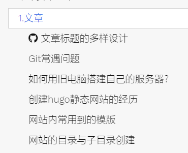

# 1.博客优化笔记

## 代码分制表

以`< tabs title="file name" >，< /tabs >`结尾；
然后里面写以`% tab title="code name" style="info" color="blue "  %，% /tab %`结尾
他们都需要用`{{}}`括起来

{}

````go

//代码块一
{}
    ```markdown
    **这里写代码**
    ```
{}
//代码块二
{}
    ```markdown
    **这里写代码**
    ```
{}


````

{}


## 显示附件文件

在双花括号里写：`attachments color="fuchsia" icon="fab fa-hackerrank"`，即可，

````go
    {}
````

------------------------------------------------------分割线

不论是创建首页页面，还是左边框的选项，归根结底它们都是“目录”，从根上说，你需要创建一个目录然后在目录里面创建一个.md文件来装这个目录或说显示这个目录的内容。

## 首页的创建

创建首页使用了命令

```c
    hugo new --kind home _index.md
```

而后产生的页面，它自动生成头文件

```c
    +++
    archetype = "home"
    title = ""
    +++
```

值得注意的是，如果你用命令

```c
    hugo new site myblog
```

创建了一个myblog的目录，那么你在里面操作**hugo new --kind home _index.md**的时候,用于显示首页的文件**_index.md**会自动产生在content文件里。

## 创建章节的方法

使用命令：

```c
    hugo new <chapter>/<name>/_index.md
```

或者：

```c
    hugo new <chapter>/<name>.md
```

在创建章节的时候需要加上`alwaysopen = false`,如下面的例子：

```c
        +++
        alwaysopen = false
        archetype = "chapter"
        title = "2.AndroidStudio"
        weight = 20
        +++
```

## 在标题前面显示图标

```c
    +++
    menuPre = "<i class='fab fa-github'></i> "
    +++
```

添加这个后的效果如下：



<!-- 导航栏 -->
<nav class="main-nav">
  <div class="container">
    <a href="/" class="logo">TechMind</a>
    <ul class="nav-links">
      <li><a href="/">首页</a></li>
      <li><a href="/tech">技术文章</a></li>
      <li><a href="/novel">小说</a></li>
    </ul>
    <div class="search-box">
      <form action="../search.html" method="get">
        <div class="searchform">
          <label class="a11y-only" for="R-search-by-detail">Search</label>
          <input data-search-input="" id="R-search-by-detail" class="search-by" name="search-by" type="search" placeholder="搜索..." _mstplaceholder="99723">
          <span class="btn cstyle interactive secondary"><button onclick="" type="submit"><i class="fa-fw fas fa-search"></i> <span class="title">搜索</span></button></span>
        </div>
      </form> 
    </div>
  </div>
</nav>

<!-- 主体内容 -->
<main class="container">
  <!-- 技术文章区 -->
  <section class="tech-articles">
  <h2>最新技术文章</h2>
  
  <article class="post-card">
    {{ partial "post-card.html" (dict "path" "log/7.初次安装AD需要做哪些设置？.md") }}
  </article>
  
  <article class="post-card">
    <div class="post-image">
      
    </div>
    <h3>#13 物联网网络安全论</h3>
    <p>探讨边缘计算环境下的安全防护体系...</p>
    <div class="meta">发布于 2024-03-12 | 分类：网络安全</div>
  </article>
</section>
  <!-- 小说专区 -->
  <aside class="novel-preview">
    <h2>连载小说</h2>
    <div class="chapter-preview">
      <h3>#8 桑叶白鸟卷</h3>
      <p>「殿下请看，这雕花窗棂的纹路暗合奇门遁甲之术...」</p>
      <p class="excerpt">太傅李大人手持竹简，青石地板上的光影随着日晷缓缓移动...</p>
      <a href="/chapter/8" class="read-more">继续阅读 →</a>
    </div>
  </aside>
</main>

<!-- 底部 -->
<footer class="site-footer">
  <div class="container">
    <div class="footer-links">
      <a href="#">关于我们</a> |
      <a href="#">隐私政策</a> |
      <a href="#">RSS订阅</a>
    </div>
    <p class="copyright">&copy; 2024 TechMind. 保留所有权利.</p>
  </div>
</footer>
<style>
  /* 基础样式 */
  :root {
    --primary-color: #2c3e50;
    --light-bg: #f8f9fa;
  }
  
  body {
    font-family: 'Open Sans', sans-serif;
    line-height: 1.6;
    color: #34495e;
    margin: 0;
  }
  
  .main-nav {
    background: var(--primary-color);
    padding: 2rem 0;
  }
  
  .nav-links {
    display: flex;
    gap: 2rem;
    list-style: none;
    padding: 0;
    margin: 0;
  }
  
  .post-card {
    background: white;
    padding: 2rem;
    margin-bottom: 2rem;
    border-radius: 8px;
    box-shadow: 0 2px 15px rgba(0,0,0,0.1);
  }
  
  .novel-preview {
    background: var(--light-bg);
    padding: 2rem;
    border-radius: 8px;
  }
  
  .read-more {
    color: var(--primary-color);
    text-decoration: none;
    font-weight: 500;
  }
  
  @media (min-width: 768px) {
    .container {
      display: grid;
      grid-template-columns: 3fr 1fr;
      gap: 3rem;
    }
  }
  /* 新增图片样式 */
  .post-image {
    width: 100%;
    border-radius: 8px;
    overflow: hidden;
    margin-bottom: 1.5rem;
  }
  
  .post-image img {
    width: 100%;
    height: 200px;
    object-fit: cover;
    transition: transform 0.3s ease;
  }
  
  .post-image:hover img {
    transform: scale(1.02);
  }
  
  /* 响应式调整 */
  @media (max-width: 768px) {
    .post-image img {
      height: 150px;
    }
  }
  </style>
  
{}