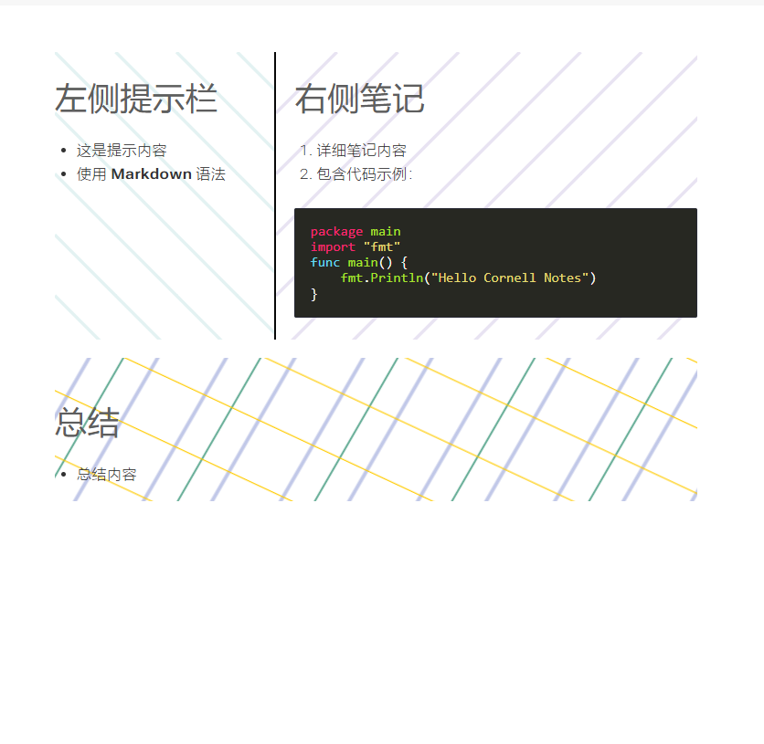
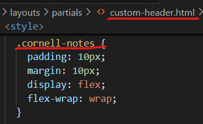
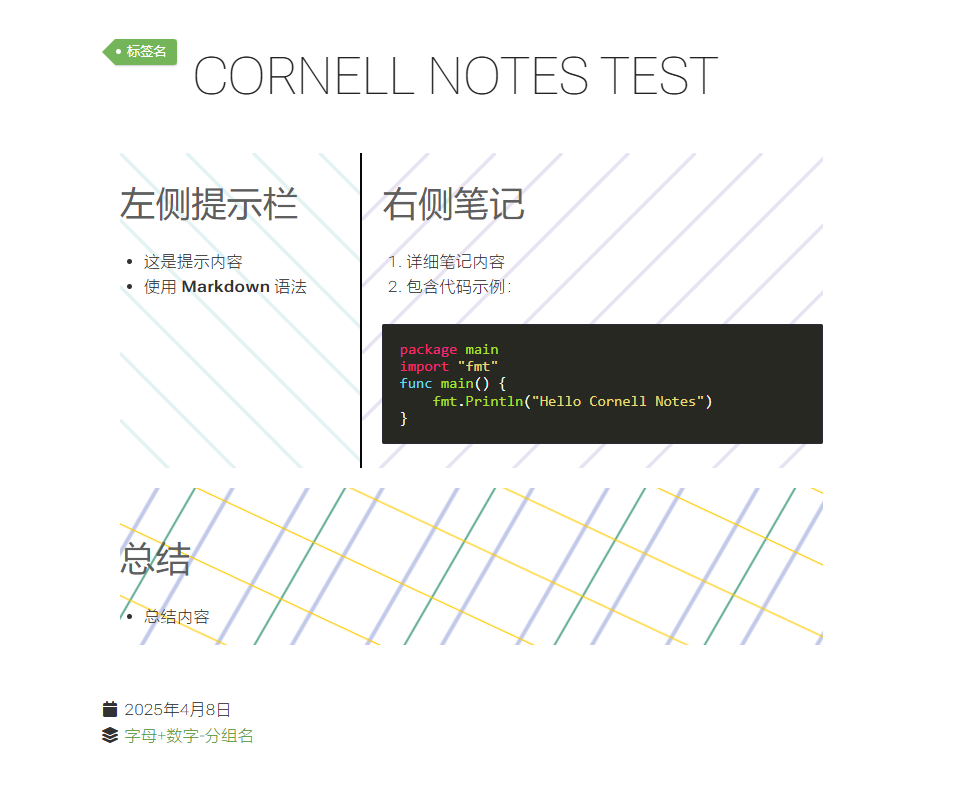

# 10.如何自定义hugo主题页面输出格式？

**声明：**需要注意文章只提供思路，当处理一些复杂问题时可能需要变换思路，所以请根据自身情况选择是否阅读本篇文章。

因本人没学过go语言，所以大部分代码都交由AI编写，不排除代码可能存在隐患。

接下来我以自己使用的hugo-theme-relearn主题为例，讲解如何自定义康奈尔笔记页面输出格式。（[hugo-theme-relearn主题](https://github.com/daojundang/hugo-theme-relearn)）

## 工程目录结构

```bash
your-blog/
├── archetypes/
│   └── cornell-notes.md        # 笔记原型模板
├── layouts/
│   ├── cornell-notes/
│   │   └── views/
│   │       └── article.html    # 页面布局模板
│   ├── partials/
│   │   ├── cornell-notes.html  # 内容输出逻辑
│   │   └── custom-header.html  # 自定义样式表
│   └── shortcodes/
│       ├── cues.html           # 左侧标签短代码
│       ├── notes.html          # 右侧内容短代码
│       └── summary.html        # 底部总结短代码
└── static/
    └── images/
        └── cornell-img/
            ├── icon1.svg       # 右侧装饰图标
            ├── icon2.svg       # 左侧装饰图标
            └── watermark.jpg   # 底部背景图
```

## 功能实现全流程

### 具体需求

我想输出一个左侧写标签，右侧写内容，最底下显示写总结的“康奈尔笔记”页面，使用命令：

```bash
hugo new --kind cornell-notes learning/algorithm/_index.md
```

创建.md文档后，md文件自动展示为如下格式：

```markdown
  +++
  title = "{{ replace .Name "-" " " | title }}"
  type = "cornell-notes"
  date = {{ .Date }}
  draft = true
  +++

  {}
  写标签区域

  {}

  {}
  写内容区域
  {}

  {}
  总结区域
  {}
```

当识别到短代码`{}`时，将`{}  {}`中的内容显示在标签一侧，剩下的依次类推。

### 样式定义

**注意：假设自己的主题目录为your-blog,那么接下来的文件创建都该目录下，[可参考目录结构](#工程目录结构)。**

创建 `layouts/partials/custom-header.html`（**遇到没有的目录或文件请自行创建，下同，所以不再提示！！**）

```html
<style>
/* 康奈尔笔记容器 */
.cornell-notes {
  padding: 20px;
  margin: 15px 0;
  display: flex;
  flex-wrap: wrap;
  background: #f9f9f9;
  border-radius: 8px;
  box-shadow: 0 2px 4px rgba(0,0,0,0.1);
}

/* 左侧标签区 */
.cues {
  background: url('/images/cornell-img/icon2.svg') no-repeat 95% 20px;
  border-right: 2px dashed #ccc;
  flex: 1;
  padding-right: 25px;
  min-width: 250px;
}

/* 右侧内容区 */
.notes {
  background: url('/images/cornell-img/icon1.svg') no-repeat 5% 20px;
  border-left: 2px dashed #ccc;
  flex: 2;
  padding-left: 25px;
  min-width: 300px;
}

/* 底部总结区 */
.summary {
  width: 100%;
  clear: both;
  padding: 20px;
  margin-top: 20px;
  background: url('/images/cornell-img/watermark.jpg') center/cover;
  border-radius: 6px;
  position: relative;
}

/* 响应式适配 */
@media (max-width: 768px) {
  .cornell-notes {
    flex-direction: column;
  }
  .cues, .notes {
    border: none;
    padding: 15px 0;
  }
}
</style>
```

### 短代码开发

​1.​左侧标签区​​ (`layouts/shortcodes/cues.html`):

```hugo
{{ $scratch := .Page.Scratch >}}
{{ $scratch.Set "cuesContent" ( .Inner | markdownify ) }}
```

2.右侧内容区：(`layouts/shortcodes/notes.html`):

```hugo
{{ $scratch := .Page.Scratch }}
{{ $scratch.Set "notesContent" ( .Inner | markdownify ) }}
```

3.底部总结区：(`layouts/shortcodes/summary.html`)：

```hugo
{{ $scratch := .Page.Scratch }}
{{ $scratch.Set "summaryContent" ( .Inner | markdownify ) }}
```

### 页面样式

创建页面样式 `layouts/partials/cornell-notes.html`：

```html
<div class="cornell-content">
  /*{{/* 初始化存储空间 */}}
  {{ .Scratch.Delete "cuesContent" }}
  {{ .Scratch.Delete "notesContent" }}
  {{ .Scratch.Delete "summaryContent" }}*/
  
  {{/* 触发短代码解析 */}}
  {{ $dummy := .Content }}
  
  {{/* 结构化输出 */}}
  <div class="cues-section">
    {{ with .Scratch.Get "cuesContent" }}
      <div class="cues-header">📌 关键标签</div>
      <div class="cues-body">{{ . | safeHTML }}</div>
    {{ else }}
      <div class="warning">⚠️ 未检测到标签内容</div>
    {{ end }}
  </div>

  <div class="notes-section">
    {{ with .Scratch.Get "notesContent" }}
      <div class="notes-header">📝 学习记录</div>
      <div class="notes-body">{{ . | safeHTML }}</div>
    {{ else }}
      <div class="warning">⚠️ 未检测到笔记内容</div>
    {{ end }}
  </div>

  <div class="summary-section">
    {{ with .Scratch.Get "summaryContent" }}
      <div class="summary-header">✨ 学习总结</div>
      <div class="summary-body">{{ . | safeHTML }}</div>
    {{ else }}
      <div class="warning">⚠️ 未检测到总结内容</div>
    {{ end }}
  </div>
</div>
```

### 页面内容输出逻辑

创建 `layouts/cornell-notes/views/article.html`：

```html
<article class="cornell-notes">
  {{ partial "cornell-notes.html" . }}
</article>
```

此处就是系统将自动调用了我们之前写的`layouts/partials/cornell-notes.html`文件，将内容输出到这个容器中。

**实际效果如下**：


为了丰富页面你可以设置标题、页脚等显示样式，这些你使用的主题一般会提供，如我这里的：

```html
<article class="cornell-notes">
  <header class="headline">
    {{partial "content-header.html" .}}
  </header>
  {{partial "heading-pre.html" .}}{{partial "heading.html" .}}{{partial "heading-post.html" .}}
  {{partial "cornell-notes.html" .}}

  <footer class="footline">
    {{partial "content-footer.html" .}}
  </footer>
</article>
```

代码说明如下（**都是基于我使用的主题，可不看**）：

1.从上而下，`article`容器的class值为`cornell-notes`，这个值在`layouts/partials/custom-header.html`中，这是之前编写页面布局时写的，此处调用该cornell-notes样式：

```html
<article class="cornell-notes">
```



2.编写内容顶栏代码，如果项目未提供就自己创建一个，同样放地，放在`layouts/partials/custom-header.html`中，因此次使用主题自带故不再创建。当然，你也可以选择不写。

```html
<header class="headline">
    {{partial "content-header.html" .}}
  </header>
```

对于标题设置：

```html
{{partial "heading-pre.html" .}}{{partial "heading.html" .}}{{partial "heading-post.html" .}}
```

页脚设置：

```html
<footer class="footline">
    {{partial "content-footer.html" .}}
  </footer>
```

**依实际需求而定，可写可不写**。

3.总而言之，如果你只是输出之前需求的页面，那么可以只写这句代码：

```html
<article class="cornell-notes">
  {{ partial "cornell-notes.html" . }}//就加了这句
</article>
```

`{{ partial "cornell-notes.html" . }}`这里就是去调用我们之前写的`layouts/partials/cornell-notes.html`文件，将内容输出到这个容器中。还记得吗?这个文件是我们写完短代码后写的文件，目的是将内容按照要求输出。

## 原型模板创建

我们在创建页面时，如果使用命令：
```bash
hugo new --kind cornell-notes log/cornell-notes/_index.md
```

这个命令会自动创建一个`archetypes/cornell-notes.md`模型的文件，实现这一操作你需要先创建`layouts/cornell-notes/views/article.html`，这一操作在上面已经完成，接下来只需要创建`archetypes/cornell-notes.md`文件即可。值得注意的是无论是命令、还是layouts、archetypes文件下，都提到了**cornell-notes**这个名字，所以创建时留意名字**需要相同**。

这里小结这一思路：

- 在`layouts/[fileName]/views/article.html`中编写页面输出逻辑。
- 在`layouts/[fileName].md`中编写文件模版
- 使用命令`hugo new --kind [fileName] [path]`生成模版文件

接下来是详细操作：

1.创建`archetypes/cornell-notes.md`文件：

```markdown
  +++
  title = "{{ replace .Name "-" " " | title }}"
  type = "cornell-notes"
  date = {{ .Date }}
  draft = true
  +++

  {}
  写标签区域

  {}

  {}
  写内容区域
  {}

  {}
  总结区域
  {}
```

2.使用方式

​​生成模版文件​​：

```bash
hugo new --kind cornell-notes learning/algorithm/_index.md
```

实际效果图：



需要注意的是写模版文件的时候是依据你个人需求而定的，例如创建`layouts/[fileName]/views/article.html`这样的文件，在有些主题可能是`layouts/partials/[fileName]/article.html`，又如，此处md文件头部模版为：

```markdown
+++
  title = "{{ replace .Name "-" " " | title }}"
  type = "cornell-notes"
  date = {{ .Date }}
  +++
```

而有些则是以：

```markdown
  ---
    title = "{{ replace .Name "-" " " | title }}"
    archetype = "cornell-notes"
    date = {{ .Date }}
  ---
```

旨在告诉你编写形式各不相同，所以清楚这一思路即可。**要避免这些坑请结合主题的说明文档帮助查看**。

## 总结

最后的最后做个总结，要想自定义hugo主题页面输出格式，你可以按照如下步骤展开：

- 确定需求，不会写代码让AI完成。
- 如果有需要请编写段代码。
- 编写输出逻辑，如果不会还请求助社区、AI等。
- 编写页面模板，参照以上思路，同时参考自己hugo主题的文档说明