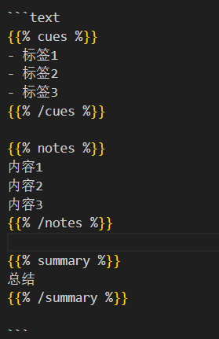

# 10.如何自定义hugo主题页面输出格式？

声明：需要注意文章只提供思路，当处理一些复杂问题时可能需要更改思路，甚至需要修改主题源码，所以请根据自身情况选择是否阅读本篇文章。

因本人没学过go语言，所以大部分代码都交由AI编写，那么此时就需要明确需求并多次与AI沟通修改，得到符合需求的代码。

接下来我以自己使用的hugo-theme-relearn主题为例，讲解如何自定义页面输出格式。（[hugo-theme-relearn主题](https://github.com/daojundang/hugo-theme-relearn)）

## 工程目录结构

```bash
your-blog/
├── archetypes/
│   └── cornell-notes.md        # 笔记原型模板
├── layouts/
│   ├── cornell-notes/
│   │   └── views/
│   │       └── article.html    # 页面布局模板
│   ├── partials/
│   │   ├── cornell-notes.html  # 内容输出逻辑
│   │   └── custom-header.html  # 自定义样式表
│   └── shortcodes/
│       ├── cues.html           # 左侧标签短代码
│       ├── notes.html          # 右侧内容短代码
│       └── summary.html        # 底部总结短代码
└── static/
    └── images/
        └── cornell-img/
            ├── icon1.svg       # 右侧装饰图标
            ├── icon2.svg       # 左侧装饰图标
            └── watermark.jpg   # 底部背景图
```

## 功能实现全流程

我想输出一个左侧写标签，右侧写内容，最底下显示写总结的“康奈尔笔记”页面，使用命令创建.md文档后，使用如下格式编写内容：



当识别到cues时，将内容显示在标签一侧，依次类推。

### 一、样式定义

创建 `layouts/partials/custom-header.html`：

```html
<style>
/* 康奈尔笔记容器 */
.cornell-notes {
  padding: 20px;
  margin: 15px 0;
  display: flex;
  flex-wrap: wrap;
  background: #f9f9f9;
  border-radius: 8px;
  box-shadow: 0 2px 4px rgba(0,0,0,0.1);
}

/* 左侧标签区 */
.cues {
  background: url('/images/cornell-img/icon2.svg') no-repeat 95% 20px;
  border-right: 2px dashed #ccc;
  flex: 1;
  padding-right: 25px;
  min-width: 250px;
}

/* 右侧内容区 */
.notes {
  background: url('/images/cornell-img/icon1.svg') no-repeat 5% 20px;
  border-left: 2px dashed #ccc;
  flex: 2;
  padding-left: 25px;
  min-width: 300px;
}

/* 底部总结区 */
.summary {
  width: 100%;
  clear: both;
  padding: 20px;
  margin-top: 20px;
  background: url('/images/cornell-img/watermark.jpg') center/cover;
  border-radius: 6px;
  position: relative;
}

/* 响应式适配 */
@media (max-width: 768px) {
  .cornell-notes {
    flex-direction: column;
  }
  .cues, .notes {
    border: none;
    padding: 15px 0;
  }
}
</style>
```

### 二、短代码开发

​​左侧标签区​​ (`layouts/shortcodes/cues.html`)

```html
{{ $scratch := .Page.Scratch }}
{{ $scratch.Set "cuesContent" ( .Inner | markdownify ) }}

​```

​右侧内容区​​ ( `layouts/shortcodes/notes.html` )

```html
{{ $scratch := .Page.Scratch }}
{{ $scratch.Set "notesContent" ( .Inner | markdownify ) }}

​```

​底部总结区​​ (`layouts/shortcodes/summary.html`)

```html
{{ $scratch := .Page.Scratch }}
{{ $scratch.Set "summaryContent" ( .Inner | markdownify ) }}
```

### 三、内容输出逻辑

创建 `layouts/partials/cornell-notes.html`：

```html
<div class="cornell-content">
  /*{{/* 初始化存储空间 */}}
  {{ .Scratch.Delete "cuesContent" }}
  {{ .Scratch.Delete "notesContent" }}
  {{ .Scratch.Delete "summaryContent" }}*/
  
  {{/* 触发短代码解析 */}}
  {{ $dummy := .Content }}
  
  {{/* 结构化输出 */}}
  <div class="cues-section">
    {{ with .Scratch.Get "cuesContent" }}
      <div class="cues-header">📌 关键标签</div>
      <div class="cues-body">{{ . | safeHTML }}</div>
    {{ else }}
      <div class="warning">⚠️ 未检测到标签内容</div>
    {{ end }}
  </div>

  <div class="notes-section">
    {{ with .Scratch.Get "notesContent" }}
      <div class="notes-header">📝 学习记录</div>
      <div class="notes-body">{{ . | safeHTML }}</div>
    {{ else }}
      <div class="warning">⚠️ 未检测到笔记内容</div>
    {{ end }}
  </div>

  <div class="summary-section">
    {{ with .Scratch.Get "summaryContent" }}
      <div class="summary-header">✨ 学习总结</div>
      <div class="summary-body">{{ . | safeHTML }}</div>
    {{ else }}
      <div class="warning">⚠️ 未检测到总结内容</div>
    {{ end }}
  </div>
</div>
```

### 四、页面模板配置

创建 `layouts/cornell-notes/views/article.html`：

```html
<article class="cornell-notes-article">
  <header class="article-header">
    {{ partial "content-header.html" . }}
  </header>
  
  {{ partial "heading-pre.html" . }}
  {{ partial "heading.html" . }}
  {{ partial "heading-post.html" . }}

  <section class="cornell-main">
    {{ partial "cornell-notes.html" . }}
  </section>

  <footer class="article-footer">
    {{ partial "content-footer.html" . }}
  </footer>
</article>
```

### 五、原型模板创建

新建 `archetypes/cornell-notes.md`：

```markdown
  +++
  title = "{{ replace .Name "-" " " | title }}"
  type = "cornell-notes"
  date = {{ .Date }}
  draft = true
  +++

  {}
  <!-- 左侧标签内容 -->
  - [核心概念]
  - [关键问题]
  - [记忆要点]
  {}

  {}
  <!-- 右侧笔记内容 -->
  ## 学习记录
  1. 核心知识点说明
  2. 重点公式推导
  3. 案例实践分析
  {}

  {}
  <!-- 总结提炼 -->
  ✨ 核心收获：
  1. 关键知识点总结
  2. 实践应用方向
  {}
```

## 使用方式

​​创建新笔记​​：

```bash
hugo new --kind cornell-notes learning/algorithm/_index.md
```

​​内容编辑示例​​：

```markdown
  {}
  - [递归算法]
  - [动态规划]
  - [复杂度分析]
  {}

  {}
  ## 递归算法精要
  1. 递归三要素：
    - 基线条件
    - 递归关系
    - 参数收敛

  2. 经典案例：
    ```python
    def factorial(n):
        if n == 0:
            return 1
        return n * factorial(n-1)
    ```
  {}

  {}
  ✨ 学习总结：

  掌握递归算法的实现要点
  理解递归与迭代的转换关系
  能够分析递归调用栈的空间复杂度
  {}

```
