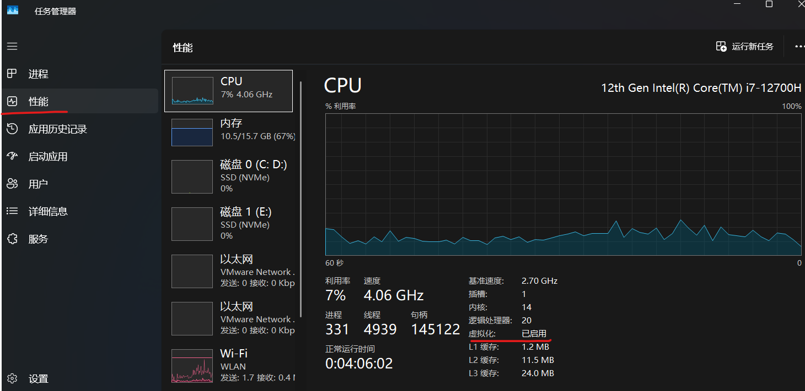
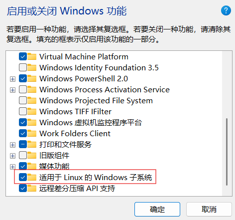
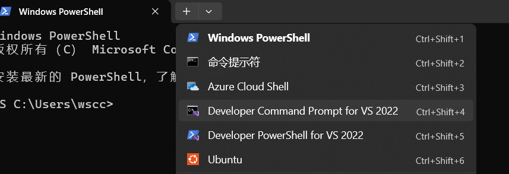
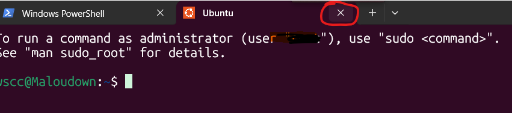
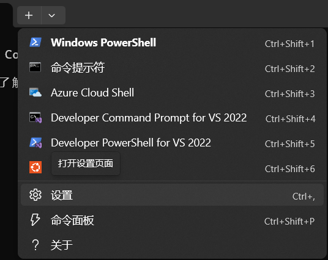
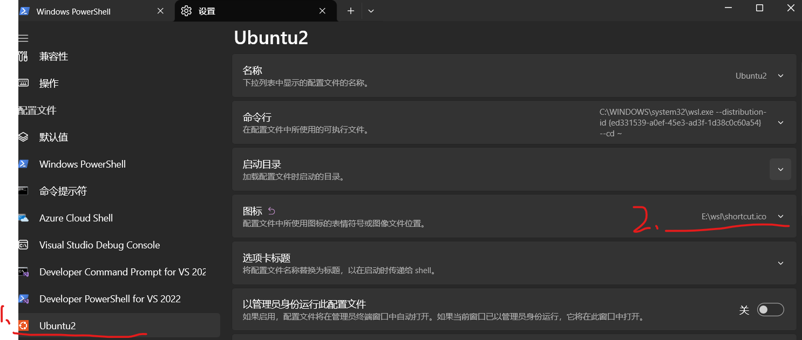

# 13.win11安装WSL详细步骤

记录如何使用WSL在win11上安装Linux子系统系统。启动方便快捷，而且可以切换多个Linux发行版本，以及随时删除，占用内存也不大。

## 先决条件

### 检查CPU虚拟化是否开启



### 打开启用或关闭Windows功能

- 开启虚拟机平台（如果有）
- 开启适用于Linux的Windows子系统



### 使用WSL安装Linux子系统

（1）打开powershell，安装子系统

```bash
wsl --install --web-download
```

如果有提示重启，重启即可。

（2）查看下载内容：

```bash
wsl --list

适用于 Linux 的 Windows 子系统分发:
Ubuntu (默认)
```

（3）第一次启动Linux子系统,创建用户并设置密码。

```bash
wsl -d Ubuntu #启动Ubuntu

exit #退出Ubuntu
```

（4）安装其他Linux发行版

```bash
wsl --list --online #查看可安装版本
wsl --install -d Debian #安装Debian
```

（5）设置默认启动的Linux发行版

默认启动的版本使用`wsl --list -v`查看当前安装的版本，前面有*号的就是默认版本，更改的方法是：

```bash
wsl --set-default [Linux发行版名称]
```

## 简单的启动与关闭方式

关闭powershell，再次打开，展开命令提示符，可以快速启动Linux子系统。



关闭也很简单，点击启动页面的X号即可。


## wsl.config与.wslconfig的配置

（1）wsl.config

- 作用：用于配置 WSL 内部（即 Linux 子系统内）的行为，比如挂载方式、自动挂载的驱动器、网络等。
- 位置：位于每个 WSL 发行版的 Linux 根目录下的 /etc/wsl.conf 文件（注意不是 Windows 下的 wsl.config）。
- 生效范围：只影响当前 Linux 发行版。
- 此次配置内容（有其他配置，详细看官网文档）：

```bash
[boot]
systemd=true #启动时自动挂载驱动器
```

（2）.wslconfig

- 作用：用于配置 WSL2 虚拟机的全局行为，比如分配给 WSL2 的内存、CPU 数量、交换空间等。
- 位置：位于 Windows 用户主目录下（如 C:\Users\你的用户名\.wslconfig）。
- 生效范围：影响所有 WSL2 发行版（全局设置）。
- 此次配置（有其他配置，详细看官网文档）：

```bash
[wsl2]
networkingMode=mirrored #网络模式为桥接模式,使电脑IP地址与Linux子系统IP地址一致
```

这样你的 Windows 和 WSL2 子系统会使用相同的网络（IP 地址段），WSL2 的网络行为会更像物理机或虚拟机桥接，方便与局域网其他设备通信。

## 卸载Linux子系统

```bash
wsl --list -v #查看当前安装的版本
wsl --unregister [Linux发行版名称]
```

## 更改Ubuntu存储路径（通过 wsl --import 手动指定路径）

```bash
#查看当前安装的版本
wsl --list -v 

# 导出发行版（如Ubuntu）到tar文件
wsl --export Ubuntu D:\wsl-images\ubuntu.tar

# 注销原始发行版（释放默认路径）
wsl --unregister Ubuntu

# 重新导入到自定义路径（例如 D:\wsl\ubuntu）
wsl --import Ubuntu D:\wsl\ubuntu D:\wsl-images\ubuntu.tar --version 2
```

可能出现的问题，Ubuntu图标不显示，启动windows时报错**找到一个带有无效"icon" 的配置文件。将该配置文件默认为无图标。确保设置"icon" 时，该值是图像的有效文件路径。**


解决办法：

（1）打开powershell，点击设置：


（2）按照如下图选择图标路径（一般情况下，启动过一次导出的Ubuntu，导出的目录下会有该图标，如果没有请自己添加一个）


## 参考资料

【1】[WSL 文档](https://learn.microsoft.com/zh-cn/windows/wsl/about)
【2】[超详细的WSL教程：Windows上的Linux子系统.mp4](https://www.bilibili.com/video/BV1tW42197za?spm_id_from=333.788.videopod.sections&vd_source=5e8e4e9e284af3291f1a3addff3fc2c3)