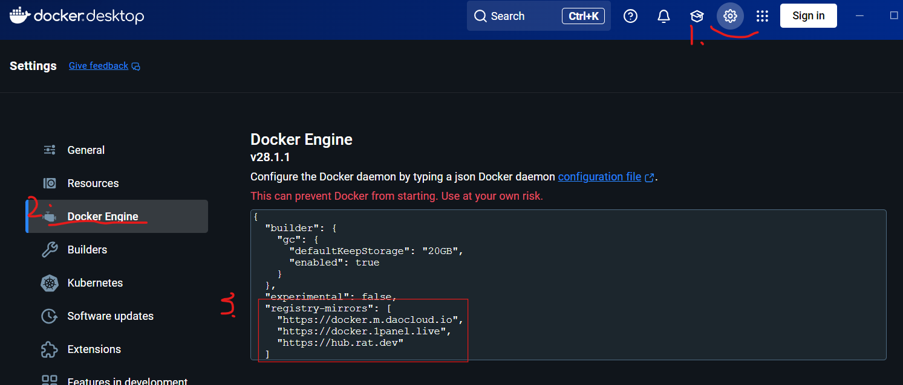
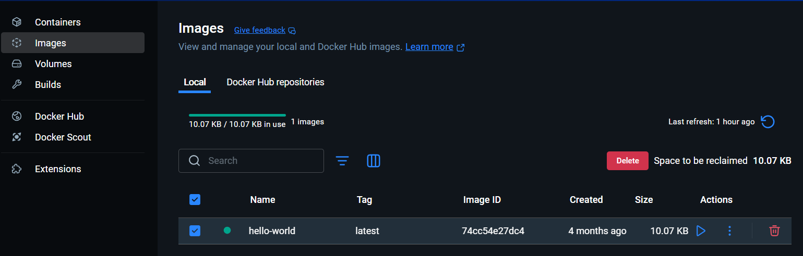

# 14.Win11安装Docker详细教程

## 写在前

本篇文章参考了B站UP的视频，视频链接：[【B站】](https://www.bilibili.com/video/BV1fS411A71Y/?spm_id_from=333.1007.top_right_bar_window_history.content.click&vd_source=5e8e4e9e284af3291f1a3addff3fc2c3)

## 什么是 Docker？

Docker 是一个开源的容器化平台，用于打包、分发和运行应用程序。它可以把应用及其所有依赖（如代码、运行环境、库等）打包到一个“容器”中，使应用能够在任何支持 Docker 的环境中快速、一致地运行。

Docker 的主要用途：

- 环境隔离：每个容器都是独立的，互不影响，避免“在我电脑上能跑”的问题。
- 快速部署：应用和环境一次打包，到处运行，极大简化部署流程。
- 持续集成/持续交付（CI/CD）：方便自动化测试、构建和部署。
- 资源高效：容器比虚拟机更轻量，启动速度快，占用资源少。
- 微服务架构：每个服务可以单独打包成容器，方便扩展和维护。

简单来说，Docker 让开发、测试、部署应用变得更简单、更高效、更可靠。

## 下载 Docker desktop

下载链接：[【GitHub仓库】](https://github.com/tech-shrimp/docker_installer/releases/tag/latest)

## 安装 Docker desktop

方法1：下载后点击exe直接安装，默认安装在C盘。

方法2：自定义安装路径

下载的安装包名字为**docker_desktop_installer_windows_x86_64.exe**，则使用下面的命令安装：

```bash
start /w "" "docker_desktop_installer_windows_x86_64.exe" install --installation-dir=D:\Docker
```

然后等待安装完成即可。

## 配置 Docker desktop



添加如下代码：

```bash
{
  "registry-mirrors": [
    "https://docker.m.daocloud.io",
    "https://docker.1panel.live",
    "https://hub.rat.dev"
  ]
}
```

## 测试案例1：hello-world

打开cmd/powershell，输入如下命令：

```bash
docker run hello-world
```

显示**Hello from Docker!**，说明安装成功：

```bash
Hello from Docker!
This message shows that your installation appears to be working correctly.

To generate this message, Docker took the following steps:
 1. The Docker client contacted the Docker daemon.
 2. The Docker daemon pulled the "hello-world" image from the Docker Hub.
    (amd64)
 3. The Docker daemon created a new container from that image which runs the
    executable that produces the output you are currently reading.
 4. The Docker daemon streamed that output to the Docker client, which sent it
    to your terminal.

To try something more ambitious, you can run an Ubuntu container with:
 $ docker run -it ubuntu bash

Share images, automate workflows, and more with a free Docker ID:
 https://hub.docker.com/

For more examples and ideas, visit:
 https://docs.docker.com/get-started/
```

## 测试案例2：安装nginx:alpine

打开cmd/powershell，输入如下命令：

```bash
docker run -d -p 8080:80 --name my-nginx nginx:alpine
```

**注意**：为了防止端口冲突，可以先检擦下8080端口是否被占用：

```bash
netstat -ano | findstr :8080
```

如果显示**LISTENING**，则说明被占用，你可以关掉该端口：

```bash
#强制终止 PID,下面的 11432 是监听的进程号
taskkill /PID 11432 /F

# 验证端口是否释放
netstat -ano | findstr :8080
```

或者改用别的端口，如果你已经先执行了`docker run -d -p 8080:80 --name my-nginx nginx:alpine`,那么建议你先关闭容器，接着删除容器，然后重新指定别的端口。

然后打开浏览器，输入**http://localhost:8080** ，页面会显示nginx的欢迎页面。

## 一些基本操作命令

```bash
docker pull 镜像名  # 下载镜像
docker run -it 镜像名 # 运行镜像
docker ps -a         # 查看所有容器
docker start 容器id  # 启动容器


docker stop 容器id   # 停止容器
docker rm 容器id     # 删除容器
docker rmi 镜像id    # 删除镜像,停止和删除容器后才能删除镜像
```

对于启动的容器，可以使用dockerUI界面进行管理，如运行，停止，删除等操作。如下图：

