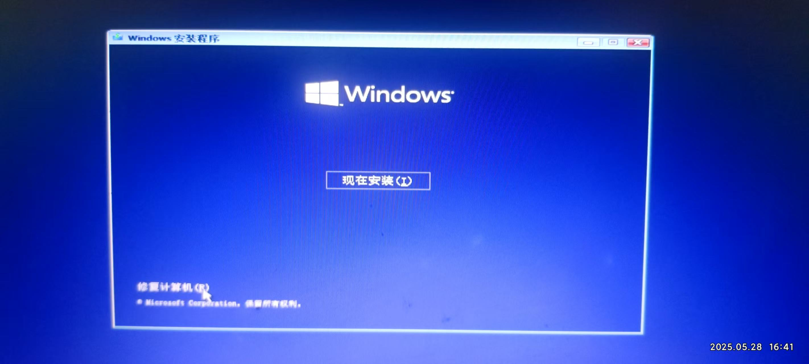
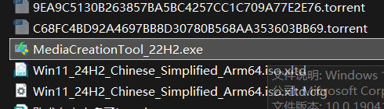
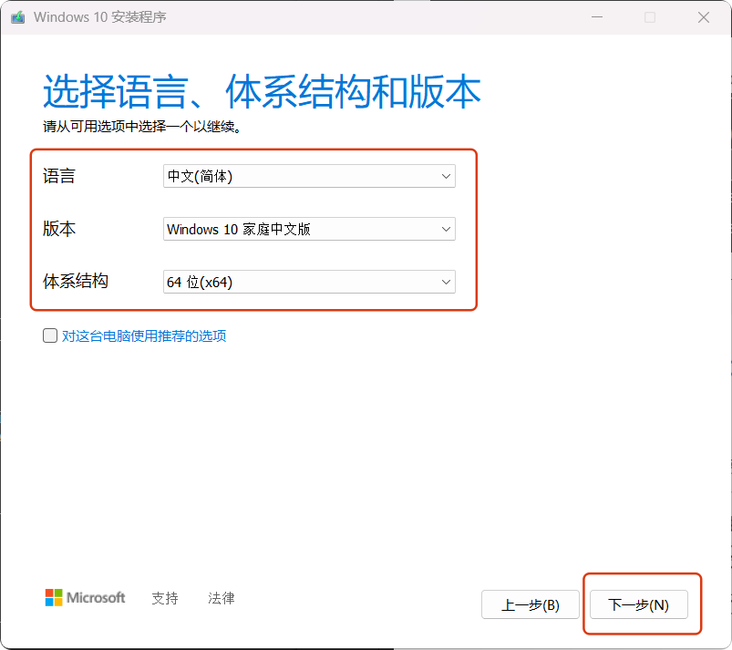
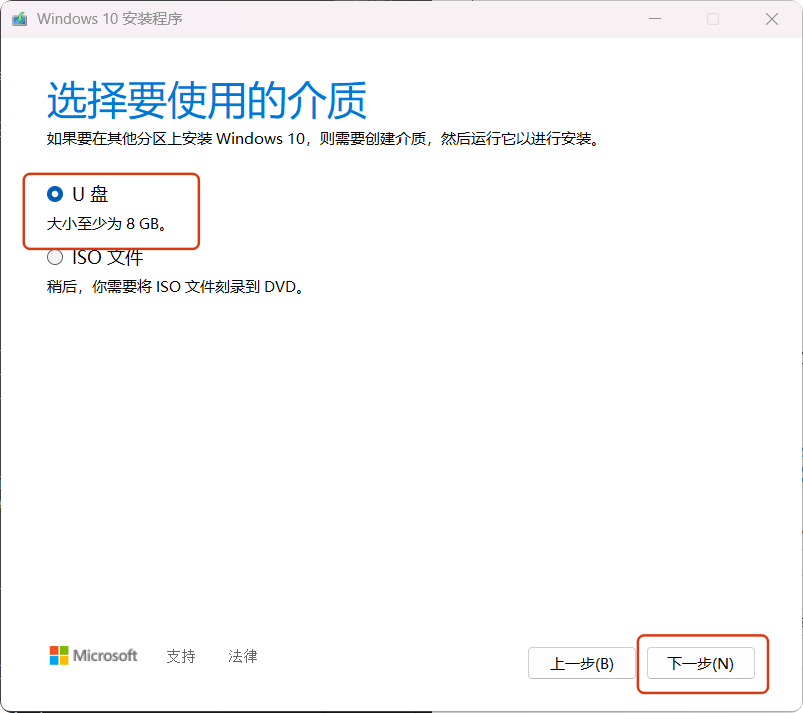
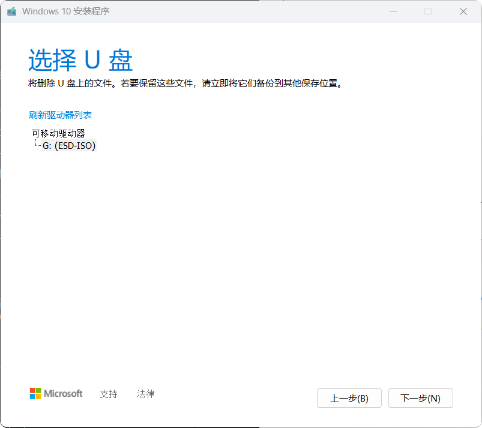
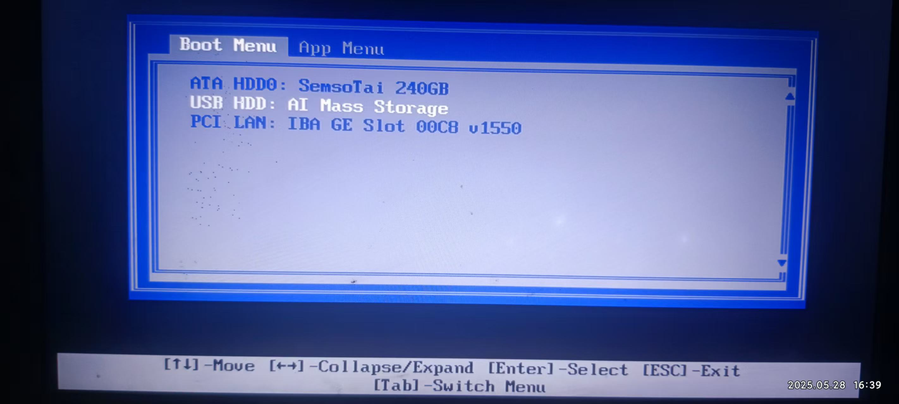
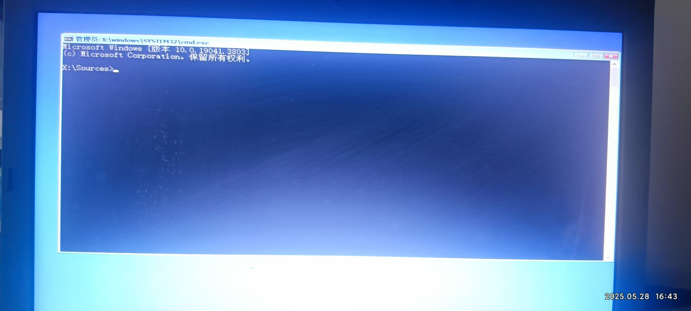

# 15.win10电脑忘记密码无法登录怎么办

## 简介

最近再给一个10年前的联想电脑装系统的时候，发现忘记密码了，用户还是管理员（Administrator），将这个问题发给Deepseek后得到了下面的解决办法，为此记录这个过程，经过一番折腾最终也是解决了问题，但是过程很像**重装系统的前半流程**。

本文的解决的重置密码，最终需要进入下面这个界面，然后点击**修复计算机（R）**，如果你有别的办法进入下面这个页面，请直接跳到本篇文章[打开命令提示符进行设置](#打开命令提示符进行设置)，然后继续操作。


## 涉及工具

- 2台电脑：忘记密码的电脑，一台可以正常登录的电脑；
- 大于8G的U盘（U盘内有数据要提前备份）；
- win10安装媒体：[下载地址](https://www.microsoft.com/zh-cn/software-download/windows10)


## 操作步骤

前面已经提到有部分流程与重装系统流程类似，说的就是下面的内容

### 运行重置工具

（1）点击下载好的MediaCreationTool.exe，并同意条款。



（2）选择为另一台电脑创建安装介质（U盘、DVD或ISO文件），并下一步。


（3）下面三项需要根据你的实际情况选择，然后点击下一步：


（4）选择**U盘**（选择**ISO文件**也可以），并点击下一步，这一步需要很长一段时间，耐心等待即可。


（5）选择U盘，点击下一步


### 进入重置密码界面

（1）选择从U盘启动

将制作好的U盘插入忘记密码的电脑，重启电脑，按住F12（电脑品牌不同按键不同），在当前的 **​​Boot Menu**​​ 界面中，选择U盘启动（​​USB HDD: AI Mass Storage）。



（2）进入Windows安装/修复界面​​

- 等待U盘加载完成后，会进入 ​​Windows安装界面​​（蓝底白字），不用选择直接下一步。

- ​不要点击“安装”​​！直接点击左下角的 ​​“修复计算机”​​（Repair your computer）。


[注：若未显示“修复计算机”，重启后重复步骤1]

### 打开命令提示符进行设置

（1）在修复界面选择：

​​疑难解答（Troubleshoot） → 高级选项（Advanced Options） → 命令提示符（Command Prompt）​


（2）执行密码重置操作​​

​​替换系统工具（Utilman.exe）​​，输入以下命令，将“轻松使用”按钮替换为命令提示符：
```bash
copy c:\windows\system32\utilman.exe c:\
copy c:\windows\system32\cmd.exe c:\windows\system32\utilman.exe
```
（完成后会提示“已复制1个文件”）

（3）重启电脑

输入如下命令重启电脑：
```bash
wpeutil reboot
```

### 通过“轻松使用”图标重置密码
​​
在登录界面右下角，点击 ​​“轻松使用”图标​​（图标为一个小人和时钟）。此时会弹出命令提示符窗口，输入命令重置密码（替换 username 和 newpassword）：
```bash
net user username newpassword

#例如
net user John 123456
```

### 恢复系统文件（重要！）
​​
登录成功后，以管理员身份打开 ​​新的命令提示符​​（搜索 cmd → 右键以管理员运行）。输入命令还原被替换的文件：

```bash
copy c:\utilman.exe c:\windows\system32\utilman.exe
```

（提示覆盖时输入 Y 确认）

## 可能出现的问题以及解决

​（1）​U盘启动后直接进入安装界面，没有“修复计算机”选项​​：

- 重启后重新选择U盘启动，在安装界面仔细寻找左下角的“修复计算机”。
- 若仍不显示，可能是U盘制作问题，需重新下载官方镜像并制作安装U盘。

​（2）​命令执行后提示“拒绝访问”​​：

- 确保从修复环境的命令提示符操作（步骤3），而非普通系统内的CMD。
​
（3）​重置密码后仍无法登录​​：

- 检查用户名是否输入正确（区分大小写），或尝试启用隐藏管理员账户：

```bash
net user Administrator /active:yes
```
