# 16.如何给电脑装win10系统

## 简介

如何给一台老的电脑装win10系统，本文以14年产的Thinkpad联想电脑为例，记录整个过程。

## 准备工具

- 1台电脑；
- 大于8G的U盘（U盘内有数据要提前备份）；
- 下载生成镜像文件的工具：[MediaCreationTool](https://www.microsoft.com/zh-cn/software-download/windows10)
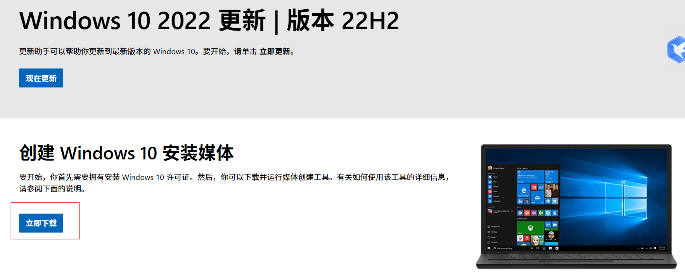
- 下载重装系统辅助工具
  - [ventoy官网 ](https://www.ventoy.net/cn/download.html)|| [也可以选择GitHub下载](https://github.com/ventoy/Ventoy/releases/tag/v1.1.05)
  - [rufus](https://rufus.ie/zh/#google_vignette)

|工具	|多系统支持	|操作便捷性	|兼容性	|适用场景|
|---|---|---|---|---|
|Ventoy	|支持	|很方便	|很好	|多系统/频繁更换ISO|
|Rufus	|不支持	|一般	|极好	|单一系统/极致兼容|

总结：
- 想要一个U盘放多个系统镜像，推荐 Ventoy。
- 只做单一系统启动盘、追求极致兼容性，推荐 Rufus。

这里因为我的电脑太旧了，为了确保能成功安装，所以选择了refus(当然vertoy也会介绍怎么用)。

## 具体操作步骤

### 制作启动盘

#### 生成镜像文件

如你已有ISO镜像文件，请跳过这个步骤。

（1）运行下载好的MediaCreationTool.exe，同意条款后继续下一步：

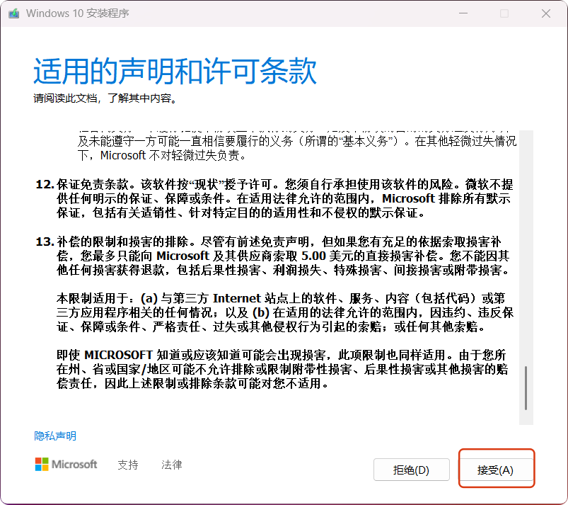

（2）选择为另一台电脑创建安装介质（U盘、DVD或ISO文件），并下一步：
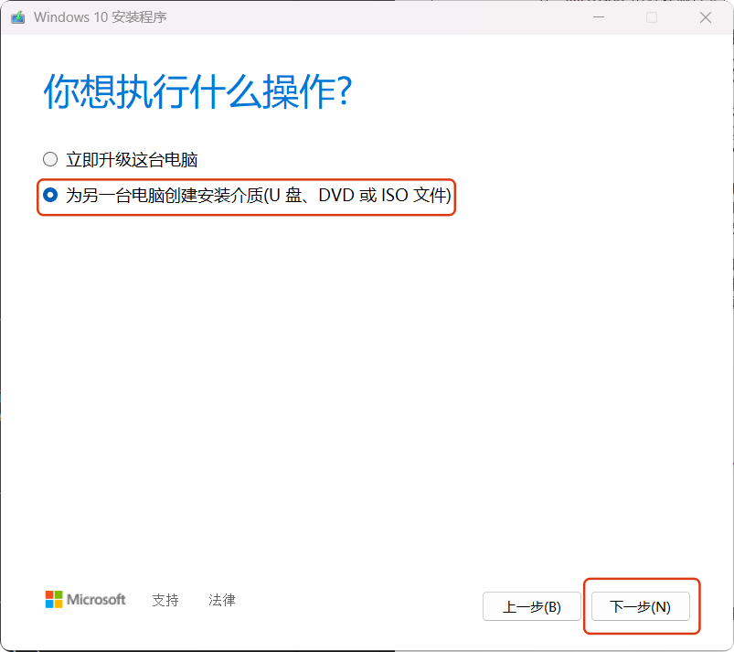

（3）下面三项需要根据你的实际情况选择，然后点击下一步：

（4）选择ISO文件（U盘这项我没选，不知道可不可行）
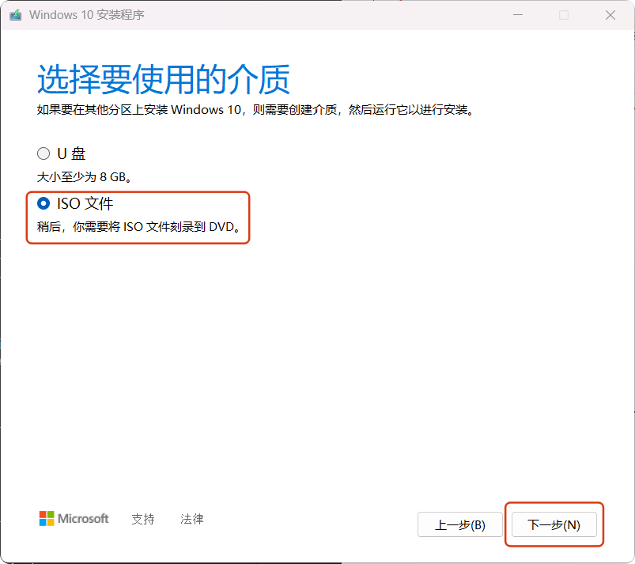

（5）选择镜像文件保存位置。可以直接保存到U盘，也可以选择其他位置，然后点击下一步（这一步需要花费一点时间，请耐性等待）：
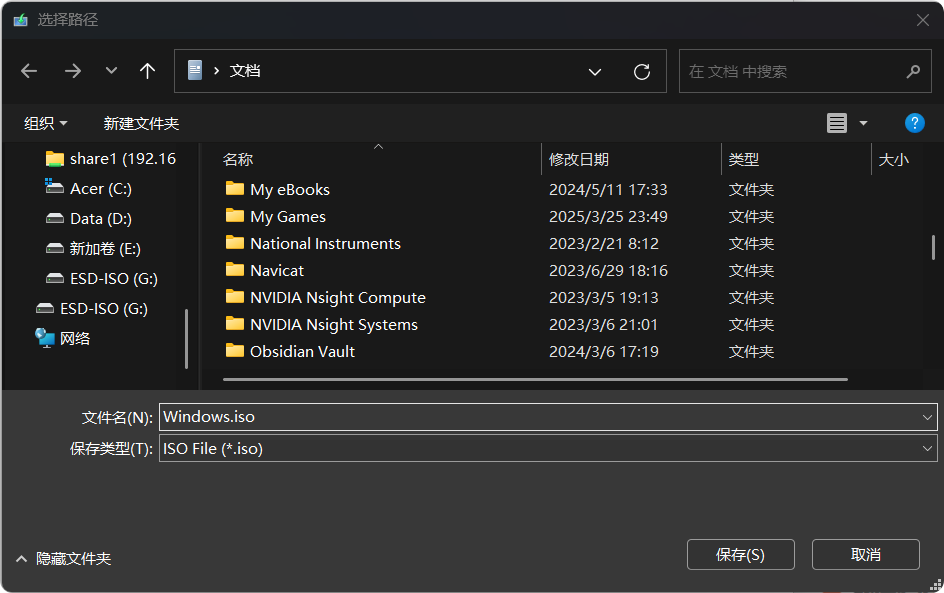

#### 使用rufus制作启动盘

点击下载好的rufus.exe，做好如图设置，然后点击**开始**：
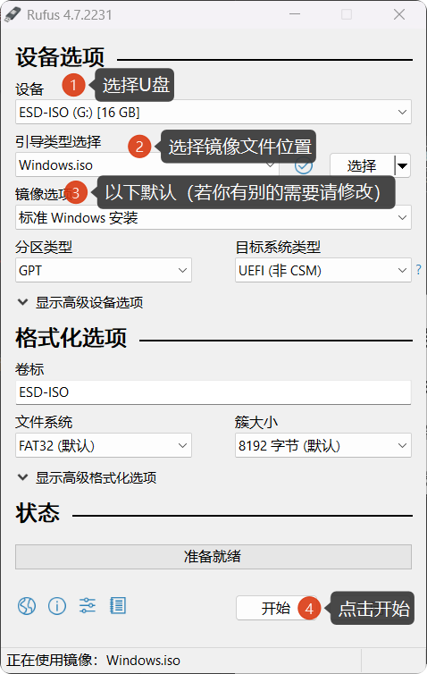

等待制作完成。

#### 使用ventoy制作启动盘

（1）将镜像文件复制到U盘根目录下。

（2）配置vertoy，安装工具到U盘：
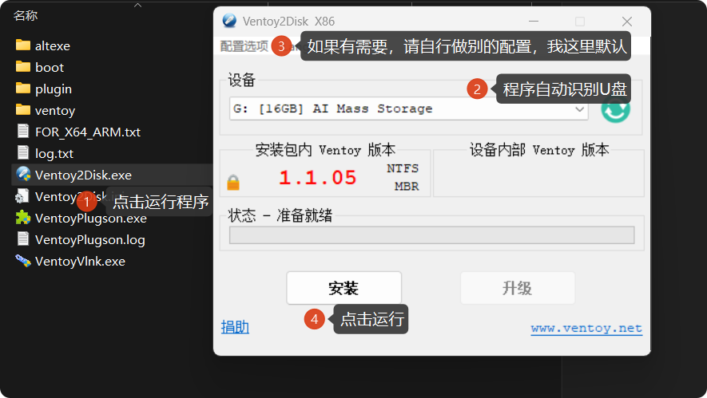

至此，U盘制作完成，接下来就是进入重装系统。

### 重启电脑

插入忘记密码的那台电脑，重启电脑，按住F12（电脑品牌不同启动不同）。在当前的 **​​Boot Menu**​​ 界面中，选择U盘启动（​​USB HDD: AI Mass Storage），进入重置工具界面。

- 如果选择的是ventoy，则会进入下面的界面：
按下**L**键，设置语言为中文，显示如下：
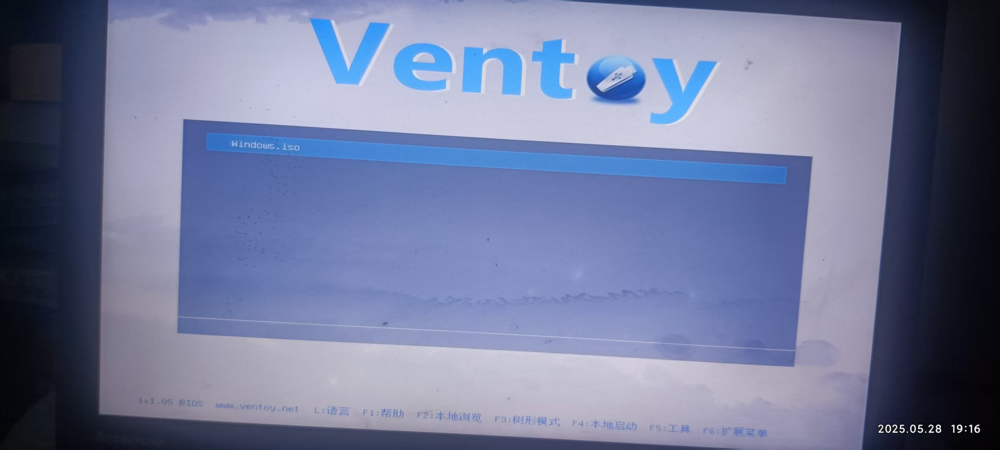
点击镜像文件，选择**以正常模式启动**：
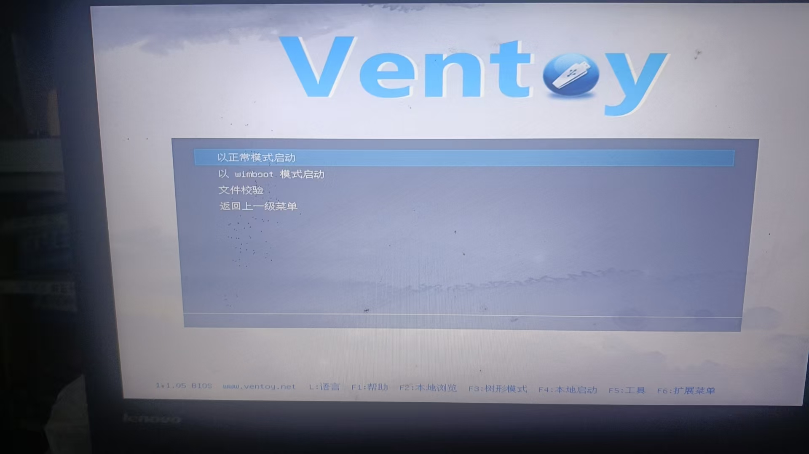

然后会跳到​​Windows安装界面​​（蓝底白字）。

- 如果选择的是rufus，则会直接跳到​​Windows安装界面​​（蓝底白字）：

### 进入Windows安装界面

（1）安装设置

等待画面跳转到 ​​Windows安装界面​​（蓝底白字），按需求选择（我这里默认）直接下一步。
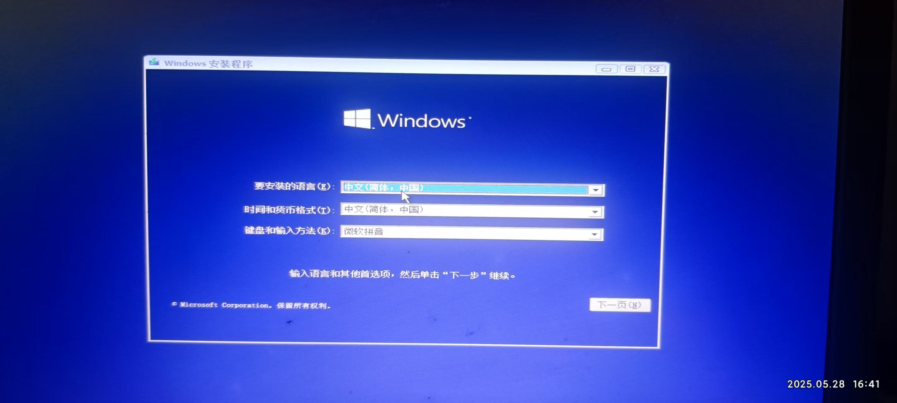

​点击“**现在安装**”​​！

（3）选择仅安装Windows，并创建分区

这里因为是重装系统，根据提示信息可知选择第二项：
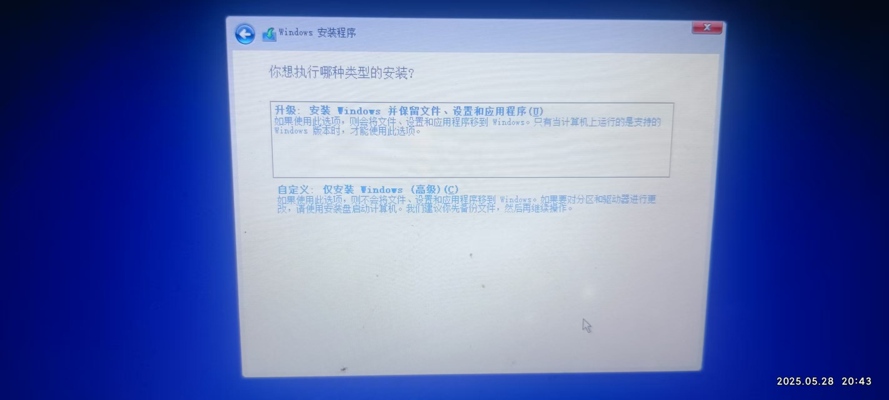

选择磁盘，并点击删除，**注意：这一操作将导致数据被删除，如有需要，请一定要提前备份好数据原始数据。**
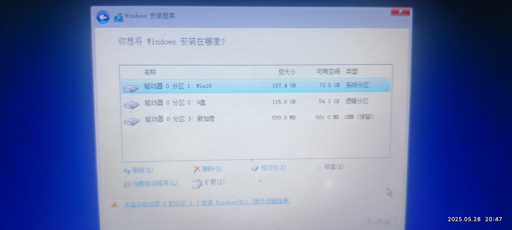

以图片中的为例，删除后磁盘总量变为220G，此时选择该磁盘，然后点击下方的新建分区，输入如102400MB，点击应用。
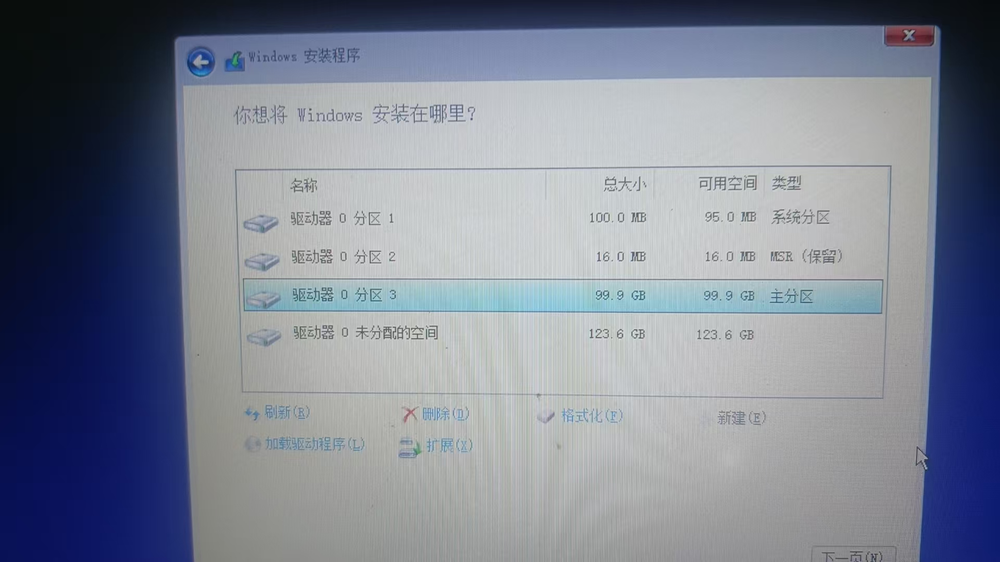
此时会为你创建三个分区，分别为：

- 系统分区：100MB
- MSR（保留）:16MB
- 主分区：99.9GB
- 未分配空间：123.6GB

**未分配空间**可以等装完系统后，再进入**电脑磁盘管理**进行分配。

以上磁盘分配好后，选择主分区磁盘，并点击先一步。后面按照提示操作即可，这里就不再赘述。

## 遇到的问题

在上面点击 **“现在安装”** 可能会跳转到一个提示页面，提示：**找不到任何设备驱动程序。请确保安装介质包含正确的驱动程序，然后单击“确定”**，如下图所示：
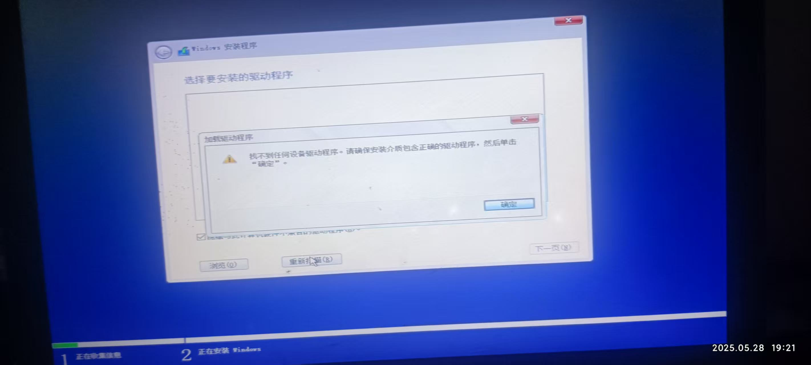

### 这里有三个可能的原因

- 1.缺少存储控制器驱动
  - Windows安装程序未包含你电脑主板芯片组（如Intel RST/VMD或AMD SATA/RAID驱动）的驱动程序，导致无法识别硬盘或SSD
  - 但是一般电脑要是能识别U盘，那说明驱动没问题。（个人猜测）
- 2.安装介质问题
  - 制作的U盘有问题，导致无法识别。
- 3.USB接口兼容性问题
  - U盘接口与电脑USB接口不兼容，导致无法识别。

### 解决办法

由于缺少驱动这一点需要下载合适的 **​SATA/RAID驱动​​**，这部分个人目前没有办法提供相关帮助，此处只提供针对第二、第三种问题的解决办法。

- **1.更换USB接口（推荐！）**：
  - 将U盘插入主板背面的 `​​USB 2.0`接口​​（黑色接口），避免使用`USB 3.0`（蓝色接口）。
  - 推荐先尝试这种办法。
- **2.重新制作U盘**：
  - 重新制作U盘或选择别的工具重新制作，如`rufus`，然后重新安装。
- **3.更换硬盘模式**：
  - 重启电脑，按`F2/del`进入`BIOS`，找到 ​`​SATA Mode/Storage Options`​​；
  - 将模式从 ​`​RAID/VMD​`​ 改为 `​​AHCI`​​（兼容性更好）；
  - 保存设置并重启，重新尝试安装。

## 总结

重装系统的流程，主要为生成镜像文件--->制作启动盘--->重启电脑--->进入Windows安装界面--->选择安装模式--->设置分区--->安装。
