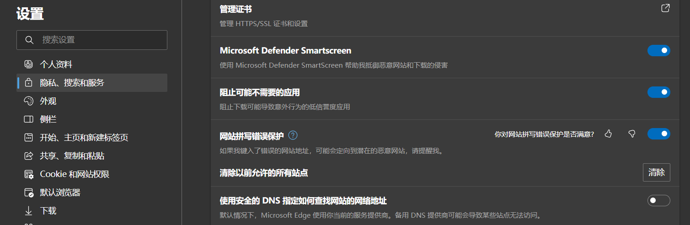

# 2.git与github的使用

## 网页链接

[原文章链接](https://www.cnblogs.com/tntblog/p/13715084.html)


## 1、使用git commi -m "……"时报错： Your branch is up to date with ‘origin/master‘

今天在提交项目的时候报了这个错误，在网上查了解决办法，有的说创建新的分支可以解决，但我的不行。

最后我的解决办法是先退出git base here，再重新进入，下面是具体步骤：

- 先使用`git add .`；
- 接着使用`git status -s`查看我更改的文件，也是我要推送的文件，如果前面的有M和??，那么久重新更新文件，然后重复上面的步骤；
- 发现前面的M是绿色的后就可以使用`git commit -m "文件备注"`；
- 然后推送就可以了`git push origin main`。

## AndroidStudio中的grable下载很慢，如何解决？

[参考地址](https://blog.csdn.net/BG1230521/article/details/136605382)

这里的关键命令是git status -s，我现在搞不懂这个错误产生的原因……

## 虚拟机连接不上网络，没有分配ENS33

[参考链接](https://blog.csdn.net/qq_44853430/article/details/109974779)


## 浏览器突然无法访问某些网站，之前可以突然不行。

解决办法：


在浏览器中关闭，使用安全的 DNS 指定如何查找网站的网络地址，然后就可以访问了，原因我还没弄清楚。

## AndroidStudio中为什么不建议使用`case R.id.generate`判断，而是使用`if(v.getId() == R.id.generate)`？

1.当使用Switch语句写如下代码时，

```java
switch (v.getId()){
            case R.id.generate:

                break;
            case R.id.add:

                break;
        }
```

（红色表示报错）如果报错android studio报错constant expression required，
可以把Switch语句换成if-else语句即

```java
If（v.getId() == R.id.generate）
{
……
}else if（v.getId() == R.id.add）{
……
}
```

这样就可以了。来源以及具体原因：
https://blog.csdn.net/weixin_43912621/article/details/106178388

{}