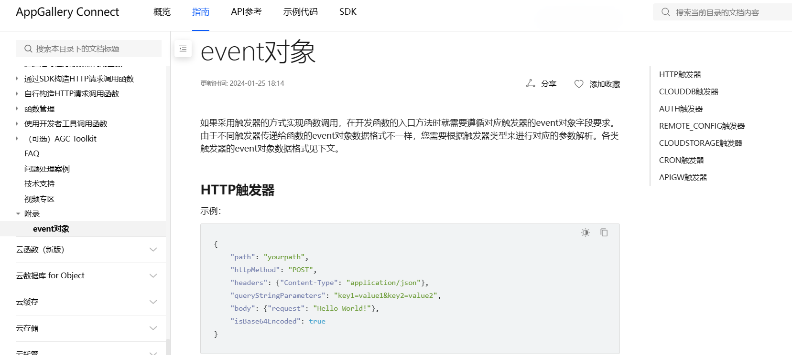
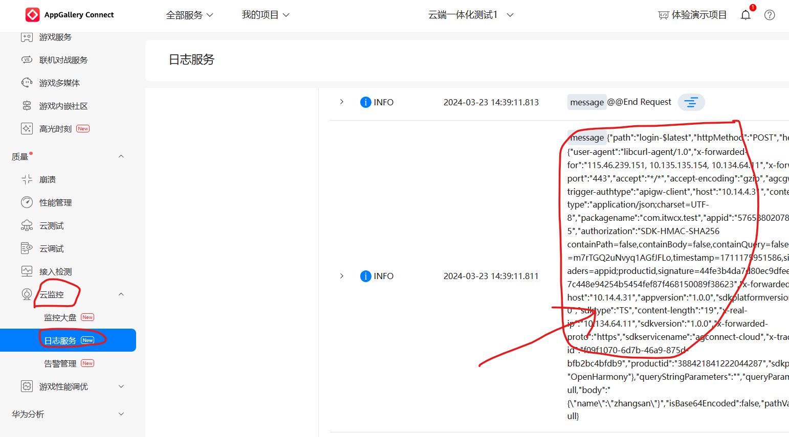
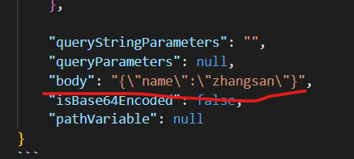
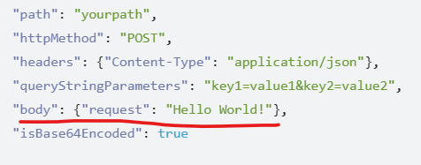
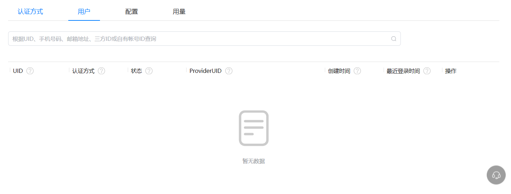
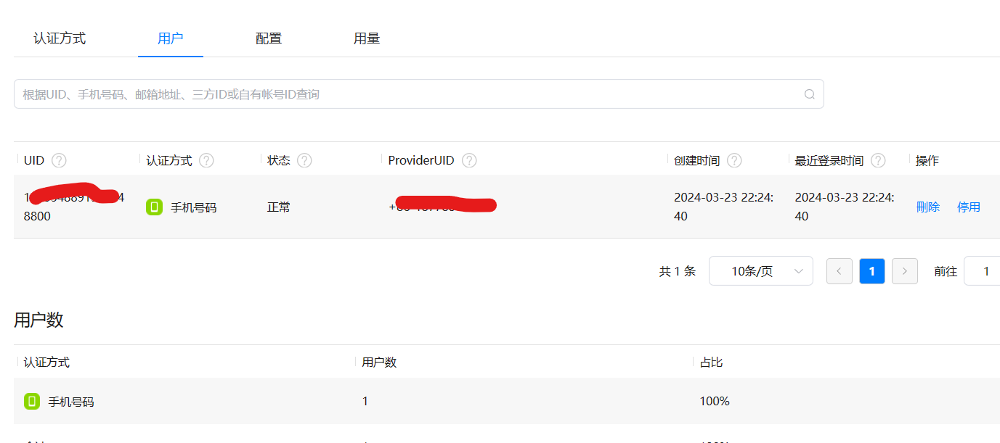

# 5.云端一体化如何查看云函数日志？

调用云函数的时候我们总有输入输出结果不符合自己预期的时候，这个时候查看日志很重要！！在云端一体化开发过程中，我们可以通过下面的方式解决这一问题：

首先参数event的输出以JSON格式输出，这样方便阅读，下面有一段代码，

云函数代码如下：

```ts
import { stringify } from "querystring";
let myHandler = async function (event, context, callback, logger) {
  logger.info(JSON.stringify(event));
  const name = event.body.name
  callback({
    code: 200,
    message: `Hello ${name}.`
  });
};

export { myHandler };
```

获取信息的ets文件如下：

```ts
import cloud from '@hw-agconnect/cloud';
@Entry
@Component
struct MyIndex {
  @State message: string = ''
  @State name:string = ''

  build() {
    Row() {
      Column() {
        TextInput({placeholder:'请输入姓名'})
          .onChange(value => {
            this.name = value
          })
        Button('使用云端一体化')
          .fontSize(20)
          .onClick(async ()=>{
            const result = await cloud.callFunction({
              name:'login',//云函数的名字
              version:'$latest',
              params:{name:this.name}
            })
            this.message=result.getValue().message
          })
        Text(this.message)
          .fontSize(50)
          .fontWeight(FontWeight.Bold)
      }
      .width('100%')
    }
    .height('100%')
  }
}
```

**function函数的说明：**

- 触发条件：
  - HTTP请求，
  - 云数据库插入，
  - 云存储
- 参数含义：
  - 输入信息（），
  - 执行时上下文信息（环境变量），
  - 输出（返回结果给调用者），
  - 记录日志（）

此处做了这样的处理使得日志输出以JSON格式输出：

---
    logger.info(JSON.stringify(event))
---

当遇到问题时，去官方的开发论坛搜索相关内容，
此处我想实现输入一个名字，然后让云端函数以不同的方式输出，比如：

---
你好，张三

你好，李四

---
但是现在输出的是：**你好，%&*%%**

解决办法：

[查看event参数说明](https://developer.huawei.com/consumer/cn/doc/AppGallery-connect-Guides/agc-cloudfunction-appx-event-0000001620581529)



再去CAG官网选择云监控--->日志服务



然后复制右边的内容,放到一个json文件夹，用编译器（比如VScode）打开，并调整格式(如果用的是VScode，请使用**shift+alt+F**调整json格式)如下：

```jsonyouweishengke
{
    "path": "login-$latest",
    "httpMethod": "POST",

    "headers": 
    {
        "user-agent": "libcurl-agent/1.0",
        "x-forwarded-for": "115.46.239.151, 10.135.135.154, 10.134.64.11",
        "x-forwarded-port": "443",
        "accept": "*/*",
        "accept-encoding": "gzip",
        "agcgw-trigger-authtype": "apigw-client",
        "host": "10.14.4.31",
        "content-type": "application/json;charset=UTF-8",
        "packagename": "com.itwcx.test",
        "appid": "5765880207853994135",
        "authorization": "SDK-HMAC-SHA256 containPath=false,containBody=false,containQuery=false,accessId=m7rTGQ2uNvyq1AGfJFLo,timestamp=1711175951586,signedHeaders=appid;productid,signature=44fe3b4da7d80ec9dfee07ca3747c448e94254b5454fef87f468150089f38623",
        "x-forwarded-host": "10.14.4.31",
        "appversion": "1.0.0",
        "sdkplatformversion": "3.2.0.0",
        "sdktype": "TS",
        "content-length": "19",
        "x-real-ip": "10.134.64.11",
        "sdkversion": "1.0.0",
        "x-forwarded-proto": "https",
        "sdkservicename": "agconnect-cloud",
        "x-trace-id": "f09f1070-6d7b-46a9-875d-bfb2bc4bfdb9",
        "productid": "388421841222044287",
        "sdkplatform": "OpenHarmony"
    },

    "queryStringParameters": "",
    "queryParameters": null,
    "body": "{\"name\":\"zhangsan\"}",
    "isBase64Encoded": false,
    "pathVariable": null
}
```

此处我们只查看参数event的HTTP请求的相关说明：

比较官网的event参数格式与自己日志打印的格式，看看有什么不同





观察可知问题出在body这个参数，参数是json格式，而日志打印的是字符格式，我们需要把字符格式转换成json格式，做如下操作：

```TS
import { stringify } from "querystring";
let myHandler = async function (event, context, callback, logger) {
  logger.info(JSON.stringify(event));
  const obj = JSON.parse(event.body)
  const name = obj.name
  callback({
    code: 200,
    message: `Hello ${name}.`
  });
};

export { myHandler };
```
上面的代码中

---
    const obj = JSON.parse(event.body)
    const name = obj.name
---

就是转换操作。


## 认证服务

### 登录页面的实现



登录验证代码：

```ts
import { AuthMode,Login } from '@hw-agconnect/auth-component'
import { AuthUser } from '@hw-agconnect/cloud'
import router from '@ohos.router'
@Entry
@Component
struct MyLogin {
  @State message: string = 'Hello World'

  build() {
    Row() {
      Column() {
        Login({
          modes:[AuthMode.PHONE_VERIFY_CODE],
          onSuccess:(usr:AuthUser) =>{
              router.pushUrl({url:'page/MyWelcome'})
          }
        }){
          Button('登录')
        }
      }
      .width('100%')
    }
    .height('100%')
  }
}
```




## 页面登录获取验证码

```ts
import { Auth, VerifyCodeAction } from '@hw-agconnect/cloud';
import cloud from '@hw-agconnect/cloud'
import hilog from '@ohos.hilog'
import router from '@ohos.router';
@Entry
@Component

struct MyLogin {
  @State countDown: number = 10
//用一个变量来获取setinterval的ID
  intervalId:number = 0 //因为这个变量与页面显示无关所以不用@State注释
  @State verifyCodeButtonEnable:boolean = false
  @State verifyCodeButtonText:string ='获取验证码'
  @State phoneNumber: string = ''
  @State verifyCode:string = '输入验证码'

  //定时器代码
  waiting(){
    this.verifyCodeButtonEnable = false
    this.verifyCodeButtonText = `${this.countDown}s`//在一点击时，就显示10S
    this.intervalId = setInterval(() => { //要知道定时器结束没有需要知道它的返回结果，这个结果可以通过setinterval的ID获取。
      this.verifyCodeButtonText = `${this.countDown}s`//将倒计时显示出来
      if(this.countDown < 0){
        //如果减到0，清楚定时器
        clearInterval(this.intervalId)//得到返回结果后清楚定时器
        this.countDown = 10
        this.intervalId = 0
        this.verifyCodeButtonText = '获取验证码'//倒计时结束时回复
        this.verifyCodeButtonEnable = true //当点击时按键不可用
        return //不需要再往下继续执行了，所以return
      }
      this.countDown--
    },1000)//每隔1秒减一次
  }
   judgement(){
     if(this.phoneNumber.length === 11){
       this.verifyCodeButtonEnable=true
     }else {
       this.verifyCodeButtonEnable=false
     }
   }
  async sending_verifyCode(){
    try { //调用方式异步调用
      await cloud.auth().requestVerifyCode({
        verifyCodeType: {
          kind: 'phone',
          phoneNumber: this.phoneNumber,
          countryCode: '86'
        },
        action: VerifyCodeAction.REGISTER_LOGIN, //验证的方式
        lang: 'zh_CN',
        sendInterval: 10
      })
      hilog.info(0,'VerifCode','Success')
    } catch (e) {
      AlertDialog.show({ title: '错误', message: '验证码失败' })//弹窗内容
      hilog.info(0,'VerifCode',JSON.stringify(e))
    }
  }
  async login_verify(){
    try {
      const result  = await cloud.auth().signIn({ //定义一个变量来接收它的返回结果,返回的是result，在通过result.gitUsr获取用户信息
        credentialInfo: {
          kind: 'phone',
          countryCode: '86',
          phoneNumber: this.phoneNumber,
          verifyCode: this.verifyCode
        }
      })
      const user = result.getUser()
      AppStorage.SetOrCreate('user',user)//存储用户到 AppStorage
      hilog.info(0,'Login','Success')
      router.replaceUrl({ url: 'pages/MyLoginLignOut' })
    } catch (e) {
      AlertDialog.show({title:'错误',message:'登陆失败'})
      hilog.info(0,'Login',JSON.stringify(e))
    }
  }


  build() {
    Row() {
      Column() {
        TextInput({placeholder:'请输入手机号'})
          .type(InputType.Number)
          .onChange(values =>{
          this.phoneNumber = values
            this.judgement()//点击获取验证码时，判断按键是否可用
        })
       Row(){
         TextInput({placeholder:'验证码'})
           .width('70%')
           .onChange(value =>{
             this.verifyCode=value
           })
         Button(this.verifyCodeButtonText)
           .width('30%')
           .enabled(this.verifyCodeButtonEnable)//该属性是控制按键是否可用
           .onClick(async () =>{ //所在方法加async
             this.waiting()
             this.sending_verifyCode()
           })
       }
        .width('100%')
        Button('登录')
          .enabled(this.phoneNumber.length === 11 && this.verifyCode.length === 6)//手机号11位，且验证码六位时点击登录才有效
          .onClick(async ()=>{
            this.login_verify()
          })

      }
      .width('100%')

    }
    .height('100%')
  }

}

```

登录后跳转到的页面：

```ts
import cloud ,{AuthUser}from "@hw-agconnect/cloud"
import hilog from '@ohos.hilog'
import router from '@ohos.router'
@Entry
@Component
struct MyLoginLignOut {
  @State photoUrl:string = '' //存储头像路径
  @State displayName:string = '' //存储用户昵称
  @StorageLink('user') user:AuthUser = null //定义一个AuthUser的类型来获取用户存的值，('user')叫存储对象名，是在另一个页面定义的名字
aboutToAppear(){//build渲染前就运行
  //1.cloud.auth().getCurrentUser()
  //2.appStorage
  this.displayName = this.user.getDisplayName()//获取用户，间接通过用户拿到用户头像等数据。
  this.photoUrl = this.user.getPhotoUrl()
}
  build() {
    Row() {
      Column() {
        Row(){
          Image(this.photoUrl?this.photoUrl:$r('app.media.app_icon'))
            .width(80)
            .height(80)
            .onClick(()=>{
              this.photoUrl= 'https://img.btstu.cn/api/images/5a2a5d5560223.jpg'
            })
        }.width('100%')
        .justifyContent(FlexAlign.Center)
        .padding({bottom:70})


        TextInput({placeholder:'设置昵称',text:this.displayName})
          .fontSize(25)
          .fontWeight(FontWeight.Bold)
          .onChange(value =>{
            this.displayName = value
          })
        Button('保存')
          .margin({top:10,bottom:10})
          .width(90)
          .onClick(async ()=>{//保存图片与用户名

            try {
              await this.user.updateProfile({//保存头像、用户名
                displayName: this.displayName,
                photoUrl: this.photoUrl
              })
              hilog.info(0,'updateProfile','Success')
            } catch (e) {
              hilog.info(0,'updateProfile',JSON.stringify(e))
            }
          })
        Button('登出')
          .margin({top:10,bottom:10})
          .width(90)
          .onClick(async ()=>{
            try {
              await cloud.auth().signOut()
              hilog.info(0,'SignOut','Success')
              router.replaceUrl({url:'pages/MyLogin'})
            } catch (e) {
              hilog.info(0,'SignOut',JSON.stringify(e))
            }
          })
      }
      .width('100%')
    }
    .height('100%')
  }
}
```

### 个人设置中心

```ts
import cloud, { AuthUser } from '@hw-agconnect/cloud'
import router from '@ohos.router'
import hilog from '@ohos.hilog'
import picker from '@ohos.file.picker'

@Entry
@Component
struct MyIndex {
  @State photoUrl: string = '' //存储头像路径
  @State displayName: string = '' //存储用户昵称
  @StorageLink('user') user: AuthUser = null //定义一个AuthUser的类型来获取用户存的值，('user')叫存储对象名，是在另一个页面定义的名字
  @State uploading: boolean = false//用户控制图片是否可以点击，上传时不可以点击
  @State uploadingText: string = '0%'//上传进度

  aboutToAppear() {  //build渲染前就运行
    // 1. cloud.auth().getCurrentUser()
    // 2. AppStorage
    this.displayName = this.user?.getDisplayName()//获取用户，间接通过用户拿到用户头像等数据。加问号是因为在aboutToAppear运行时是无法获取用户名或图片等信息的
    this.photoUrl = this.user?.getPhotoUrl()
  }

  build() {
    Row() {
      Column({ space: 10 }) {
        Stack() {//Stack该属性让它所包含的组件重叠
          Image(this.photoUrl ? this.photoUrl : $r('app.media.user_dark'))
            .width(70)
            .height(70)
            .borderRadius(70)
            .enabled(!this.uploading)
            .onComplete(()=>{
              this.uploading = false
            })
            .onClick(async () => {
              // this.photoUrl = '网络图片的地址'
              try {
                // 1. 从相簿中选照片
                const options = new picker.PhotoSelectOptions()
                options.MIMEType = picker.PhotoViewMIMETypes.IMAGE_TYPE//媒体类型：视频还是图片
                options.maxSelectNumber = 1//最大选择个数
                const result = await new picker.PhotoViewPicker().select(options)//把参数传给下面的方法，把结果传给result
                hilog.info(0, 'Upload', `Picker Success ${result.photoUris[0]}`)
                this.uploading = true
                // 2. 调云存储 api 上传照片
                await cloud.storage().upload({
                  localPath: result.photoUris[0],//本地图片路径
                  cloudPath: `test/${this.user.getUid()}.jpg`,//云存储那边存储的路径
                  onUploadProgress: event => {
                    const percent = Math.floor(100 * event.loaded / event.total)//获取上传的百分比，event.loaded：已上传的自己数，event.total：总的自己数，Math.floor：舍弃小数点
                    this.uploadingText = `${percent}%`  //数值更新到uploadingText
                  }
                })
                hilog.info(0, 'Upload', 'Upload Success')
                // 3. 获取上传照片的网络地址
                const url = await cloud.storage().getDownloadURL(`test/${this.user.getUid()}.jpg`)//获取公网地址，拿到图片在网络上的地址
                this.photoUrl = `${url}&ts=${new Date().getTime()}`//这个里做这个处理是因为，图片被缓存起来了，上传的时候如果只是给云存储的地址，那么在传第二张图片到云存储后，photoUrl再获取时，因为图片地址不变照片也不会改变，它会缓存起来，而在图片后面加上一个时间图片就不在被缓存。
                // this.uploading = false
                hilog.info(0, 'Upload', `url: ${url}`)
              } catch (e) {
                hilog.error(0, 'Upload', JSON.stringify(e))
              }
            })
          if (this.uploading) {
            // 显示上传进度
            Text(this.uploadingText)
              .width(70)
              .height(70)
              .borderRadius(70)
              .fontColor('white')
              .backgroundColor('black')
              .opacity(0.6)
              .fontSize(24)
              .fontWeight(FontWeight.Bolder)
              .textAlign(TextAlign.Center)//文字对齐方式
          }
        }


        TextInput({ placeholder: '请设置昵称', text: this.displayName })
          .width('50%')
          .onChange(value => {
            this.displayName = value
          })
        Button(`保存`)
          .onClick(async () => {
            try {
              await this.user.updateProfile({
                displayName: this.displayName,
                photoUrl: this.photoUrl
              })
              hilog.info(0, 'updateProfile', 'Success')
            } catch (e) {
              hilog.error(0, 'updateProfile', JSON.stringify(e))
            }
          })
        Button(`登出`)
          .onClick(async () => {
            try {
              await cloud.auth().signOut()
              hilog.info(0, 'SignOut', 'Success')
              router.replaceUrl({ url: 'pages/MyLoginCustom' })
            } catch (e) {
              hilog.error(0, 'SignOut', JSON.stringify(e))
            }
          })

      }
      .width('100%')
    }
    .height('100%')
  }
}
```

## 登录页面

```ts
import { Auth, VerifyCodeAction } from '@hw-agconnect/cloud';
import cloud from '@hw-agconnect/cloud'
import hilog from '@ohos.hilog'
import router from '@ohos.router';
@Entry
@Component

struct MyLogin {
  @State countDown: number = 10
//用一个变量来获取setinterval的ID
  intervalId:number = 0 //因为这个变量与页面显示无关所以不用@State注释
  @State verifyCodeButtonEnable:boolean = false
  @State verifyCodeButtonText:string ='获取验证码'
  @State phoneNumber: string = ''
  @State verifyCode:string = '输入验证码'
  private mainPage = `pages/StudentPage`

  async aboutToAppear() {
    try {
      const user = await cloud.auth().getCurrentUser()//获取当前认证用户
      if (user != null) {//获取用户是否为空，如果用户已经断开会话，则下一次进入时间走时登录流程
        AppStorage.SetOrCreate('user', user) // 如果会话未断开，不走登录流程，而是吧用户数据存到AppStorage
        router.replaceUrl({ url: this.mainPage })
      }
    } catch (e) {
      hilog.error(0, 'Login', JSON.stringify(e))
    }
  }
  //定时器代码
  waiting(){
    this.verifyCodeButtonEnable = false
    this.verifyCodeButtonText = `${this.countDown}s`//在一点击时，就显示10S
    this.intervalId = setInterval(() => { //要知道定时器结束没有需要知道它的返回结果，这个结果可以通过setinterval的ID获取。
      this.verifyCodeButtonText = `${this.countDown}s`//将倒计时显示出来
      if(this.countDown < 0){
        //如果减到0，清楚定时器
        clearInterval(this.intervalId)//得到返回结果后清楚定时器
        this.countDown = 10
        this.intervalId = 0
        this.verifyCodeButtonText = '获取验证码'//倒计时结束时回复
        this.verifyCodeButtonEnable = true //当点击时按键不可用
        return //不需要再往下继续执行了，所以return
      }
      this.countDown--
    },1000)//每隔1秒减一次
  }
   judgement(){
     if(this.phoneNumber.length === 11){
       this.verifyCodeButtonEnable=true
     }else {
       this.verifyCodeButtonEnable=false
     }
   }
  async sending_verifyCode(){
    try { //调用方式异步调用
      await cloud.auth().requestVerifyCode({
        verifyCodeType: {
          kind: 'phone',
          phoneNumber: this.phoneNumber,
          countryCode: '86'
        },
        action: VerifyCodeAction.REGISTER_LOGIN, //验证的方式
        lang: 'zh_CN',
        sendInterval: 10
      })
      hilog.info(0,'VerifCode','Success')
    } catch (e) {
      AlertDialog.show({ title: '错误', message: '验证码失败' })//弹窗内容
      hilog.info(0,'VerifCode',JSON.stringify(e))
    }
  }
  async login_verify(){
    try {
      const result  = await cloud.auth().signIn({ //定义一个变量来接收它的返回结果,返回的是result，在通过result.gitUsr获取用户信息
        credentialInfo: {
          kind: 'phone',
          countryCode: '86',
          phoneNumber: this.phoneNumber,
          verifyCode: this.verifyCode
        }
      })
      const user = result.getUser()
      AppStorage.SetOrCreate('user',user)//存储用户到 AppStorage
      hilog.info(0,'Login','Success')
      router.replaceUrl({ url: 'pages/MyLoginLignOut' })
    } catch (e) {
      AlertDialog.show({title:'错误',message:'登陆失败'})
      hilog.info(0,'Login',JSON.stringify(e))
    }
  }


  build() {
    Row() {
      Column() {
        TextInput({placeholder:'请输入手机号'})
          .type(InputType.Number)
          .onChange(values =>{
          this.phoneNumber = values
            this.judgement()//点击获取验证码时，判断按键是否可用
        })
       Row(){
         TextInput({placeholder:'验证码'})
           .width('70%')
           .onChange(value =>{
             this.verifyCode=value
           })
         Button(this.verifyCodeButtonText)
           .width('30%')
           .enabled(this.verifyCodeButtonEnable)//该属性是控制按键是否可用
           .onClick(async () =>{ //所在方法加async
             this.waiting()
             this.sending_verifyCode()
           })
       }
        .width('100%')
        Button('登录')
          .enabled(this.phoneNumber.length === 11 && this.verifyCode.length === 6)//手机号11位，且验证码六位时点击登录才有效
          .onClick(async ()=>{
            this.login_verify()
          })

      }
      .width('100%')

    }
    .height('100%')
  }

}


```

希望文档对你有所帮助。

{}