# 唛盟杯比赛详记

## 比赛说明

自己有幸参加这次唛盟杯的比赛，这次比赛流程如下：

一、报名时2024年1月1到31日本来是12月份但延期了。

二、培训时间，现在还不确定，不过也是可以肯定是年后的事了。

三、项目制作时间3-5月，不知道后面会不会改。

四、项目环境及操作流程

（一）、开发工具

1、要求使用唛盟低代码平台作为开发项目模板[唛盟低代码平台链接](https://gitee.com/maimengcloud/mdp-lcode-ui-web)；

2、要求使用唛盟研发管理系统（唛盟xm）进行软件研发项目管理[唛盟研发管理系统链接](https://maimengcloud.com/xm/m1/#/login);

（二）、唛盟xm操作流程

    1、先在唛盟xm中建立一个产品，产品名称为“知识产权流程管理系统”；
    2、细化产品需求；
    3、由产品派生一个项目，构建项目团队；
    4、由需求派生项目任务，并确定任务执行人、计划完成时间等；
    5、编制测试用例，建立测试计划，执行测试；
    6、出具项目报告，提交结项申请。

（三）、代码提交

官方提供代码库链接，我们下载后，在该代码库基础上进行开发、提交代码。

## 比赛题目

### 一、项目主题

知识产权流程管理系统

二、项目描述

该系统用于知识产权项目申报的全过程跟踪管理，其功能包括：

- 客户下单、
- 提交申请、
- 申请反馈、
- 订单查询、
- 订单详情、
- 文档查阅下载等六大部分。

该系统分为客户端和管理端两个子系统。客户端对客户开放，主要功能包括：

- 客户下单、
- 付款、
- 订单查询、
- 订单进度消息推送（推送到公众号、网站内部消息）、
- 文档查阅下载等。

管理端对管理人员开放，不对客户开放，负责订单管理、文档上传（批量上传）等。

### 三、项目需求

（一）、用户端

个人中心模块：

1、订单查询

分为我的订单（综合查询）及商标、专利、版权、科技项目四大子类查询，订单查询按全部业务下单时间顺列。

订单查询功能大致效果图：
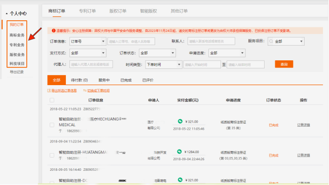

2、订单详细

可根据订单详情按钮跳转到对应的订单详情。
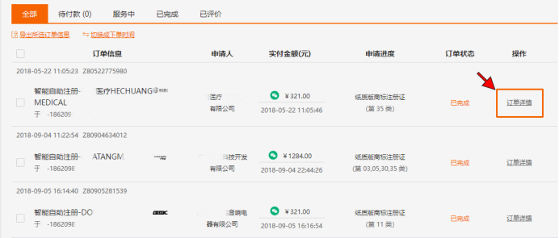
订单详情页展示图：
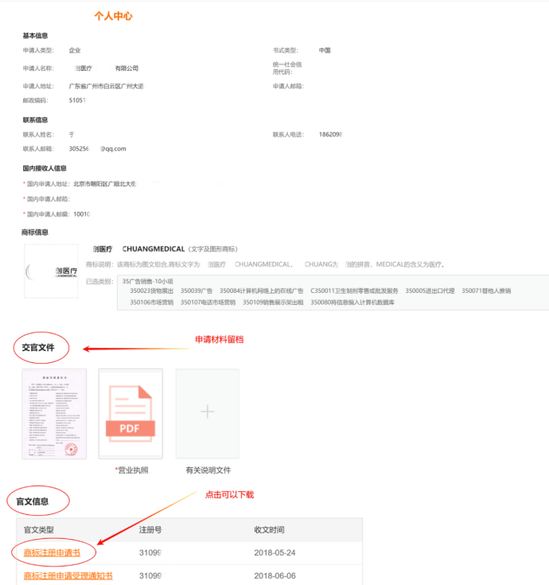

（二）、管理端

订单管理模块：

**1、订单查询**

查询订单，展示列表。

**2、订单详细**

在订单列表中点击某个订单，进入订单详情。

**3、文档上传**

在订单详情页，点击文档上传，选中本地文件，上传本地文件到服务器，支持批量、单文件上传。

## 注册唛盟账号

### 队长和队员注册账号

一、扫描一级部门的二维码

这一部分只建议参加了比赛的网友查看。本次是组队参加，一队3-5人，队长要在他们的官方网页端注册号团队（二级部门），方便后面的项目管理，然后再通过一级部门添加自己的团队，首先是扫描官方给的二维码，扫这个二维码后注册就会在一级部门下，这也是要注册在一级部门之下的办法，

二、授权登录成功后，跳转到提示页面，点击“首页”

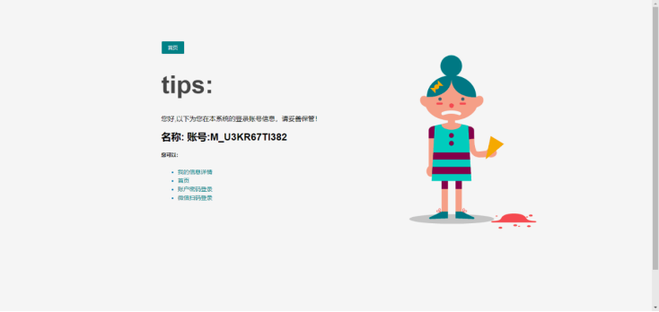
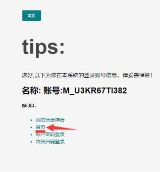

三、进入低代码平台首页，按照提示，点击“账户明细”

四、按照提示，输入姓名，并提交

五、点击唛盟低代码平台官网，选择微信扫码登录

唛盟低代码平台官网：https://maimengcloud.com/lcode/m1/#/login

六、看到用户名称是自己的即报名成功

### 队长注册团队

#### 1要求

    1.构建每个参赛团队的独立部门
    2.将参赛队员拉入部门
    3.给每个参赛队员设置好岗位

#### 2相关环境

[唛盟账户系统](https://maimengcloud.com/lcode/m1/)

#### 3操作步骤

3.1 在一级部门，即总部下建立子部门

进入【部门管理】，点击【添加下级】

3.2输入部门信息

- 部门名称要求：以参赛团队名称作为部门名称
- 上级领导选：一级部门 
- 部门负责人：选参赛团队组长
- 部门性质：技术部门
- 协作类型：内部组织

其它字段不填

（如果你不是第一届比赛的同学，那这个不需要关注，可能每年都不一样）

3.3保存提交

3.4把岗位挂接到部门上

【部门管理】中找到刚才建立的部门，点击【岗位】按钮弹出以下岗位选择框：

选择左边需要绑定的岗位，移动到右边，点击【提交】按钮即完成岗位绑定（如果没有显示岗位，多次刷新，或者退出重新登录，这个知识第一届遇到此问题解决的方案）

3.5把用户拉入部门

打开【用户管理】菜单，先把自己的搜索出来，如果不是通过一级部门的二维码注册的，会搜不到的哦。找到需要拉入的队友，点击【部门/岗位】

弹出以下部门岗位选择界面：

在弹出的界面中左边选中归属的部门，右边选中岗位，再【提交】即可

这部分本来也不想记了，毕竟没什么用了，可能下一届又不一样了，但想想自己记一下当作回忆也可以。

## 安装git和nodejs

在安装前我们通过这个链接`https://gitee.com/maimengcloud/mdp-lcode-ui-web`去看看这个项目的介绍，

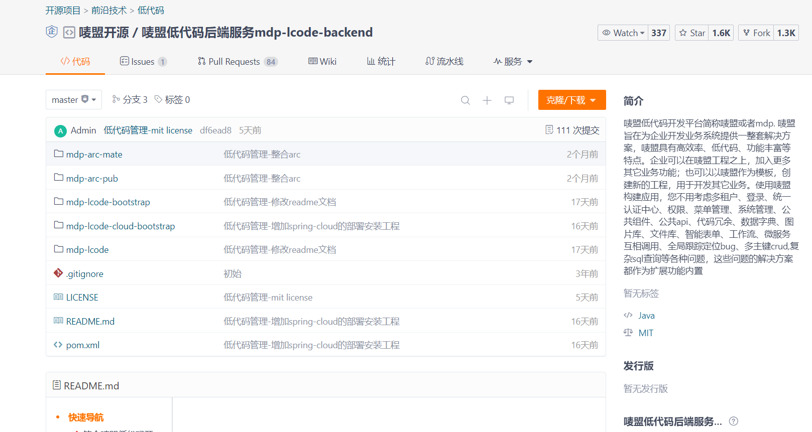

大概浏览一下，然后往下拉根据导航直接跳到 **快速开始**

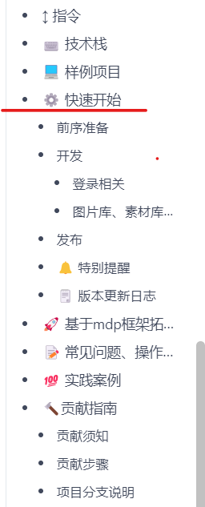

这里并不是说其他的不重要，只是说对于一个项目而言如果不是涉及本地启动的话不必花费时间去纠结，等你能让项目在本地启动后再回来看看也不迟，当然这也有弊端，可能会错一些细节哈。

在快速开始的地方提到：

---
 注意：该项目使用 element-ui@2.3.0+ 版本，所以最低兼容 vue@2.5.0+ nodejs版本v14.16.1

---
所以我们安装的时候要注意版本的问题尽量不要选太高的，如果你已经安装了一部分或全部，而且版本很高或很低，这样也不必太担心（大不了删掉重新安装，哈哈），下面是我的一些经验，希望帮到你。

### git的安装

这部分没有太多可讲的，网上有很多的教程，讲的也很好，这里需要你记住的一条命令是：

```git
 git clone <远程仓库地址>  <本地存放目录>
```
 
这里举个例子，就比如这次比赛用到的这个项目,我们建一个文件夹装要下载的项目，比如是mdp文件夹，然后右键，win11选显示更多，在弹出的选项选择： **git bash here**

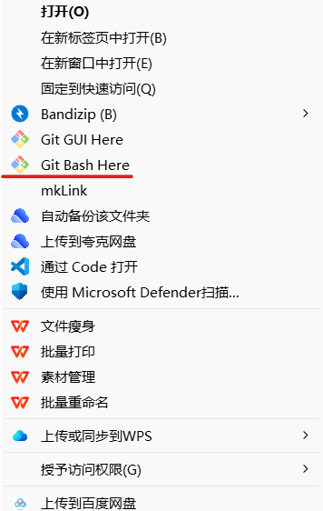

然后复制下面的内容回车就可以了。

---
 git clone https://gitee.com/maimengcloud/mdp-lcode-ui-web.git  mdp-lcode-ui-web/

---

但是有的时候也会因为网速的问题，导致无法下载，比如回车后报错，如下:

---
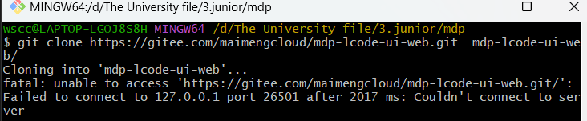
Cloning into 'mdp-lcode-ui-web'...
fatal: unable to access 'https://gitee.com/maimengcloud/mdp-lcode-ui-web.git/': Failed to connect to 127.0.0.1 port 26501 after 2017 ms: Couldn't connect to server

---

简单翻译理解就是这个远程仓库无法访问，其实这也是使用让我比较烦恼的问题，这里的原因我可能没办法给你讲清楚（你有时间可以去琢磨哈），但有个软件可以分享给你，帮你解决这个问题，即 **watt toolkit** ,而且这个软件在微软软件商城就有。

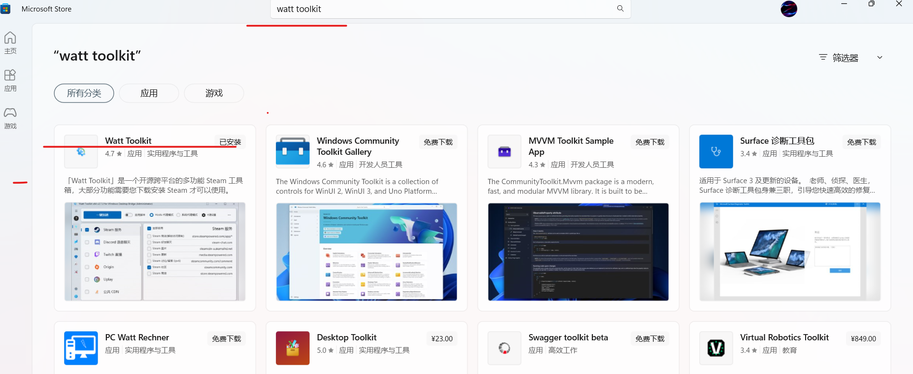

下载后选github，然后点击一键加速。

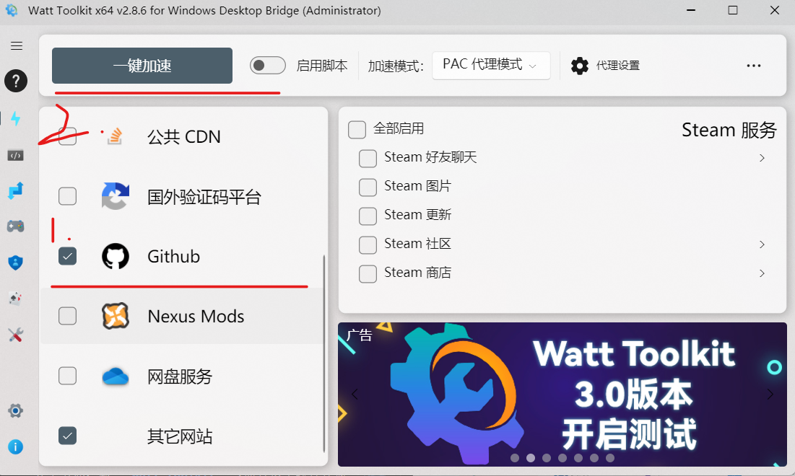
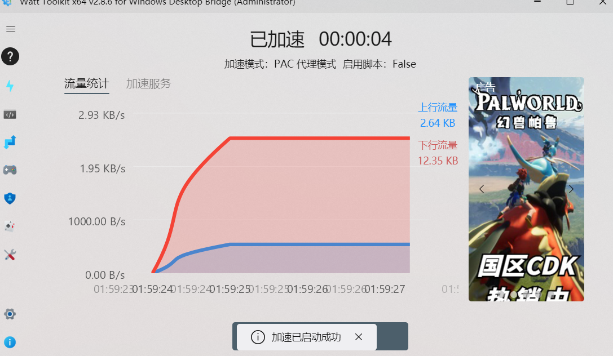

然我们再回到git base here，再次输入刚才的命令回车，

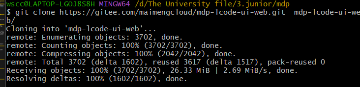

发现刚才的代码仓库已经下载到本地了。

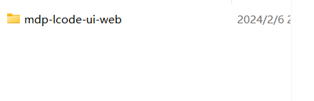

如果你使用上面的软件还是无法下载远程的仓库，那你需要根据报错信息在网上查考相关的信息，这里提供上面报错的可能解决方案，只是针对上面的问题哦！[参照文章](https://cloud.tencent.com/developer/article/2108855)

### 安装node

网上可能称为nodejs都是一个工具，这个工具的简介还请参照官方，这里我们有做过多的了解哦。在安装node之前我们要先安装nvm。这是一个管理node的工具，这里安装的主要目的是 **升高或降低node版本**，简单就是想安装哪个版本（已发布且可下载的版本）的可以用这个工具来实现。

nvm是否要安装取决于你的情况，除了nvm，此次项目还需要安装工具node，vue，mvn。

方案一：为防止版本过高过低影响运行，以后可能还需要，最好是下载nvm管理node，然后也要了解升级或降低vue版本的方法，最后下载mvn；

方案二：自己不管安装还是没安装，直接安装node，vue，mvn，本次项目用到的node，vue，mvn都在package.json文件里定义写好了，运行后会根据里面去下载，似乎对项目没太大影响（因为我工具处于最高版本，或是相对低一点的版本，使用相同的命令，报错都是一个，基于这点你可以尝试。）

## 方案一

### 安装nvm

[参照文档](https://blog.csdn.net/HuangsTing/article/details/113857145) 关于文章的几点说明：

- 登录github的时候记得开watt toolket;
- 如果nvm下载不了要刷新或者退出重新进入，多试几次；
- 基于本次的项目我们只看文章的一——四，五往后有时间就了解一下就好了；

里面的 **三、配置路径和下载源**我们需要把淘宝镜像改为如下：

```
    node_mirror: https://cdn.npmmirror.com/binaries/node/
    npm_mirror: https://cdn.npmmirror.com/binaries/npm/
```

这是因为淘宝的镜像换了。

接着[参照文章](https://blog.csdn.net/ZHANGYANG_1109/article/details/121229581)，目的是node还要做一些配置，主要node的环境变量设置，还有目录`node_cache`和目录`node_global`的一些设置。从文章的下图开始看，关于node的下载就不看了。
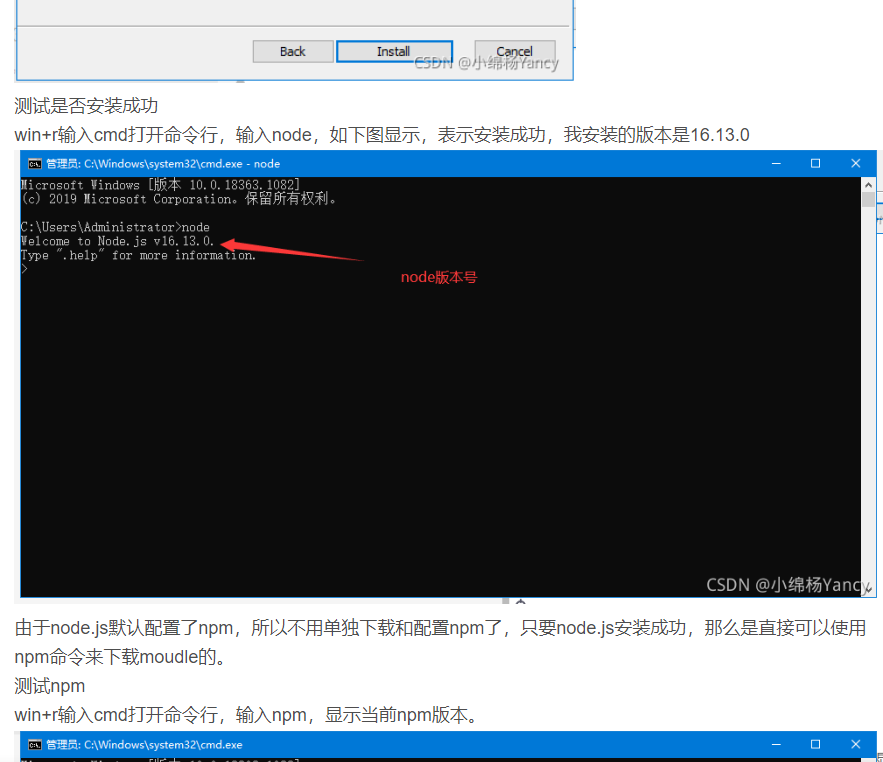

注意在设置目录`node_cache`和目录`node_global`时，

---
npm config set prefix "<自己的文件目录>\node_global"
npm config set cache "<自己的文件目录>\node_cache"

---

这两个路径时要记得把它改成自己安装的路径：

### 安装指定的vue版本

#### 情况一：你没安装过vue

首先你要先安装好node，然后用node的npm工具安装vue。

使用命令查看可安装版本：

---
要查看的vue版本是1.x和2.x的

---

```vue
    npm view vue-cli versions --json
```

---
要查看的vue版本是3.x的

---

```vue
    npm view @vue/cli versions --json
```

**安装vue指定的版本**：

---
安装的vue版本是1.x和2.x的

---

```vue
    npm install -g @vue/cli@版本号

    yarn global add @vue/cli@版本号

```

---
要查看的vue版本是3.x的

---

```vue
    npm install -g vue-cli@版本号

    yarn global add vue-cli@版本号

```

**第一次安装要去配环境变量。**

#### 情况二：你安装过vue

卸载已经安装的Vue Cli

---
卸载 3.x 或 4.x 版本的Vue Cli

---

```vue
npm uninstall -g @vue/cli

yarn global remove @vue/cli

```

---
卸载 1.x 或 2.x 版本的Vue Cli

---

```vue
npm uninstall vue-cli -g

yarn global remove vue-cli

```

重复情况一的步骤，然后打开cmd，输入：

```shell
vue -V

```

显示安装的版本则说明安装完成。

[原文章链接](https://blog.csdn.net/milijiangjun/article/details/108004669)

### 安装mvn（Maven）工具

直接参照[这个文章](https://blog.csdn.net/u012660464/article/details/114113349)就好了。

## 方案二

## 安装node和vue

[参照文章](https://blog.csdn.net/zhouyan8603/article/details/109039732)，同样的里面涉及到镜像文件的设置要注意换掉：

```
    node_mirror: https://cdn.npmmirror.com/binaries/node/
    npm_mirror: https://cdn.npmmirror.com/binaries/npm/
```

除此之外在设置目录`node_cache`和目录`node_global`这两个路径时要记得把它改成自己安装的路径：

---
npm config set prefix "<自己的文件目录>\node_global"
npm config set cache "<自己的文件目录>\node_cache"

---

## 安装mvn

直接参照[这个文章](https://blog.csdn.net/u012660464/article/details/114113349)就好了。

至此工具就就安装完了，接着我们就要去启动项目了。

## 本地启动项目

本次使用的系统是win11和code应用程序，如果你用的不是这个系统和应用程序情况可能不一样哈。

### 根据项目的简介开始运行项目

这里我使用的是code应用程序（你如果用的是别的应用程序另说咯），点击文件夹用code打开后，根据项目文档执行命令：

```
    npm install
```

结果…………………………报错啦（我就知道没这么简单）！！！错误如下：

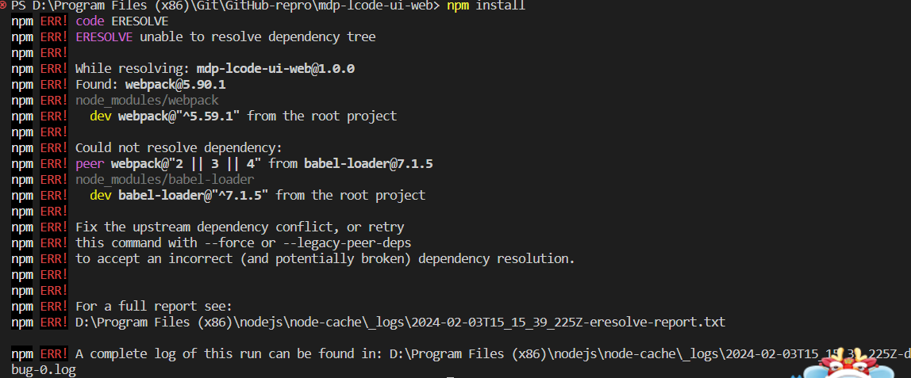

上面的报错意思是：在尝试安装项目依赖时，npm遇到了依赖冲突问题。具体来说，babel-loader需要webpack的版本在2、3或4之间，但是你的项目中已经安装了webpack的5.90.1版本。这导致了peer依赖冲突，因为babel-loader期望的webpack版本与实际安装的版本不匹配，

**解决办法如下：**

1.查看自己的node版本；

    ```
    node -v
    ```

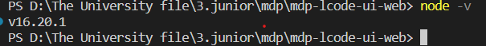

2.修改"package.json"，在"devDependencies"中增加"node": "^21.6.1"依赖；

    ```
    "node":"^21.6.1",
    ```
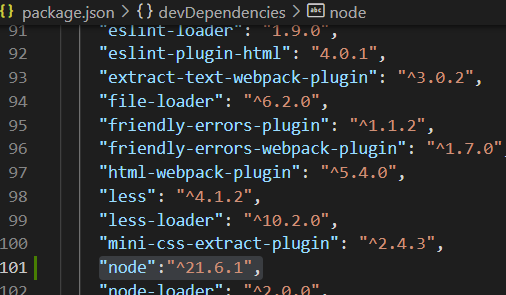

3.npm install -s node-sass@4.14.1;

4.npm install --save --legacy-peer-deps;

    结果……………………报错啦！！！！！

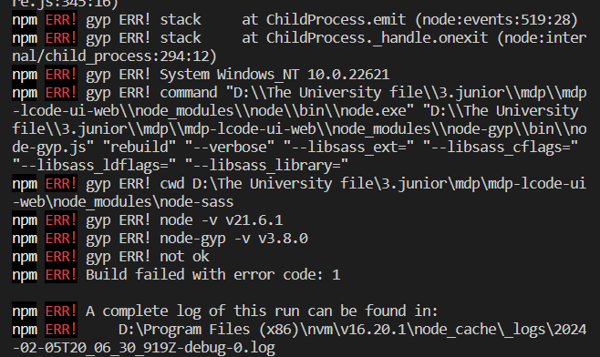

    修改"package.json"，原来的改为"node": "^13.14.0"依赖；

    再次运行结果没报错。

5.npm install --registry=https://cdn.npmmirror.com

    接着我们运行如下代码 `npm install --registry=https://cdn.npmmirror.com`

6.npm run dev

    运行npm run dev，结果还是报错了……
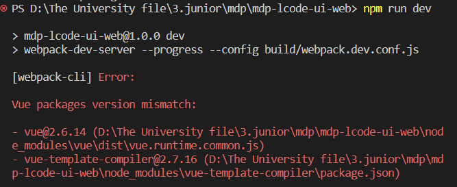

    这里的错误说vue-template-compiler的版本为2.7.16，那我们就去"package.json"找到vue，

    原来的vue版本：
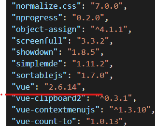

    把上面的修改为`"vue":"^2.7.16",`

    这时候要重新运行 `npm install --save --legacy-peer-deps`,然后再次运行 `npm run dev`;

    结果还是报错，如下：

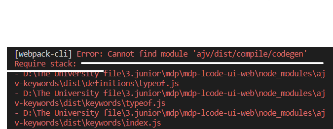

    大概意思是没有找到ajv这个包，那么我们在"package.json"里的 **"dependencies"** 添加`"ajv": "^8.12.0",`
    然后重复`npm install --save --legacy-peer-deps`, `npm run dev`操作就可以了。

    显示如下：
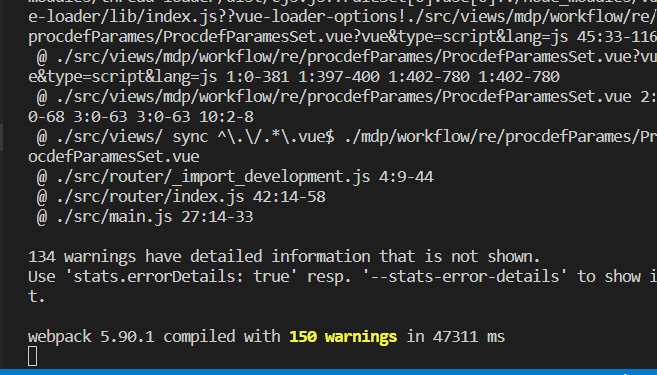

    我们再看看页面，页面如下：


    到这里说明没问题了。

从上面我们可以了解到一点，自己安装的版本似乎并不会影响项目的运行，所以选择方案二来进行安装似乎更简单，但从往长远的看方案一更更好，他可以随时换版本，更为方便。

[原文章链接](https://www.cnblogs.com/happyfuns/p/16774117.html)