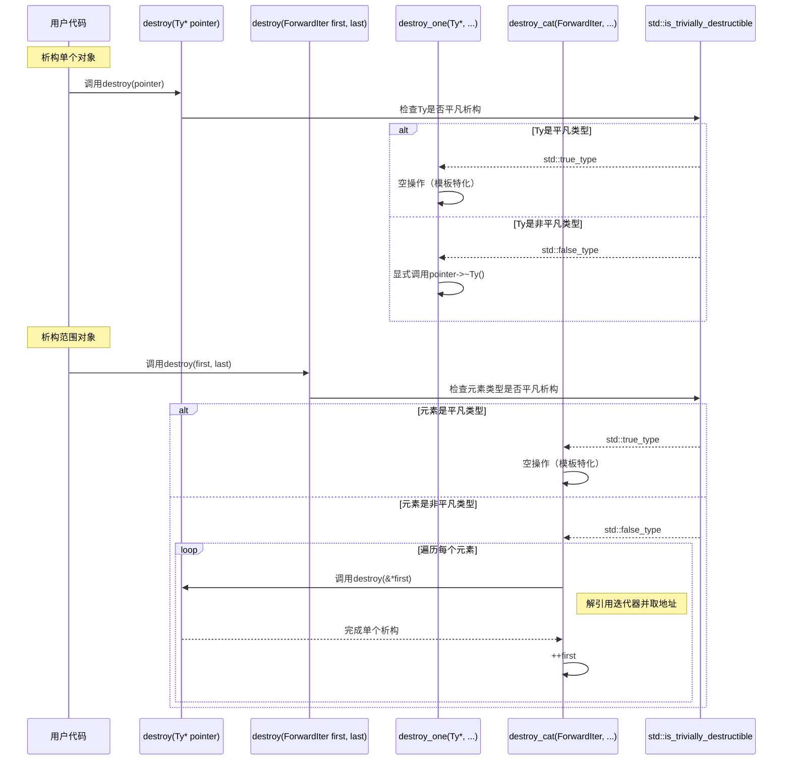

# 手撕MyTinySTL项目

## 项目简介

## 复刻基本思路

### 前期准备

#### 5.construct.h

destroy析构方法的执行流程：



### 阶段一：基础容器与数据结构​​

- ​目标​​：掌握基础容器的实现原理和内存管理。
- ​核心头文件​​：vector.h, list.h, deque.h, stack.h, queue.h
- ​学习内容​​：

（1）查看源代码顺序

type_traits.h--->

#### ​​顺序容器​​

（1）vector.h：动态数组实现，重点学习：

- 动态扩容策略（2 倍扩容 vs 固定步长）
- 内存连续性与迭代器失效机制
- push_back/erase 的时间复杂度

（2）list.h：双向链表实现，分析：

- 节点结构（prev/next/data）
- 链表迭代器的实现（如何维护指针）
- splice 操作的高效性

（3）deque.h：双端队列的分段连续内存设计，理解：

- 中控器（map）与缓冲区（buffer）结构
- 随机访问的复杂度优化

#### ​容器适配器​​

stack.h 和 queue.h：基于底层容器（如 deque 或 list）的封装，学习：

- 如何通过组合而非继承实现适配器模式
- 限制接口的设计（如禁止 stack 的随机访问）

#### ​实践方法​​

- ​手写实现​​：从零实现 vector 和 list，模仿 push_back、insert、erase 等接口。
- ​​对比标准库​​：用 GDB 调试标准库的 std::vector 和 MyTinySTL 的 vector.h，观察内存布局差异。

​​阶段二：关联容器与内存管理​​
​​目标​​：深入哈希表、红黑树和内存分配机制。
​​核心头文件​​：hashtable.h, rb_table.h, unordered_map.h, unordered_set.h, allocator.h, memory.h
​​学习内容​​：

​​关联容器​​：
hashtable.h：链地址法哈希表实现，重点分析：
哈希函数设计（如取模运算的优化）
桶（bucket）的动态扩容与负载因子控制
冲突解决策略（链表 vs 开放寻址）
rb_table.h：红黑树实现，学习：
红黑树的 5 条规则与平衡调整（左旋/右旋）
如何通过红黑树实现 map.h 和 set.h
​​内存管理​​：
allocator.h：内存分配器设计，重点：
对象构造/析构分离（construct.h/destroy.h）
内存池实现（避免频繁调用 new/delete）
memory.h：智能指针（如 shared_ptr）和内存工具（uninitialized_copy）。
​​实践方法​​：

​​实现哈希表​​：手写一个简化版 hashtable，支持插入、查找和动态扩容。
​​红黑树调试​​：在 rb_table.h 中插入节点，通过打印节点颜色和结构验证平衡性。
​​阶段三：算法、迭代器与模板元编程​​
​​目标​​：掌握算法与容器的协作逻辑及泛型编程技巧。
​​核心头文件​​：algo.h, algorithm.h, iterator.h, type_traits.h, functional.h
​​学习内容​​：

​​算法与迭代器​​：
algo.h：基础算法（如 sort、find），分析：
如何通过迭代器泛化容器操作（如 RandomAccessIterator 与 BidirectionalIterator 的区别）
快排、插入排序的混合优化策略
iterator.h：迭代器萃取机制（iterator_traits），理解：
迭代器分类（input_iterator_tag 等）
如何通过 distance 和 advance 实现泛型移动
​​模板元编程​​：
type_traits.h：类型萃取技术，学习：
判断类型特性（如 is_integral、is_pointer）
实现编译期条件分支（如 enable_if）
functional.h：仿函数（greater、less）与绑定器（bind）。
​​实践方法​​：

​​优化算法​​：在 algo.h 中添加自定义算法（如归并排序），并通过迭代器适配不同容器。
​​类型萃取实战​​：利用 type_traits.h 实现一个编译期类型检查工具。
​​阶段四：高级主题与系统化整合​​
​​目标​​：理解异常处理、并发安全与性能优化。
​​核心头文件​​：except.h, util.h, memory.h（线程安全扩展）
​​学习内容​​：

​​异常处理​​：
except.h：学习 MyTinySTL 的异常传播机制（如 try/catch 在容器中的使用）。
​​并发与性能​​：
为 hashtable.h 或 rb_table.h 添加线程安全锁（如 mutex）。
分析 vector 扩容时的内存分配性能，尝试实现内存池优化。
​​实践方法​​：

​​线程安全改造​​：为 unordered_map.h 添加细粒度锁，支持多线程插入/查找。
​​性能测试​​：用 chrono 库对比 MyTinySTL 与标准库的 sort 算法性能。
​​学习路径总结​​
​​按模块分阶段​​：从容器→内存→算法→高级特性逐步推进，避免一次性 overwhelmed。
​​代码精读+手写​​：对每个头文件，先阅读源码注释，再手写简化版实现（例如先实现 vector 的 push_back，再逐步完善）。
​​对比与调试​​：
通过 g++ -E 生成预处理文件，观察模板展开后的代码。
对比 MyTinySTL 与 libstdc++（GCC 标准库）的同类组件实现差异。
​​实战驱动​​：
为 MyTinySTL 添加新功能（如 span 容器或并行算法），提交 Pull Request。
在 LeetCode 或实际项目中尝试替换标准库组件，验证可靠性和性能。
​​资源推荐​​
​​书籍​​：
《STL 源码剖析》- 侯捷（对照本书分析 MyTinySTL 的设计差异）
《Effective STL》- Scott Meyers（学习高效使用 STL 的实践技巧）
​​工具​​：
​​Compiler Explorer​​：在线查看模板实例化后的汇编代码。
​​Valgrind​​：检测 MyTinySTL 的内存泄漏问题。

## 复刻项目阶段安排

## 复刻项目三阶段

## 结论

## 参考资料

## 附录1：个人喜好记录

记录自己觉得写得很好得代码，他们就像你读到一段很美得名言警句一样。

（1）从后往前复制数据到新数组中

```c++
while (first != last)
    *--result = *--last;
```

（1）移动语义

```c++
template <class T>
typename std::remove_reference<T>::type&& move(T&& arg) noexcept
{
  return static_cast<typename std::remove_reference<T>::type&&>(arg);
}
```

（2）完美转发

```c++
template <class T>
T&& forward(typename std::remove_reference<T>::type& arg) noexcept
{
  return static_cast<T&&>(arg);
}
```

