# 电赛

------------------------------------------------------------------
**以下笔记皆基于HAL库。**

## 新建STM32CubeMX工程步骤

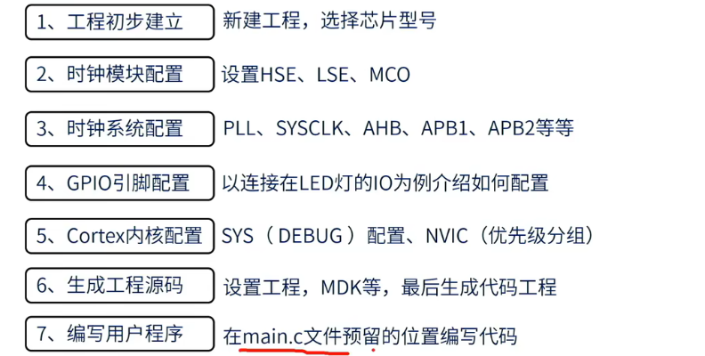

创建工程中如果勾选MCO表示向外部输出时钟，
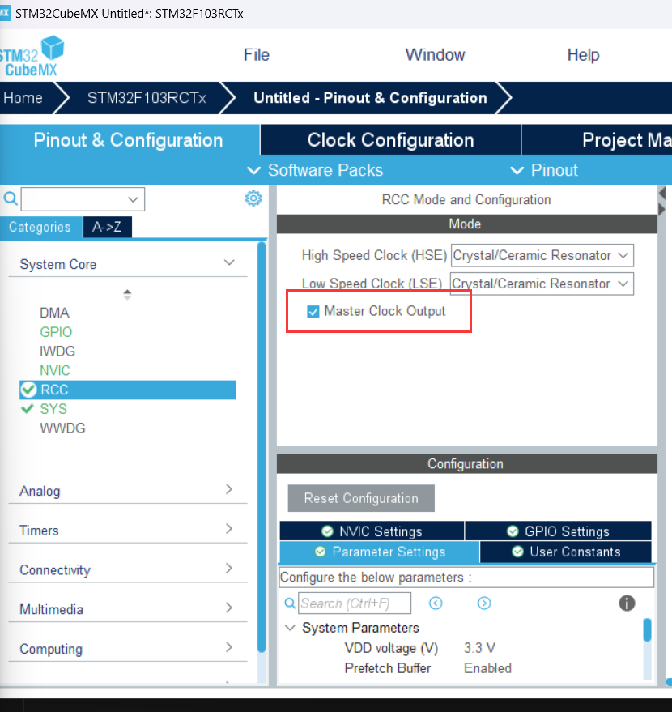
输出的是哪一个引脚可以查看，如下图。
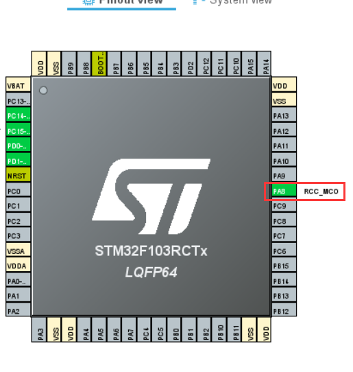

外部时钟设置
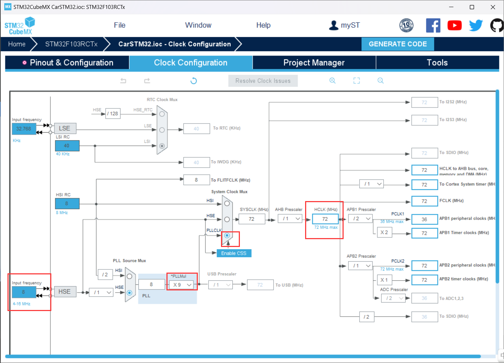

工程设置
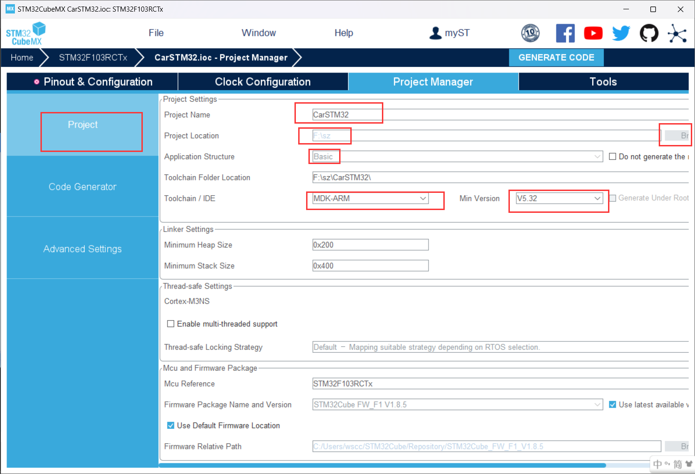

如果Application Structure设置为Basic，那么会把下面的两个文件分开放
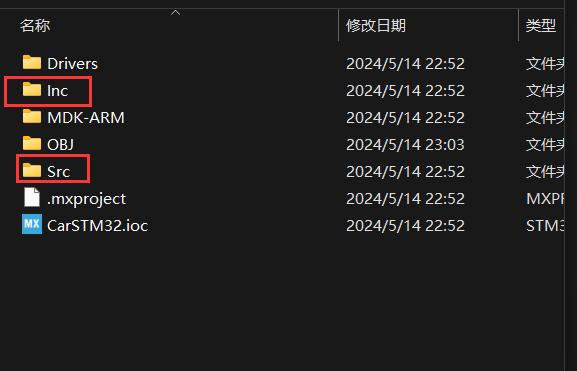
否则项目会把两个文件放在一个文件夹里，如Core

最后还需要设置Code Generator，如下：
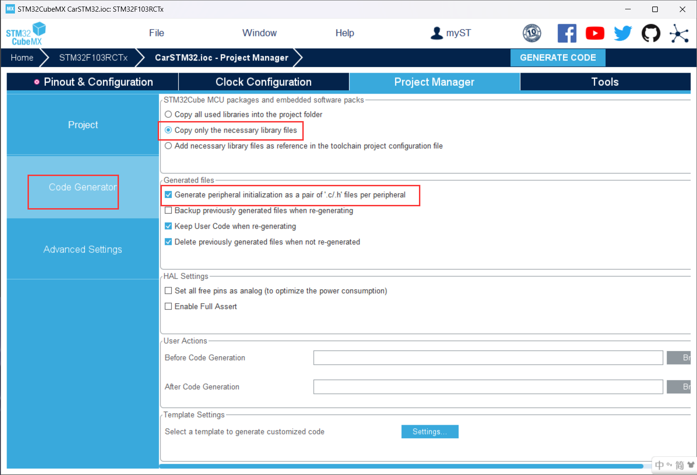

## 时钟

1.初识时钟周期

2.时钟树
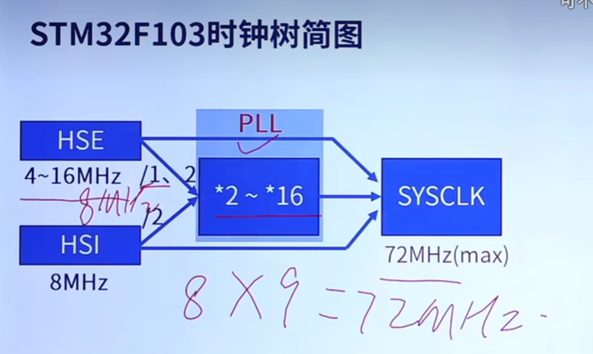
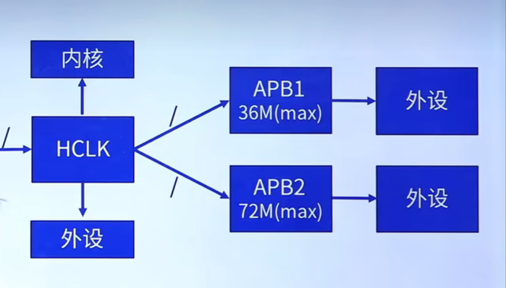
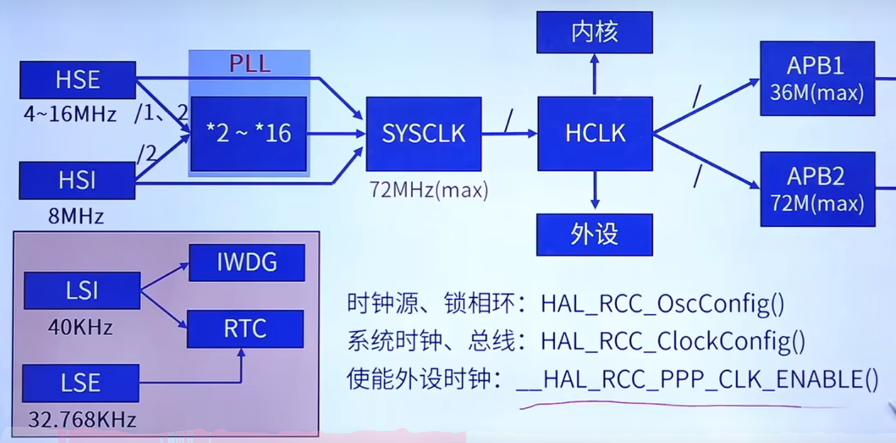

3.时钟配置步骤
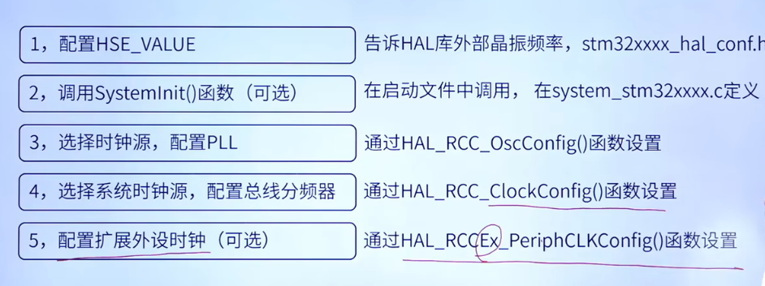

4.外设时钟使能和失能

5.sys_stm32_cloc_init()函数

- HAL_RCC_OscConfig()

  - HSE高速外设振荡器
  - LSE
  - RC振荡器，随着电压的变化而变化，所以需要一个检验值
  - PLL锁相环
- HAL_RCC_ClockConfig()
  
  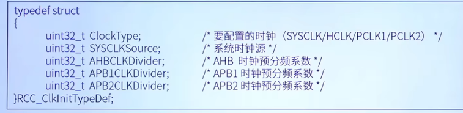
  - 第一个参数
    - 结构体中的第一个参数里的HCLK是指AHB总线、PCLK1是指APB1总线、PCLK2是指APB2总线，这个配置表示要配那条总线的时钟。
  - 第二个形参
  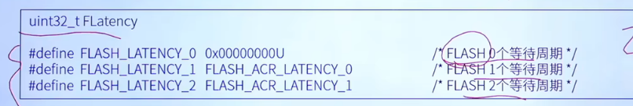
    - F1系统时钟72MHz,如果使用72MHz访问闪存（Flash）那么是需要等待的，因为闪存的允许最大时钟频率是42MHz,所以需要等待，等待多少个周期需要下图
  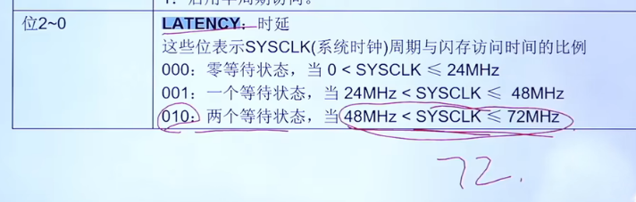

6.SYSTEN文件夹

- sys文件夹
  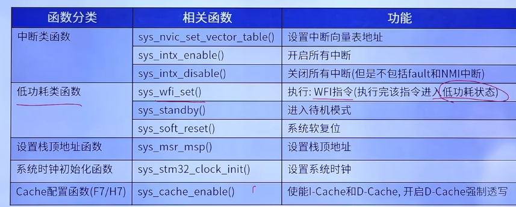

### NVIC介绍

#### 中断基本概念

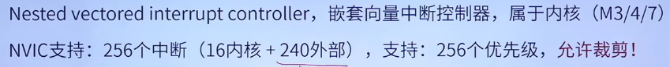
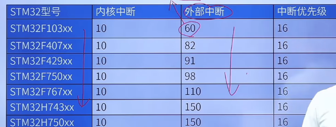

#### 中断向量表


#### 文件里的中断在哪里呢？

在文件**startup_stm32f10x_hd.s**中这里列出内部中断，外部中断就在内部中断之下，这里不再列出。

```c
__Vectors       DCD     __initial_sp               ; Top of Stack
                DCD     Reset_Handler              ; Reset Handler
                DCD     NMI_Handler                ; NMI Handler
                DCD     HardFault_Handler          ; Hard Fault Handler
                DCD     MemManage_Handler          ; MPU Fault Handler
                DCD     BusFault_Handler           ; Bus Fault Handler
                DCD     UsageFault_Handler         ; Usage Fault Handler
                DCD     0                          ; Reserved
                DCD     0                          ; Reserved
                DCD     0                          ; Reserved
                DCD     0                          ; Reserved
                DCD     SVC_Handler                ; SVCall Handler
                DCD     DebugMon_Handler           ; Debug Monitor Handler
                DCD     0                          ; Reserved
                DCD     PendSV_Handler             ; PendSV Handler
                DCD     SysTick_Handler            ; SysTick Handler
```

#### 中断寄存器

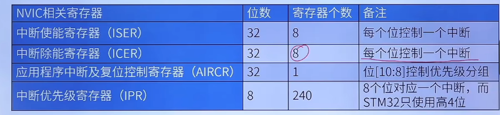

#### 中断原理

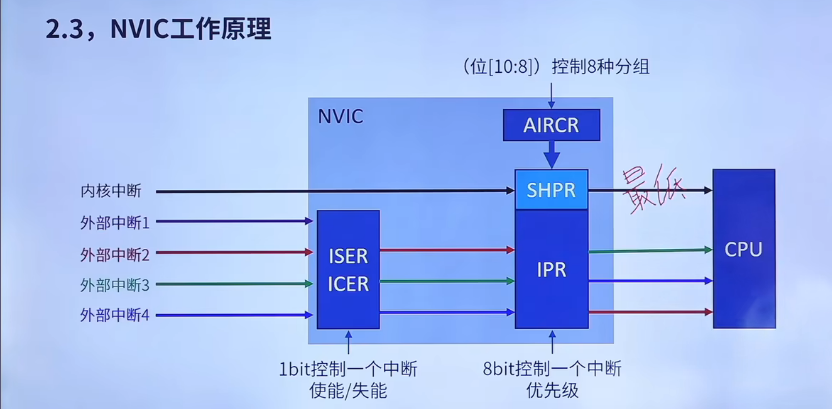

### 中断优先级

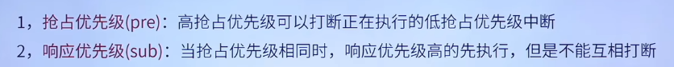
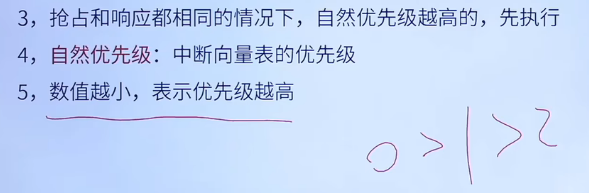
响应优先级又叫子优先级

**中断的抢占优先级由AICR寄存器的后三位控制，而响应优先级由IPRx寄存器的后四位控制**，最终分配结果参考下面的表格
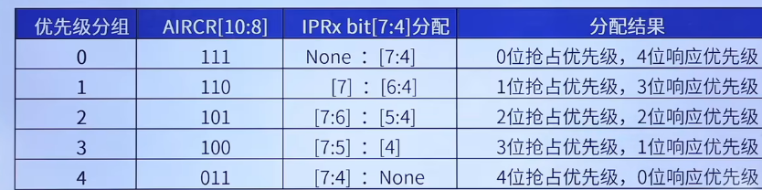

中断一般只设置一次，设置多次可能会导致中断紊乱，一般以最后一次的中断设置为准，详细说明参考手册4.4.5

中断执行的顺序：抢占优先级（先执行数值小的）————响应优先级（先执行数值小的）————自然优先级（先执行数值大的）

### NVIC 的使用

------------------------------------------------------------------
**以下笔记皆基于标准库。**

## 标准库中额中断

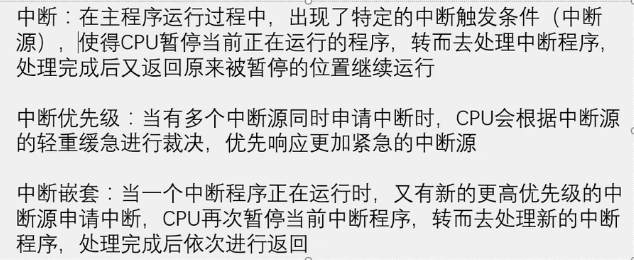

### EXTI（Extern Interrupt）外部中断

EXTI可以监测指定GPIO口的电平信号，当其指定的GPIO口产生电平变化时，EXTI将立即向NVIC发出中断申请，经过NVIC裁决后即可中断CPU主程序，使CPU执行EXTI对应的中断程序

简而言之，gpio电平发生变化时，申请外部中断。

- **支持的触发方式**：上升沿/下降沿/双边沿/软件触发（*引脚没有发生变化，执行一段代码就申请中断*）
- **支持的GPIO口**：所有GPIO口，但相同的Pin不能同时触发中断（*如PA1，PB1，PC1不能同时触发中断*）
- **通道数**：16个GPIO_Pin，外加PVD输出、RTC闹钟、USB唤醒、以太网唤醒
- **触发响应方式**：中断响应/事件响应（*事件响应不会触发中断。而是触发别的外设操作。属于外设之间的联合工作*）

### AFIO复用IO口

主要用于引脚复用功能的选择和重定义

在STM32中，AFIO主要完成两个任务：

- 复用功能引脚重映射
- 中断引脚选择
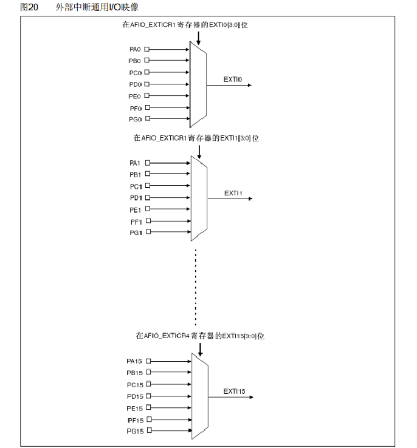

### EXTI实现代码

这段代码的中断端口是GPIOB_Pin14，所以需要将相关的传感器接到PB14这个端口

```c
void CountSensor_Init(){
	//配置RCC
	RCC_APB2PeriphClockCmd(RCC_APB2Periph_GPIOB,ENABLE);
	
	//AFIO、
	RCC_APB2PeriphClockCmd(RCC_APB2Periph_AFIO,ENABLE);
	
	//EXTI、一直打开着不用配置打开时钟
	//NVIC  一直打开着不用配置打开时钟
	
	GPIO_InitTypeDef GPIO_InitStructure;
	GPIO_InitStructure.GPIO_Mode=GPIO_Mode_IPU;
	GPIO_InitStructure.GPIO_Pin=GPIO_Pin_14;
	GPIO_InitStructure.GPIO_Speed=GPIO_Speed_50MHz;
	GPIO_Init(GPIOB,&GPIO_InitStructure);
	
	GPIO_EXTILineConfig(GPIO_PortSourceGPIOB,GPIO_PinSource14);
	
	//EXTI
	EXTI_InitTypeDef EXTI_InitStructure;
	EXTI_InitStructure.EXTI_Line=EXTI_Line14;
	EXTI_InitStructure.EXTI_LineCmd=ENABLE;
	EXTI_InitStructure.EXTI_Mode=EXTI_Mode_Interrupt;
	EXTI_InitStructure.EXTI_Trigger=EXTI_Trigger_Falling;
	
	EXTI_Init(&EXTI_InitStructure);
	
	//NVIC
	
	NVIC_InitTypeDef NVIC_InitStructure;
	NVIC_InitStructure.NVIC_IRQChannel=EXTI15_10_IRQn;
	NVIC_InitStructure.NVIC_IRQChannelCmd=ENABLE;
	NVIC_InitStructure.NVIC_IRQChannelPreemptionPriority=2;
	NVIC_InitStructure.NVIC_IRQChannelSubPriority=0;
	NVIC_Init(&NVIC_InitStructure);
}
void EXTI15_10_IRQHandler(void){//中断函数
	if(EXTI_GetITStatus(EXTI_Line14)== SET){
		EXTI_ClearITPendingBit(EXTI_Line14);
	}
}

```

## 定时器

### TIM（Timer）定时器

定时器可以对输入的时钟进行计数，并在计数值达到设定值时触发中断

16位计数器、预分频器、自动重装寄存器的时基单元，在72MHz计数时钟下可以实现最大59.65s的定时
不仅具备基本的定时中断功能，而且还包含内外时钟源选择、输入捕获、输出比较、编码器接口、主从触发模式等多种功能
根据复杂度和应用场景分为了高级定时器、通用定时器、基本定时器三种类型

### 使用内部时钟源实现中断（标准库中）

在编写代码前先看看定时器的实现原理图

- 基本定时器
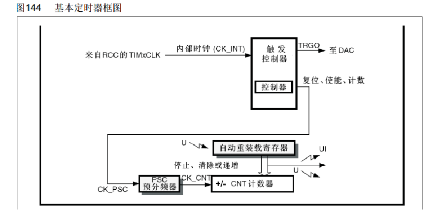
- 通用定时器
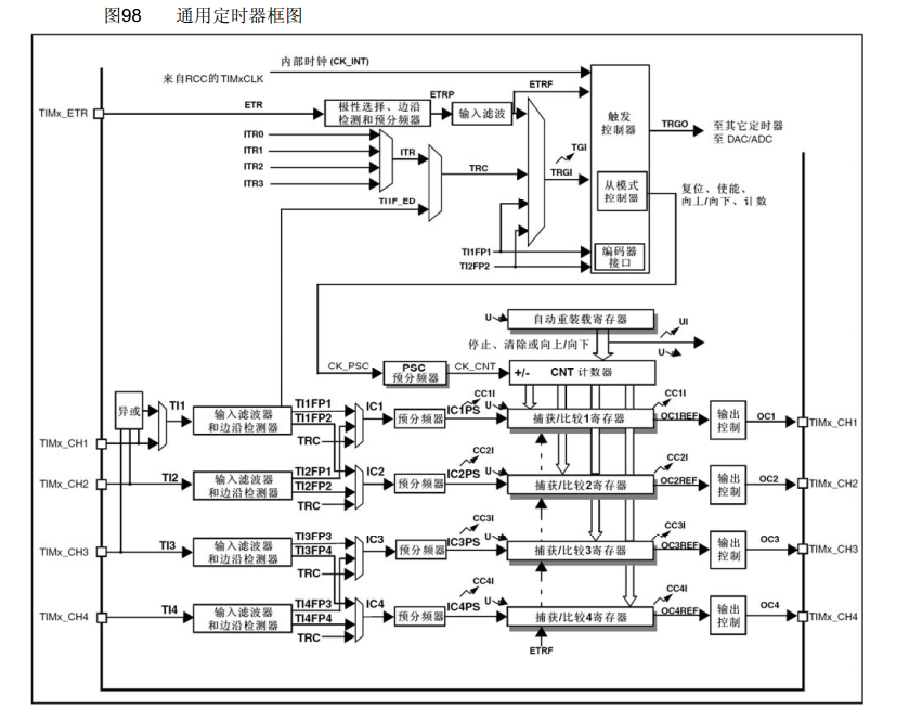
- 高级定时器（红色框出来的部分是高级定时器独有的）
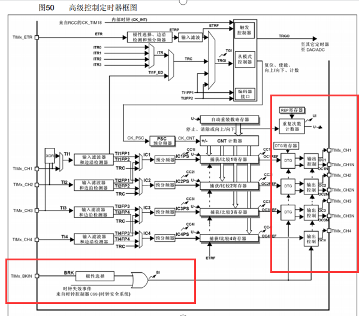

此处主要参考通用计时器的结构图，下面是基于内部时钟RCC的定时器。

在 **stm32f103xxx_rcc.c** 文件对 **RCC_APB1PeriphClockCmd** 这样的介绍：

```c
/**
  * @brief  Enables or disables the High Speed APB (APB2) peripheral clock.
  * @param  RCC_APB2Periph: specifies the APB2 peripheral to gates its clock.
  *   This parameter can be any combination of the following values:
  *     @arg RCC_APB2Periph_AFIO, RCC_APB2Periph_GPIOA, 
  ……
  ……
  ……+
  */
```

specifies the APB2 peripheral to gates its clock.即：指定APB 2外围设备到其时钟门。而这里的时钟门代码里选择了TIM2。


```c
void Timer_Init(void){
	//1.RCC 
	RCC_APB1PeriphClockCmd(RCC_APB1Periph_TIM2,ENABLE);
	
	//2.选择时基单元时钟源，
	TIM_InternalClockConfig(TIM2);
	
	//3.时基单元
	TIM_TimeBaseInitTypeDef TIM_TimeBaseInitStructure;
	TIM_TimeBaseInitStructure.TIM_ClockDivision=TIM_CKD_DIV1;		//时钟分频，这里是1分频
	TIM_TimeBaseInitStructure.TIM_CounterMode=TIM_CounterMode_Up;	//计数方式
	TIM_TimeBaseInitStructure.TIM_Period=10000-1;					//自动重装值，计数达到这个值后触发中断，然后重新开始计数
	TIM_TimeBaseInitStructure.TIM_Prescaler=7200 -1;				//预分频，计数频率，
																	//假设计数为1s则自动重装值可设置为10000，预分频可设置为7200，公式为秒数=27MHz/PSC/ARR
	TIM_TimeBaseInitStructure.TIM_RepetitionCounter=0;				//重复计数数器高级定时器才有，这里设置为0
	TIM_TimeBaseInit(TIM2,&TIM_TimeBaseInitStructure);				//时基单元设置
	
	TIM_ITConfig(TIM2,TIM_IT_Update,ENABLE);
	
	//4.中断输出控制 
	NVIC_PriorityGroupConfig(NVIC_PriorityGroup_2);					//抢占优先级,0-3， 响应优先级0-3，一个工程只设置一次
	
	//5.NVIC
	NVIC_InitTypeDef  NVIC_InitStructure;
	NVIC_InitStructure.NVIC_IRQChannel=TIM2_IRQn;
	NVIC_InitStructure.NVIC_IRQChannelCmd=ENABLE;
	NVIC_InitStructure.NVIC_IRQChannelPreemptionPriority=1;
	NVIC_InitStructure.NVIC_IRQChannelSubPriority=1;
	NVIC_Init(&NVIC_InitStructure);
	
	TIM_Cmd(TIM2,ENABLE);
}

void TIM2_IRQHandler(void){
	 if(TIM_GetITStatus(TIM2,TIM_IT_Update) == SET){
		Num++;
		TIM_ClearITPendingBit(TIM2,TIM_IT_Update);
	 }
}

```

## 实现输出比较

### OC（Output Compare）输出比较

- 输出比较可以通过比较CNT与CCR寄存器值的关系，来对输出电平进行置1、置0或翻转的操作，用于输出一定频率和占空比的**PWM波形**

- 每个高级定时器和通用定时器都拥有4个输出比较通道

- 高级定时器的前3个通道额外拥有死区生成和互补输出的功能

- OC：**输出比较**
- IC：**输入比较**
- CC：**输入/输出比较**

### PWM波形

- PWM（Pulse Width Modulation）脉冲宽度调制，广泛应用于各种电子和电气系统中，用于控制功率转换、电机速度、信号传输等
- 在具有[^1](惯性的系统)中，可以通过对一系列脉冲的宽度进行调制，来等效地获得所需要的模拟参量，常应用于电机控速等领域
[^1](例如电机转动暂停后不会马上停止，而是过一段时间才会停止。)
- PWM参数：
  - 频率 = 1 / TS
  - 占空比 = TON / TS
  - 分辨率 = 占空比变化步距
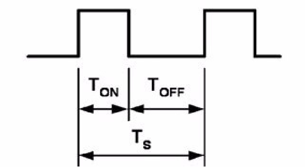
一些电平变化图可以等效为图中的虚线。
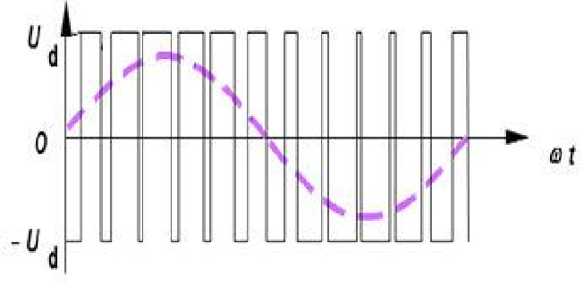

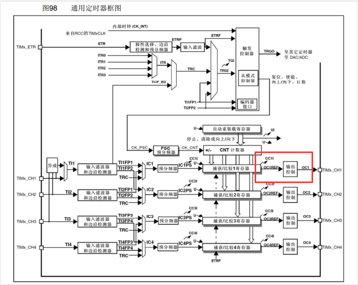
上图框出来的部分具体如下图：
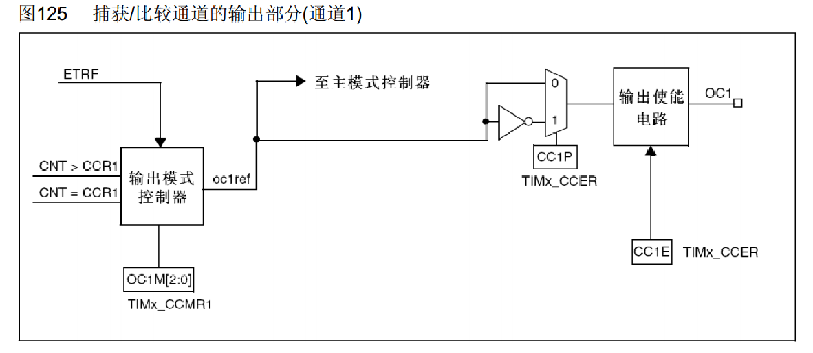

在信号通过比较后输出到CC1P，然后再输出到输出使用电路，输出使用电路的OC1可以查看**引脚定义表**

在上图中需要注意的一些引文缩写：

- **REF** 是reference的缩写。意思是 **参考信号**

### 输出比较的设置

设置的函数为

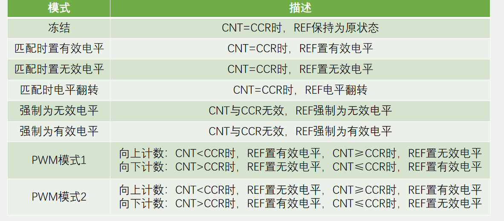

### PWM基本结构

配置PWM的时候可以参考下面的图，
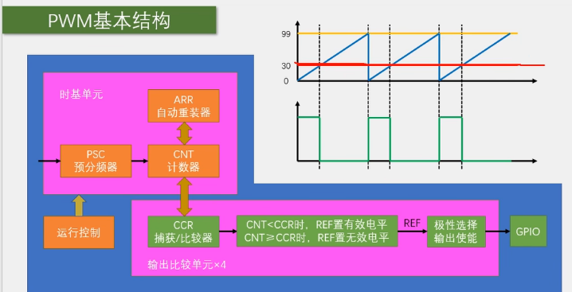
图中的参考坐标系图红色线表示CCR的值，蓝色线表示CNT的值，黄色线表示自动重装载值即ARR。
了解了这点后我们再看看PWM的是如何计算的，如下公式

**PWM频率：** 
\[ \text{Freq} = \frac{CKPSC}{(PSC + 1) \times (ARR + 1)} \]
可以看出PWM的频率等于CNT的更新频率

**PWM占空比：** 
\[ \text{Duty} = \frac{CCR}{(ARR + 1)} \]

**PWM分辨率：** 
\[ \text{Reso} = \frac{1}{(ARR + 1)} \]

### 代码编写

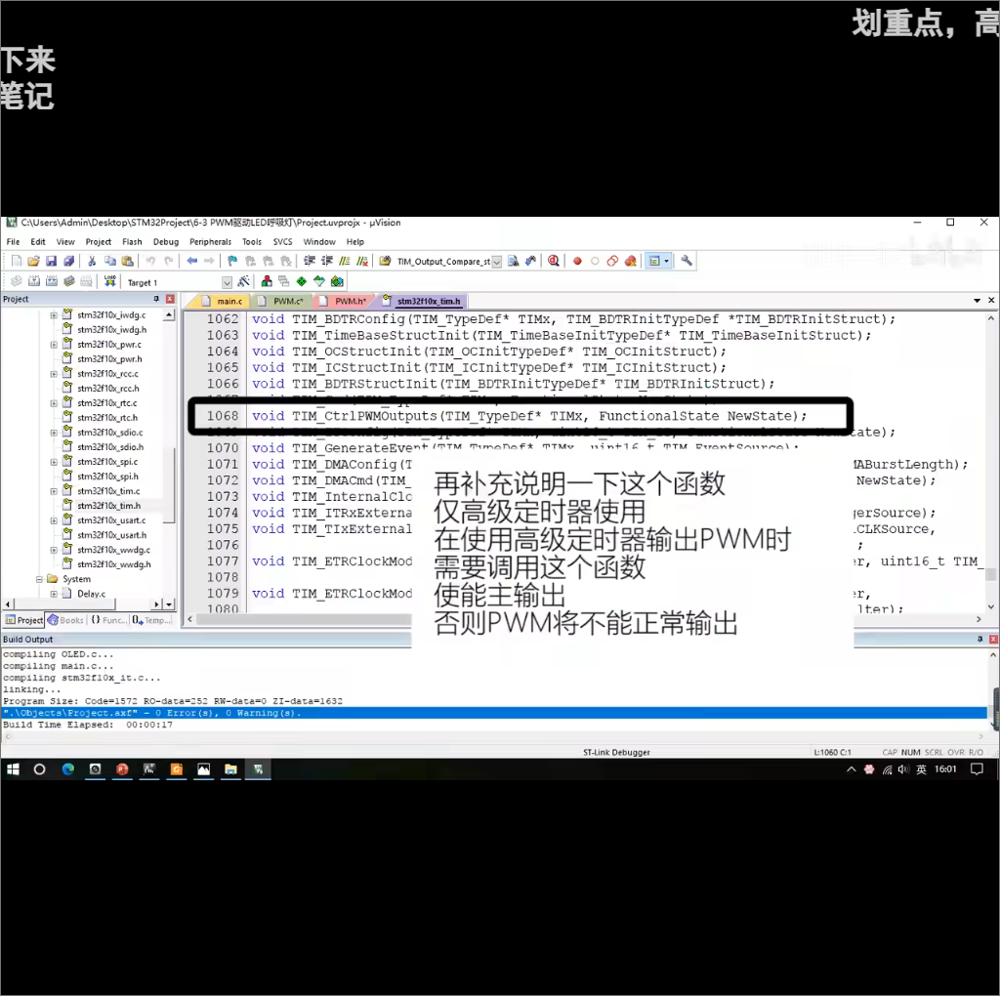

{}