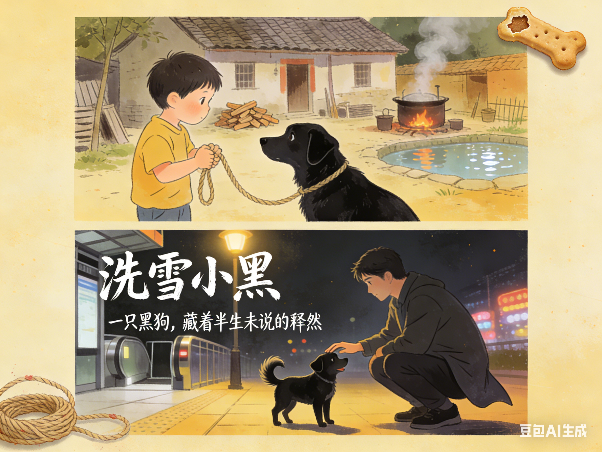

# 洗雪小黑

来省城工作两月后的一天夜里，我如常下班。走出地铁站时，一只黑色小狗摇着尾巴迎面走来。心里莫名一颤，我回头看看身后 —— 无人，又环顾四周 —— 也无人在意它。于是蹲下身，试探着伸出手。小狗先停了摇尾，后退半步，随即又像是感知到某种安全的频率，重新摇晃起来。我摸了摸它的头，指尖传来温热的触感。冬至刚过，夜风很冷，但这小小的交汇处，却漾开一阵无声的暖意。

忽然想起小时候家里养过的那条黑狗。它生过好几窝崽，那些绒团似的模样早已被时光冲刷得模糊不清，唯独母狗的身影，始终钉在记忆的底片上。乡下不给狗起名，它也就没有名字。此刻，一个迟来多年的称呼忽然浮上心头：就叫它 “小黑” 吧。

那时家家户户耕田种地，村里总是一幅 “大儿锄豆溪东，中儿正织鸡笼” 的忙碌景象。父母和哥姐在深沟里劳作，我的任务是在晌午把热好的饭菜装进背篓送去。小黑总是陪我。它时而窜进路旁灌木丛，时而跑到前头很远，再在某处路口静静等着。

我怕它乱跑出事 —— 听说有亲戚的狗就是在灌木丛里被猎人的铁夹断了腿。这画面在脑中一闪，我便从背篓里翻出条麻绳，系在小黑颈上。它没有抗拒，只是仰头望我一眼。我们便一前一后，保持着绳长的距离，慢慢朝深沟走去。
去深沟必经过陈爷爷家。我向来怕他，也怕他家的狗。陈爷爷是村里出名的嘴毒，他养的狗也似主人，凶悍异常。每次路过，我都想快步溜过，可那犬吠声总会惊动屋里的人。这次有小黑在，我下意识攥紧绳子。小黑像是懂了，默默走在我侧前方，竟有种护卫的姿态。

快到他家门口时，犬吠又起。可这次，小黑停了下来，与门内的大狗静静对视。我正不解，却见两只狗尾巴都轻轻摇了起来。陈爷爷闻声出来，问了些什么话，内容我早已忘记。只记得自己心神一松，绳子竟从手中滑脱。我慌忙去追，却见小黑已跟着陈家狗跑远了。陈爷爷在身后哈哈大笑：“小黑这是遇上相好的咯！”
我把背篓一放，冲进陈家院子。“我家狗跟你家狗跑了！是不是被你家狗带哪儿去了？”

陈奶奶一家正围坐火塘边准备吃午饭，几双眼睛齐刷刷看向我。我一时噎住。等陈奶奶弄明白缘由，只淡淡道：“狗有狗路，晚些自己就回来了。”

小黑确实认路，也有过独自跑远又安然回家的先例。可那一刻，我只想立刻找到它。正要上前，陈爷爷忽然大喊：“哎呀！你家狗掉我家水池里了！你看！你看！” 他脸上似笑非笑的神情让我脑子一空，急忙爬上池沿。池水里，小黑正费力划动，我慌忙去抓浮着的绳头 —— 可就在指尖触到绳子的刹那，它猛地向下一沉，再没浮起来。

父亲用麻袋装走小黑尸体时，我哭了一早上。他骑摩托车把小黑载去了一个我永远找不到的地方。关于小黑的记忆，似乎就终结在那里。我总想，要是没遇见陈家的狗，要是没有那个蓄水池…… 后来有几次，我还借故去陈家闹过。哥哥为此揍了我几棍，问清原委后，他沉默良久，才低声道：“那几天，小黑本来就不对劲…… 妈喂它东西，它一口都没吃。”

所以，是小黑自己已经不行了？我始终无法全然接受这个解释。只是岁月像一层又一层的沙，渐渐掩埋了尖锐的疑问，也教会人一种沉默的妥协。往后想起小黑，我便用这个理由安抚自己。

手指传来柔软的触感，将我拉回现实。地铁口的小黑狗仍蹭着我的手。一个男人走近，没等他问，我便退开一步：“您家的狗？”

“是的。”

“真可爱。” 我发现自己只能说得出这句话。

狗主人友善地笑了笑，寒暄两句，便唤狗离开。我站在原地，看那小小的黑色身影轻快地蹿到主人前头，尾巴摇成一朵模糊的花。就像很久以前，也有条黑狗，总是那样跑在我前头。

{}